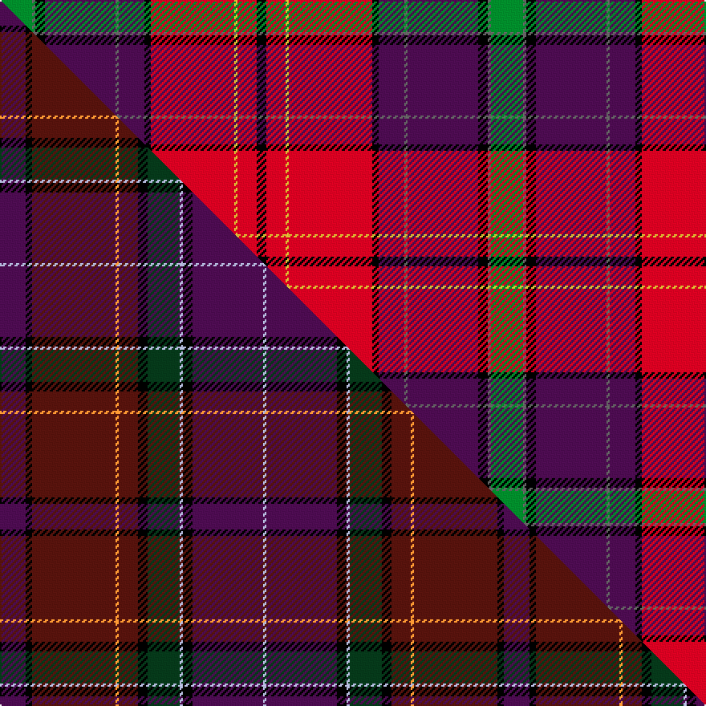

This is one **variant** — a specific cloth: this exact thread count and colourway, with its own
provenance below. It is one weaving of the [sett](/setts/g10n1k3dp22n1dp8k2r26ly1r6k3/) (the scale-free proportion — the
same cloth at any scale or shade), whose colour order is pattern [GBKBBBKRYRK](/stripes/gbkbbbkryrk/).

Part of the [Faulkner](/tartans/f/fa/faulkner/) tartan — the named design grouping this sett with its other cloths.

Sourced from tartans-authority.  It is a [11 stripe tartan](/stripes/stripes11/).

Original link [https://www.tartanregister.gov.uk/tartanDetails.aspx?ref=10080](https://www.tartanregister.gov.uk/tartanDetails.aspx?ref=10080)

Dataset <small>— provenance for this record, inherited from the source manifest</small>

<dl class="dataset-prov">
<dt>source</dt><dd><a href="/sources/tartans-authority/">Scottish Tartans Authority</a></dd>
<dt>data captured from</dt><dd><a href="https://github.com/thetartan/tartan-database/blob/master/data/tartans-authority/data.csv">https://github.com/thetartan/tartan-database/blob/master/data/tartans-authority/data.csv</a></dd>
<dt>data date</dt><dd>4th July 2009 <small>(this record)</small></dd>
<dt>licence</dt><dd><a href="https://creativecommons.org/licenses/by-nc-nd/4.0/">CC BY-NC-ND 4.0</a></dd>
</dl>

Capture chain <small>— the hands this data passed through, oldest first; each capture carries its own licence</small>

<ol class="capture-chain">
<li><a href="https://www.tartansauthority.com/">Scottish Tartans Authority</a> <small>the heritage body's archive — its tartan-ferret record browser is retired (links repaired to the SRT, above)</small></li>
<li><a href="https://github.com/thetartan/tartan-database">thetartan/tartan-database</a> <small>2016-2017</small> · <a href="https://creativecommons.org/licenses/by-nc-nd/4.0/">CC BY-NC-ND 4.0</a> <small>Levko Kravets's frozen compilation — the capture we vendored, and where its CC licence text came from</small></li>
<li>this dictionary <small>captured 2026-06-10 · commit 5bf86c7566</small> <small>each re-capture is a git commit to data/sources</small></li>
</ol>

## Register references

External register numbers recorded for this tartan.

- Scottish Register of Tartans: [10080](https://www.tartanregister.gov.uk/tartanDetails?ref=10080)
- Scottish Tartans Authority (ITI): 10080

## Thread count
G/20 N2 K6 DP44 N2 DP16 K4 R52 LY2 R12 K/6

One full sett is **306 threads**.

## Palette
<table><thead><tr><th>Colour</th><th>Shade</th><th>OKLCh</th></tr></thead><tbody><tr><td>R</td><td><code style="background-color:#D60020;">#D60020</code> <small style="color:#888">#D60020</small></td><td><small style="color:#888">oklch(55.2% 0.224 25.5)</small></td></tr><tr><td>LY</td><td><code style="background-color:#DCBC32;">#DCBC32</code> <small style="color:#888">#DCBC32</small></td><td><small style="color:#888">oklch(80.0% 0.150 95.2)</small></td></tr><tr><td>G</td><td><code style="background-color:#008B2A;">#008B2A</code> <small style="color:#888">#008B2A</small></td><td><small style="color:#888">oklch(55.4% 0.170 145.9)</small></td></tr><tr><td>K</td><td><code style="background-color:#000000;">#000000</code> <small style="color:#888">#000000</small></td><td><small style="color:#888">oklch(0.0% 0.000 0.0)</small></td></tr><tr><td>N</td><td><code style="background-color:#636363;">#636363</code> <small style="color:#888">#636363</small></td><td><small style="color:#888">oklch(50.0% 0.000 89.9)</small></td></tr><tr><td>DP</td><td><code style="background-color:#4B0B4F;">#4B0B4F</code> <small style="color:#888">#4B0B4F</small></td><td><small style="color:#888">oklch(30.1% 0.125 325.4)</small></td></tr></tbody></table>

# Sample pattern

## Compared to the master

This cloth is one sett of its design; the master sett (the exemplar the design is anchored on) is below for comparison.

Its **ΔTartan distance** from the master is **0.92** — the same measure the nearest-tartans table ranks by (0 is identical; a re-scale of the same cloth is near 0, a recolour or a different proportion further).

<figure class="master-compare" style="margin:0">

this sett
master sett ★

<figcaption style="color:#888;font-size:smaller">One weave of this sett against the <a href="/setts/dp8k2dr26lo1dr6k3dg10lb1k3dp22lb1/">master sett ★</a>, split on the diagonal: a shared proportion runs seamlessly across it with only the shades shifting; a different proportion breaks on it.</figcaption>
</figure>

## Nearest tartan variants

The nearest existing variants by ΔTartan distance, with this cloth at the top so the swatches line up against it.

ΔTartan

Threads

Variant

Sett

—

306

<a href="/variants/s11/g10n1k3dp22n1dp8k2r26ly1r6k3~x2/">Faulkner (Personal)</a>

<a href="/ttd/edit/#slug=dp7o2ri2r2dp23r2k2r1k15ri29lp2~x2~ri2109032-r2109013&amp;base=g10n1k3dp22n1dp8k2r26ly1r6k3~x2" title="compare in the TTD">1.58</a>

330

<a href="/variants/s11/dp7o2ri2r2dp23r2k2r1k15ri29lp2~x2~ri2109032-r2109013/">MacHatters of the Old Pueblo</a>

<a href="/ttd/edit/#slug=k2dy1k2dy8r29n9dt24w2dt2~x2~dt1204274&amp;base=g10n1k3dp22n1dp8k2r26ly1r6k3~x2" title="compare in the TTD">1.79</a>

308

<a href="/variants/s9/k2dy1k2dy8r29n9db24w2db2~x2~db1204274/">Lermontov Family Tartan</a>

<a href="/ttd/edit/#slug=k2y1k2y8r29n9db24w2db2~x2&amp;base=g10n1k3dp22n1dp8k2r26ly1r6k3~x2" title="compare in the TTD">2.12</a>

308

<a href="/variants/s9/k2y1k2y8r29n9db24w2db2~x2/">Lermontov</a>

<a href="/ttd/edit/#slug=dg15r25dg4k2ly1db1ly1k2dg4db12w1~x2&amp;base=g10n1k3dp22n1dp8k2r26ly1r6k3~x2" title="compare in the TTD">2.28</a>

240

<a href="/variants/s11/dg15r25dg4k2ly1db1ly1k2dg4db12w1~x2/">Livingstone - Australia (Personal)</a>

<a href="/ttd/edit/#slug=r63w4k4dp18ly4dg50~x2~dp1607327&amp;base=g10n1k3dp22n1dp8k2r26ly1r6k3~x2" title="compare in the TTD">2.31</a>

346

<a href="/variants/s6/r63w4k4dp18ly4dg50~x2~dp1607327/">Gordon of Abergeldie</a>

<a href="/ttd/edit/#slug=w2dp2k2r4k1r21k4w1dp12k3w1g6k2db3r1~x2&amp;base=g10n1k3dp22n1dp8k2r26ly1r6k3~x2" title="compare in the TTD">2.50</a>

254

<a href="/variants/s15/w2dp2k2r4k1r21k4w1dp12k3w1g6k2db3r1~x2/">Gaudet-Hillan (Personal)</a>

<a href="/ttd/edit/#slug=r48k10db12k2r3k2db12k10n10k2y3~x2&amp;base=g10n1k3dp22n1dp8k2r26ly1r6k3~x2" title="compare in the TTD">2.60</a>

354

<a href="/variants/s11/r48k10db12k2r3k2db12k10n10k2y3~x2/">Brooks Brothers (WCWM)</a>

<a href="/ttd/edit/#slug=r4k4r28dp4g4k10g4dp4g4dp8k1w3~x2&amp;base=g10n1k3dp22n1dp8k2r26ly1r6k3~x2" title="compare in the TTD">2.66</a>

298

<a href="/variants/s12/r4k4r28dp4g4k10g4dp4g4dp8k1w3~x2/">Kelly of Sleat Red</a>

<a href="/ttd/edit/#slug=lb8k1r22ly1r6k3dg10w1k3lb20w1~x2&amp;base=g10n1k3dp22n1dp8k2r26ly1r6k3~x2" title="compare in the TTD">2.67</a>

286

<a href="/variants/s11/lb8k1r22ly1r6k3dg10w1k3lb20w1~x2/">Unnamed C20th - National Archives</a>

<a href="/ttd/edit/#slug=r4k4r32g4w3g4k13g3db18r2y3~x2&amp;base=g10n1k3dp22n1dp8k2r26ly1r6k3~x2" title="compare in the TTD">2.77</a>

346

<a href="/variants/s11/r4k4r32g4w3g4k13g3db18r2y3~x2/">Norwell</a>

## Neighbour map

Every grey dot is one of 13621 variants placed by the first two principal components of the ΔTartan feature space (42% of its variance). Red is this tartan; blue dots are its nearest — click one to open its page.

<svg viewBox="0 0 640 380" role="img" style="max-width:100%;height:auto;border:1px solid #e0e0e0;border-radius:4px;display:block" xmlns="http://www.w3.org/2000/svg"><image href="/nn/cloud.v1.png" width="640" height="380"/><a href="/variants/s11/dp7o2ri2r2dp23r2k2r1k15ri29lp2~x2~ri2109032-r2109013/"><circle cx="187.5" cy="72.0" r="4" fill="#3465a4"><title>MacHatters of the Old Pueblo</title></circle></a><a href="/variants/s9/k2dy1k2dy8r29n9db24w2db2~x2~db1204274/"><circle cx="195.8" cy="93.1" r="4" fill="#3465a4"><title>Lermontov Family Tartan</title></circle></a><a href="/variants/s9/k2y1k2y8r29n9db24w2db2~x2/"><circle cx="187.5" cy="91.8" r="4" fill="#3465a4"><title>Lermontov</title></circle></a><a href="/variants/s11/dg15r25dg4k2ly1db1ly1k2dg4db12w1~x2/"><circle cx="182.5" cy="84.3" r="4" fill="#3465a4"><title>Livingstone - Australia (Personal)</title></circle></a><a href="/variants/s6/r63w4k4dp18ly4dg50~x2~dp1607327/"><circle cx="165.3" cy="106.0" r="4" fill="#3465a4"><title>Gordon of Abergeldie</title></circle></a><a href="/variants/s15/w2dp2k2r4k1r21k4w1dp12k3w1g6k2db3r1~x2/"><circle cx="144.0" cy="64.5" r="4" fill="#3465a4"><title>Gaudet-Hillan (Personal)</title></circle></a><a href="/variants/s11/r48k10db12k2r3k2db12k10n10k2y3~x2/"><circle cx="211.7" cy="86.0" r="4" fill="#3465a4"><title>Brooks Brothers (WCWM)</title></circle></a><a href="/variants/s12/r4k4r28dp4g4k10g4dp4g4dp8k1w3~x2/"><circle cx="178.8" cy="87.9" r="4" fill="#3465a4"><title>Kelly of Sleat Red</title></circle></a><a href="/variants/s11/lb8k1r22ly1r6k3dg10w1k3lb20w1~x2/"><circle cx="152.0" cy="91.2" r="4" fill="#3465a4"><title>Unnamed C20th - National Archives</title></circle></a><a href="/variants/s11/r4k4r32g4w3g4k13g3db18r2y3~x2/"><circle cx="148.5" cy="96.2" r="4" fill="#3465a4"><title>Norwell</title></circle></a><circle cx="194.7" cy="85.1" r="5" fill="#c00000"/><text x="320" y="376" text-anchor="middle" font-size="11" fill="#999">ground</text><text x="11" y="190" text-anchor="middle" font-size="11" fill="#999" transform="rotate(-90 11 190)">complexity</text></svg>

ID: /variants/s11/g10n1k3dp22n1dp8k2r26ly1r6k3~x2/
