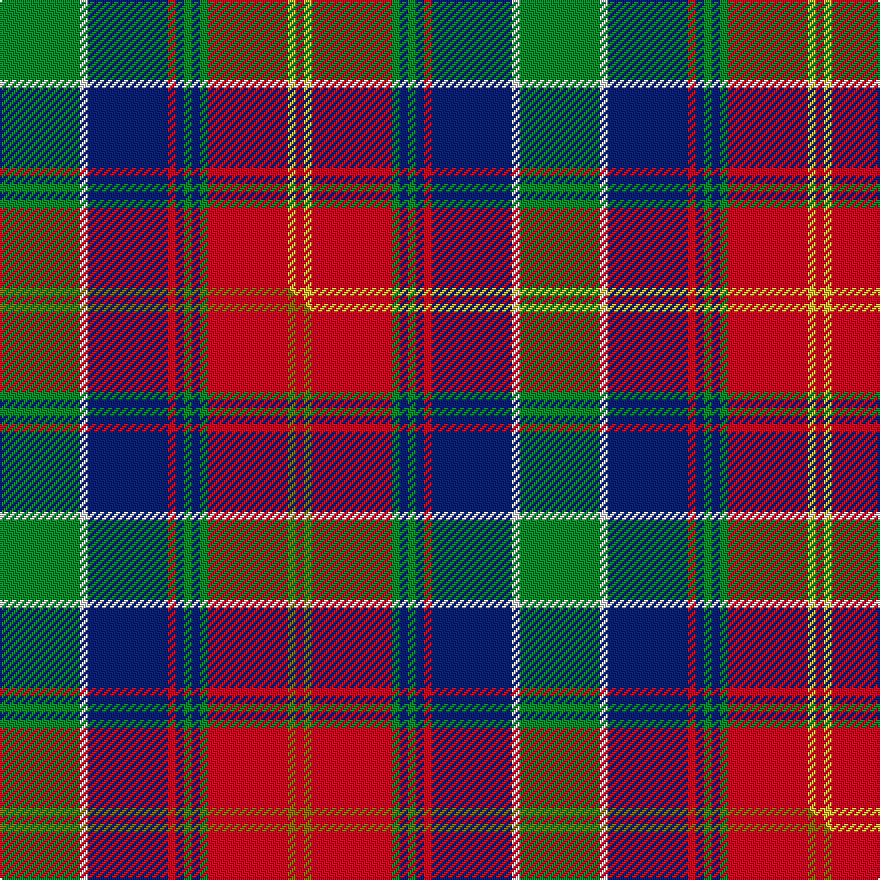

This is one **variant** — a specific cloth: this exact thread count and colourway, with its own
provenance below. It is one weaving of the [sett](/setts/g10w1db10r1db1g1db1g1r10ly1r1/) (the scale-free proportion — the
same cloth at any scale or shade), whose colour order is pattern [GWBRBGBGRYR](/stripes/gwbrbgbgryr/).

Part of the [Belfast Tattoo](/tartans/b/be/belfast-tattoo/) tartan — the named design grouping this sett with its other cloths.

Sourced from tartans-authority.  It is a [11 stripe tartan](/stripes/stripes11/).

Original link [https://www.tartanregister.gov.uk/tartanDetails.aspx?ref=11190](https://www.tartanregister.gov.uk/tartanDetails.aspx?ref=11190)

Dataset <small>— provenance for this record, inherited from the source manifest</small>

<dl class="dataset-prov">
<dt>source</dt><dd><a href="/sources/tartans-authority/">Scottish Tartans Authority</a></dd>
<dt>data captured from</dt><dd><a href="https://github.com/thetartan/tartan-database/blob/master/data/tartans-authority/data.csv">https://github.com/thetartan/tartan-database/blob/master/data/tartans-authority/data.csv</a></dd>
<dt>data date</dt><dd>2014 <small>(this record)</small></dd>
<dt>licence</dt><dd><a href="https://creativecommons.org/licenses/by-nc-nd/4.0/">CC BY-NC-ND 4.0</a></dd>
</dl>

Capture chain <small>— the hands this data passed through, oldest first; each capture carries its own licence</small>

<ol class="capture-chain">
<li><a href="https://www.tartansauthority.com/">Scottish Tartans Authority</a> <small>the heritage body's archive — its tartan-ferret record browser is retired (links repaired to the SRT, above)</small></li>
<li><a href="https://github.com/thetartan/tartan-database">thetartan/tartan-database</a> <small>2016-2017</small> · <a href="https://creativecommons.org/licenses/by-nc-nd/4.0/">CC BY-NC-ND 4.0</a> <small>Levko Kravets's frozen compilation — the capture we vendored, and where its CC licence text came from</small></li>
<li>this dictionary <small>captured 2026-06-10 · commit 5bf86c7566</small> <small>each re-capture is a git commit to data/sources</small></li>
</ol>

## Register references

External register numbers recorded for this tartan.

- Scottish Register of Tartans: [11190](https://www.tartanregister.gov.uk/tartanDetails?ref=11190)
- Scottish Tartans Authority (ITI): 11190

## Thread count
G/40 W4 DB40 R4 DB4 G4 DB4 G4 R40 LY4 R/4

One full sett is **260 threads**.

## Palette
<table><thead><tr><th>Colour</th><th>Shade</th><th>OKLCh</th></tr></thead><tbody><tr><td>DB</td><td><code style="background-color:#082077;">#082077</code> <small style="color:#888">#082077</small></td><td><small style="color:#888">oklch(30.0% 0.149 265.1)</small></td></tr><tr><td>G</td><td><code style="background-color:#008B2A;">#008B2A</code> <small style="color:#888">#008B2A</small></td><td><small style="color:#888">oklch(55.4% 0.170 145.9)</small></td></tr><tr><td>R</td><td><code style="background-color:#D60020;">#D60020</code> <small style="color:#888">#D60020</small></td><td><small style="color:#888">oklch(55.2% 0.224 25.5)</small></td></tr><tr><td>W</td><td><code style="background-color:#F7F7F7;">#F7F7F7</code> <small style="color:#888">#F7F7F7</small></td><td><small style="color:#888">oklch(97.6% 0.000 89.9)</small></td></tr><tr><td>LY</td><td><code style="background-color:#DCBC32;">#DCBC32</code> <small style="color:#888">#DCBC32</small></td><td><small style="color:#888">oklch(80.0% 0.150 95.2)</small></td></tr></tbody></table>

# Sample pattern

## Compared to the master

This cloth is one sett of its design; the master sett (the exemplar the design is anchored on) is below for comparison.

Its **ΔTartan distance** from the master is **0.02** — the same measure the nearest-tartans table ranks by (0 is identical; a re-scale of the same cloth is near 0, a recolour or a different proportion further).

<figure class="master-compare" style="margin:0">

this sett
master sett ★

<figcaption style="color:#888;font-size:smaller">One weave of this sett against the <a href="/setts/g10w1db10r1db1g1db1g1r10y1r1/">master sett ★</a>, split on the diagonal: a shared proportion runs seamlessly across it with only the shades shifting; a different proportion breaks on it.</figcaption>
</figure>

## Nearest tartan variants

The nearest existing variants by ΔTartan distance, with this cloth at the top so the swatches line up against it.

ΔTartan

Threads

Variant

Sett

—

260

<a href="/variants/s11/g10w1db10r1db1g1db1g1r10ly1r1~x4/">Belfast Tattoo</a>

<a href="/ttd/edit/#slug=g10w1db10r1db1g1db1g1r10y1r1~x4&amp;base=g10w1db10r1db1g1db1g1r10ly1r1~x4" title="compare in the TTD">0.02</a>

260

<a href="/variants/s11/g10w1db10r1db1g1db1g1r10y1r1~x4/">Belfast Tattoo</a>

<a href="/ttd/edit/#slug=dy4w2dy2w3dy20db6lb3db2lb2db2lb16r3~x2&amp;base=g10w1db10r1db1g1db1g1r10ly1r1~x4" title="compare in the TTD">2.38</a>

246

<a href="/variants/s12/dy4w2dy2w3dy20db6lb3db2lb2db2lb16r3~x2/">Callum Scotch House Trade Tartan</a>

<a href="/ttd/edit/#slug=lb1r1db1r2g8r1db1r2g1r1db8r2g1r1lb1~x4&amp;base=g10w1db10r1db1g1db1g1r10ly1r1~x4" title="compare in the TTD">2.42</a>

248

<a href="/variants/s15/lb1r1db1r2g8r1db1r2g1r1db8r2g1r1lb1~x4/">MacIntyre of Glenorchy Clan Tartan</a>

<a href="/ttd/edit/#slug=db3g26db3r3db20r3db3r26g5w3~x2&amp;base=g10w1db10r1db1g1db1g1r10ly1r1~x4" title="compare in the TTD">2.55</a>

368

<a href="/variants/s10/db3g26db3r3db20r3db3r26g5w3~x2/">Roxburgh Red</a>

<a href="/ttd/edit/#slug=w1db4dy8r4w1r4w1r4g16db2w1~x2&amp;base=g10w1db10r1db1g1db1g1r10ly1r1~x4" title="compare in the TTD">2.56</a>

180

<a href="/variants/s11/w1db4dy8r4w1r4w1r4g16db2w1~x2/">Stuart/Stewart Riding Cloak</a>

<a href="/ttd/edit/#slug=db4ri1db12w1ri4w1g4w1r4g12db1w2~x2~ri2406019-r1706009&amp;base=g10w1db10r1db1g1db1g1r10ly1r1~x4" title="compare in the TTD">2.66</a>

176

<a href="/variants/s12/db4ri1db12w1ri4w1g4w1r4g12db1w2~x2~ri2406019-r1706009/">Glenfalloch Corporate Tartan</a>

<a href="/ttd/edit/#slug=g25r2w2db2w2r13dy28db2r3~x2&amp;base=g10w1db10r1db1g1db1g1r10ly1r1~x4" title="compare in the TTD">2.67</a>

260

<a href="/variants/s9/g25r2w2db2w2r13dy28db2r3~x2/">Brousseau (Personal)</a>

<a href="/ttd/edit/#slug=db5lb2db11g2db2g6r17ly9db1r1~x2&amp;base=g10w1db10r1db1g1db1g1r10ly1r1~x4" title="compare in the TTD">2.73</a>

212

<a href="/variants/s10/db5lb2db11g2db2g6r17ly9db1r1~x2/">Clarks No. 1 (Fashion)</a>

<a href="/ttd/edit/#slug=w1r2db2r4g16r2db1r4g1r2db16r4g2r2w1~x2&amp;base=g10w1db10r1db1g1db1g1r10ly1r1~x4" title="compare in the TTD">2.74</a>

236

<a href="/variants/s15/w1r2db2r4g16r2db1r4g1r2db16r4g2r2w1~x2/">MacIntyre</a>

<a href="/ttd/edit/#slug=lb1r2db2r4g16r2db2r4g2r2db16r4g2r2lb1~x2&amp;base=g10w1db10r1db1g1db1g1r10ly1r1~x4" title="compare in the TTD">2.76</a>

244

<a href="/variants/s15/lb1r2db2r4g16r2db2r4g2r2db16r4g2r2lb1~x2/">MacIntyre of Whitehouse (Clan?)</a>

## Neighbour map

Every grey dot is one of 13656 variants placed by the first two principal components of the ΔTartan feature space (42% of its variance). Red is this tartan; blue dots are its nearest — click one to open its page. The map is a flat projection of a many-dimensional space — [how to read it](/posts/neighbourhood-maps/).

<svg viewBox="0 0 640 380" role="img" style="max-width:100%;height:auto;border:1px solid #e0e0e0;border-radius:4px;display:block" xmlns="http://www.w3.org/2000/svg"><image href="/nn/cloud.v1.png" width="640" height="380"/><a href="/variants/s11/g10w1db10r1db1g1db1g1r10y1r1~x4/"><circle cx="176.1" cy="153.5" r="4" fill="#3465a4"><title>Belfast Tattoo</title></circle></a><a href="/variants/s12/dy4w2dy2w3dy20db6lb3db2lb2db2lb16r3~x2/"><circle cx="174.1" cy="149.7" r="4" fill="#3465a4"><title>Callum Scotch House Trade Tartan</title></circle></a><a href="/variants/s15/lb1r1db1r2g8r1db1r2g1r1db8r2g1r1lb1~x4/"><circle cx="173.4" cy="167.7" r="4" fill="#3465a4"><title>MacIntyre of Glenorchy Clan Tartan</title></circle></a><a href="/variants/s10/db3g26db3r3db20r3db3r26g5w3~x2/"><circle cx="193.5" cy="185.4" r="4" fill="#3465a4"><title>Roxburgh Red</title></circle></a><a href="/variants/s11/w1db4dy8r4w1r4w1r4g16db2w1~x2/"><circle cx="167.8" cy="145.4" r="4" fill="#3465a4"><title>Stuart/Stewart Riding Cloak</title></circle></a><a href="/variants/s12/db4ri1db12w1ri4w1g4w1r4g12db1w2~x2~ri2406019-r1706009/"><circle cx="161.9" cy="156.0" r="4" fill="#3465a4"><title>Glenfalloch Corporate Tartan</title></circle></a><a href="/variants/s9/g25r2w2db2w2r13dy28db2r3~x2/"><circle cx="202.8" cy="152.4" r="4" fill="#3465a4"><title>Brousseau (Personal)</title></circle></a><a href="/variants/s10/db5lb2db11g2db2g6r17ly9db1r1~x2/"><circle cx="167.3" cy="151.2" r="4" fill="#3465a4"><title>Clarks No. 1 (Fashion)</title></circle></a><a href="/variants/s15/w1r2db2r4g16r2db1r4g1r2db16r4g2r2w1~x2/"><circle cx="208.1" cy="133.3" r="4" fill="#3465a4"><title>MacIntyre</title></circle></a><a href="/variants/s15/lb1r2db2r4g16r2db2r4g2r2db16r4g2r2lb1~x2/"><circle cx="208.0" cy="139.2" r="4" fill="#3465a4"><title>MacIntyre of Whitehouse (Clan?)</title></circle></a><circle cx="173.5" cy="153.1" r="5" fill="#c00000"/><text x="320" y="376" text-anchor="middle" font-size="11" fill="#999">ground</text><text x="11" y="190" text-anchor="middle" font-size="11" fill="#999" transform="rotate(-90 11 190)">complexity</text></svg>

ID: /variants/s11/g10w1db10r1db1g1db1g1r10ly1r1~x4/
