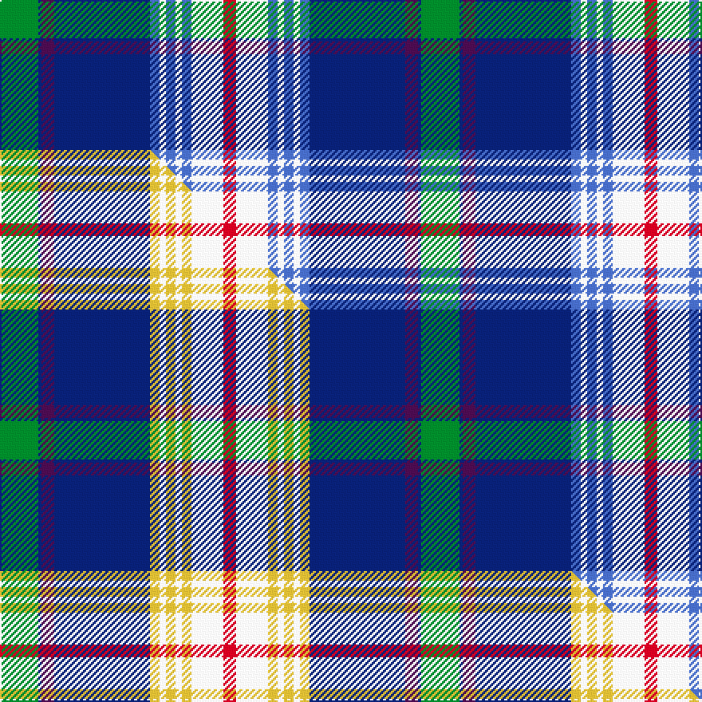

This page is one **sett** — a single exact thread-count. It belongs to the [tartan](/setts/g12db1dp4db30b3w2b3w2b3w10r4/)
(the same proportion at any scale), whose colour order is pattern [GBBBBWBWBWR](/stripes/gbbbbwbwbwr/).

Part of the [Rosslyn Chapel](/tartans/rosslyn-chapel/) tartan — the named design grouping this sett with its other cloths.

Sourced from weddslist.  It is a [11 stripe tartan](/stripes/stripes11/).

Original link http://www.weddslist.com/cgi-bin/tartans/pg.pl?source=sts

Dataset <small>— provenance for this record, inherited from the source manifest</small>

<dl class="dataset-prov">
<dt>source</dt><dd><a href="/sources/weddslist/">Weddslist</a></dd>
<dt>data captured from</dt><dd><a href="https://github.com/thetartan/tartan-database/blob/master/data/weddslist/data.csv">https://github.com/thetartan/tartan-database/blob/master/data/weddslist/data.csv</a></dd>
<dt>data date</dt><dd>2016-11-17 <small>(dataset default)</small></dd>
<dt>licence</dt><dd><a href="https://creativecommons.org/licenses/by-nc-nd/4.0/">CC BY-NC-ND 4.0</a></dd>
</dl>

Capture chain <small>— the hands this data passed through, oldest first; each capture carries its own licence</small>

<ol class="capture-chain">
<li><a href="https://www.weddslist.com/tartans/">Weddslist</a> <small>the living privately compiled reference</small></li>
<li><a href="https://github.com/thetartan/tartan-database">thetartan/tartan-database</a> <small>2016-2017</small> · <a href="https://creativecommons.org/licenses/by-nc-nd/4.0/">CC BY-NC-ND 4.0</a> <small>Levko Kravets's frozen compilation — the capture we vendored, and where its CC licence text came from</small></li>
<li>this dictionary <small>captured 2026-06-10 · commit 5bf86c7566</small> <small>each re-capture is a git commit to data/sources</small></li>
</ol>

## Thread count
G/24 DB2 DP8 DB60 B6 W4 B6 W4 B6 W20 R/8

One full sett is **264 threads**.

## Palette
<table><thead><tr><th>Colour</th><th>Shade</th><th>OKLCh</th></tr></thead><tbody><tr><td>DB</td><td><code style="background-color:#082077;">#082077</code> <small style="color:#888">#082077</small></td><td><small style="color:#888">oklch(30.0% 0.149 265.1)</small></td></tr><tr><td>G</td><td><code style="background-color:#008B2A;">#008B2A</code> <small style="color:#888">#008B2A</small></td><td><small style="color:#888">oklch(55.4% 0.170 145.9)</small></td></tr><tr><td>W</td><td><code style="background-color:#F7F7F7;">#F7F7F7</code> <small style="color:#888">#F7F7F7</small></td><td><small style="color:#888">oklch(97.6% 0.000 89.9)</small></td></tr><tr><td>B</td><td><code style="background-color:#466CC8;">#466CC8</code> <small style="color:#888">#466CC8</small></td><td><small style="color:#888">oklch(55.1% 0.149 265.0)</small></td></tr><tr><td>DP</td><td><code style="background-color:#4B0B4F;">#4B0B4F</code> <small style="color:#888">#4B0B4F</small></td><td><small style="color:#888">oklch(30.1% 0.125 325.4)</small></td></tr><tr><td>R</td><td><code style="background-color:#D60020;">#D60020</code> <small style="color:#888">#D60020</small></td><td><small style="color:#888">oklch(55.2% 0.224 25.5)</small></td></tr></tbody></table>

# Sample pattern

## Compared to the master

This cloth is one sett of its design; the master sett (the exemplar the design is anchored on) is below for comparison.

Its **ΔTartan distance** from the master is **0.90** — the same measure the nearest-tartans table ranks by (0 is identical; a re-scale of the same cloth is near 0, a recolour or a different proportion further).

<figure class="master-compare" style="margin:0">

this sett
master sett ★

<figcaption style="color:#888;font-size:smaller">One weave of this sett against the <a href="/setts/g12db1dp4db30ly3w2ly3w2ly3w10r4/">master sett ★</a>, split on the diagonal: a shared proportion runs seamlessly across it with only the shades shifting; a different proportion breaks on it.</figcaption>
</figure>

## Nearest tartan variants

The nearest existing variants by ΔTartan distance, with this cloth at the top so the swatches line up against it.

ΔTartan

Threads

Variant

Sett

—

264

<a href="/variants/s11/g12db1dp4db30b3w2b3w2b3w10r4~x2/">Rosslyn Chapel</a>

<a href="/ttd/edit/#slug=g12db1dp4db30ly3w2ly3w2ly3w10r4~x2&amp;base=g12db1dp4db30b3w2b3w2b3w10r4~x2" title="compare in the TTD">0.90</a>

264

<a href="/variants/s11/g12db1dp4db30ly3w2ly3w2ly3w10r4~x2/">Rosslyn Chapel</a>

<a href="/ttd/edit/#slug=dbi30db4g5db2r2db2g5db4w10db5t8db1~x2~dbi1406275-db1404245&amp;base=g12db1dp4db30b3w2b3w2b3w10r4~x2" title="compare in the TTD">2.08</a>

250

<a href="/variants/s12/dbi30db4g5db2r2db2g5db4w10db5t8db1~x2~dbi1406275-db1404245/">Lyon (Personal)</a>

<a href="/ttd/edit/#slug=db2w20r1y2dg8b4dg2b2dg2db20w2~x2&amp;base=g12db1dp4db30b3w2b3w2b3w10r4~x2" title="compare in the TTD">2.22</a>

252

<a href="/variants/s11/db2w20r1y2dg8b4dg2b2dg2db20w2~x2/">Nova Scotia, dress</a>

<a href="/ttd/edit/#slug=g4y1lb3db15g2r2g14n1lb28db2~x2~db0805267-n1604274&amp;base=g12db1dp4db30b3w2b3w2b3w10r4~x2" title="compare in the TTD">2.54</a>

276

<a href="/variants/s10/g4y1lb3db15g2r2g14dbi1lb28db2~x2~db0805267-dbi1604274/">Heriot Watt University</a>

<a href="/ttd/edit/#slug=db2w20r1y2dg8g4dg2g2dg2db20w2~x2&amp;base=g12db1dp4db30b3w2b3w2b3w10r4~x2" title="compare in the TTD">2.68</a>

252

<a href="/variants/s11/db2w20r1y2dg8g4dg2g2dg2db20w2~x2/">Nova Scotia Dress</a>

<a href="/ttd/edit/#slug=w6db6w3db44dg20g8dg2g8dg6r3dg2r3dg4w25ly4&amp;base=g12db1dp4db30b3w2b3w2b3w10r4~x2" title="compare in the TTD">2.79</a>

278

<a href="/variants/s15/w6db6w3db44dg20g8dg2g8dg6r3dg2r3dg4w25ly4/">Anstey (Personal)</a>

<a href="/ttd/edit/#slug=w6db6w3db44dg20g8dg2g8dg6r3dg2r3dg4w25ly4~g2308144-ly3106085&amp;base=g12db1dp4db30b3w2b3w2b3w10r4~x2" title="compare in the TTD">2.88</a>

278

<a href="/variants/s15/w6db6w3db44dg20g8dg2g8dg6r3dg2r3dg4w25ly4~g2308144-ly3106085/">Anstey in New Scotland (Personal)</a>

<a href="/ttd/edit/#slug=w3db1g18r3lb4r3dt4db3dt2db24ri1~x2~db1406275-r2108022-dt1204274-ri2109032&amp;base=g12db1dp4db30b3w2b3w2b3w10r4~x2" title="compare in the TTD">2.91</a>

256

<a href="/variants/s11/w3dbi1g18r3lb4r3db4dbi3db2dbi24ri1~x2~dbi1406275-r2108022-db1204274-ri2109032/">Queen of the South Football Club</a>

<a href="/ttd/edit/#slug=w4db1dbi12db1r8w8db8w2db1w2db24ly4db1r2~x2~db1404245-dbi1406275&amp;base=g12db1dp4db30b3w2b3w2b3w10r4~x2" title="compare in the TTD">2.95</a>

300

<a href="/variants/s14/w4db1dbi12db1r8w8db8w2db1w2db24ly4db1r2~x2~db1404245-dbi1406275/">Submariners (Unofficial)</a>

<a href="/ttd/edit/#slug=r4g1w5g1r2g1w5db4t20db8y2db8y4~x2&amp;base=g12db1dp4db30b3w2b3w2b3w10r4~x2" title="compare in the TTD">3.05</a>

244

<a href="/variants/s13/r4g1w5g1r2g1w5db4t20db8y2db8y4~x2/">Pille Family (Belgium) (Personal)</a>

## Neighbour map

Every grey dot is one of 13620 variants placed by the first two principal components of the ΔTartan feature space (42% of its variance). Red is this tartan; blue dots are its nearest — click one to open its page.

<svg viewBox="0 0 640 380" role="img" style="max-width:100%;height:auto;border:1px solid #e0e0e0;border-radius:4px;display:block" xmlns="http://www.w3.org/2000/svg"><image href="/nn/cloud.v1.png" width="640" height="380"/><a href="/variants/s11/g12db1dp4db30ly3w2ly3w2ly3w10r4~x2/"><circle cx="180.5" cy="90.0" r="4" fill="#3465a4"><title>Rosslyn Chapel</title></circle></a><a href="/variants/s12/dbi30db4g5db2r2db2g5db4w10db5t8db1~x2~dbi1406275-db1404245/"><circle cx="198.2" cy="104.7" r="4" fill="#3465a4"><title>Lyon (Personal)</title></circle></a><a href="/variants/s11/db2w20r1y2dg8b4dg2b2dg2db20w2~x2/"><circle cx="143.1" cy="107.8" r="4" fill="#3465a4"><title>Nova Scotia, dress</title></circle></a><a href="/variants/s10/g4y1lb3db15g2r2g14dbi1lb28db2~x2~db0805267-dbi1604274/"><circle cx="214.2" cy="102.8" r="4" fill="#3465a4"><title>Heriot Watt University</title></circle></a><a href="/variants/s11/db2w20r1y2dg8g4dg2g2dg2db20w2~x2/"><circle cx="141.0" cy="108.3" r="4" fill="#3465a4"><title>Nova Scotia Dress</title></circle></a><a href="/variants/s15/w6db6w3db44dg20g8dg2g8dg6r3dg2r3dg4w25ly4/"><circle cx="134.4" cy="93.2" r="4" fill="#3465a4"><title>Anstey (Personal)</title></circle></a><a href="/variants/s15/w6db6w3db44dg20g8dg2g8dg6r3dg2r3dg4w25ly4~g2308144-ly3106085/"><circle cx="133.8" cy="93.1" r="4" fill="#3465a4"><title>Anstey in New Scotland (Personal)</title></circle></a><a href="/variants/s11/w3dbi1g18r3lb4r3db4dbi3db2dbi24ri1~x2~dbi1406275-r2108022-db1204274-ri2109032/"><circle cx="201.0" cy="94.8" r="4" fill="#3465a4"><title>Queen of the South Football Club</title></circle></a><a href="/variants/s14/w4db1dbi12db1r8w8db8w2db1w2db24ly4db1r2~x2~db1404245-dbi1406275/"><circle cx="219.5" cy="110.2" r="4" fill="#3465a4"><title>Submariners (Unofficial)</title></circle></a><a href="/variants/s13/r4g1w5g1r2g1w5db4t20db8y2db8y4~x2/"><circle cx="130.7" cy="123.0" r="4" fill="#3465a4"><title>Pille Family (Belgium) (Personal)</title></circle></a><circle cx="187.8" cy="92.3" r="5" fill="#c00000"/><text x="320" y="376" text-anchor="middle" font-size="11" fill="#999">ground</text><text x="11" y="190" text-anchor="middle" font-size="11" fill="#999" transform="rotate(-90 11 190)">complexity</text></svg>

ID: /variants/s11/g12db1dp4db30b3w2b3w2b3w10r4~x2/
