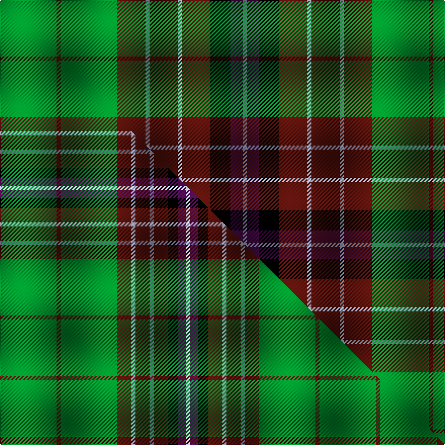

This is one **variant** — a specific cloth: this exact thread count and colourway, with its own
provenance below. It is one weaving of the [sett](/tartans/h/hy/hynde/) (the scale-free proportion — the
same cloth at any scale or shade), whose colour order is pattern [GBGBWBWBKBW](/stripes/gbgbwbwbkbw/).

Part of the [Hynde](/tartans/h/hy/hynde/) tartan — the named design grouping this sett with its other cloths.

Sourced from tartans-authority.  It is a [11 stripe tartan](/stripes/stripes11/).

Original link <code>http://www.tartansauthority.com/tartan-ferret/display/976/</code> — retired · [Internet Archive copy](https://web.archive.org/web/*/http://www.tartansauthority.com/tartan-ferret/display/976/*)

Dataset <small>— provenance for this record, inherited from the source manifest</small>

<dl class="dataset-prov">
<dt>source</dt><dd><a href="/sources/tartans-authority/">Scottish Tartans Authority</a></dd>
<dt>data captured from</dt><dd><a href="https://github.com/thetartan/tartan-database/blob/master/data/tartans-authority/data.csv">https://github.com/thetartan/tartan-database/blob/master/data/tartans-authority/data.csv</a></dd>
<dt>data date</dt><dd>1744 <small>(this record)</small></dd>
<dt>licence</dt><dd><a href="https://creativecommons.org/licenses/by-nc-nd/4.0/">CC BY-NC-ND 4.0</a></dd>
</dl>

Capture chain <small>— the hands this data passed through, oldest first; each capture carries its own licence</small>

<ol class="capture-chain">
<li><a href="https://www.tartansauthority.com/">Scottish Tartans Authority</a> <small>the heritage body’s archive — its tartan-ferret record browser is retired; dead record links are shown unlinked, with an Internet Archive copy (ITI numbers are not SRT references)</small></li>
<li><a href="https://github.com/thetartan/tartan-database">thetartan/tartan-database</a> <small>2016-2017</small> · <a href="https://creativecommons.org/licenses/by-nc-nd/4.0/">CC BY-NC-ND 4.0</a> <small>Levko Kravets's frozen compilation — the capture we vendored, and where its CC licence text came from</small></li>
<li>this dictionary <small>captured 2026-06-10 · commit 5bf86c7566</small> <small>each re-capture is a git commit to data/sources</small></li>
</ol>

## Register references

External register numbers recorded for this tartan.

- Scottish Tartans Authority (ITI): 976

## Thread count
G/56 DR4 G56 DR28 LB4 DR28 LB4 DR28 K20 DP12 LB/4

One full sett is **428 threads**.

## Palette
<table><thead><tr><th>Colour</th><th>Shade</th><th>OKLCh</th></tr></thead><tbody><tr><td>DR</td><td><code style="background-color:#55120C;">#55120C</code> <small style="color:#888">#55120C</small></td><td><small style="color:#888">oklch(30.0% 0.099 29.3)</small></td></tr><tr><td>G</td><td><code style="background-color:#008B2A;">#008B2A</code> <small style="color:#888">#008B2A</small></td><td><small style="color:#888">oklch(55.4% 0.170 145.9)</small></td></tr><tr><td>K</td><td><code style="background-color:#000000;">#000000</code> <small style="color:#888">#000000</small></td><td><small style="color:#888">oklch(0.0% 0.000 0.0)</small></td></tr><tr><td>LB</td><td><code style="background-color:#B5BBDE;">#B5BBDE</code> <small style="color:#888">#B5BBDE</small></td><td><small style="color:#888">oklch(79.9% 0.050 277.6)</small></td></tr><tr><td>DP</td><td><code style="background-color:#4B0B4F;">#4B0B4F</code> <small style="color:#888">#4B0B4F</small></td><td><small style="color:#888">oklch(30.1% 0.125 325.4)</small></td></tr></tbody></table>

# Sample pattern

[Sample sheet (PDF)](swatch.pdf) — the woven sample, thread count and palette on one printable A4, rendered on demand (the same sheet the TTD print page downloads).

## Compared to the master

This cloth is one sett of its design; the master sett (the exemplar the design is anchored on) is below for comparison.

Its **ΔTartan distance** from the master is **0.61** — the same measure the nearest-tartans table ranks by (0 is identical; a re-scale of the same cloth is near 0, a recolour or a different proportion further).

<figure class="master-compare" style="margin:0">

this sett
master sett ★

<figcaption style="color:#888;font-size:smaller">One weave of this sett against the <a href="/setts/g28dr2g28dr7lb2dr7lb2dr7k5dp4lb2/">master sett ★</a>, split on the diagonal: a shared proportion runs seamlessly across it with only the shades shifting; a different proportion breaks on it.</figcaption>
</figure>

## Nearest tartan variants

The nearest existing variants by ΔTartan distance, with this cloth at the top so the swatches line up against it.

ΔTartan

Threads

Variant

Sett

—

428

<a href="/variants/s11/g14dr1g14dr7lb1dr7lb1dr7k5dp3lb1~x4/">Hynde (Sir John) (Artefact)</a>

<a href="/ttd/edit/#slug=g14r1g14r7w1r7w1r7db5dp3w1~x4&amp;base=g14dr1g14dr7lb1dr7lb1dr7k5dp3lb1~x4" title="compare in the TTD">1.20</a>

428

<a href="/variants/s11/g14r1g14r7w1r7w1r7db5dp3w1~x4/">Hynde Artifact Tartan</a>

<a href="/ttd/edit/#slug=dr6k4dr8g16dr6lb2dr2g2dr2lb2dr6g18dp6g2dp1~x2&amp;base=g14dr1g14dr7lb1dr7lb1dr7k5dp3lb1~x4" title="compare in the TTD">1.71</a>

318

<a href="/variants/s15/dr6k4dr8g16dr6lb2dr2g2dr2lb2dr6g18dp6g2dp1~x2/">MacCall Family Tartan</a>

<a href="/ttd/edit/#slug=g22r4g2r2g2r4g12k12r2db10r4db4y3~x2&amp;base=g14dr1g14dr7lb1dr7lb1dr7k5dp3lb1~x4" title="compare in the TTD">2.19</a>

282

<a href="/variants/s13/g22r4g2r2g2r4g12k12r2db10r4db4y3~x2/">Cochrane (1974)</a>

<a href="/ttd/edit/#slug=g22r4g2r2g2r4g12k12r2db10r4db4y3&amp;base=g14dr1g14dr7lb1dr7lb1dr7k5dp3lb1~x4" title="compare in the TTD">2.19</a>

141

<a href="/variants/s13/g22r4g2r2g2r4g12k12r2db10r4db4y3/">Cochrane LC</a>

<a href="/ttd/edit/#slug=g5db20g20db2g2db2g25r2g2r17k8g2w2~x2&amp;base=g14dr1g14dr7lb1dr7lb1dr7k5dp3lb1~x4" title="compare in the TTD">2.44</a>

422

<a href="/variants/s13/g5db20g20db2g2db2g25r2g2r17k8g2w2~x2/">Boyle, Cameron (Personal)</a>

<a href="/ttd/edit/#slug=w1r2g10r2g2k8g2db8g2r2g10r2w1~x4&amp;base=g14dr1g14dr7lb1dr7lb1dr7k5dp3lb1~x4" title="compare in the TTD">2.47</a>

408

<a href="/variants/s13/w1r2g10r2g2k8g2db8g2r2g10r2w1~x4/">Reid, Green</a>

<a href="/ttd/edit/#slug=w1r2g10r2g2k8g2db8g2r2g10r2w1~x2&amp;base=g14dr1g14dr7lb1dr7lb1dr7k5dp3lb1~x4" title="compare in the TTD">2.47</a>

204

<a href="/variants/s13/w1r2g10r2g2k8g2db8g2r2g10r2w1~x2/">Reid Family Tartan</a>

<a href="/ttd/edit/#slug=k2g10n5g20n5y3n7k3n7k4n4w2~x2&amp;base=g14dr1g14dr7lb1dr7lb1dr7k5dp3lb1~x4" title="compare in the TTD">2.49</a>

280

<a href="/variants/s12/k2g10n5g20n5y3n7k3n7k4n4w2~x2/">Aceo</a>

<a href="/ttd/edit/#slug=g9r6g40dp6g6dp6k6dp36ly4dp8ly4&amp;base=g14dr1g14dr7lb1dr7lb1dr7k5dp3lb1~x4" title="compare in the TTD">2.51</a>

249

<a href="/variants/s11/g9r6g40dp6g6dp6k6dp36ly4dp8ly4/">Boyle Family, Susan (Personal)</a>

<a href="/ttd/edit/#slug=r4db5r4db5g8y2g24w2g8db5r4db5r4~x2&amp;base=g14dr1g14dr7lb1dr7lb1dr7k5dp3lb1~x4" title="compare in the TTD">2.54</a>

304

<a href="/variants/s13/r4db5r4db5g8y2g24w2g8db5r4db5r4~x2/">Clackson Hunting (Personal)</a>

## Neighbour map

Every grey dot is one of 13662 variants placed by the first two principal components of the ΔTartan feature space (42% of its variance). Red is this tartan; blue dots are its nearest — click one to open its page. The map is a flat projection of a many-dimensional space — [how to read it](/posts/neighbourhood-maps/).

<svg viewBox="0 0 640 380" role="img" style="max-width:100%;height:auto;border:1px solid #e0e0e0;border-radius:4px;display:block" xmlns="http://www.w3.org/2000/svg"><image href="/nn/cloud.v1.png" width="640" height="380"/><a href="/variants/s11/g14r1g14r7w1r7w1r7db5dp3w1~x4/"><circle cx="233.1" cy="163.2" r="4" fill="#3465a4"><title>Hynde Artifact Tartan</title></circle></a><a href="/variants/s15/dr6k4dr8g16dr6lb2dr2g2dr2lb2dr6g18dp6g2dp1~x2/"><circle cx="222.1" cy="130.8" r="4" fill="#3465a4"><title>MacCall Family Tartan</title></circle></a><a href="/variants/s13/g22r4g2r2g2r4g12k12r2db10r4db4y3~x2/"><circle cx="161.3" cy="142.0" r="4" fill="#3465a4"><title>Cochrane (1974)</title></circle></a><a href="/variants/s13/g22r4g2r2g2r4g12k12r2db10r4db4y3/"><circle cx="161.3" cy="142.0" r="4" fill="#3465a4"><title>Cochrane LC</title></circle></a><a href="/variants/s13/g5db20g20db2g2db2g25r2g2r17k8g2w2~x2/"><circle cx="209.0" cy="131.2" r="4" fill="#3465a4"><title>Boyle, Cameron (Personal)</title></circle></a><a href="/variants/s13/w1r2g10r2g2k8g2db8g2r2g10r2w1~x4/"><circle cx="169.1" cy="149.0" r="4" fill="#3465a4"><title>Reid, Green</title></circle></a><a href="/variants/s13/w1r2g10r2g2k8g2db8g2r2g10r2w1~x2/"><circle cx="169.1" cy="149.0" r="4" fill="#3465a4"><title>Reid Family Tartan</title></circle></a><a href="/variants/s12/k2g10n5g20n5y3n7k3n7k4n4w2~x2/"><circle cx="186.8" cy="175.0" r="4" fill="#3465a4"><title>Aceo</title></circle></a><a href="/variants/s11/g9r6g40dp6g6dp6k6dp36ly4dp8ly4/"><circle cx="204.8" cy="148.3" r="4" fill="#3465a4"><title>Boyle Family, Susan (Personal)</title></circle></a><a href="/variants/s13/r4db5r4db5g8y2g24w2g8db5r4db5r4~x2/"><circle cx="235.0" cy="160.9" r="4" fill="#3465a4"><title>Clackson Hunting (Personal)</title></circle></a><circle cx="212.3" cy="155.3" r="5" fill="#c00000"/><text x="320" y="376" text-anchor="middle" font-size="11" fill="#999">ground</text><text x="11" y="190" text-anchor="middle" font-size="11" fill="#999" transform="rotate(-90 11 190)">complexity</text></svg>

ID: /variants/s11/g14dr1g14dr7lb1dr7lb1dr7k5dp3lb1~x4/
