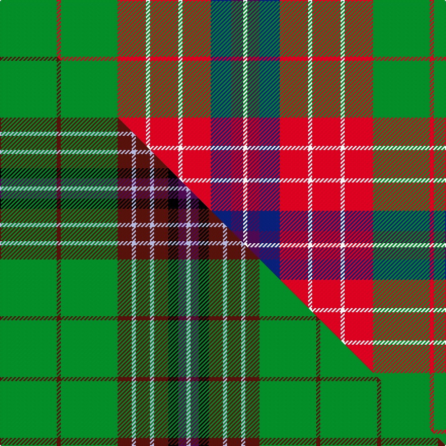

This is one **variant** — a specific cloth: this exact thread count and colourway, with its own
provenance below. It is one weaving of the [sett](/setts/g14r1g14r7w1r7w1r7db5dp3w1/) (the scale-free proportion — the
same cloth at any scale or shade), whose colour order is pattern [GRGRWRWRBBW](/stripes/grgrwrwrbbw/).

Part of the [Hynde](/tartans/hynde/) tartan — the named design grouping this sett with its other cloths.

Sourced from house-of-tartan.  It is a [11 stripe tartan](/stripes/stripes11/).

Original link [http://www.house-of-tartan.scotland.net/house/TartanViewjs.asp?colr=Def&tnam=976](http://www.house-of-tartan.scotland.net/house/TartanViewjs.asp?colr=Def&tnam=976)

## Provenance

Earliest known date: 1744 Trews belonging to Sir John Hynde.

2 attestations — the source records this cloth was collapsed from (oldest owns this page)

<ul>
<li>1744 — Hynde Artifact Tartan (house-of-tartan, <a href="http://www.house-of-tartan.scotland.net/house/TartanViewjs.asp?colr=Def&tnam=976">record</a>) </li>
<li>undated — Hynde (weddslist, <a href="http://www.weddslist.com/cgi-bin/tartans/pg.pl?source=sts">record</a>) </li>
</ul>

Dataset <small>— provenance for this record, inherited from the source manifest</small>

<dl class="dataset-prov">
<dt>source</dt><dd><a href="/sources/house-of-tartan/">House of Tartan</a></dd>
<dt>data captured from</dt><dd><a href="https://github.com/thetartan/tartan-database/blob/master/data/house-of-tartan/data.csv">https://github.com/thetartan/tartan-database/blob/master/data/house-of-tartan/data.csv</a></dd>
<dt>data date</dt><dd>1744 <small>(this record)</small></dd>
<dt>licence</dt><dd><a href="https://creativecommons.org/licenses/by-nc-nd/4.0/">CC BY-NC-ND 4.0</a></dd>
</dl>

Capture chain <small>— the hands this data passed through, oldest first; each capture carries its own licence</small>

<ol class="capture-chain">
<li><a href="http://www.house-of-tartan.scotland.net/">House of Tartan</a> <small>the weaver/retailer's database — the site is now offline; the URL is kept as the ultimate source's identity</small></li>
<li><a href="https://github.com/thetartan/tartan-database">thetartan/tartan-database</a> <small>2016-2017</small> · <a href="https://creativecommons.org/licenses/by-nc-nd/4.0/">CC BY-NC-ND 4.0</a> <small>Levko Kravets's frozen compilation — the capture we vendored, and where its CC licence text came from</small></li>
<li>this dictionary <small>captured 2026-06-10 · commit 5bf86c7566</small> <small>each re-capture is a git commit to data/sources</small></li>
</ol>

## Thread count
G/56 R4 G56 R28 W4 R28 W4 R28 DB20 DP12 W/4

One full sett is **428 threads**.

## Palette
<table><thead><tr><th>Colour</th><th>Shade</th><th>OKLCh</th></tr></thead><tbody><tr><td>DB</td><td><code style="background-color:#082077;">#082077</code> <small style="color:#888">#082077</small></td><td><small style="color:#888">oklch(30.0% 0.149 265.1)</small></td></tr><tr><td>G</td><td><code style="background-color:#008B2A;">#008B2A</code> <small style="color:#888">#008B2A</small></td><td><small style="color:#888">oklch(55.4% 0.170 145.9)</small></td></tr><tr><td>W</td><td><code style="background-color:#F7F7F7;">#F7F7F7</code> <small style="color:#888">#F7F7F7</small></td><td><small style="color:#888">oklch(97.6% 0.000 89.9)</small></td></tr><tr><td>DP</td><td><code style="background-color:#4B0B4F;">#4B0B4F</code> <small style="color:#888">#4B0B4F</small></td><td><small style="color:#888">oklch(30.1% 0.125 325.4)</small></td></tr><tr><td>R</td><td><code style="background-color:#D60020;">#D60020</code> <small style="color:#888">#D60020</small></td><td><small style="color:#888">oklch(55.2% 0.224 25.5)</small></td></tr></tbody></table>

# Sample pattern

## Compared to the master

This cloth is one sett of its design; the master sett (the exemplar the design is anchored on) is below for comparison.

Its **ΔTartan distance** from the master is **1.80** — the same measure the nearest-tartans table ranks by (0 is identical; a re-scale of the same cloth is near 0, a recolour or a different proportion further).

<figure class="master-compare" style="margin:0">

this sett
master sett ★

<figcaption style="color:#888;font-size:smaller">One weave of this sett against the <a href="/setts/g28dr2g28dr7lb2dr7lb2dr7k5dp4lb2/">master sett ★</a>, split on the diagonal: a shared proportion runs seamlessly across it with only the shades shifting; a different proportion breaks on it.</figcaption>
</figure>

## Nearest tartan variants

The nearest existing variants by ΔTartan distance, with this cloth at the top so the swatches line up against it.

ΔTartan

Threads

Variant

Sett

—

428

<a href="/variants/s11/g14r1g14r7w1r7w1r7db5dp3w1~x4/">Hynde Artifact Tartan</a>

<a href="/ttd/edit/#slug=g14dr1g14dr7lb1dr7lb1dr7k5dp3lb1~x4&amp;base=g14r1g14r7w1r7w1r7db5dp3w1~x4" title="compare in the TTD">1.20</a>

428

<a href="/variants/s11/g14dr1g14dr7lb1dr7lb1dr7k5dp3lb1~x4/">Hynde (Sir John) (Artefact)</a>

<a href="/ttd/edit/#slug=dr2r4g2db2r6g14r2db2g2r12g7dr2r5w1~x2&amp;base=g14r1g14r7w1r7w1r7db5dp3w1~x4" title="compare in the TTD">1.99</a>

246

<a href="/variants/s14/dr2r4g2db2r6g14r2db2g2r12g7dr2r5w1~x2/">MacDonald of Staffa #5</a>

<a href="/ttd/edit/#slug=g22r3db10t2db10r21g22r3y2db2~x2&amp;base=g14r1g14r7w1r7w1r7db5dp3w1~x4" title="compare in the TTD">2.00</a>

340

<a href="/variants/s10/g22r3db10t2db10r21g22r3y2db2~x2/">Glasgow Cathedral 2000</a>

<a href="/ttd/edit/#slug=dr5r2y24lb2y2lb2y6lb8dr6lb8ly4~x2&amp;base=g14r1g14r7w1r7w1r7db5dp3w1~x4" title="compare in the TTD">2.07</a>

258

<a href="/variants/s11/dr5r2y24lb2y2lb2y6lb8dr6lb8ly4~x2/">Tasmanian</a>

<a href="/ttd/edit/#slug=g6dg2g3dg2g6db8r20ly2r3g2~x2&amp;base=g14r1g14r7w1r7w1r7db5dp3w1~x4" title="compare in the TTD">2.14</a>

200

<a href="/variants/s10/g6dg2g3dg2g6db8r20ly2r3g2~x2/">Connolly Dress (Name)</a>

<a href="/ttd/edit/#slug=g12w1r1w4r1w1r8dy2r1~x4&amp;base=g14r1g14r7w1r7w1r7db5dp3w1~x4" title="compare in the TTD">2.15</a>

196

<a href="/variants/s9/g12w1r1w4r1w1r8dy2r1~x4/">Karibu (Corporate)</a>

<a href="/ttd/edit/#slug=g12w1r1w4r1w1r8y2r1~x4&amp;base=g14r1g14r7w1r7w1r7db5dp3w1~x4" title="compare in the TTD">2.15</a>

196

<a href="/variants/s9/g12w1r1w4r1w1r8y2r1~x4/">Karibu</a>

<a href="/ttd/edit/#slug=r2ri4g2db2ri6g14ri2db2g2ri12g7r2ri5w1~x2~r1506028-ri2008029&amp;base=g14r1g14r7w1r7w1r7db5dp3w1~x4" title="compare in the TTD">2.32</a>

246

<a href="/variants/s14/r2ri4g2db2ri6g14ri2db2g2ri12g7r2ri5w1~x2~r1506028-ri2008029/">MacDonald of Staffa 4</a>

<a href="/ttd/edit/#slug=dg2r3g2db2r6g16r2db4g2r16g8dg2r4w2&amp;base=g14r1g14r7w1r7w1r7db5dp3w1~x4" title="compare in the TTD">2.37</a>

138

<a href="/variants/s14/dg2r3g2db2r6g16r2db4g2r16g8dg2r4w2/">MacKinnon</a>

<a href="/ttd/edit/#slug=w2r4lb2g8r16g2db4r2g16r6db2g2r3lb2~x2&amp;base=g14r1g14r7w1r7w1r7db5dp3w1~x4" title="compare in the TTD">2.41</a>

276

<a href="/variants/s14/w2r4lb2g8r16g2db4r2g16r6db2g2r3lb2~x2/">MacKinnon #2</a>

## Neighbour map

Every grey dot is one of 13621 variants placed by the first two principal components of the ΔTartan feature space (42% of its variance). Red is this tartan; blue dots are its nearest — click one to open its page.

<svg viewBox="0 0 640 380" role="img" style="max-width:100%;height:auto;border:1px solid #e0e0e0;border-radius:4px;display:block" xmlns="http://www.w3.org/2000/svg"><image href="/nn/cloud.v1.png" width="640" height="380"/><a href="/variants/s11/g14dr1g14dr7lb1dr7lb1dr7k5dp3lb1~x4/"><circle cx="212.3" cy="155.8" r="4" fill="#3465a4"><title>Hynde (Sir John) (Artefact)</title></circle></a><a href="/variants/s14/dr2r4g2db2r6g14r2db2g2r12g7dr2r5w1~x2/"><circle cx="253.2" cy="153.6" r="4" fill="#3465a4"><title>MacDonald of Staffa #5</title></circle></a><a href="/variants/s10/g22r3db10t2db10r21g22r3y2db2~x2/"><circle cx="228.2" cy="179.3" r="4" fill="#3465a4"><title>Glasgow Cathedral 2000</title></circle></a><a href="/variants/s11/dr5r2y24lb2y2lb2y6lb8dr6lb8ly4~x2/"><circle cx="254.6" cy="168.7" r="4" fill="#3465a4"><title>Tasmanian</title></circle></a><a href="/variants/s10/g6dg2g3dg2g6db8r20ly2r3g2~x2/"><circle cx="216.1" cy="169.2" r="4" fill="#3465a4"><title>Connolly Dress (Name)</title></circle></a><a href="/variants/s9/g12w1r1w4r1w1r8dy2r1~x4/"><circle cx="218.0" cy="169.6" r="4" fill="#3465a4"><title>Karibu (Corporate)</title></circle></a><a href="/variants/s9/g12w1r1w4r1w1r8y2r1~x4/"><circle cx="226.3" cy="172.7" r="4" fill="#3465a4"><title>Karibu</title></circle></a><a href="/variants/s14/r2ri4g2db2ri6g14ri2db2g2ri12g7r2ri5w1~x2~r1506028-ri2008029/"><circle cx="261.2" cy="156.0" r="4" fill="#3465a4"><title>MacDonald of Staffa 4</title></circle></a><a href="/variants/s14/dg2r3g2db2r6g16r2db4g2r16g8dg2r4w2/"><circle cx="219.0" cy="167.3" r="4" fill="#3465a4"><title>MacKinnon</title></circle></a><a href="/variants/s14/w2r4lb2g8r16g2db4r2g16r6db2g2r3lb2~x2/"><circle cx="218.1" cy="166.9" r="4" fill="#3465a4"><title>MacKinnon #2</title></circle></a><circle cx="233.0" cy="163.8" r="5" fill="#c00000"/><text x="320" y="376" text-anchor="middle" font-size="11" fill="#999">ground</text><text x="11" y="190" text-anchor="middle" font-size="11" fill="#999" transform="rotate(-90 11 190)">complexity</text></svg>

ID: /variants/s11/g14r1g14r7w1r7w1r7db5dp3w1~x4/
