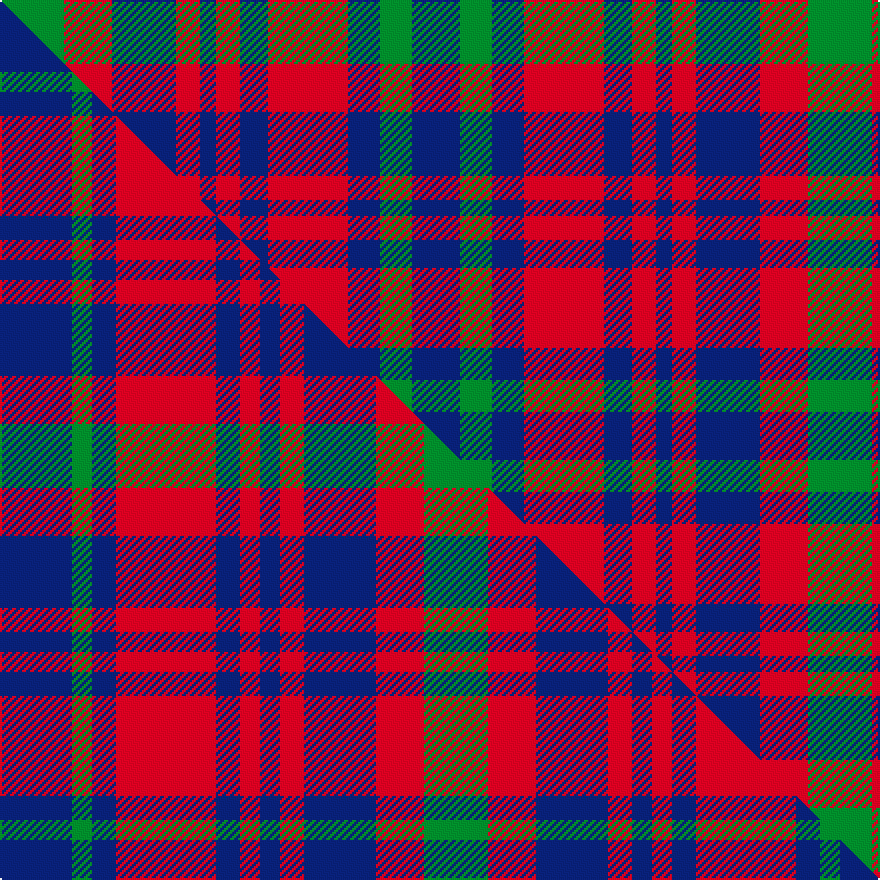

This page is one **sett** — a single exact thread-count. It belongs to the [tartan](/setts/g16r12db16r6db4r6db7r20db8g8db12/)
(the same proportion at any scale), whose colour order is pattern [BGBRBRBRBRG](/stripes/bgbrbrbrbrg/).

Part of the [Fiddes](/tartans/fiddes-2/) tartan — the named design grouping this sett with its other cloths.

Sourced from register-of-tartans.  It is a [11 stripe tartan](/stripes/stripes11/).

Original link [https://www.tartanregister.gov.uk/tartanDetails.aspx?ref=1175](https://www.tartanregister.gov.uk/tartanDetails.aspx?ref=1175)

2 attestations — the source records this cloth was collapsed from (oldest owns this page)

<ul>
<li>undated — Fiddes #2 (register-of-tartans, <a href="https://www.tartanregister.gov.uk/tartanDetails.aspx?ref=1175">record</a>)  <em>Mackinlays book of hand colourer Tartan Strips is in the Scottish Tartans Society archive.</em></li>
<li>undated — Fiddes (weddslist, <a href="http://www.weddslist.com/cgi-bin/tartans/pg.pl?source=sts">record</a>) </li>
</ul>

Dataset <small>— provenance for this record, inherited from the source manifest</small>

<dl class="dataset-prov">
<dt>source</dt><dd><a href="/sources/register-of-tartans/">Scottish Register of Tartans</a></dd>
<dt>data captured from</dt><dd><a href="https://github.com/thetartan/tartan-database/blob/master/data/register-of-tartans/data.csv">https://github.com/thetartan/tartan-database/blob/master/data/register-of-tartans/data.csv</a></dd>
<dt>data date</dt><dd>2017-01-06 <small>(dataset default)</small></dd>
<dt>licence</dt><dd><a href="https://www.tartanregister.gov.uk/copyright">Crown copyright</a></dd>
</dl>

Capture chain <small>— the hands this data passed through, oldest first; each capture carries its own licence</small>

<ol class="capture-chain">
<li><a href="https://www.tartanregister.gov.uk/">Scottish Register of Tartans</a> · <a href="https://www.tartanregister.gov.uk/copyright">Crown copyright</a> <small>the living register — still published by National Records of Scotland</small></li>
<li><a href="https://github.com/thetartan/tartan-database">thetartan/tartan-database</a> <small>2016-2017</small> · <a href="https://creativecommons.org/licenses/by-nc-nd/4.0/">CC BY-NC-ND 4.0</a> <small>Levko Kravets's frozen compilation — the capture we vendored, and where its CC licence text came from</small></li>
<li>this dictionary <small>captured 2026-06-10 · commit 5bf86c7566</small> <small>each re-capture is a git commit to data/sources</small></li>
</ol>

## Register references

External register numbers recorded for this tartan.

- Scottish Register of Tartans: [1175](https://www.tartanregister.gov.uk/tartanDetails.aspx?ref=1175)
- Scottish Tartans World Register: 122

## Thread count
G/32 R24 DB32 R12 DB8 R12 DB14 R40 DB16 G16 DB/24

One full sett is **404 threads**.

## Palette
<table><thead><tr><th>Colour</th><th>Shade</th><th>OKLCh</th></tr></thead><tbody><tr><td>DB</td><td><code style="background-color:#082077;">#082077</code> <small style="color:#888">#082077</small></td><td><small style="color:#888">oklch(30.0% 0.149 265.1)</small></td></tr><tr><td>G</td><td><code style="background-color:#008B2A;">#008B2A</code> <small style="color:#888">#008B2A</small></td><td><small style="color:#888">oklch(55.4% 0.170 145.9)</small></td></tr><tr><td>R</td><td><code style="background-color:#D60020;">#D60020</code> <small style="color:#888">#D60020</small></td><td><small style="color:#888">oklch(55.2% 0.224 25.5)</small></td></tr></tbody></table>

# Sample pattern

## Compared to the master

This cloth is one sett of its design; the master sett (the exemplar the design is anchored on) is below for comparison.

Its **ΔTartan distance** from the master is **0.26** — the same measure the nearest-tartans table ranks by (0 is identical; a re-scale of the same cloth is near 0, a recolour or a different proportion further).

<figure class="master-compare" style="margin:0">

this sett
master sett ★

<figcaption style="color:#888;font-size:smaller">One weave of this sett against the <a href="/setts/db18g5db6r25db6r5db5r6db18r12g16/">master sett ★</a>, split on the diagonal: a shared proportion runs seamlessly across it with only the shades shifting; a different proportion breaks on it.</figcaption>
</figure>

## Nearest tartan variants

The nearest existing variants by ΔTartan distance, with this cloth at the top so the swatches line up against it.

ΔTartan

Threads

Variant

Sett

—

404

<a href="/variants/s11/g16r12db16r6db4r6db7r20db8g8db12~x2/">Fiddes #2</a>

<a href="/ttd/edit/#slug=db18g5db6r25db6r5db5r6db18r12g16~x2&amp;base=g16r12db16r6db4r6db7r20db8g8db12~x2" title="compare in the TTD">0.26</a>

420

<a href="/variants/s11/db18g5db6r25db6r5db5r6db18r12g16~x2/">Fiddes (Artefact)</a>

<a href="/ttd/edit/#slug=db13r4db4r9db14r4db14g15r8g8r4~x2&amp;base=g16r12db16r6db4r6db7r20db8g8db12~x2" title="compare in the TTD">1.67</a>

354

<a href="/variants/s11/db13r4db4r9db14r4db14g15r8g8r4~x2/">McCaslin</a>

<a href="/ttd/edit/#slug=r4dg4r1db4r4~x12~dg1605139&amp;base=g16r12db16r6db4r6db7r20db8g8db12~x2" title="compare in the TTD">2.34</a>

312

<a href="/variants/s5/r4dg4r1db4r4~x12~dg1605139/">Gow</a>

<a href="/ttd/edit/#slug=r10g14r3db14r10g14r3db4~x2&amp;base=g16r12db16r6db4r6db7r20db8g8db12~x2" title="compare in the TTD">2.68</a>

260

<a href="/variants/s8/r10g14r3db14r10g14r3db4~x2/">Glasgow District Tartan</a>

<a href="/ttd/edit/#slug=db13r4db4r9db14r4db14g15r8g8r4g8w4~x2&amp;base=g16r12db16r6db4r6db7r20db8g8db12~x2" title="compare in the TTD">2.88</a>

402

<a href="/variants/s13/db13r4db4r9db14r4db14g15r8g8r4g8w4~x2/">MacCaslan (Artefact)</a>

<a href="/ttd/edit/#slug=dr9lb4dr6t4lb2k2lb2dr5t3lb2k2lb2~x2&amp;base=g16r12db16r6db4r6db7r20db8g8db12~x2" title="compare in the TTD">3.16</a>

150

<a href="/variants/s12/dr9lb4dr6t4lb2k2lb2dr5t3lb2k2lb2~x2/">Westgaard Ladies' (Personal)</a>

<a href="/ttd/edit/#slug=r3db3r3db10g10r3g3r3~x2&amp;base=g16r12db16r6db4r6db7r20db8g8db12~x2" title="compare in the TTD">3.27</a>

140

<a href="/variants/s8/r3db3r3db10g10r3g3r3~x2/">Flora MacDonald</a>

<a href="/ttd/edit/#slug=r5dp5r1g5r5~x8~dp1607327&amp;base=g16r12db16r6db4r6db7r20db8g8db12~x2" title="compare in the TTD">3.41</a>

256

<a href="/variants/s5/r5dp5r1g5r5~x8~dp1607327/">Gow (Portrait)</a>

<a href="/ttd/edit/#slug=r12g14r4g14r4g14r4db8r5db8r12g3r12&amp;base=g16r12db16r6db4r6db7r20db8g8db12~x2" title="compare in the TTD">3.45</a>

204

<a href="/variants/s13/r12g14r4g14r4g14r4db8r5db8r12g3r12/">Grant of Monymusk</a>

<a href="/ttd/edit/#slug=r12g14r4g14r4g14r4db8r5db8r12g3r12~x2&amp;base=g16r12db16r6db4r6db7r20db8g8db12~x2" title="compare in the TTD">3.45</a>

408

<a href="/variants/s13/r12g14r4g14r4g14r4db8r5db8r12g3r12~x2/">Grant of Monymusk</a>

## Neighbour map

Every grey dot is one of 13621 variants placed by the first two principal components of the ΔTartan feature space (42% of its variance). Red is this tartan; blue dots are its nearest — click one to open its page.

<svg viewBox="0 0 640 380" role="img" style="max-width:100%;height:auto;border:1px solid #e0e0e0;border-radius:4px;display:block" xmlns="http://www.w3.org/2000/svg"><image href="/nn/cloud.v1.png" width="640" height="380"/><a href="/variants/s11/db18g5db6r25db6r5db5r6db18r12g16~x2/"><circle cx="219.9" cy="248.1" r="4" fill="#3465a4"><title>Fiddes (Artefact)</title></circle></a><a href="/variants/s11/db13r4db4r9db14r4db14g15r8g8r4~x2/"><circle cx="200.6" cy="274.6" r="4" fill="#3465a4"><title>McCaslin</title></circle></a><a href="/variants/s5/r4dg4r1db4r4~x12~dg1605139/"><circle cx="187.0" cy="301.8" r="4" fill="#3465a4"><title>Gow</title></circle></a><a href="/variants/s8/r10g14r3db14r10g14r3db4~x2/"><circle cx="192.5" cy="278.9" r="4" fill="#3465a4"><title>Glasgow District Tartan</title></circle></a><a href="/variants/s13/db13r4db4r9db14r4db14g15r8g8r4g8w4~x2/"><circle cx="142.1" cy="253.2" r="4" fill="#3465a4"><title>MacCaslan (Artefact)</title></circle></a><a href="/variants/s12/dr9lb4dr6t4lb2k2lb2dr5t3lb2k2lb2~x2/"><circle cx="154.9" cy="225.0" r="4" fill="#3465a4"><title>Westgaard Ladies' (Personal)</title></circle></a><a href="/variants/s8/r3db3r3db10g10r3g3r3~x2/"><circle cx="170.0" cy="275.8" r="4" fill="#3465a4"><title>Flora MacDonald</title></circle></a><a href="/variants/s5/r5dp5r1g5r5~x8~dp1607327/"><circle cx="205.9" cy="289.6" r="4" fill="#3465a4"><title>Gow (Portrait)</title></circle></a><a href="/variants/s13/r12g14r4g14r4g14r4db8r5db8r12g3r12/"><circle cx="222.2" cy="261.7" r="4" fill="#3465a4"><title>Grant of Monymusk</title></circle></a><a href="/variants/s13/r12g14r4g14r4g14r4db8r5db8r12g3r12~x2/"><circle cx="222.2" cy="261.7" r="4" fill="#3465a4"><title>Grant of Monymusk</title></circle></a><circle cx="192.0" cy="266.9" r="5" fill="#c00000"/><text x="320" y="376" text-anchor="middle" font-size="11" fill="#999">ground</text><text x="11" y="190" text-anchor="middle" font-size="11" fill="#999" transform="rotate(-90 11 190)">complexity</text></svg>

ID: /variants/s11/g16r12db16r6db4r6db7r20db8g8db12~x2/
