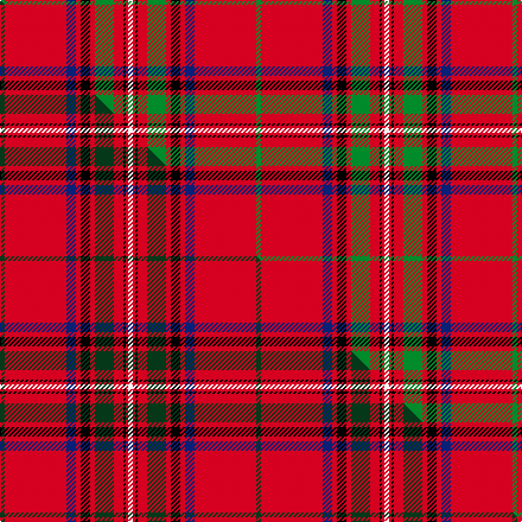

This page is one **sett** — a single exact thread-count. It belongs to the [tartan](/setts/g2r26db4r2k4r2g8r4k1r1w2/)
(the same proportion at any scale), whose colour order is pattern [GRBRKRGRKRW](/stripes/grbrkrgrkrw/).

Part of the [Stewart of Rothesay](/tartans/stewart-of-rothesay/) tartan — the named design grouping this sett with its other cloths.

Sourced from weddslist.  It is a [11 stripe tartan](/stripes/stripes11/).

Original link http://www.weddslist.com/cgi-bin/tartans/pg.pl?source=sts

## Provenance

Earliest known date: 1829 See Vestiarium Scoticum entry. Named `Duke of Rothesay' in a drawing by Charles Sobieski (Allen) in the Dick Lauder transcript in the Royal Library in Windsor.

2 attestations — the source records this cloth was collapsed from (oldest owns this page)

<ul>
<li>undated — Stewart of Rothesay (weddslist, <a href="http://www.weddslist.com/cgi-bin/tartans/pg.pl?source=sts">record</a>) </li>
<li>undated — Stewart of Rothesay Clan Tartan (house-of-tartan, <a href="http://www.house-of-tartan.scotland.net/house/TartanViewjs.asp?colr=Def&tnam=847">record</a>) </li>
</ul>

## Thread count
G/4 R52 DB8 R4 K8 R4 G16 R8 K2 R2 W/4

One full sett is **216 threads**.

## Palette
<table><thead><tr><th>Colour</th><th>Shade</th><th>OKLCh</th></tr></thead><tbody><tr><td>DB</td><td><code style="background-color:#082077;">#082077</code> <small style="color:#888">#082077</small></td><td><small style="color:#888">oklch(30.0% 0.149 265.1)</small></td></tr><tr><td>G</td><td><code style="background-color:#008B2A;">#008B2A</code> <small style="color:#888">#008B2A</small></td><td><small style="color:#888">oklch(55.4% 0.170 145.9)</small></td></tr><tr><td>K</td><td><code style="background-color:#000000;">#000000</code> <small style="color:#888">#000000</small></td><td><small style="color:#888">oklch(0.0% 0.000 0.0)</small></td></tr><tr><td>W</td><td><code style="background-color:#F7F7F7;">#F7F7F7</code> <small style="color:#888">#F7F7F7</small></td><td><small style="color:#888">oklch(97.6% 0.000 89.9)</small></td></tr><tr><td>R</td><td><code style="background-color:#D60020;">#D60020</code> <small style="color:#888">#D60020</small></td><td><small style="color:#888">oklch(55.2% 0.224 25.5)</small></td></tr></tbody></table>

# Sample pattern

## Compared to the master

This cloth is one sett of its design; the master sett (the exemplar the design is anchored on) is below for comparison.

Its **ΔTartan distance** from the master is **0.48** — the same measure the nearest-tartans table ranks by (0 is identical; a re-scale of the same cloth is near 0, a recolour or a different proportion further).

<figure class="master-compare" style="margin:0">

this sett
master sett ★

<figcaption style="color:#888;font-size:smaller">One weave of this sett against the <a href="/setts/dg2r26db4r2k4r2dg8r4k1r1w2/">master sett ★</a>, split on the diagonal: a shared proportion runs seamlessly across it with only the shades shifting; a different proportion breaks on it.</figcaption>
</figure>

## Nearest tartan variants

The nearest existing variants by ΔTartan distance, with this cloth at the top so the swatches line up against it.

ΔTartan

Threads

Variant

Sett

—

216

<a href="/variants/s11/g2r26db4r2k4r2g8r4k1r1w2~x2/">Stewart of Rothesay</a>

<a href="/ttd/edit/#slug=dg2r26db4r2k4r2dg8r4k1r1w2~x2&amp;base=g2r26db4r2k4r2g8r4k1r1w2~x2" title="compare in the TTD">0.00</a>

216

<a href="/variants/s11/dg2r26db4r2k4r2dg8r4k1r1w2~x2/">Stewart/Stuart of Rothesay (Sobieski)</a>

<a href="/ttd/edit/#slug=g7r122db17r12k12y3k4w3g48r16k4r6w5&amp;base=g2r26db4r2k4r2g8r4k1r1w2~x2" title="compare in the TTD">2.13</a>

506

<a href="/variants/s13/g7r122db17r12k12y3k4w3g48r16k4r6w5/">Stuart/Stewart of Rothesay</a>

<a href="/ttd/edit/#slug=g6w1g12r4db4r2k4r32g1r2~x2&amp;base=g2r26db4r2k4r2g8r4k1r1w2~x2" title="compare in the TTD">2.14</a>

256

<a href="/variants/s10/g6w1g12r4db4r2k4r32g1r2~x2/">Seton</a>

<a href="/ttd/edit/#slug=g2r30db4r4k6y1k1w1k1g10r4k1r1w1~x2&amp;base=g2r26db4r2k4r2g8r4k1r1w2~x2" title="compare in the TTD">2.22</a>

262

<a href="/variants/s14/g2r30db4r4k6y1k1w1k1g10r4k1r1w1~x2/">Stuart/Stewart</a>

<a href="/ttd/edit/#slug=w8r100k42g42r5k3r5lb42r100w8&amp;base=g2r26db4r2k4r2g8r4k1r1w2~x2" title="compare in the TTD">2.64</a>

694

<a href="/variants/s10/w8r100k42g42r5k3r5lb42r100w8/">Unidentified Plaid #7</a>

<a href="/ttd/edit/#slug=r103k8g16w4r9k3r9w4g7db41k14r14w10g6&amp;base=g2r26db4r2k4r2g8r4k1r1w2~x2" title="compare in the TTD">2.77</a>

387

<a href="/variants/s14/r103k8g16w4r9k3r9w4g7db41k14r14w10g6/">MacFarlane, Red</a>

2.82

—

<a href="/variants/s14/r98k3dg21w5r5k2r5w5dg2db21k7r7w8dg4~db1204274/">MacFarlane Red</a>

<a href="/ttd/edit/#slug=r40k3r2db12r2g2r2g2y3~x2&amp;base=g2r26db4r2k4r2g8r4k1r1w2~x2" title="compare in the TTD">2.90</a>

186

<a href="/variants/s9/r40k3r2db12r2g2r2g2y3~x2/">Oliver, dress</a>

<a href="/ttd/edit/#slug=r15k1r1db5r1g1r1g1lo1~x8&amp;base=g2r26db4r2k4r2g8r4k1r1w2~x2" title="compare in the TTD">2.90</a>

304

<a href="/variants/s9/r15k1r1db5r1g1r1g1lo1~x8/">Oliver, Red (Clan)</a>

## Neighbour map

Every grey dot is one of 13620 variants placed by the first two principal components of the ΔTartan feature space (42% of its variance). Red is this tartan; blue dots are its nearest — click one to open its page.

<svg viewBox="0 0 640 380" role="img" style="max-width:100%;height:auto;border:1px solid #e0e0e0;border-radius:4px;display:block" xmlns="http://www.w3.org/2000/svg"><image href="/nn/cloud.v1.png" width="640" height="380"/><a href="/variants/s11/dg2r26db4r2k4r2dg8r4k1r1w2~x2/"><circle cx="328.5" cy="72.0" r="4" fill="#3465a4"><title>Stewart/Stuart of Rothesay (Sobieski)</title></circle></a><a href="/variants/s13/g7r122db17r12k12y3k4w3g48r16k4r6w5/"><circle cx="318.5" cy="28.5" r="4" fill="#3465a4"><title>Stuart/Stewart of Rothesay</title></circle></a><a href="/variants/s10/g6w1g12r4db4r2k4r32g1r2~x2/"><circle cx="328.7" cy="77.6" r="4" fill="#3465a4"><title>Seton</title></circle></a><a href="/variants/s14/g2r30db4r4k6y1k1w1k1g10r4k1r1w1~x2/"><circle cx="281.1" cy="35.0" r="4" fill="#3465a4"><title>Stuart/Stewart</title></circle></a><a href="/variants/s10/w8r100k42g42r5k3r5lb42r100w8/"><circle cx="285.7" cy="86.4" r="4" fill="#3465a4"><title>Unidentified Plaid #7</title></circle></a><a href="/variants/s14/r103k8g16w4r9k3r9w4g7db41k14r14w10g6/"><circle cx="267.8" cy="49.2" r="4" fill="#3465a4"><title>MacFarlane, Red</title></circle></a><a href="/variants/s14/r98k3dg21w5r5k2r5w5dg2db21k7r7w8dg4~db1204274/"><circle cx="328.7" cy="21.3" r="4" fill="#3465a4"><title>MacFarlane Red</title></circle></a><a href="/variants/s9/r40k3r2db12r2g2r2g2y3~x2/"><circle cx="390.7" cy="83.3" r="4" fill="#3465a4"><title>Oliver, dress</title></circle></a><a href="/variants/s9/r15k1r1db5r1g1r1g1lo1~x8/"><circle cx="368.2" cy="97.5" r="4" fill="#3465a4"><title>Oliver, Red (Clan)</title></circle></a><circle cx="325.8" cy="73.1" r="5" fill="#c00000"/><text x="320" y="376" text-anchor="middle" font-size="11" fill="#999">ground</text><text x="11" y="190" text-anchor="middle" font-size="11" fill="#999" transform="rotate(-90 11 190)">complexity</text></svg>

ID: /variants/s11/g2r26db4r2k4r2g8r4k1r1w2~x2/
