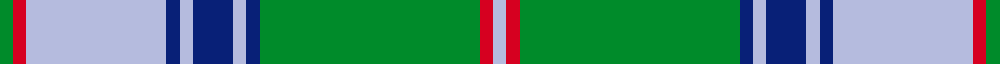

This is one **variant** — a specific cloth: this exact thread count and colourway, with its own
provenance below. It is one weaving of the [sett](/tartans/m/ma/maine-state/) (the scale-free proportion — the
same cloth at any scale or shade), whose colour order is pattern [GRWBWBWBGRW](/stripes/grwbwbwbgrw/).

Part of the [Maine State](/tartans/m/ma/maine-state/) tartan — the named design grouping this sett with its other cloths.

Sourced from house-of-tartan.  It is a [11 stripe tartan](/stripes/stripes11/).

Original link [http://www.house-of-tartan.scotland.net/house/TartanViewjs.asp?colr=Def&tnam=502](http://www.house-of-tartan.scotland.net/house/TartanViewjs.asp?colr=Def&tnam=502)

## Provenance

Earliest known date: 1965 Maine tartan is the oldest of America's tartans. It was woven by the Maine Spinning Company which has now gone out of business. When the tartan was first introduced it was reported in the Glasgow Herald (30.12.65) that it had been 'duly accredited by the State of Maine'. The State archives, however, are unable to locate the authorization. It is now marketed by the Maine Tartan and Tweed company, who hold the copyright.

Dataset <small>— provenance for this record, inherited from the source manifest</small>

<dl class="dataset-prov">
<dt>source</dt><dd><a href="/sources/house-of-tartan/">House of Tartan</a></dd>
<dt>data captured from</dt><dd><a href="https://github.com/thetartan/tartan-database/blob/master/data/house-of-tartan/data.csv">https://github.com/thetartan/tartan-database/blob/master/data/house-of-tartan/data.csv</a></dd>
<dt>data date</dt><dd>1965 <small>(this record)</small></dd>
<dt>licence</dt><dd><a href="https://creativecommons.org/licenses/by-nc-nd/4.0/">CC BY-NC-ND 4.0</a></dd>
</dl>

Capture chain <small>— the hands this data passed through, oldest first; each capture carries its own licence</small>

<ol class="capture-chain">
<li><a href="http://www.house-of-tartan.scotland.net/">House of Tartan</a> <small>the weaver/retailer's database — the site is now offline; the URL is kept as the ultimate source's identity</small></li>
<li><a href="https://github.com/thetartan/tartan-database">thetartan/tartan-database</a> <small>2016-2017</small> · <a href="https://creativecommons.org/licenses/by-nc-nd/4.0/">CC BY-NC-ND 4.0</a> <small>Levko Kravets's frozen compilation — the capture we vendored, and where its CC licence text came from</small></li>
<li>this dictionary <small>captured 2026-06-10 · commit 5bf86c7566</small> <small>each re-capture is a git commit to data/sources</small></li>
</ol>

## Thread count
G/4 R4 LB42 DB4 LB4 DB12 LB4 DB4 G66 R4 LB/4

One full sett is **296 threads**.

## Palette
<table><thead><tr><th>Colour</th><th>Shade</th><th>OKLCh</th></tr></thead><tbody><tr><td>LB</td><td><code style="background-color:#B5BBDE;">#B5BBDE</code> <small style="color:#888">#B5BBDE</small></td><td><small style="color:#888">oklch(79.9% 0.050 277.6)</small></td></tr><tr><td>DB</td><td><code style="background-color:#082077;">#082077</code> <small style="color:#888">#082077</small></td><td><small style="color:#888">oklch(30.0% 0.149 265.1)</small></td></tr><tr><td>G</td><td><code style="background-color:#008B2A;">#008B2A</code> <small style="color:#888">#008B2A</small></td><td><small style="color:#888">oklch(55.4% 0.170 145.9)</small></td></tr><tr><td>R</td><td><code style="background-color:#D60020;">#D60020</code> <small style="color:#888">#D60020</small></td><td><small style="color:#888">oklch(55.2% 0.224 25.5)</small></td></tr></tbody></table>

# Sample pattern

[Sample sheet (PDF)](swatch.pdf) — the woven sample, thread count and palette on one printable A4, rendered on demand (the same sheet the TTD print page downloads).

## Nearest tartan variants

The nearest existing variants by ΔTartan distance, with this cloth at the top so the swatches line up against it.

ΔTartan

Threads

Variant

Sett

—

296

<a href="/variants/s11/g2r2lb21db2lb2db6lb2db2g33r2lb2~x2/">Maine State District Tartan</a>

<a href="/ttd/edit/#slug=g2r2lb23db2lb2db6lb2db2g33r2lb2~x2&amp;base=g2r2lb21db2lb2db6lb2db2g33r2lb2~x2" title="compare in the TTD">0.07</a>

304

<a href="/variants/s11/g2r2lb23db2lb2db6lb2db2g33r2lb2~x2/">Maine State</a>

<a href="/ttd/edit/#slug=dg2db2lb23db2lb2db6lb2db2dg33r2lb2~x2&amp;base=g2r2lb21db2lb2db6lb2db2g33r2lb2~x2" title="compare in the TTD">1.07</a>

304

<a href="/variants/s11/dg2db2lb23db2lb2db6lb2db2dg33r2lb2~x2/">Maine, Original State of (Fashion)</a>

<a href="/ttd/edit/#slug=db4lb1g4r2g14db2g1db1lb1db1lb13r1g1~x4&amp;base=g2r2lb21db2lb2db6lb2db2g33r2lb2~x2" title="compare in the TTD">2.04</a>

348

<a href="/variants/s13/db4lb1g4r2g14db2g1db1lb1db1lb13r1g1~x4/">Maine Dirigo</a>

<a href="/ttd/edit/#slug=r2w1g18db12g1db3w1r2w1db2g2~x2&amp;base=g2r2lb21db2lb2db6lb2db2g33r2lb2~x2" title="compare in the TTD">2.34</a>

172

<a href="/variants/s11/r2w1g18db12g1db3w1r2w1db2g2~x2/">MacKirgan</a>

<a href="/ttd/edit/#slug=g2db1lb6db10g4db1g1r1g1db1g18r1g4db6lb6db1~x4&amp;base=g2r2lb21db2lb2db6lb2db2g33r2lb2~x2" title="compare in the TTD">2.81</a>

500

<a href="/variants/s16/g2db1lb6db10g4db1g1r1g1db1g18r1g4db6lb6db1~x4/">Tiger</a>

<a href="/ttd/edit/#slug=g2db1lb6db6g4r1g18db1g1r1g1db1g4db10lb6db1~x4&amp;base=g2r2lb21db2lb2db6lb2db2g33r2lb2~x2" title="compare in the TTD">2.81</a>

500

<a href="/variants/s16/g2db1lb6db6g4r1g18db1g1r1g1db1g4db10lb6db1~x4/">Pina (Corporate)</a>

<a href="/ttd/edit/#slug=g49lb21k3lb3w3~x2~g5408159&amp;base=g2r2lb21db2lb2db6lb2db2g33r2lb2~x2" title="compare in the TTD">2.94</a>

412

<a href="/variants/s8/w3lb3k3lb21g49lb21k3lb3~x2~g5408159/">Irvine of Drum</a>

<a href="/ttd/edit/#slug=r2db12w1db1g1r1g7db1g12w1~x4&amp;base=g2r2lb21db2lb2db6lb2db2g33r2lb2~x2" title="compare in the TTD">3.01</a>

300

<a href="/variants/s10/r2db12w1db1g1r1g7db1g12w1~x4/">Tennessee State (US State)</a>

<a href="/ttd/edit/#slug=g27r2g3r3db3ly2db14r2db3ly3db3r2db14~x2&amp;base=g2r2lb21db2lb2db6lb2db2g33r2lb2~x2" title="compare in the TTD">3.20</a>

242

<a href="/variants/s13/g27r2g3r3db3ly2db14r2db3ly3db3r2db14~x2/">Crowne Plaza (Corporate)</a>

<a href="/ttd/edit/#slug=db4r17db4g4db2g4db4g27db4ly4~x2&amp;base=g2r2lb21db2lb2db6lb2db2g33r2lb2~x2" title="compare in the TTD">3.21</a>

280

<a href="/variants/s10/db4r17db4g4db2g4db4g27db4ly4~x2/">Cape Breton University</a>

## Neighbour map

Every grey dot is one of 13662 variants placed by the first two principal components of the ΔTartan feature space (42% of its variance). Red is this tartan; blue dots are its nearest — click one to open its page. The map is a flat projection of a many-dimensional space — [how to read it](/posts/neighbourhood-maps/).

<svg viewBox="0 0 640 380" role="img" style="max-width:100%;height:auto;border:1px solid #e0e0e0;border-radius:4px;display:block" xmlns="http://www.w3.org/2000/svg"><image href="/nn/cloud.v1.png" width="640" height="380"/><a href="/variants/s11/g2r2lb23db2lb2db6lb2db2g33r2lb2~x2/"><circle cx="284.8" cy="142.4" r="4" fill="#3465a4"><title>Maine State</title></circle></a><a href="/variants/s11/dg2db2lb23db2lb2db6lb2db2dg33r2lb2~x2/"><circle cx="264.9" cy="130.8" r="4" fill="#3465a4"><title>Maine, Original State of (Fashion)</title></circle></a><a href="/variants/s13/db4lb1g4r2g14db2g1db1lb1db1lb13r1g1~x4/"><circle cx="247.9" cy="150.0" r="4" fill="#3465a4"><title>Maine Dirigo</title></circle></a><a href="/variants/s11/r2w1g18db12g1db3w1r2w1db2g2~x2/"><circle cx="276.3" cy="138.8" r="4" fill="#3465a4"><title>MacKirgan</title></circle></a><a href="/variants/s16/g2db1lb6db10g4db1g1r1g1db1g18r1g4db6lb6db1~x4/"><circle cx="259.5" cy="139.2" r="4" fill="#3465a4"><title>Tiger</title></circle></a><a href="/variants/s16/g2db1lb6db6g4r1g18db1g1r1g1db1g4db10lb6db1~x4/"><circle cx="259.5" cy="139.2" r="4" fill="#3465a4"><title>Pina (Corporate)</title></circle></a><a href="/variants/s8/w3lb3k3lb21g49lb21k3lb3~x2~g5408159/"><circle cx="298.1" cy="161.2" r="4" fill="#3465a4"><title>Irvine of Drum</title></circle></a><a href="/variants/s10/r2db12w1db1g1r1g7db1g12w1~x4/"><circle cx="285.4" cy="168.5" r="4" fill="#3465a4"><title>Tennessee State (US State)</title></circle></a><a href="/variants/s13/g27r2g3r3db3ly2db14r2db3ly3db3r2db14~x2/"><circle cx="258.1" cy="150.9" r="4" fill="#3465a4"><title>Crowne Plaza (Corporate)</title></circle></a><a href="/variants/s10/db4r17db4g4db2g4db4g27db4ly4~x2/"><circle cx="263.8" cy="172.4" r="4" fill="#3465a4"><title>Cape Breton University</title></circle></a><circle cx="287.9" cy="142.2" r="5" fill="#c00000"/><text x="320" y="376" text-anchor="middle" font-size="11" fill="#999">ground</text><text x="11" y="190" text-anchor="middle" font-size="11" fill="#999" transform="rotate(-90 11 190)">complexity</text></svg>

ID: /variants/s11/g2r2lb21db2lb2db6lb2db2g33r2lb2~x2/
