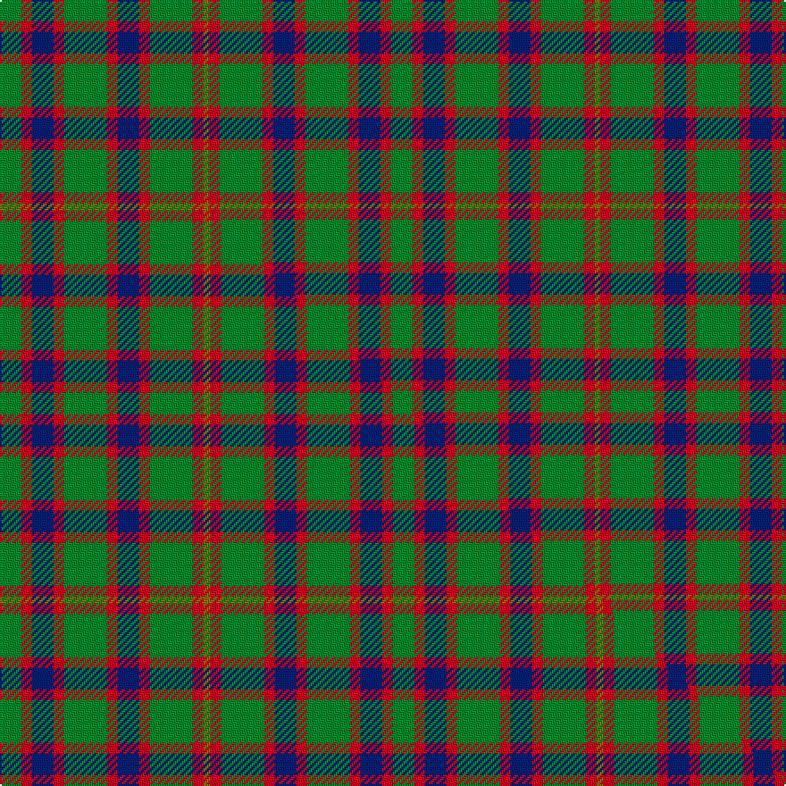

This is one **variant** — a specific cloth: this exact thread count and colourway, with its own
provenance below. It is one weaving of the [sett](/tartans/h/ha/hall/) (the scale-free proportion — the
same cloth at any scale or shade), whose colour order is pattern [GRBRGRBRGRG](/stripes/grbrgrbrgrg/).

Part of the [Hall](/tartans/h/ha/hall/) tartan — the named design grouping this sett with its other cloths.

Sourced from weddslist.  It is a [11 stripe tartan](/stripes/stripes11/).

Original link [http://www.weddslist.com/cgi-bin/tartans/pg.pl?source=sts](http://www.weddslist.com/cgi-bin/tartans/pg.pl?source=sts)

Dataset <small>— provenance for this record, inherited from the source manifest</small>

<dl class="dataset-prov">
<dt>source</dt><dd><a href="/sources/weddslist/">Weddslist</a></dd>
<dt>data captured from</dt><dd><a href="https://github.com/thetartan/tartan-database/blob/master/data/weddslist/data.csv">https://github.com/thetartan/tartan-database/blob/master/data/weddslist/data.csv</a></dd>
<dt>data date</dt><dd>2016-11-17 <small>(dataset default)</small></dd>
<dt>licence</dt><dd><a href="https://creativecommons.org/licenses/by-nc-nd/4.0/">CC BY-NC-ND 4.0</a></dd>
</dl>

Capture chain <small>— the hands this data passed through, oldest first; each capture carries its own licence</small>

<ol class="capture-chain">
<li><a href="https://www.weddslist.com/tartans/">Weddslist</a> <small>the living privately compiled reference</small></li>
<li><a href="https://github.com/thetartan/tartan-database">thetartan/tartan-database</a> <small>2016-2017</small> · <a href="https://creativecommons.org/licenses/by-nc-nd/4.0/">CC BY-NC-ND 4.0</a> <small>Levko Kravets's frozen compilation — the capture we vendored, and where its CC licence text came from</small></li>
<li>this dictionary <small>captured 2026-06-10 · commit 5bf86c7566</small> <small>each re-capture is a git commit to data/sources</small></li>
</ol>

## Thread count
G/12 R6 DB12 R6 G24 R6 DB12 R6 G24 R6 Y/3

One full sett is **219 threads**.

## Palette
<table><thead><tr><th>Colour</th><th>Shade</th><th>OKLCh</th></tr></thead><tbody><tr><td>DB</td><td><code style="background-color:#082077;">#082077</code> <small style="color:#888">#082077</small></td><td><small style="color:#888">oklch(30.0% 0.149 265.1)</small></td></tr><tr><td>G</td><td><code style="background-color:#008B2A;">#008B2A</code> <small style="color:#888">#008B2A</small></td><td><small style="color:#888">oklch(55.4% 0.170 145.9)</small></td></tr><tr><td>R</td><td><code style="background-color:#D60020;">#D60020</code> <small style="color:#888">#D60020</small></td><td><small style="color:#888">oklch(55.2% 0.224 25.5)</small></td></tr><tr><td>Y</td><td><code style="background-color:#8B6E00;">#8B6E00</code> <small style="color:#888">#8B6E00</small></td><td><small style="color:#888">oklch(55.1% 0.113 90.4)</small></td></tr></tbody></table>

# Sample pattern

## Compared to the master

This cloth is one sett of its design; the master sett (the exemplar the design is anchored on) is below for comparison.

Its **ΔTartan distance** from the master is **0.30** — the same measure the nearest-tartans table ranks by (0 is identical; a re-scale of the same cloth is near 0, a recolour or a different proportion further).

<figure class="master-compare" style="margin:0">

this sett
master sett ★

<figcaption style="color:#888;font-size:smaller">One weave of this sett against the <a href="/setts/g6r3db6r3g12r3db6r3g12r3y2/">master sett ★</a>, split on the diagonal: a shared proportion runs seamlessly across it with only the shades shifting; a different proportion breaks on it.</figcaption>
</figure>

## Nearest tartan variants

The nearest existing variants by ΔTartan distance, with this cloth at the top so the swatches line up against it.

ΔTartan

Threads

Variant

Sett

—

219

<a href="/variants/s11/g4r2db4r2g8r2db4r2g8r2y1~x3/">Hall</a>

<a href="/ttd/edit/#slug=g6r3db6r3g12r3db6r3g12r3y2~x2&amp;base=g4r2db4r2g8r2db4r2g8r2y1~x3" title="compare in the TTD">0.30</a>

220

<a href="/variants/s11/g6r3db6r3g12r3db6r3g12r3y2~x2/">Hall (1994)</a>

<a href="/ttd/edit/#slug=db1r2g12r10db12r2g12r10g12r2db1~x4&amp;base=g4r2db4r2g8r2db4r2g8r2y1~x3" title="compare in the TTD">2.00</a>

600

<a href="/variants/s11/db1r2g12r10db12r2g12r10g12r2db1~x4/">Glasgow (Error)</a>

<a href="/ttd/edit/#slug=db10r2g2r6g16r1g2r1g3r6~x4~r1807033&amp;base=g4r2db4r2g8r2db4r2g8r2y1~x3" title="compare in the TTD">2.01</a>

328

<a href="/variants/s10/db10r2g2r6g16r1g2r1g3r6~x4~r1807033/">Nithsdale</a>

<a href="/ttd/edit/#slug=db10r2g2r6g16r1g2r1g3r6~x4&amp;base=g4r2db4r2g8r2db4r2g8r2y1~x3" title="compare in the TTD">2.01</a>

328

<a href="/variants/s10/db10r2g2r6g16r1g2r1g3r6~x4/">Nithsdale (3 colours) (District)</a>

<a href="/ttd/edit/#slug=db10r2g2r6g16r1g2r1g3r6~x2&amp;base=g4r2db4r2g8r2db4r2g8r2y1~x3" title="compare in the TTD">2.01</a>

164

<a href="/variants/s10/db10r2g2r6g16r1g2r1g3r6~x2/">Nithsdale District Tartan</a>

<a href="/ttd/edit/#slug=db6r15g41r15db20g41lb6&amp;base=g4r2db4r2g8r2db4r2g8r2y1~x3" title="compare in the TTD">2.45</a>

276

<a href="/variants/s7/db6r15g41r15db20g41lb6/">Bean Hunting</a>

<a href="/ttd/edit/#slug=r3o18g10o2db10o2db10o2g10o18w3~x2&amp;base=g4r2db4r2g8r2db4r2g8r2y1~x3" title="compare in the TTD">2.61</a>

340

<a href="/variants/s11/r3o18g10o2db10o2db10o2g10o18w3~x2/">Fraser hunting</a>

<a href="/ttd/edit/#slug=r5dt12g3db4g20dt3g3r5~x4&amp;base=g4r2db4r2g8r2db4r2g8r2y1~x3" title="compare in the TTD">2.67</a>

400

<a href="/variants/s8/r5dt12g3db4g20dt3g3r5~x4/">Daks (0600150)</a>

<a href="/ttd/edit/#slug=r3g10r3g14db16g3y2~x2&amp;base=g4r2db4r2g8r2db4r2g8r2y1~x3" title="compare in the TTD">2.87</a>

194

<a href="/variants/s7/r3g10r3g14db16g3y2~x2/">Cameron of Lochiel (Hunting)</a>

<a href="/ttd/edit/#slug=r3g10r3g14db16g3y2&amp;base=g4r2db4r2g8r2db4r2g8r2y1~x3" title="compare in the TTD">2.87</a>

97

<a href="/variants/s7/r3g10r3g14db16g3y2/">Cameron Hunting</a>

## Neighbour map

Every grey dot is one of 13656 variants placed by the first two principal components of the ΔTartan feature space (42% of its variance). Red is this tartan; blue dots are its nearest — click one to open its page. The map is a flat projection of a many-dimensional space — [how to read it](/posts/neighbourhood-maps/).

<svg viewBox="0 0 640 380" role="img" style="max-width:100%;height:auto;border:1px solid #e0e0e0;border-radius:4px;display:block" xmlns="http://www.w3.org/2000/svg"><image href="/nn/cloud.v1.png" width="640" height="380"/><a href="/variants/s11/g6r3db6r3g12r3db6r3g12r3y2~x2/"><circle cx="235.7" cy="232.7" r="4" fill="#3465a4"><title>Hall (1994)</title></circle></a><a href="/variants/s11/db1r2g12r10db12r2g12r10g12r2db1~x4/"><circle cx="270.0" cy="210.3" r="4" fill="#3465a4"><title>Glasgow (Error)</title></circle></a><a href="/variants/s10/db10r2g2r6g16r1g2r1g3r6~x4~r1807033/"><circle cx="304.3" cy="189.2" r="4" fill="#3465a4"><title>Nithsdale</title></circle></a><a href="/variants/s10/db10r2g2r6g16r1g2r1g3r6~x4/"><circle cx="291.8" cy="183.5" r="4" fill="#3465a4"><title>Nithsdale (3 colours) (District)</title></circle></a><a href="/variants/s10/db10r2g2r6g16r1g2r1g3r6~x2/"><circle cx="291.8" cy="183.5" r="4" fill="#3465a4"><title>Nithsdale District Tartan</title></circle></a><a href="/variants/s7/db6r15g41r15db20g41lb6/"><circle cx="280.0" cy="241.5" r="4" fill="#3465a4"><title>Bean Hunting</title></circle></a><a href="/variants/s11/r3o18g10o2db10o2db10o2g10o18w3~x2/"><circle cx="227.2" cy="195.1" r="4" fill="#3465a4"><title>Fraser hunting</title></circle></a><a href="/variants/s8/r5dt12g3db4g20dt3g3r5~x4/"><circle cx="247.5" cy="227.5" r="4" fill="#3465a4"><title>Daks (0600150)</title></circle></a><a href="/variants/s7/r3g10r3g14db16g3y2~x2/"><circle cx="279.0" cy="230.5" r="4" fill="#3465a4"><title>Cameron of Lochiel (Hunting)</title></circle></a><a href="/variants/s7/r3g10r3g14db16g3y2/"><circle cx="279.0" cy="230.5" r="4" fill="#3465a4"><title>Cameron Hunting</title></circle></a><circle cx="248.1" cy="220.2" r="5" fill="#c00000"/><text x="320" y="376" text-anchor="middle" font-size="11" fill="#999">ground</text><text x="11" y="190" text-anchor="middle" font-size="11" fill="#999" transform="rotate(-90 11 190)">complexity</text></svg>

ID: /variants/s11/g4r2db4r2g8r2db4r2g8r2y1~x3/
