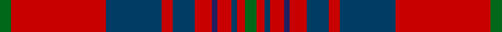

This page is one **sett** — a single exact thread-count. It belongs to the [tartan](/setts/g4r34dt20r4dt8r6db2r5dt2r3g4/)
(the same proportion at any scale), whose colour order is pattern [GRBRBRBRBRG](/stripes/grbrbrbrbrg/).

Part of the [Hughes](/tartans/hughes/) tartan — the named design grouping this sett with its other cloths.

Sourced from tartans-authority.  It is a [11 stripe tartan](/stripes/stripes11/).

Original link http://www.tartansauthority.com/tartan-ferret/display/5756/

## Register references

External register numbers recorded for this tartan.

- Scottish Tartans Authority (ITI): 5756

## Thread count
G/4 R34 DB20 R4 DB8 R6 DBa2 R5 DB2 R3 G/4

One full sett is **176 threads**.

## Palette

Palette: <strong>Tartan Register</strong>
<table><thead><tr><th>Colour</th><th>Threads</th><th>Shade</th><th>Base</th><th>OKLCh</th></tr></thead><tbody><tr><td>G/</td><td style="text-align:right;font-variant-numeric:tabular-nums">4</td><td><code style="background-color:#006818;">#006818</code> <small style="color:#888">#006818</small></td><td>G <code style="background-color:#006100;">#006100</code></td><td><small style="color:#888">oklch(45.0% 0.142 145.0)</small></td></tr><tr><td>R</td><td style="text-align:right;font-variant-numeric:tabular-nums">34</td><td><code style="background-color:#C80000;">#C80000</code> <small style="color:#888">#C80000</small></td><td>R <code style="background-color:#CC0000;">#CC0000</code></td><td><small style="color:#888">oklch(52.3% 0.215 29.2)</small></td></tr><tr><td>DB</td><td style="text-align:right;font-variant-numeric:tabular-nums">20</td><td><code style="background-color:#003C64;">#003C64</code> <small style="color:#888">#003C64</small></td><td>B <code style="background-color:#2A418A;">#2A418A</code></td><td><small style="color:#888">oklch(34.5% 0.089 246.0)</small></td></tr><tr><td>R</td><td style="text-align:right;font-variant-numeric:tabular-nums">4</td><td><code style="background-color:#C80000;">#C80000</code> <small style="color:#888">#C80000</small></td><td>R <code style="background-color:#CC0000;">#CC0000</code></td><td><small style="color:#888">oklch(52.3% 0.215 29.2)</small></td></tr><tr><td>DB</td><td style="text-align:right;font-variant-numeric:tabular-nums">8</td><td><code style="background-color:#003C64;">#003C64</code> <small style="color:#888">#003C64</small></td><td>B <code style="background-color:#2A418A;">#2A418A</code></td><td><small style="color:#888">oklch(34.5% 0.089 246.0)</small></td></tr><tr><td>R</td><td style="text-align:right;font-variant-numeric:tabular-nums">6</td><td><code style="background-color:#C80000;">#C80000</code> <small style="color:#888">#C80000</small></td><td>R <code style="background-color:#CC0000;">#CC0000</code></td><td><small style="color:#888">oklch(52.3% 0.215 29.2)</small></td></tr><tr><td>DBa</td><td style="text-align:right;font-variant-numeric:tabular-nums">2</td><td><code style="background-color:#202060;">#202060</code> <small style="color:#888">#202060</small></td><td>B <code style="background-color:#2A418A;">#2A418A</code></td><td><small style="color:#888">oklch(28.9% 0.111 276.9)</small></td></tr><tr><td>R</td><td style="text-align:right;font-variant-numeric:tabular-nums">5</td><td><code style="background-color:#C80000;">#C80000</code> <small style="color:#888">#C80000</small></td><td>R <code style="background-color:#CC0000;">#CC0000</code></td><td><small style="color:#888">oklch(52.3% 0.215 29.2)</small></td></tr><tr><td>DB</td><td style="text-align:right;font-variant-numeric:tabular-nums">2</td><td><code style="background-color:#003C64;">#003C64</code> <small style="color:#888">#003C64</small></td><td>B <code style="background-color:#2A418A;">#2A418A</code></td><td><small style="color:#888">oklch(34.5% 0.089 246.0)</small></td></tr><tr><td>R</td><td style="text-align:right;font-variant-numeric:tabular-nums">3</td><td><code style="background-color:#C80000;">#C80000</code> <small style="color:#888">#C80000</small></td><td>R <code style="background-color:#CC0000;">#CC0000</code></td><td><small style="color:#888">oklch(52.3% 0.215 29.2)</small></td></tr><tr><td>G/</td><td style="text-align:right;font-variant-numeric:tabular-nums">4</td><td><code style="background-color:#006818;">#006818</code> <small style="color:#888">#006818</small></td><td>G <code style="background-color:#006100;">#006100</code></td><td><small style="color:#888">oklch(45.0% 0.142 145.0)</small></td></tr></tbody></table>

## Compared to the master

This cloth is one sett of its design; the master sett (the exemplar the design is anchored on) is below for comparison.

<figure style="margin:0"><figcaption style="color:#888;font-size:smaller">this sett</figcaption></figure>
<figure style="margin:0"><figcaption style="color:#888;font-size:smaller"><a href="/setts/dgi20dg14db9ly2db9k1w2/">master sett →</a></figcaption></figure>

## Nearest tartans

The nearest existing variants by ΔTartan distance, with this tartan at the top so the swatches line up against it.

ΔTartan

Tartan

Sett

—

<a href="/ttd/edit/#slug=g4r34dt20r4dt8r6db2r5dt2r3g4">Hughes (Welsh Name)</a> <a class="nn-out" href="/variants/s11/g4r34dt20r4dt8r6db2r5dt2r3g4/" title="open its dictionary page">↗</a>

0.66

<a href="/ttd/edit/#slug=db4r1db1r18db10r1g1r6g10r6w1r4db1~x2&amp;base=g4r34dt20r4dt8r6db2r5dt2r3g4">Cameron of Locheil</a> <a class="nn-out" href="/variants/s13/db4r1db1r18db10r1g1r6g10r6w1r4db1~x2/" title="open its dictionary page">↗</a>

0.73

<a href="/ttd/edit/#slug=r7w2r36db6dg3db3dg3db3dg12r4~x2&amp;base=g4r34dt20r4dt8r6db2r5dt2r3g4">Chisholm of Strathglass</a> <a class="nn-out" href="/variants/s10/r7w2r36db6dg3db3dg3db3dg12r4~x2/" title="open its dictionary page">↗</a>

0.76

<a href="/ttd/edit/#slug=db4r1db1r18db10r1dg1r6dg10r6w1r4db1~x2&amp;base=g4r34dt20r4dt8r6db2r5dt2r3g4">Cameron of Locheil</a> <a class="nn-out" href="/variants/s13/db4r1db1r18db10r1dg1r6dg10r6w1r4db1~x2/" title="open its dictionary page">↗</a>

0.77

<a href="/ttd/edit/#slug=m7w2m32db7g3db2g3db2g16m3~x2&amp;base=g4r34dt20r4dt8r6db2r5dt2r3g4">Chisholm Hunting (HSL) Clan Tartan</a> <a class="nn-out" href="/variants/s10/m7w2m32db7g3db2g3db2g16m3~x2/" title="open its dictionary page">↗</a>

0.77

<a href="/ttd/edit/#slug=r7w2r36b6g3b3g3b3g12r4~x2&amp;base=g4r34dt20r4dt8r6db2r5dt2r3g4">Chisholm of Strathglass (Clan)</a> <a class="nn-out" href="/variants/s10/r7w2r36b6g3b3g3b3g12r4~x2/" title="open its dictionary page">↗</a>

0.82

<a href="/ttd/edit/#slug=lo4r37db17r4db8r6do2r5db2r3lo4&amp;base=g4r34dt20r4dt8r6db2r5dt2r3g4">Griffiths (Welsh Name)</a> <a class="nn-out" href="/variants/s11/lo4r37db17r4db8r6do2r5db2r3lo4/" title="open its dictionary page">↗</a>

0.82

<a href="/ttd/edit/#slug=db2r30g8r3g8r6db4r3db12w2~x2&amp;base=g4r34dt20r4dt8r6db2r5dt2r3g4">Jenkins (Name)</a> <a class="nn-out" href="/variants/s10/db2r30g8r3g8r6db4r3db12w2~x2/" title="open its dictionary page">↗</a>

0.83

<a href="/ttd/edit/#slug=r6lb1r24dp6dg2dp1dg2dp1dg12r1&amp;base=g4r34dt20r4dt8r6db2r5dt2r3g4">Chisholm D</a> <a class="nn-out" href="/variants/s10/r6lb1r24dp6dg2dp1dg2dp1dg12r1/" title="open its dictionary page">↗</a>

0.86

<a href="/ttd/edit/#slug=dg2r2db1r24b1db6r3dg12r4db1~x2&amp;base=g4r34dt20r4dt8r6db2r5dt2r3g4">MacDonell of Keppoch</a> <a class="nn-out" href="/variants/s10/dg2r2db1r24b1db6r3dg12r4db1~x2/" title="open its dictionary page">↗</a>

0.86

<a href="/ttd/edit/#slug=dg2r2db1r24b1db6r3dg12r4db1&amp;base=g4r34dt20r4dt8r6db2r5dt2r3g4">MacDonell of Keppoch</a> <a class="nn-out" href="/variants/s10/dg2r2db1r24b1db6r3dg12r4db1/" title="open its dictionary page">↗</a>

## Neighbour map

Every grey dot is one of 14360 variants placed by the first two principal components of the ΔTartan feature space (44% of its variance). Red is this tartan; blue dots are its nearest — click one to open its page.

<svg viewBox="0 0 640 380" role="img" style="max-width:100%;height:auto;border:1px solid #e0e0e0;border-radius:4px;display:block" xmlns="http://www.w3.org/2000/svg"><image href="/nn/cloud.v1.png" width="640" height="380"/><a href="/variants/s13/db4r1db1r18db10r1g1r6g10r6w1r4db1~x2/"><circle cx="343.2" cy="141.2" r="4" fill="#3465a4"><title>Cameron of Locheil</title></circle></a><a href="/variants/s10/r7w2r36db6dg3db3dg3db3dg12r4~x2/"><circle cx="371.6" cy="130.8" r="4" fill="#3465a4"><title>Chisholm of Strathglass</title></circle></a><a href="/variants/s13/db4r1db1r18db10r1dg1r6dg10r6w1r4db1~x2/"><circle cx="336.4" cy="134.2" r="4" fill="#3465a4"><title>Cameron of Locheil</title></circle></a><a href="/variants/s10/m7w2m32db7g3db2g3db2g16m3~x2/"><circle cx="349.4" cy="151.8" r="4" fill="#3465a4"><title>Chisholm Hunting (HSL) Clan Tartan</title></circle></a><a href="/variants/s10/r7w2r36b6g3b3g3b3g12r4~x2/"><circle cx="379.3" cy="135.2" r="4" fill="#3465a4"><title>Chisholm of Strathglass (Clan)</title></circle></a><a href="/variants/s11/lo4r37db17r4db8r6do2r5db2r3lo4/"><circle cx="388.6" cy="132.5" r="4" fill="#3465a4"><title>Griffiths (Welsh Name)</title></circle></a><a href="/variants/s10/db2r30g8r3g8r6db4r3db12w2~x2/"><circle cx="314.4" cy="150.6" r="4" fill="#3465a4"><title>Jenkins (Name)</title></circle></a><a href="/variants/s10/r6lb1r24dp6dg2dp1dg2dp1dg12r1/"><circle cx="372.0" cy="125.8" r="4" fill="#3465a4"><title>Chisholm D</title></circle></a><a href="/variants/s10/dg2r2db1r24b1db6r3dg12r4db1~x2/"><circle cx="397.3" cy="136.4" r="4" fill="#3465a4"><title>MacDonell of Keppoch</title></circle></a><a href="/variants/s10/dg2r2db1r24b1db6r3dg12r4db1/"><circle cx="397.3" cy="136.4" r="4" fill="#3465a4"><title>MacDonell of Keppoch</title></circle></a><circle cx="365.1" cy="145.1" r="5" fill="#c00000"/></svg>

ID: /variants/s11/g4r34dt20r4dt8r6db2r5dt2r3g4/
