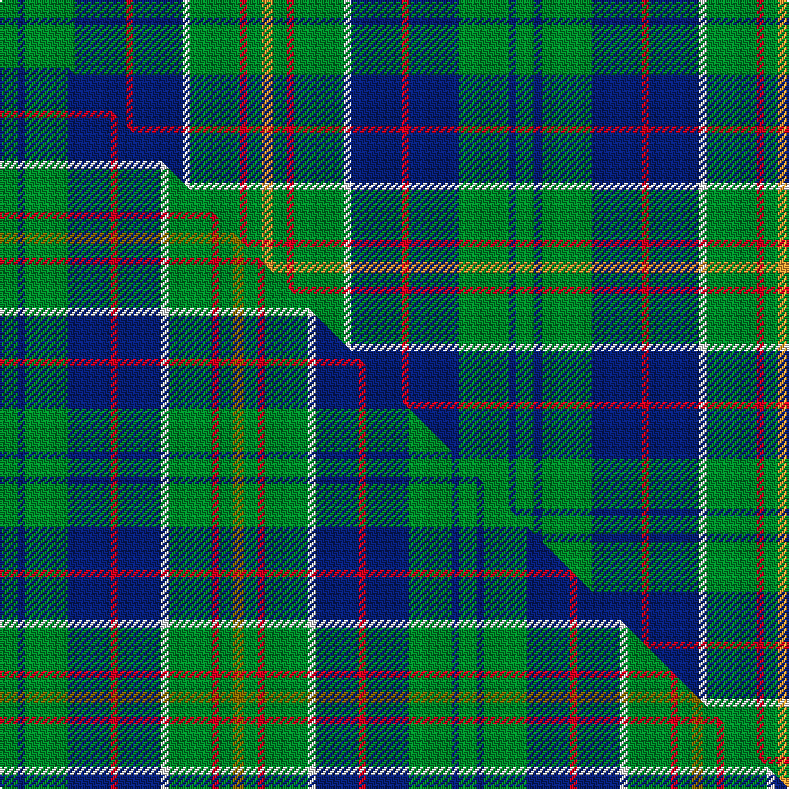

This is one **variant** — a specific cloth: this exact thread count and colourway, with its own
provenance below. It is one weaving of the [sett](/tartans/h/hu/hunter-of-hunterston/) (the scale-free proportion — the
same cloth at any scale or shade), whose colour order is pattern [GBGBRBWGRGY](/stripes/gbgbrbwgrgy/).

Part of the [Hunter of Hunterston](/tartans/h/hu/hunter-of-hunterston/) tartan — the named design grouping this sett with its other cloths.

Sourced from tartans-authority.  It is a [11 stripe tartan](/stripes/stripes11/).

Original link <code>http://www.tartansauthority.com/tartan-ferret/display/719/</code> — retired · [Internet Archive copy](https://web.archive.org/web/*/http://www.tartansauthority.com/tartan-ferret/display/719/*)

Dataset <small>— provenance for this record, inherited from the source manifest</small>

<dl class="dataset-prov">
<dt>source</dt><dd><a href="/sources/tartans-authority/">Scottish Tartans Authority</a></dd>
<dt>data captured from</dt><dd><a href="https://github.com/thetartan/tartan-database/blob/master/data/tartans-authority/data.csv">https://github.com/thetartan/tartan-database/blob/master/data/tartans-authority/data.csv</a></dd>
<dt>data date</dt><dd>1983 <small>(this record)</small></dd>
<dt>licence</dt><dd><a href="https://creativecommons.org/licenses/by-nc-nd/4.0/">CC BY-NC-ND 4.0</a></dd>
</dl>

Capture chain <small>— the hands this data passed through, oldest first; each capture carries its own licence</small>

<ol class="capture-chain">
<li><a href="https://www.tartansauthority.com/">Scottish Tartans Authority</a> <small>the heritage body’s archive — its tartan-ferret record browser is retired; dead record links are shown unlinked, with an Internet Archive copy (ITI numbers are not SRT references)</small></li>
<li><a href="https://github.com/thetartan/tartan-database">thetartan/tartan-database</a> <small>2016-2017</small> · <a href="https://creativecommons.org/licenses/by-nc-nd/4.0/">CC BY-NC-ND 4.0</a> <small>Levko Kravets's frozen compilation — the capture we vendored, and where its CC licence text came from</small></li>
<li>this dictionary <small>captured 2026-06-10 · commit 5bf86c7566</small> <small>each re-capture is a git commit to data/sources</small></li>
</ol>

## Register references

External register numbers recorded for this tartan.

- Scottish Tartans Authority (ITI): 719

## Thread count
G/10 DB4 G28 DB28 R4 DB28 W4 G28 R4 G8 LO/6

One full sett is **288 threads**.

## Palette
<table><thead><tr><th>Colour</th><th>Shade</th><th>OKLCh</th></tr></thead><tbody><tr><td>DB</td><td><code style="background-color:#082077;">#082077</code> <small style="color:#888">#082077</small></td><td><small style="color:#888">oklch(30.0% 0.149 265.1)</small></td></tr><tr><td>G</td><td><code style="background-color:#008B2A;">#008B2A</code> <small style="color:#888">#008B2A</small></td><td><small style="color:#888">oklch(55.4% 0.170 145.9)</small></td></tr><tr><td>LO</td><td><code style="background-color:#FF9C34;">#FF9C34</code> <small style="color:#888">#FF9C34</small></td><td><small style="color:#888">oklch(77.9% 0.161 61.8)</small></td></tr><tr><td>R</td><td><code style="background-color:#D60020;">#D60020</code> <small style="color:#888">#D60020</small></td><td><small style="color:#888">oklch(55.2% 0.224 25.5)</small></td></tr><tr><td>W</td><td><code style="background-color:#F7F7F7;">#F7F7F7</code> <small style="color:#888">#F7F7F7</small></td><td><small style="color:#888">oklch(97.6% 0.000 89.9)</small></td></tr></tbody></table>

# Sample pattern

## Compared to the master

This cloth is one sett of its design; the master sett (the exemplar the design is anchored on) is below for comparison.

Its **ΔTartan distance** from the master is **0.47** — the same measure the nearest-tartans table ranks by (0 is identical; a re-scale of the same cloth is near 0, a recolour or a different proportion further).

<figure class="master-compare" style="margin:0">

this sett
master sett ★

<figcaption style="color:#888;font-size:smaller">One weave of this sett against the <a href="/setts/g5db2g12db12r2db12w2g12r2g4y3/">master sett ★</a>, split on the diagonal: a shared proportion runs seamlessly across it with only the shades shifting; a different proportion breaks on it.</figcaption>
</figure>

## Nearest tartan variants

The nearest existing variants by ΔTartan distance, with this cloth at the top so the swatches line up against it.

ΔTartan

Threads

Variant

Sett

—

288

<a href="/variants/s11/g5db2g14db14r2db14w2g14r2g4lo3~x2/">Hunter of Hunterston (Clan)</a>

<a href="/ttd/edit/#slug=g5db2g12db12r2db12w2g12r2g4y3~x2&amp;base=g5db2g14db14r2db14w2g14r2g4lo3~x2" title="compare in the TTD">0.47</a>

256

<a href="/variants/s11/g5db2g12db12r2db12w2g12r2g4y3~x2/">Hunter of Hunterston Clan Tartan</a>

<a href="/ttd/edit/#slug=g10w2g10k3db12r3db12g15w2db3k2g3y3~x2&amp;base=g5db2g14db14r2db14w2g14r2g4lo3~x2" title="compare in the TTD">1.57</a>

294

<a href="/variants/s13/g10w2g10k3db12r3db12g15w2db3k2g3y3~x2/">Greylock Corporate Tartan</a>

<a href="/ttd/edit/#slug=g21db4w4db32g12y4g8r4g6db12&amp;base=g5db2g14db14r2db14w2g14r2g4lo3~x2" title="compare in the TTD">1.78</a>

181

<a href="/variants/s10/g21db4w4db32g12y4g8r4g6db12/">Harkness Hunting</a>

<a href="/ttd/edit/#slug=w3db28g26r3g26db26lb12db3lb3&amp;base=g5db2g14db14r2db14w2g14r2g4lo3~x2" title="compare in the TTD">2.09</a>

254

<a href="/variants/s9/w3db28g26r3g26db26lb12db3lb3/">Seaford House</a>

<a href="/ttd/edit/#slug=g8r3g3r5g26db7lb3db28r3db6~x2&amp;base=g5db2g14db14r2db14w2g14r2g4lo3~x2" title="compare in the TTD">2.30</a>

340

<a href="/variants/s10/g8r3g3r5g26db7lb3db28r3db6~x2/">Stewart of Appin Htg (error)</a>

<a href="/ttd/edit/#slug=g11r4g4r7g41db11lb4db41r4db8&amp;base=g5db2g14db14r2db14w2g14r2g4lo3~x2" title="compare in the TTD">2.31</a>

251

<a href="/variants/s10/g11r4g4r7g41db11lb4db41r4db8/">Stuart/Stewart of Appin #2</a>

<a href="/ttd/edit/#slug=db22g6db5lb2g22r6g5r4g9w3~x2&amp;base=g5db2g14db14r2db14w2g14r2g4lo3~x2" title="compare in the TTD">2.40</a>

286

<a href="/variants/s10/db22g6db5lb2g22r6g5r4g9w3~x2/">MacConnell Clan Tartan</a>

<a href="/ttd/edit/#slug=db24g4db3g4db24g6w3g4r3g8ly3g8r3g4w3g6~x2&amp;base=g5db2g14db14r2db14w2g14r2g4lo3~x2" title="compare in the TTD">2.41</a>

380

<a href="/variants/s16/db24g4db3g4db24g6w3g4r3g8ly3g8r3g4w3g6~x2/">Scottish Borders Tourist Board</a>

<a href="/ttd/edit/#slug=g3w3g18db14r5db14r5db14g21w3~x2&amp;base=g5db2g14db14r2db14w2g14r2g4lo3~x2" title="compare in the TTD">2.49</a>

388

<a href="/variants/s10/g3w3g18db14r5db14r5db14g21w3~x2/">Hamilton of Clayton (Personal)</a>

<a href="/ttd/edit/#slug=g16y3db9r3db9g6db3g3k3~x4&amp;base=g5db2g14db14r2db14w2g14r2g4lo3~x2" title="compare in the TTD">2.51</a>

364

<a href="/variants/s9/g16y3db9r3db9g6db3g3k3~x4/">Blarney Castle</a>

## Neighbour map

Every grey dot is one of 13662 variants placed by the first two principal components of the ΔTartan feature space (42% of its variance). Red is this tartan; blue dots are its nearest — click one to open its page. The map is a flat projection of a many-dimensional space — [how to read it](/posts/neighbourhood-maps/).

<svg viewBox="0 0 640 380" role="img" style="max-width:100%;height:auto;border:1px solid #e0e0e0;border-radius:4px;display:block" xmlns="http://www.w3.org/2000/svg"><image href="/nn/cloud.v1.png" width="640" height="380"/><a href="/variants/s11/g5db2g12db12r2db12w2g12r2g4y3~x2/"><circle cx="215.9" cy="212.0" r="4" fill="#3465a4"><title>Hunter of Hunterston Clan Tartan</title></circle></a><a href="/variants/s13/g10w2g10k3db12r3db12g15w2db3k2g3y3~x2/"><circle cx="149.6" cy="162.8" r="4" fill="#3465a4"><title>Greylock Corporate Tartan</title></circle></a><a href="/variants/s10/g21db4w4db32g12y4g8r4g6db12/"><circle cx="223.5" cy="196.1" r="4" fill="#3465a4"><title>Harkness Hunting</title></circle></a><a href="/variants/s9/w3db28g26r3g26db26lb12db3lb3/"><circle cx="207.0" cy="197.5" r="4" fill="#3465a4"><title>Seaford House</title></circle></a><a href="/variants/s10/g8r3g3r5g26db7lb3db28r3db6~x2/"><circle cx="249.9" cy="188.7" r="4" fill="#3465a4"><title>Stewart of Appin Htg (error)</title></circle></a><a href="/variants/s10/g11r4g4r7g41db11lb4db41r4db8/"><circle cx="258.3" cy="182.3" r="4" fill="#3465a4"><title>Stuart/Stewart of Appin #2</title></circle></a><a href="/variants/s10/db22g6db5lb2g22r6g5r4g9w3~x2/"><circle cx="235.5" cy="179.2" r="4" fill="#3465a4"><title>MacConnell Clan Tartan</title></circle></a><a href="/variants/s16/db24g4db3g4db24g6w3g4r3g8ly3g8r3g4w3g6~x2/"><circle cx="211.5" cy="161.9" r="4" fill="#3465a4"><title>Scottish Borders Tourist Board</title></circle></a><a href="/variants/s10/g3w3g18db14r5db14r5db14g21w3~x2/"><circle cx="197.3" cy="228.0" r="4" fill="#3465a4"><title>Hamilton of Clayton (Personal)</title></circle></a><a href="/variants/s9/g16y3db9r3db9g6db3g3k3~x4/"><circle cx="174.3" cy="212.9" r="4" fill="#3465a4"><title>Blarney Castle</title></circle></a><circle cx="224.0" cy="199.1" r="5" fill="#c00000"/><text x="320" y="376" text-anchor="middle" font-size="11" fill="#999">ground</text><text x="11" y="190" text-anchor="middle" font-size="11" fill="#999" transform="rotate(-90 11 190)">complexity</text></svg>

ID: /variants/s11/g5db2g14db14r2db14w2g14r2g4lo3~x2/
