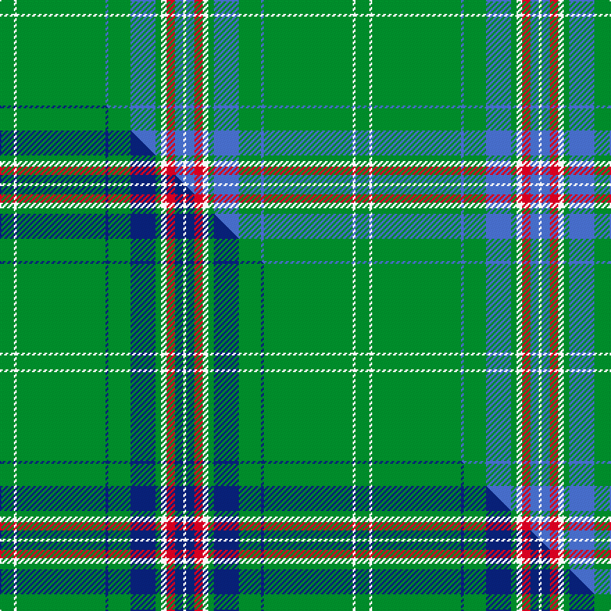

This is one **variant** — a specific cloth: this exact thread count and colourway, with its own
provenance below. It is one weaving of the [sett](/tartans/p/po/portosalvo/) (the scale-free proportion — the
same cloth at any scale or shade), whose colour order is pattern [GWGBGBGWRBW](/stripes/gwgbgbgwrbw/).

Part of the [Portosalvo](/tartans/p/po/portosalvo/) tartan — the named design grouping this sett with its other cloths.

Sourced from tartans-authority.  It is a [11 stripe tartan](/stripes/stripes11/).

Original link <code>http://www.tartansauthority.com/tartan-ferret/display/10328/</code> — retired · [Internet Archive copy](https://web.archive.org/web/*/http://www.tartansauthority.com/tartan-ferret/display/10328/*)

Dataset <small>— provenance for this record, inherited from the source manifest</small>

<dl class="dataset-prov">
<dt>source</dt><dd><a href="/sources/tartans-authority/">Scottish Tartans Authority</a></dd>
<dt>data captured from</dt><dd><a href="https://github.com/thetartan/tartan-database/blob/master/data/tartans-authority/data.csv">https://github.com/thetartan/tartan-database/blob/master/data/tartans-authority/data.csv</a></dd>
<dt>data date</dt><dd>1st Sept 2010 <small>(this record)</small></dd>
<dt>licence</dt><dd><a href="https://creativecommons.org/licenses/by-nc-nd/4.0/">CC BY-NC-ND 4.0</a></dd>
</dl>

Capture chain <small>— the hands this data passed through, oldest first; each capture carries its own licence</small>

<ol class="capture-chain">
<li><a href="https://www.tartansauthority.com/">Scottish Tartans Authority</a> <small>the heritage body’s archive — its tartan-ferret record browser is retired; dead record links are shown unlinked, with an Internet Archive copy (ITI numbers are not SRT references)</small></li>
<li><a href="https://github.com/thetartan/tartan-database">thetartan/tartan-database</a> <small>2016-2017</small> · <a href="https://creativecommons.org/licenses/by-nc-nd/4.0/">CC BY-NC-ND 4.0</a> <small>Levko Kravets's frozen compilation — the capture we vendored, and where its CC licence text came from</small></li>
<li>this dictionary <small>captured 2026-06-10 · commit 5bf86c7566</small> <small>each re-capture is a git commit to data/sources</small></li>
</ol>

## Register references

External register numbers recorded for this tartan.

- Scottish Register of Tartans: [10328](https://www.tartanregister.gov.uk/tartanDetails?ref=10328)
- Scottish Tartans Authority (ITI): 10328

## Thread count
G/10 W2 G64 B2 G16 B18 G4 W4 R6 B6 W/2

One full sett is **256 threads**.

## Palette
<table><thead><tr><th>Colour</th><th>Shade</th><th>OKLCh</th></tr></thead><tbody><tr><td>B</td><td><code style="background-color:#466CC8;">#466CC8</code> <small style="color:#888">#466CC8</small></td><td><small style="color:#888">oklch(55.1% 0.149 265.0)</small></td></tr><tr><td>R</td><td><code style="background-color:#D60020;">#D60020</code> <small style="color:#888">#D60020</small></td><td><small style="color:#888">oklch(55.2% 0.224 25.5)</small></td></tr><tr><td>W</td><td><code style="background-color:#F7F7F7;">#F7F7F7</code> <small style="color:#888">#F7F7F7</small></td><td><small style="color:#888">oklch(97.6% 0.000 89.9)</small></td></tr><tr><td>G</td><td><code style="background-color:#008B2A;">#008B2A</code> <small style="color:#888">#008B2A</small></td><td><small style="color:#888">oklch(55.4% 0.170 145.9)</small></td></tr></tbody></table>

# Sample pattern

## Compared to the master

This cloth is one sett of its design; the master sett (the exemplar the design is anchored on) is below for comparison.

Its **ΔTartan distance** from the master is **0.10** — the same measure the nearest-tartans table ranks by (0 is identical; a re-scale of the same cloth is near 0, a recolour or a different proportion further).

<figure class="master-compare" style="margin:0">

this sett
master sett ★

<figcaption style="color:#888;font-size:smaller">One weave of this sett against the <a href="/setts/g5w1g32db1g8db9g2w2r3db3w1/">master sett ★</a>, split on the diagonal: a shared proportion runs seamlessly across it with only the shades shifting; a different proportion breaks on it.</figcaption>
</figure>

## Nearest tartan variants

The nearest existing variants by ΔTartan distance, with this cloth at the top so the swatches line up against it.

ΔTartan

Threads

Variant

Sett

—

256

<a href="/variants/s11/g5w1g32b1g8b9g2w2r3b3w1~x2/">Portosalvo (Corporate)</a>

<a href="/ttd/edit/#slug=g5w1g32db1g8db9g2w2r3db3w1~x2&amp;base=g5w1g32b1g8b9g2w2r3b3w1~x2" title="compare in the TTD">0.10</a>

256

<a href="/variants/s11/g5w1g32db1g8db9g2w2r3db3w1~x2/">Portosalvo</a>

<a href="/ttd/edit/#slug=db17r3g55db3g4db3g4y3w5~x2&amp;base=g5w1g32b1g8b9g2w2r3b3w1~x2" title="compare in the TTD">2.44</a>

344

<a href="/variants/s9/db17r3g55db3g4db3g4y3w5~x2/">Bundanoon</a>

<a href="/ttd/edit/#slug=db17r3g55db3g4db3g4dy3w5~x2&amp;base=g5w1g32b1g8b9g2w2r3b3w1~x2" title="compare in the TTD">2.45</a>

344

<a href="/variants/s9/db17r3g55db3g4db3g4dy3w5~x2/">Bundanoon</a>

<a href="/ttd/edit/#slug=g78db13ly6r3ly5g6db9ly6~x2&amp;base=g5w1g32b1g8b9g2w2r3b3w1~x2" title="compare in the TTD">2.46</a>

336

<a href="/variants/s8/g78db13ly6r3ly5g6db9ly6~x2/">Walterstrm (2014))</a>

<a href="/ttd/edit/#slug=g3dbi1g2r1g3db3g2db2g18dbi2~x2~dbi3409246-db2508255&amp;base=g5w1g32b1g8b9g2w2r3b3w1~x2" title="compare in the TTD">2.60</a>

138

<a href="/variants/s10/g3dbi1g2r1g3db3g2db2g18dbi2~x2~dbi3409246-db2508255/">Owen Welsh Name Tartan</a>

<a href="/ttd/edit/#slug=g78db13y6r3y5g6db9y6~x2&amp;base=g5w1g32b1g8b9g2w2r3b3w1~x2" title="compare in the TTD">2.64</a>

336

<a href="/variants/s8/g78db13y6r3y5g6db9y6~x2/">Walterström (2014)</a>

<a href="/ttd/edit/#slug=g44db11g5t3g4db8g4w1~x2~db1812264-t5912243&amp;base=g5w1g32b1g8b9g2w2r3b3w1~x2" title="compare in the TTD">2.73</a>

230

<a href="/variants/s8/g44db11g5t3g4db8g4w1~x2~db1812264-t5912243/">Hastings-Stephenson (Personal)</a>

<a href="/ttd/edit/#slug=g33db2g33r2db12r12g4r2g4w3~x2&amp;base=g5w1g32b1g8b9g2w2r3b3w1~x2" title="compare in the TTD">2.76</a>

356

<a href="/variants/s10/g33db2g33r2db12r12g4r2g4w3~x2/">Island Weavers (Corporate)</a>

<a href="/ttd/edit/#slug=g10b4g1b4g15r4g1~x4&amp;base=g5w1g32b1g8b9g2w2r3b3w1~x2" title="compare in the TTD">2.92</a>

268

<a href="/variants/s7/g10b4g1b4g15r4g1~x4/">Logan</a>

<a href="/ttd/edit/#slug=r4g3dp3g44dp16g10w2g2dp2~x2&amp;base=g5w1g32b1g8b9g2w2r3b3w1~x2" title="compare in the TTD">2.98</a>

332

<a href="/variants/s9/r4g3dp3g44dp16g10w2g2dp2~x2/">Glenfeshie (Personal)</a>

## Neighbour map

Every grey dot is one of 13662 variants placed by the first two principal components of the ΔTartan feature space (42% of its variance). Red is this tartan; blue dots are its nearest — click one to open its page. The map is a flat projection of a many-dimensional space — [how to read it](/posts/neighbourhood-maps/).

<svg viewBox="0 0 640 380" role="img" style="max-width:100%;height:auto;border:1px solid #e0e0e0;border-radius:4px;display:block" xmlns="http://www.w3.org/2000/svg"><image href="/nn/cloud.v1.png" width="640" height="380"/><a href="/variants/s11/g5w1g32db1g8db9g2w2r3db3w1~x2/"><circle cx="443.5" cy="118.6" r="4" fill="#3465a4"><title>Portosalvo</title></circle></a><a href="/variants/s9/db17r3g55db3g4db3g4y3w5~x2/"><circle cx="381.0" cy="127.3" r="4" fill="#3465a4"><title>Bundanoon</title></circle></a><a href="/variants/s9/db17r3g55db3g4db3g4dy3w5~x2/"><circle cx="378.4" cy="126.3" r="4" fill="#3465a4"><title>Bundanoon</title></circle></a><a href="/variants/s8/g78db13ly6r3ly5g6db9ly6~x2/"><circle cx="436.9" cy="140.3" r="4" fill="#3465a4"><title>Walterstrm (2014))</title></circle></a><a href="/variants/s10/g3dbi1g2r1g3db3g2db2g18dbi2~x2~dbi3409246-db2508255/"><circle cx="499.2" cy="159.8" r="4" fill="#3465a4"><title>Owen Welsh Name Tartan</title></circle></a><a href="/variants/s8/g78db13y6r3y5g6db9y6~x2/"><circle cx="468.3" cy="148.8" r="4" fill="#3465a4"><title>Walterström (2014)</title></circle></a><a href="/variants/s8/g44db11g5t3g4db8g4w1~x2~db1812264-t5912243/"><circle cx="483.7" cy="135.6" r="4" fill="#3465a4"><title>Hastings-Stephenson (Personal)</title></circle></a><a href="/variants/s10/g33db2g33r2db12r12g4r2g4w3~x2/"><circle cx="407.7" cy="161.8" r="4" fill="#3465a4"><title>Island Weavers (Corporate)</title></circle></a><a href="/variants/s7/g10b4g1b4g15r4g1~x4/"><circle cx="465.0" cy="227.6" r="4" fill="#3465a4"><title>Logan</title></circle></a><a href="/variants/s9/r4g3dp3g44dp16g10w2g2dp2~x2/"><circle cx="432.6" cy="138.7" r="4" fill="#3465a4"><title>Glenfeshie (Personal)</title></circle></a><circle cx="476.5" cy="130.2" r="5" fill="#c00000"/><text x="320" y="376" text-anchor="middle" font-size="11" fill="#999">ground</text><text x="11" y="190" text-anchor="middle" font-size="11" fill="#999" transform="rotate(-90 11 190)">complexity</text></svg>

ID: /variants/s11/g5w1g32b1g8b9g2w2r3b3w1~x2/
