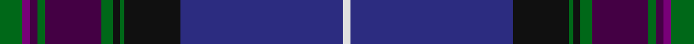

This page is one **sett** — a single exact thread-count. It belongs to the [tartan](/setts/g6dpi2dp2g2dp15g3k2g1k15db43w2/)
(the same proportion at any scale), whose colour order is pattern [GBBGBGKGKBW](/stripes/gbbgbgkgkbw/).

Part of the [Scottish Pride](/tartans/scottish-pride/) tartan — the named design grouping this sett with its other cloths.

Sourced from tartans-authority.  It is a [11 stripe tartan](/stripes/stripes11/).

Original link http://www.tartansauthority.com/tartan-ferret/display/6492/

## Register references

External register numbers recorded for this tartan.

- Scottish Tartans Authority (ITI): 6492

## Thread count
G/12 P4 DP4 G4 DP30 G6 K4 G2 K30 DB86 LN/4

One full sett is **356 threads**.

## Palette

Palette: <strong>Tartan Register</strong>
<table><thead><tr><th>Colour</th><th>Threads</th><th>Shade</th><th>Base</th><th>OKLCh</th></tr></thead><tbody><tr><td>G/</td><td style="text-align:right;font-variant-numeric:tabular-nums">12</td><td><code style="background-color:#006818;">#006818</code> <small style="color:#888">#006818</small></td><td>G <code style="background-color:#006100;">#006100</code></td><td><small style="color:#888">oklch(45.0% 0.142 145.0)</small></td></tr><tr><td>P</td><td style="text-align:right;font-variant-numeric:tabular-nums">4</td><td><code style="background-color:#780078;">#780078</code> <small style="color:#888">#780078</small></td><td>B <code style="background-color:#2A418A;">#2A418A</code></td><td><small style="color:#888">oklch(40.2% 0.185 328.4)</small></td></tr><tr><td>DP</td><td style="text-align:right;font-variant-numeric:tabular-nums">4</td><td><code style="background-color:#440044;">#440044</code> <small style="color:#888">#440044</small></td><td>B <code style="background-color:#2A418A;">#2A418A</code></td><td><small style="color:#888">oklch(27.1% 0.125 328.4)</small></td></tr><tr><td>G</td><td style="text-align:right;font-variant-numeric:tabular-nums">4</td><td><code style="background-color:#006818;">#006818</code> <small style="color:#888">#006818</small></td><td>G <code style="background-color:#006100;">#006100</code></td><td><small style="color:#888">oklch(45.0% 0.142 145.0)</small></td></tr><tr><td>DP</td><td style="text-align:right;font-variant-numeric:tabular-nums">30</td><td><code style="background-color:#440044;">#440044</code> <small style="color:#888">#440044</small></td><td>B <code style="background-color:#2A418A;">#2A418A</code></td><td><small style="color:#888">oklch(27.1% 0.125 328.4)</small></td></tr><tr><td>G</td><td style="text-align:right;font-variant-numeric:tabular-nums">6</td><td><code style="background-color:#006818;">#006818</code> <small style="color:#888">#006818</small></td><td>G <code style="background-color:#006100;">#006100</code></td><td><small style="color:#888">oklch(45.0% 0.142 145.0)</small></td></tr><tr><td>K</td><td style="text-align:right;font-variant-numeric:tabular-nums">4</td><td><code style="background-color:#101010;">#101010</code> <small style="color:#888">#101010</small></td><td>K <code style="background-color:#000000;">#000000</code></td><td><small style="color:#888">oklch(17.3% 0.000 89.9)</small></td></tr><tr><td>G</td><td style="text-align:right;font-variant-numeric:tabular-nums">2</td><td><code style="background-color:#006818;">#006818</code> <small style="color:#888">#006818</small></td><td>G <code style="background-color:#006100;">#006100</code></td><td><small style="color:#888">oklch(45.0% 0.142 145.0)</small></td></tr><tr><td>K</td><td style="text-align:right;font-variant-numeric:tabular-nums">30</td><td><code style="background-color:#101010;">#101010</code> <small style="color:#888">#101010</small></td><td>K <code style="background-color:#000000;">#000000</code></td><td><small style="color:#888">oklch(17.3% 0.000 89.9)</small></td></tr><tr><td>DB</td><td style="text-align:right;font-variant-numeric:tabular-nums">86</td><td><code style="background-color:#2C2C80;">#2C2C80</code> <small style="color:#888">#2C2C80</small></td><td>B <code style="background-color:#2A418A;">#2A418A</code></td><td><small style="color:#888">oklch(35.0% 0.138 276.6)</small></td></tr><tr><td>LN/</td><td style="text-align:right;font-variant-numeric:tabular-nums">4</td><td><code style="background-color:#E0E0E0;">#E0E0E0</code> <small style="color:#888">#E0E0E0</small></td><td>W <code style="background-color:#F7F7F7;">#F7F7F7</code></td><td><small style="color:#888">oklch(90.7% 0.000 89.9)</small></td></tr></tbody></table>

## Compared to the master

This cloth is one sett of its design; the master sett (the exemplar the design is anchored on) is below for comparison.

<figure style="margin:0"><figcaption style="color:#888;font-size:smaller">this sett</figcaption></figure>
<figure style="margin:0"><figcaption style="color:#888;font-size:smaller"><a href="/setts/g6dpi2dp2g2dp15g3k2g1k15db43w2db43k15g1k2g2dp15g3dp2dpi2/">master sett →</a></figcaption></figure>

## Nearest tartans

The nearest existing variants by ΔTartan distance, with this tartan at the top so the swatches line up against it.

ΔTartan

Tartan

Sett

—

<a href="/ttd/edit/#slug=g6dpi2dp2g2dp15g3k2g1k15db43w2~x2">Scottish Pride (Fashion)</a> <a class="nn-out" href="/variants/s11/g6dpi2dp2g2dp15g3k2g1k15db43w2~x2/" title="open its dictionary page">↗</a>

1.01

<a href="/ttd/edit/#slug=db9dg2dpi2dp2dg18dpi2k2dg1k19db33w2~x2&amp;base=g6dpi2dp2g2dp15g3k2g1k15db43w2~x2">Highland Pride of Scotland (Fashion)</a> <a class="nn-out" href="/variants/s11/db9dg2dpi2dp2dg18dpi2k2dg1k19db33w2~x2/" title="open its dictionary page">↗</a>

1.03

<a href="/ttd/edit/#slug=db54dbi14ly3dbi3w3dbi3g9dr7dbi2dr9w2~x2&amp;base=g6dpi2dp2g2dp15g3k2g1k15db43w2~x2">Holyrood Corporate Tartan</a> <a class="nn-out" href="/variants/s11/db54dbi14ly3dbi3w3dbi3g9dr7dbi2dr9w2~x2/" title="open its dictionary page">↗</a>

1.12

<a href="/ttd/edit/#slug=db66k20dbi7y4dbi5y4dbi5y4dbi7k2lr6&amp;base=g6dpi2dp2g2dp15g3k2g1k15db43w2~x2">Muir Homes</a> <a class="nn-out" href="/variants/s11/db66k20dbi7y4dbi5y4dbi5y4dbi7k2lr6/" title="open its dictionary page">↗</a>

1.13

<a href="/ttd/edit/#slug=db6w1db40m1k12dg12m6dg2dp2dg4~x2&amp;base=g6dpi2dp2g2dp15g3k2g1k15db43w2~x2">Scotland the Brave (Fashion)</a> <a class="nn-out" href="/variants/s10/db6w1db40m1k12dg12m6dg2dp2dg4~x2/" title="open its dictionary page">↗</a>

1.18

<a href="/ttd/edit/#slug=db5w1db44dp1g12k12dp5k2m2k3~x2&amp;base=g6dpi2dp2g2dp15g3k2g1k15db43w2~x2">Heart of Scotland (Fashion)</a> <a class="nn-out" href="/variants/s10/db5w1db44dp1g12k12dp5k2m2k3~x2/" title="open its dictionary page">↗</a>

1.21

<a href="/ttd/edit/#slug=dbi5o4r6lo1r9db35dbi5lo1dbi12w1~x2&amp;base=g6dpi2dp2g2dp15g3k2g1k15db43w2~x2">University of Dundee</a> <a class="nn-out" href="/variants/s10/dbi5o4r6lo1r9db35dbi5lo1dbi12w1~x2/" title="open its dictionary page">↗</a>

1.26

<a href="/ttd/edit/#slug=dg4r1dg1r3dg16k12r1db27lb2db3lb1ly2~x2&amp;base=g6dpi2dp2g2dp15g3k2g1k15db43w2~x2">McGuirk (2013)</a> <a class="nn-out" href="/variants/s12/dg4r1dg1r3dg16k12r1db27lb2db3lb1ly2~x2/" title="open its dictionary page">↗</a>

1.35

<a href="/ttd/edit/#slug=dg8dpi2dp2dg3dp16dg2k2dg1k16db30w2~x2&amp;base=g6dpi2dp2g2dp15g3k2g1k15db43w2~x2">Pride of Scotland General Tartan</a> <a class="nn-out" href="/variants/s11/dg8dpi2dp2dg3dp16dg2k2dg1k16db30w2~x2/" title="open its dictionary page">↗</a>

1.35

<a href="/ttd/edit/#slug=dt36r3dt1r2dt3r6db1r2db35w1db1lo2~x2&amp;base=g6dpi2dp2g2dp15g3k2g1k15db43w2~x2">Kirkcaldy Tartan Army (Corporate)</a> <a class="nn-out" href="/variants/s12/dt36r3dt1r2dt3r6db1r2db35w1db1lo2~x2/" title="open its dictionary page">↗</a>

1.38

<a href="/ttd/edit/#slug=g6dpi2dp2g2dp15g3k2g1k15db43w2db43k15g1k2g2dp15g3dp2dpi2~x2&amp;base=g6dpi2dp2g2dp15g3k2g1k15db43w2~x2">Scottish Pride</a> <a class="nn-out" href="/variants/s20/g6dpi2dp2g2dp15g3k2g1k15db43w2db43k15g1k2g2dp15g3dp2dpi2~x2/" title="open its dictionary page">↗</a>

## Neighbour map

Every grey dot is one of 14360 variants placed by the first two principal components of the ΔTartan feature space (44% of its variance). Red is this tartan; blue dots are its nearest — click one to open its page.

<svg viewBox="0 0 640 380" role="img" style="max-width:100%;height:auto;border:1px solid #e0e0e0;border-radius:4px;display:block" xmlns="http://www.w3.org/2000/svg"><image href="/nn/cloud.v1.png" width="640" height="380"/><a href="/variants/s11/db9dg2dpi2dp2dg18dpi2k2dg1k19db33w2~x2/"><circle cx="296.9" cy="120.0" r="4" fill="#3465a4"><title>Highland Pride of Scotland (Fashion)</title></circle></a><a href="/variants/s11/db54dbi14ly3dbi3w3dbi3g9dr7dbi2dr9w2~x2/"><circle cx="296.2" cy="101.1" r="4" fill="#3465a4"><title>Holyrood Corporate Tartan</title></circle></a><a href="/variants/s11/db66k20dbi7y4dbi5y4dbi5y4dbi7k2lr6/"><circle cx="350.6" cy="120.8" r="4" fill="#3465a4"><title>Muir Homes</title></circle></a><a href="/variants/s10/db6w1db40m1k12dg12m6dg2dp2dg4~x2/"><circle cx="338.5" cy="103.7" r="4" fill="#3465a4"><title>Scotland the Brave (Fashion)</title></circle></a><a href="/variants/s10/db5w1db44dp1g12k12dp5k2m2k3~x2/"><circle cx="383.3" cy="105.6" r="4" fill="#3465a4"><title>Heart of Scotland (Fashion)</title></circle></a><a href="/variants/s10/dbi5o4r6lo1r9db35dbi5lo1dbi12w1~x2/"><circle cx="282.1" cy="101.1" r="4" fill="#3465a4"><title>University of Dundee</title></circle></a><a href="/variants/s12/dg4r1dg1r3dg16k12r1db27lb2db3lb1ly2~x2/"><circle cx="257.3" cy="112.4" r="4" fill="#3465a4"><title>McGuirk (2013)</title></circle></a><a href="/variants/s11/dg8dpi2dp2dg3dp16dg2k2dg1k16db30w2~x2/"><circle cx="244.2" cy="128.3" r="4" fill="#3465a4"><title>Pride of Scotland General Tartan</title></circle></a><a href="/variants/s12/dt36r3dt1r2dt3r6db1r2db35w1db1lo2~x2/"><circle cx="355.7" cy="111.4" r="4" fill="#3465a4"><title>Kirkcaldy Tartan Army (Corporate)</title></circle></a><a href="/variants/s20/g6dpi2dp2g2dp15g3k2g1k15db43w2db43k15g1k2g2dp15g3dp2dpi2~x2/"><circle cx="332.1" cy="81.6" r="4" fill="#3465a4"><title>Scottish Pride</title></circle></a><circle cx="313.8" cy="96.0" r="5" fill="#c00000"/></svg>

ID: /variants/s11/g6dpi2dp2g2dp15g3k2g1k15db43w2~x2/
