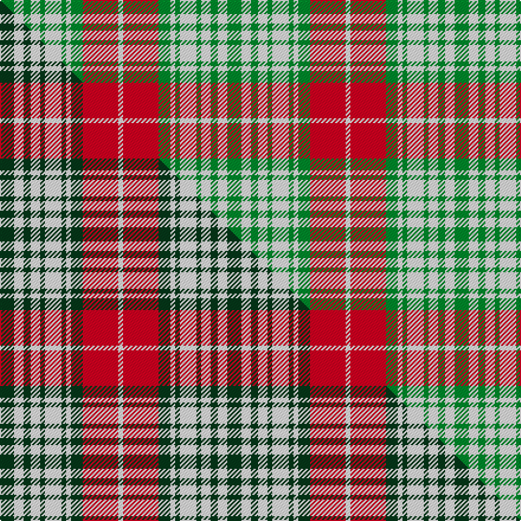

This is one **variant** — a specific cloth: this exact thread count and colourway, with its own
provenance below. It is one weaving of the [sett](/tartans/p/pr/prince-george/) (the scale-free proportion — the
same cloth at any scale or shade), whose colour order is pattern [GWGWGWGWGRW](/stripes/gwgwgwgwgrw/).

Part of the [Prince George](/tartans/p/pr/prince-george/) tartan — the named design grouping this sett with its other cloths.

Sourced from tartans-authority.  It is a [11 stripe tartan](/stripes/stripes11/).

Original link <code>http://www.tartansauthority.com/tartan-ferret/display/942/</code> — retired · [Internet Archive copy](https://web.archive.org/web/*/http://www.tartansauthority.com/tartan-ferret/display/942/*)

## Provenance

Earliest known date: pre 2003 The warmth and glow of the fertile soil, The green field and tree, The yellow and the brown of Autumn, The white of surf or a summer snow, Rust, green, yellow and white, Yes! That's our Island Tartan.

3 attestations — the source records this cloth was collapsed from (oldest owns this page)

<ul>
<li>pre 1918 — Prince George (Royal) (tartans-authority, <a href="https://web.archive.org/web/*/http://www.tartansauthority.com/tartan-ferret/display/942/*">record</a>)  <em>No details known. A Prince George tartan was listed in the 1930 publication 'The Land of the Gael' by a John Ross FSA. Also appears in a large book (Page 91) of almost 400 hand-painted warp strips by James Cant (died 1960) and presented to Jack Dalgety of Forfar (Alex Dalgety & Son). 11th March 2015. Burberry Catalogue produced during WWI by John Ross lists the Prince George as a Royal Tartan.</em></li>
<li>pre 2003 — Prince George Royal Family Tartan (house-of-tartan, <a href="http://www.house-of-tartan.scotland.net/house/TartanViewjs.asp?colr=Def&tnam=942">record</a>) </li>
<li>undated — Prince George (weddslist, <a href="http://www.weddslist.com/cgi-bin/tartans/pg.pl?source=sts">record</a>) </li>
</ul>

Dataset <small>— provenance for this record, inherited from the source manifest</small>

<dl class="dataset-prov">
<dt>source</dt><dd><a href="/sources/tartans-authority/">Scottish Tartans Authority</a></dd>
<dt>data captured from</dt><dd><a href="https://github.com/thetartan/tartan-database/blob/master/data/tartans-authority/data.csv">https://github.com/thetartan/tartan-database/blob/master/data/tartans-authority/data.csv</a></dd>
<dt>data date</dt><dd>pre 1918 <small>(this record)</small></dd>
<dt>licence</dt><dd><a href="https://creativecommons.org/licenses/by-nc-nd/4.0/">CC BY-NC-ND 4.0</a></dd>
</dl>

Capture chain <small>— the hands this data passed through, oldest first; each capture carries its own licence</small>

<ol class="capture-chain">
<li><a href="https://www.tartansauthority.com/">Scottish Tartans Authority</a> <small>the heritage body’s archive — its tartan-ferret record browser is retired; dead record links are shown unlinked, with an Internet Archive copy (ITI numbers are not SRT references)</small></li>
<li><a href="https://github.com/thetartan/tartan-database">thetartan/tartan-database</a> <small>2016-2017</small> · <a href="https://creativecommons.org/licenses/by-nc-nd/4.0/">CC BY-NC-ND 4.0</a> <small>Levko Kravets's frozen compilation — the capture we vendored, and where its CC licence text came from</small></li>
<li>this dictionary <small>captured 2026-06-10 · commit 5bf86c7566</small> <small>each re-capture is a git commit to data/sources</small></li>
</ol>

## Register references

External register numbers recorded for this tartan.

- Scottish Tartans Authority (ITI): 942

## Thread count
G/12 W8 G6 W8 G4 W14 G4 W4 G10 R30 W/4

One full sett is **192 threads**.

## Palette
<table><thead><tr><th>Colour</th><th>Shade</th><th>OKLCh</th></tr></thead><tbody><tr><td>G</td><td><code style="background-color:#008B2A;">#008B2A</code> <small style="color:#888">#008B2A</small></td><td><small style="color:#888">oklch(55.4% 0.170 145.9)</small></td></tr><tr><td>R</td><td><code style="background-color:#D60020;">#D60020</code> <small style="color:#888">#D60020</small></td><td><small style="color:#888">oklch(55.2% 0.224 25.5)</small></td></tr><tr><td>W</td><td><code style="background-color:#F7F7F7;">#F7F7F7</code> <small style="color:#888">#F7F7F7</small></td><td><small style="color:#888">oklch(97.6% 0.000 89.9)</small></td></tr></tbody></table>

# Sample pattern

## Compared to the master

This cloth is one sett of its design; the master sett (the exemplar the design is anchored on) is below for comparison.

Its **ΔTartan distance** from the master is **0.15** — the same measure the nearest-tartans table ranks by (0 is identical; a re-scale of the same cloth is near 0, a recolour or a different proportion further).

<figure class="master-compare" style="margin:0">

this sett
master sett ★

<figcaption style="color:#888;font-size:smaller">One weave of this sett against the <a href="/setts/dg6w4dg3w4dg2w7dg2w2dg5r15w2/">master sett ★</a>, split on the diagonal: a shared proportion runs seamlessly across it with only the shades shifting; a different proportion breaks on it.</figcaption>
</figure>

## Nearest tartan variants

The nearest existing variants by ΔTartan distance, with this cloth at the top so the swatches line up against it.

ΔTartan

Threads

Variant

Sett

—

192

<a href="/variants/s11/g6w4g3w4g2w7g2w2g5r15w2~x2/">Prince George (Royal)</a>

<a href="/ttd/edit/#slug=dg6w4dg3w4dg2w7dg2w2dg5r15w2~x2&amp;base=g6w4g3w4g2w7g2w2g5r15w2~x2" title="compare in the TTD">0.15</a>

192

<a href="/variants/s11/dg6w4dg3w4dg2w7dg2w2dg5r15w2~x2/">Prince George</a>

<a href="/ttd/edit/#slug=g26r3g3r3g3r11w27r3w5~x2&amp;base=g6w4g3w4g2w7g2w2g5r15w2~x2" title="compare in the TTD">2.13</a>

274

<a href="/variants/s9/g26r3g3r3g3r11w27r3w5~x2/">Lindsay Dress Red</a>

<a href="/ttd/edit/#slug=w8dt2w1dt2w1dt2r3dt3w1~x4&amp;base=g6w4g3w4g2w7g2w2g5r15w2~x2" title="compare in the TTD">2.83</a>

148

<a href="/variants/s9/w8dt2w1dt2w1dt2r3dt3w1~x4/">Canadian Winter Games 1987</a>

<a href="/ttd/edit/#slug=db3o14g2o2g2o3g6w18db3o2db2o2~x2&amp;base=g6w4g3w4g2w7g2w2g5r15w2~x2" title="compare in the TTD">3.20</a>

226

<a href="/variants/s12/db3o14g2o2g2o3g6w18db3o2db2o2~x2/">Raibert, Check</a>

<a href="/ttd/edit/#slug=do4r3do21r2w14ly22r3ly4~x2&amp;base=g6w4g3w4g2w7g2w2g5r15w2~x2" title="compare in the TTD">3.28</a>

276

<a href="/variants/s8/do4r3do21r2w14ly22r3ly4~x2/">Bannock Bane M.405</a>

<a href="/ttd/edit/#slug=o22do2o2do2o2do15w17do3~x2&amp;base=g6w4g3w4g2w7g2w2g5r15w2~x2" title="compare in the TTD">3.35</a>

210

<a href="/variants/s8/o22do2o2do2o2do15w17do3~x2/">Turnberry, Manx Snaefell</a>

<a href="/ttd/edit/#slug=w6r2g16r3g2r3g6w2r2w2g6r7g6r2g2r16w2r2w2~x2&amp;base=g6w4g3w4g2w7g2w2g5r15w2~x2" title="compare in the TTD">3.49</a>

340

<a href="/variants/s19/w6r2g16r3g2r3g6w2r2w2g6r7g6r2g2r16w2r2w2~x2/">MacDougall (Lochcarron)</a>

<a href="/ttd/edit/#slug=w3g2r8w14t3r3g20r3t20r3t3w14r8g2w3~x2&amp;base=g6w4g3w4g2w7g2w2g5r15w2~x2" title="compare in the TTD">3.55</a>

424

<a href="/variants/s15/w3g2r8w14t3r3g20r3t20r3t3w14r8g2w3~x2/">Robertson dress Hunting</a>

<a href="/ttd/edit/#slug=lb12k8lb12w1ly2w1ly8w1ly2w1ly8w1ly2w1ly8&amp;base=g6w4g3w4g2w7g2w2g5r15w2~x2" title="compare in the TTD">3.56</a>

116

<a href="/variants/s15/lb12k8lb12w1ly2w1ly8w1ly2w1ly8w1ly2w1ly8/">Bush (Artefact)</a>

<a href="/ttd/edit/#slug=g12w1r1w4r1w1r8dy2r1~x4&amp;base=g6w4g3w4g2w7g2w2g5r15w2~x2" title="compare in the TTD">3.66</a>

196

<a href="/variants/s9/g12w1r1w4r1w1r8dy2r1~x4/">Karibu (Corporate)</a>

## Neighbour map

Every grey dot is one of 13656 variants placed by the first two principal components of the ΔTartan feature space (42% of its variance). Red is this tartan; blue dots are its nearest — click one to open its page. The map is a flat projection of a many-dimensional space — [how to read it](/posts/neighbourhood-maps/).

<svg viewBox="0 0 640 380" role="img" style="max-width:100%;height:auto;border:1px solid #e0e0e0;border-radius:4px;display:block" xmlns="http://www.w3.org/2000/svg"><image href="/nn/cloud.v1.png" width="640" height="380"/><a href="/variants/s11/dg6w4dg3w4dg2w7dg2w2dg5r15w2~x2/"><circle cx="175.3" cy="209.2" r="4" fill="#3465a4"><title>Prince George</title></circle></a><a href="/variants/s9/g26r3g3r3g3r11w27r3w5~x2/"><circle cx="223.4" cy="199.3" r="4" fill="#3465a4"><title>Lindsay Dress Red</title></circle></a><a href="/variants/s9/w8dt2w1dt2w1dt2r3dt3w1~x4/"><circle cx="236.7" cy="213.0" r="4" fill="#3465a4"><title>Canadian Winter Games 1987</title></circle></a><a href="/variants/s12/db3o14g2o2g2o3g6w18db3o2db2o2~x2/"><circle cx="183.3" cy="171.0" r="4" fill="#3465a4"><title>Raibert, Check</title></circle></a><a href="/variants/s8/do4r3do21r2w14ly22r3ly4~x2/"><circle cx="176.9" cy="189.8" r="4" fill="#3465a4"><title>Bannock Bane M.405</title></circle></a><a href="/variants/s8/o22do2o2do2o2do15w17do3~x2/"><circle cx="235.9" cy="195.2" r="4" fill="#3465a4"><title>Turnberry, Manx Snaefell</title></circle></a><a href="/variants/s19/w6r2g16r3g2r3g6w2r2w2g6r7g6r2g2r16w2r2w2~x2/"><circle cx="236.3" cy="182.0" r="4" fill="#3465a4"><title>MacDougall (Lochcarron)</title></circle></a><a href="/variants/s15/w3g2r8w14t3r3g20r3t20r3t3w14r8g2w3~x2/"><circle cx="145.1" cy="178.4" r="4" fill="#3465a4"><title>Robertson dress Hunting</title></circle></a><a href="/variants/s15/lb12k8lb12w1ly2w1ly8w1ly2w1ly8w1ly2w1ly8/"><circle cx="197.1" cy="155.5" r="4" fill="#3465a4"><title>Bush (Artefact)</title></circle></a><a href="/variants/s9/g12w1r1w4r1w1r8dy2r1~x4/"><circle cx="218.2" cy="168.9" r="4" fill="#3465a4"><title>Karibu (Corporate)</title></circle></a><circle cx="192.3" cy="218.6" r="5" fill="#c00000"/><text x="320" y="376" text-anchor="middle" font-size="11" fill="#999">ground</text><text x="11" y="190" text-anchor="middle" font-size="11" fill="#999" transform="rotate(-90 11 190)">complexity</text></svg>

ID: /variants/s11/g6w4g3w4g2w7g2w2g5r15w2~x2/
