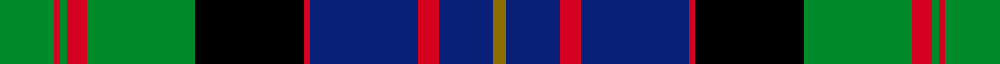

This page is one **sett** — a single exact thread-count. It belongs to the [tartan](/setts/g8r1g1r3g16k16r1db16r3db8y2/)
(the same proportion at any scale), whose colour order is pattern [GBRBRKGRGRG](/stripes/gbrbrkgrgrg/).

Sourced from weddslist.  It is a [11 stripe tartan](/stripes/stripes11/).

Original link http://www.weddslist.com/cgi-bin/tartans/pg.pl?source=rb

2 attestations — the source records this cloth was collapsed from (oldest owns this page)

<ul>
<li>undated — Cameron of Erracht (weddslist, <a href="http://www.weddslist.com/cgi-bin/tartans/pg.pl?source=rb">record</a>) </li>
<li>undated — Cameron of Erracht (weddslist, <a href="http://www.weddslist.com/cgi-bin/tartans/pg.pl?source=x">record</a>) </li>
</ul>

## Thread count
G/8 R1 G1 R3 G16 K16 R1 DB16 R3 DB8 Y/2

One full sett is **140 threads**.

## Palette
<table><thead><tr><th>Colour</th><th>Shade</th><th>OKLCh</th></tr></thead><tbody><tr><td>DB</td><td><code style="background-color:#082077;">#082077</code> <small style="color:#888">#082077</small></td><td><small style="color:#888">oklch(30.0% 0.149 265.1)</small></td></tr><tr><td>G</td><td><code style="background-color:#008B2A;">#008B2A</code> <small style="color:#888">#008B2A</small></td><td><small style="color:#888">oklch(55.4% 0.170 145.9)</small></td></tr><tr><td>K</td><td><code style="background-color:#000000;">#000000</code> <small style="color:#888">#000000</small></td><td><small style="color:#888">oklch(0.0% 0.000 0.0)</small></td></tr><tr><td>R</td><td><code style="background-color:#D60020;">#D60020</code> <small style="color:#888">#D60020</small></td><td><small style="color:#888">oklch(55.2% 0.224 25.5)</small></td></tr><tr><td>Y</td><td><code style="background-color:#8B6E00;">#8B6E00</code> <small style="color:#888">#8B6E00</small></td><td><small style="color:#888">oklch(55.1% 0.113 90.4)</small></td></tr></tbody></table>

# Sample pattern

## Nearest variants

The nearest existing variants by ΔTartan distance, with this cloth at the top so the swatches line up against it.

ΔTartan

Threads

Variant

Sett

—

140

<a href="/variants/s11/g8r1g1r3g16k16r1db16r3db8y2/">Cameron of Erracht</a>

<a href="/ttd/edit/#slug=g8r1g1r3g16k16r1db16r3db8y2~x2&amp;base=g8r1g1r3g16k16r1db16r3db8y2" title="compare in the TTD">0.00</a>

280

<a href="/variants/s11/g8r1g1r3g16k16r1db16r3db8y2~x2/">Cameron of Erracht (Clan)</a>

<a href="/ttd/edit/#slug=db16r5db30r2k33g30r5g2r2g7w2~x2&amp;base=g8r1g1r3g16k16r1db16r3db8y2" title="compare in the TTD">0.58</a>

500

<a href="/variants/s11/db16r5db30r2k33g30r5g2r2g7w2~x2/">MacDonell of Glengarry</a>

<a href="/ttd/edit/#slug=db16r5db30r2k33g30r5g2r2g7w4&amp;base=g8r1g1r3g16k16r1db16r3db8y2" title="compare in the TTD">0.58</a>

252

<a href="/variants/s11/db16r5db30r2k33g30r5g2r2g7w4/">MacDonell of Glengarry #3</a>

<a href="/ttd/edit/#slug=db8r4db12r1k12g12r3g2r1g4w1~x2&amp;base=g8r1g1r3g16k16r1db16r3db8y2" title="compare in the TTD">0.68</a>

222

<a href="/variants/s11/db8r4db12r1k12g12r3g2r1g4w1~x2/">MacDonell of Glengarry #2</a>

<a href="/ttd/edit/#slug=db17r2db2r6db32r2k34g32r6g2r2g17~x2&amp;base=g8r1g1r3g16k16r1db16r3db8y2" title="compare in the TTD">1.60</a>

548

<a href="/variants/s12/db17r2db2r6db32r2k34g32r6g2r2g17~x2/">MacDonald #4</a>

<a href="/ttd/edit/#slug=db16r2db2r5db29r2k31g29r5g2r2g16~x2&amp;base=g8r1g1r3g16k16r1db16r3db8y2" title="compare in the TTD">1.63</a>

500

<a href="/variants/s12/db16r2db2r5db29r2k31g29r5g2r2g16~x2/">MacDonald #3</a>

<a href="/ttd/edit/#slug=db17r2db2r5db29r2k31g29r5g2r2g17~x2&amp;base=g8r1g1r3g16k16r1db16r3db8y2" title="compare in the TTD">1.64</a>

504

<a href="/variants/s12/db17r2db2r5db29r2k31g29r5g2r2g17~x2/">MacDonald</a>

<a href="/ttd/edit/#slug=db12r2db2r5db26r2k29g27r5g2r2g12~x2&amp;base=g8r1g1r3g16k16r1db16r3db8y2" title="compare in the TTD">1.68</a>

456

<a href="/variants/s12/db12r2db2r5db26r2k29g27r5g2r2g12~x2/">MacDonald #5</a>

<a href="/ttd/edit/#slug=db16r2db2r7db31r2k32w3g31r7g2r2g16~x2&amp;base=g8r1g1r3g16k16r1db16r3db8y2" title="compare in the TTD">1.90</a>

548

<a href="/variants/s13/db16r2db2r7db31r2k32w3g31r7g2r2g16~x2/">Clanranald, MacDonald of</a>

<a href="/ttd/edit/#slug=db8r1db2r3db12r1k12w1g12r3g2r1g8~x2&amp;base=g8r1g1r3g16k16r1db16r3db8y2" title="compare in the TTD">1.97</a>

232

<a href="/variants/s13/db8r1db2r3db12r1k12w1g12r3g2r1g8~x2/">MacDonald of Clanranald</a>

## Neighbour map

Every grey dot is one of 13620 variants placed by the first two principal components of the ΔTartan feature space (42% of its variance). Red is this tartan; blue dots are its nearest — click one to open its page.

<svg viewBox="0 0 640 380" role="img" style="max-width:100%;height:auto;border:1px solid #e0e0e0;border-radius:4px;display:block" xmlns="http://www.w3.org/2000/svg"><image href="/nn/cloud.v1.png" width="640" height="380"/><a href="/variants/s11/g8r1g1r3g16k16r1db16r3db8y2~x2/"><circle cx="128.7" cy="137.7" r="4" fill="#3465a4"><title>Cameron of Erracht (Clan)</title></circle></a><a href="/variants/s11/db16r5db30r2k33g30r5g2r2g7w2~x2/"><circle cx="136.2" cy="126.4" r="4" fill="#3465a4"><title>MacDonell of Glengarry</title></circle></a><a href="/variants/s11/db16r5db30r2k33g30r5g2r2g7w4/"><circle cx="127.8" cy="127.6" r="4" fill="#3465a4"><title>MacDonell of Glengarry #3</title></circle></a><a href="/variants/s11/db8r4db12r1k12g12r3g2r1g4w1~x2/"><circle cx="108.9" cy="152.6" r="4" fill="#3465a4"><title>MacDonell of Glengarry #2</title></circle></a><a href="/variants/s12/db17r2db2r6db32r2k34g32r6g2r2g17~x2/"><circle cx="152.6" cy="138.5" r="4" fill="#3465a4"><title>MacDonald #4</title></circle></a><a href="/variants/s12/db16r2db2r5db29r2k31g29r5g2r2g16~x2/"><circle cx="150.7" cy="142.5" r="4" fill="#3465a4"><title>MacDonald #3</title></circle></a><a href="/variants/s12/db17r2db2r5db29r2k31g29r5g2r2g17~x2/"><circle cx="151.6" cy="143.2" r="4" fill="#3465a4"><title>MacDonald</title></circle></a><a href="/variants/s12/db12r2db2r5db26r2k29g27r5g2r2g12~x2/"><circle cx="143.4" cy="143.5" r="4" fill="#3465a4"><title>MacDonald #5</title></circle></a><a href="/variants/s13/db16r2db2r7db31r2k32w3g31r7g2r2g16~x2/"><circle cx="120.8" cy="121.7" r="4" fill="#3465a4"><title>Clanranald, MacDonald of</title></circle></a><a href="/variants/s13/db8r1db2r3db12r1k12w1g12r3g2r1g8~x2/"><circle cx="113.3" cy="142.4" r="4" fill="#3465a4"><title>MacDonald of Clanranald</title></circle></a><circle cx="128.7" cy="137.7" r="5" fill="#c00000"/><text x="320" y="376" text-anchor="middle" font-size="11" fill="#999">ground</text><text x="11" y="190" text-anchor="middle" font-size="11" fill="#999" transform="rotate(-90 11 190)">complexity</text></svg>

ID: /variants/s11/g8r1g1r3g16k16r1db16r3db8y2/
