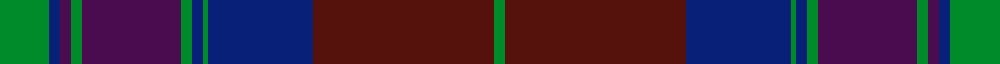

This page is one **sett** — a single exact thread-count. It belongs to the [tartan](/setts/g9db2dp2g2dp18g2db2g1db19dr33g2/)
(the same proportion at any scale), whose colour order is pattern [GBBGBGBGBBG](/stripes/gbbgbgbgbbg/).

Sourced from register-of-tartans.  It is a [11 stripe tartan](/stripes/stripes11/).

Original link https://www.tartanregister.gov.uk/tartanDetails.aspx?ref=3376

2 attestations — the source records this cloth was collapsed from (oldest owns this page)

<ul>
<li>01/01/2003 — Pride of Scotland Autumn (register-of-tartans, <a href="https://www.tartanregister.gov.uk/tartanDetails.aspx?ref=3376">record</a>)  <em>Design owned by McCalls of Aberdeen. Woven exclusively by Lochcarron of Scotland. Woven sample.</em></li>
<li>2003 — Pride of Scotland, Autumn (Fashion) (tartans-authority, <a href="http://www.tartansauthority.com/tartan-ferret/display/6479/">record</a>)  <em>One of a series of tartans from McCalls of Aberdeen based on the Pride of Scotland (#2469). Woven exclusively by Lochcarron of Scotland. Woven sample.</em></li>
</ul>

## Register references

External register numbers recorded for this tartan.

- Scottish Register of Tartans: [3376](https://www.tartanregister.gov.uk/tartanDetails.aspx?ref=3376)
- Scottish Tartans Authority (ITI): 6479

## Thread count
G/18 DB4 DP4 G4 DP36 G4 DB4 G2 DB38 DR66 G/4

One full sett is **346 threads**.

## Palette
<table><thead><tr><th>Colour</th><th>Shade</th><th>OKLCh</th></tr></thead><tbody><tr><td>DB</td><td><code style="background-color:#082077;">#082077</code> <small style="color:#888">#082077</small></td><td><small style="color:#888">oklch(30.0% 0.149 265.1)</small></td></tr><tr><td>DR</td><td><code style="background-color:#55120C;">#55120C</code> <small style="color:#888">#55120C</small></td><td><small style="color:#888">oklch(30.0% 0.099 29.3)</small></td></tr><tr><td>G</td><td><code style="background-color:#008B2A;">#008B2A</code> <small style="color:#888">#008B2A</small></td><td><small style="color:#888">oklch(55.4% 0.170 145.9)</small></td></tr><tr><td>DP</td><td><code style="background-color:#4B0B4F;">#4B0B4F</code> <small style="color:#888">#4B0B4F</small></td><td><small style="color:#888">oklch(30.1% 0.125 325.4)</small></td></tr></tbody></table>

# Sample pattern

ID: /variants/s11/g9db2dp2g2dp18g2db2g1db19dr33g2~x2/
