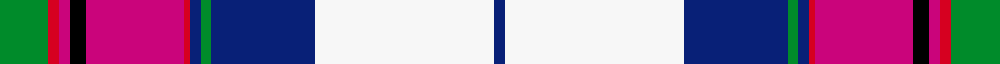

This page is one **sett** — a single exact thread-count. It belongs to the [tartan](/setts/g9r2m2k3m18r1db2g2db19w33db2/)
(the same proportion at any scale), whose colour order is pattern [BWBGBRRKRRG](/stripes/bwbgbrrkrrg/).

Sourced from register-of-tartans.  It is a [11 stripe tartan](/stripes/stripes11/).

Original link https://www.tartanregister.gov.uk/tartanDetails.aspx?ref=3378

2 attestations — the source records this cloth was collapsed from (oldest owns this page)

<ul>
<li>01/01/1997 — Pride of Scotland Dress (Dance) (register-of-tartans, <a href="https://www.tartanregister.gov.uk/tartanDetails.aspx?ref=3378">record</a>)  <em>As shown in DC Dalgliesh Dancers swatch book.</em></li>
<li>pre 1997 — Pride of Scotland Dress (Dance) (tartans-authority, <a href="http://www.tartansauthority.com/tartan-ferret/display/6566/">record</a>)  <em>One of a series of tartans from McCalls of Aberdeen based on the Pride of Scotland (#2469). As shown in D C Dalgliesh Dancers swatch book.</em></li>
</ul>

## Register references

External register numbers recorded for this tartan.

- Scottish Register of Tartans: [3378](https://www.tartanregister.gov.uk/tartanDetails.aspx?ref=3378)
- Scottish Tartans Authority (ITI): 6566

## Thread count
G/18 R4 M4 K6 M36 R2 DB4 G4 DB38 W66 DB/4

One full sett is **350 threads**.

## Palette
<table><thead><tr><th>Colour</th><th>Shade</th><th>OKLCh</th></tr></thead><tbody><tr><td>DB</td><td><code style="background-color:#082077;">#082077</code> <small style="color:#888">#082077</small></td><td><small style="color:#888">oklch(30.0% 0.149 265.1)</small></td></tr><tr><td>G</td><td><code style="background-color:#008B2A;">#008B2A</code> <small style="color:#888">#008B2A</small></td><td><small style="color:#888">oklch(55.4% 0.170 145.9)</small></td></tr><tr><td>K</td><td><code style="background-color:#000000;">#000000</code> <small style="color:#888">#000000</small></td><td><small style="color:#888">oklch(0.0% 0.000 0.0)</small></td></tr><tr><td>LN</td><td><code style="background-color:#F7F7F7;">#F7F7F7</code> <small style="color:#888">#F7F7F7</small></td><td><small style="color:#888">oklch(97.6% 0.000 89.9)</small></td></tr><tr><td>P</td><td><code style="background-color:#CA047B;">#CA047B</code> <small style="color:#888">#CA047B</small></td><td><small style="color:#888">oklch(55.0% 0.225 353.8)</small></td></tr><tr><td>R</td><td><code style="background-color:#D60020;">#D60020</code> <small style="color:#888">#D60020</small></td><td><small style="color:#888">oklch(55.2% 0.224 25.5)</small></td></tr></tbody></table>

# Sample pattern

ID: /variants/s11/g9r2m2k3m18r1db2g2db19w33db2~x2/
