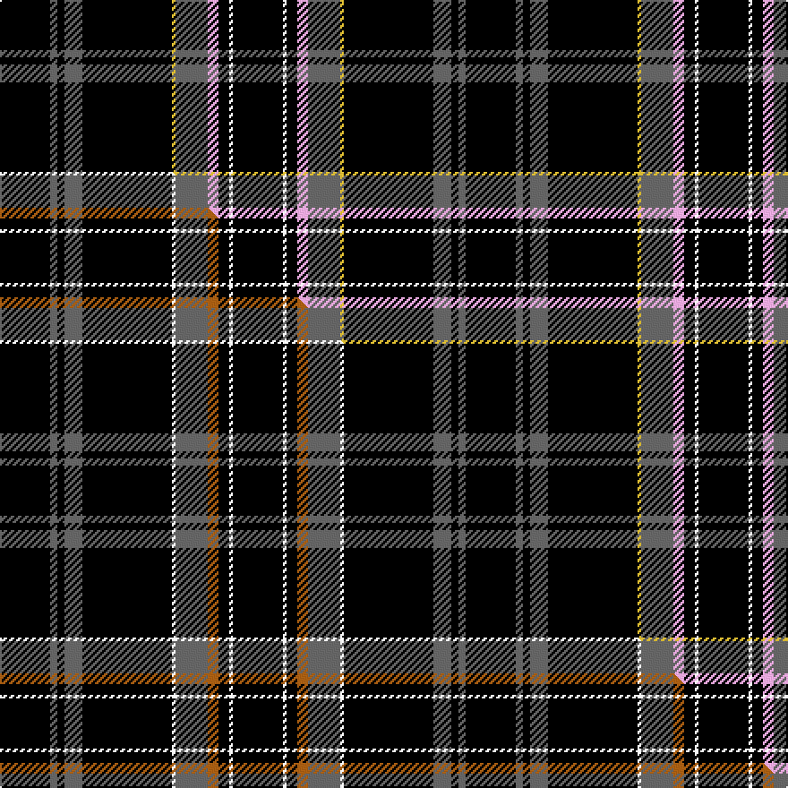

This page is one **sett** — a single exact thread-count. It belongs to the [tartan](/setts/k14n2k2n5k25ly1n9lp3k3w1k14/)
(the same proportion at any scale), whose colour order is pattern [KBKBKYBWKWK](/stripes/kbkbkybwkwk/).

Part of the [Springbank](/tartans/springbank/) tartan — the named design grouping this sett with its other cloths.

Sourced from tartans-authority.  It is a [11 stripe tartan](/stripes/stripes11/).

Original link https://www.tartanregister.gov.uk/tartanDetails.aspx?ref=8611

Dataset <small>— provenance for this record, inherited from the source manifest</small>

<dl class="dataset-prov">
<dt>source</dt><dd><a href="/sources/tartans-authority/">Scottish Tartans Authority</a></dd>
<dt>data captured from</dt><dd><a href="https://github.com/thetartan/tartan-database/blob/master/data/tartans-authority/data.csv">https://github.com/thetartan/tartan-database/blob/master/data/tartans-authority/data.csv</a></dd>
<dt>data date</dt><dd>March 2012 <small>(this record)</small></dd>
<dt>licence</dt><dd><a href="https://creativecommons.org/licenses/by-nc-nd/4.0/">CC BY-NC-ND 4.0</a></dd>
</dl>

Capture chain <small>— the hands this data passed through, oldest first; each capture carries its own licence</small>

<ol class="capture-chain">
<li><a href="https://www.tartansauthority.com/">Scottish Tartans Authority</a> <small>the heritage body's archive — its tartan-ferret record browser is retired (links repaired to the SRT, above)</small></li>
<li><a href="https://github.com/thetartan/tartan-database">thetartan/tartan-database</a> <small>2016-2017</small> · <a href="https://creativecommons.org/licenses/by-nc-nd/4.0/">CC BY-NC-ND 4.0</a> <small>Levko Kravets's frozen compilation — the capture we vendored, and where its CC licence text came from</small></li>
<li>this dictionary <small>captured 2026-06-10 · commit 5bf86c7566</small> <small>each re-capture is a git commit to data/sources</small></li>
</ol>

## Register references

External register numbers recorded for this tartan.

- Scottish Register of Tartans: [8611](https://www.tartanregister.gov.uk/tartanDetails?ref=8611)
- Scottish Tartans Authority (ITI): 8611

## Thread count
K/28 N4 K4 N10 K50 LY2 N18 LP6 K6 W2 K/28

One full sett is **260 threads**.

## Palette
<table><thead><tr><th>Colour</th><th>Shade</th><th>OKLCh</th></tr></thead><tbody><tr><td>K</td><td><code style="background-color:#000000;">#000000</code> <small style="color:#888">#000000</small></td><td><small style="color:#888">oklch(0.0% 0.000 0.0)</small></td></tr><tr><td>LP</td><td><code style="background-color:#E4A6DB;">#E4A6DB</code> <small style="color:#888">#E4A6DB</small></td><td><small style="color:#888">oklch(80.0% 0.100 331.6)</small></td></tr><tr><td>LY</td><td><code style="background-color:#DCBC32;">#DCBC32</code> <small style="color:#888">#DCBC32</small></td><td><small style="color:#888">oklch(80.0% 0.150 95.2)</small></td></tr><tr><td>N</td><td><code style="background-color:#636363;">#636363</code> <small style="color:#888">#636363</small></td><td><small style="color:#888">oklch(50.0% 0.000 89.9)</small></td></tr><tr><td>W</td><td><code style="background-color:#F7F7F7;">#F7F7F7</code> <small style="color:#888">#F7F7F7</small></td><td><small style="color:#888">oklch(97.6% 0.000 89.9)</small></td></tr></tbody></table>

# Sample pattern

## Compared to the master

This cloth is one sett of its design; the master sett (the exemplar the design is anchored on) is below for comparison.

Its **ΔTartan distance** from the master is **0.60** — the same measure the nearest-tartans table ranks by (0 is identical; a re-scale of the same cloth is near 0, a recolour or a different proportion further).

<figure class="master-compare" style="margin:0">

this sett
master sett ★

<figcaption style="color:#888;font-size:smaller">One weave of this sett against the <a href="/setts/k14n2k2n5k25w1n9o3k3w1k14/">master sett ★</a>, split on the diagonal: a shared proportion runs seamlessly across it with only the shades shifting; a different proportion breaks on it.</figcaption>
</figure>

## Nearest tartan variants

The nearest existing variants by ΔTartan distance, with this cloth at the top so the swatches line up against it.

ΔTartan

Threads

Variant

Sett

—

260

<a href="/variants/s11/k14n2k2n5k25ly1n9lp3k3w1k14~x2/">Springbank</a>

<a href="/ttd/edit/#slug=k14n2k2n5k25w1n9o3k3w1k14~x2&amp;base=k14n2k2n5k25ly1n9lp3k3w1k14~x2" title="compare in the TTD">0.60</a>

260

<a href="/variants/s11/k14n2k2n5k25w1n9o3k3w1k14~x2/">Springbank</a>

<a href="/ttd/edit/#slug=k14n2k2n5k25w1n9b3k3w1k14~x2&amp;base=k14n2k2n5k25ly1n9lp3k3w1k14~x2" title="compare in the TTD">0.60</a>

260

<a href="/variants/s11/k14n2k2n5k25w1n9b3k3w1k14~x2/">Springbank</a>

<a href="/ttd/edit/#slug=db6k20r3t2k20ly2k25ly1r2ly1t6~x2&amp;base=k14n2k2n5k25ly1n9lp3k3w1k14~x2" title="compare in the TTD">1.00</a>

328

<a href="/variants/s11/db6k20r3t2k20ly2k25ly1r2ly1t6~x2/">Martinez (2014)</a>

<a href="/ttd/edit/#slug=k5r2k30lb8w1k9w2k9w1lb8k30r3~x2&amp;base=k14n2k2n5k25ly1n9lp3k3w1k14~x2" title="compare in the TTD">2.28</a>

416

<a href="/variants/s12/k5r2k30lb8w1k9w2k9w1lb8k30r3~x2/">Glasgow Caledonian University Corporate Tartan</a>

<a href="/ttd/edit/#slug=k10n2oi2n2k14n2k2lp1n12k24o2~x2~n1900000-oi2500000&amp;base=k14n2k2n5k25ly1n9lp3k3w1k14~x2" title="compare in the TTD">2.30</a>

268

<a href="/variants/s11/k10n2oi2n2k14n2k2lp1n12k24o2~x2~n1900000-oi2500000/">Pride of Scotland Platinum</a>

<a href="/ttd/edit/#slug=k49o8k4n6oi4n6k4o8k49oi2~n1900000-oi2500000&amp;base=k14n2k2n5k25ly1n9lp3k3w1k14~x2" title="compare in the TTD">2.61</a>

229

<a href="/variants/s10/k49o8k4n6oi4n6k4o8k49oi2~n1900000-oi2500000/">Harley Davidson</a>

<a href="/ttd/edit/#slug=k9n2o2n2k18n2k2lp1n19k33dp2~x2~n1900000-o2500000&amp;base=k14n2k2n5k25ly1n9lp3k3w1k14~x2" title="compare in the TTD">2.71</a>

346

<a href="/variants/s11/k9n2o2n2k18n2k2lp1n19k33dp2~x2~n1900000-o2500000/">Pride of Scotland Contemporary</a>

<a href="/ttd/edit/#slug=k45o9k12r1k1g12k1r1k12o9k45g9~x2~o2404317&amp;base=k14n2k2n5k25ly1n9lp3k3w1k14~x2" title="compare in the TTD">2.78</a>

520

<a href="/variants/s12/k45o9k12r1k1g12k1r1k12o9k45g9~x2~o2404317/">O'Boyle</a>

<a href="/ttd/edit/#slug=k34g10k5r2k8dy2w3dy2k8r2k5g10k28db3~x2&amp;base=k14n2k2n5k25ly1n9lp3k3w1k14~x2" title="compare in the TTD">2.80</a>

414

<a href="/variants/s14/k34g10k5r2k8dy2w3dy2k8r2k5g10k28db3~x2/">Lambert (Front Royal) Dark Night</a>

<a href="/ttd/edit/#slug=k34g10k5r2k8dy2w3dy2k8r2k5g10k28t3~x2&amp;base=k14n2k2n5k25ly1n9lp3k3w1k14~x2" title="compare in the TTD">2.85</a>

414

<a href="/variants/s14/k34g10k5r2k8dy2w3dy2k8r2k5g10k28t3~x2/">Lambert Dark (Personal)</a>

## Neighbour map

Every grey dot is one of 13620 variants placed by the first two principal components of the ΔTartan feature space (42% of its variance). Red is this tartan; blue dots are its nearest — click one to open its page.

<svg viewBox="0 0 640 380" role="img" style="max-width:100%;height:auto;border:1px solid #e0e0e0;border-radius:4px;display:block" xmlns="http://www.w3.org/2000/svg"><image href="/nn/cloud.v1.png" width="640" height="380"/><a href="/variants/s11/k14n2k2n5k25w1n9o3k3w1k14~x2/"><circle cx="390.3" cy="108.0" r="4" fill="#3465a4"><title>Springbank</title></circle></a><a href="/variants/s11/k14n2k2n5k25w1n9b3k3w1k14~x2/"><circle cx="389.9" cy="108.3" r="4" fill="#3465a4"><title>Springbank</title></circle></a><a href="/variants/s11/db6k20r3t2k20ly2k25ly1r2ly1t6~x2/"><circle cx="373.2" cy="91.6" r="4" fill="#3465a4"><title>Martinez (2014)</title></circle></a><a href="/variants/s12/k5r2k30lb8w1k9w2k9w1lb8k30r3~x2/"><circle cx="402.9" cy="86.8" r="4" fill="#3465a4"><title>Glasgow Caledonian University Corporate Tartan</title></circle></a><a href="/variants/s11/k10n2oi2n2k14n2k2lp1n12k24o2~x2~n1900000-oi2500000/"><circle cx="351.7" cy="96.5" r="4" fill="#3465a4"><title>Pride of Scotland Platinum</title></circle></a><a href="/variants/s10/k49o8k4n6oi4n6k4o8k49oi2~n1900000-oi2500000/"><circle cx="425.7" cy="99.2" r="4" fill="#3465a4"><title>Harley Davidson</title></circle></a><a href="/variants/s11/k9n2o2n2k18n2k2lp1n19k33dp2~x2~n1900000-o2500000/"><circle cx="374.6" cy="82.5" r="4" fill="#3465a4"><title>Pride of Scotland Contemporary</title></circle></a><a href="/variants/s12/k45o9k12r1k1g12k1r1k12o9k45g9~x2~o2404317/"><circle cx="410.8" cy="75.6" r="4" fill="#3465a4"><title>O'Boyle</title></circle></a><a href="/variants/s14/k34g10k5r2k8dy2w3dy2k8r2k5g10k28db3~x2/"><circle cx="325.2" cy="81.7" r="4" fill="#3465a4"><title>Lambert (Front Royal) Dark Night</title></circle></a><a href="/variants/s14/k34g10k5r2k8dy2w3dy2k8r2k5g10k28t3~x2/"><circle cx="323.1" cy="81.3" r="4" fill="#3465a4"><title>Lambert Dark (Personal)</title></circle></a><circle cx="369.4" cy="93.3" r="5" fill="#c00000"/><text x="320" y="376" text-anchor="middle" font-size="11" fill="#999">ground</text><text x="11" y="190" text-anchor="middle" font-size="11" fill="#999" transform="rotate(-90 11 190)">complexity</text></svg>

ID: /variants/s11/k14n2k2n5k25ly1n9lp3k3w1k14~x2/
