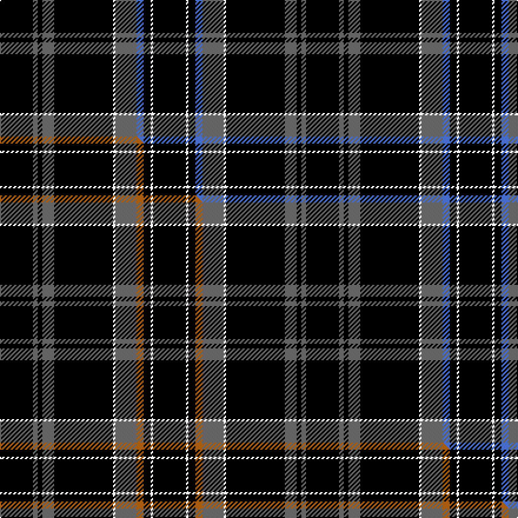

This page is one **sett** — a single exact thread-count. It belongs to the [tartan](/setts/k14n2k2n5k25w1n9b3k3w1k14/)
(the same proportion at any scale), whose colour order is pattern [KBKBKWBBKWK](/stripes/kbkbkwbbkwk/).

Part of the [Springbank](/tartans/springbank/) tartan — the named design grouping this sett with its other cloths.

Sourced from tartans-authority.  It is a [11 stripe tartan](/stripes/stripes11/).

Original link http://www.tartansauthority.com/tartan-ferret/display/11289/

## Register references

External register numbers recorded for this tartan.

- Scottish Register of Tartans: [11289](https://www.tartanregister.gov.uk/tartanDetails?ref=11289)
- Scottish Tartans Authority (ITI): 11289

## Thread count
K/28 N4 K4 N10 K50 W2 N18 B6 K6 W2 K/28

One full sett is **260 threads**.

## Palette
<table><thead><tr><th>Colour</th><th>Shade</th><th>OKLCh</th></tr></thead><tbody><tr><td>K</td><td><code style="background-color:#000000;">#000000</code> <small style="color:#888">#000000</small></td><td><small style="color:#888">oklch(0.0% 0.000 0.0)</small></td></tr><tr><td>N</td><td><code style="background-color:#636363;">#636363</code> <small style="color:#888">#636363</small></td><td><small style="color:#888">oklch(50.0% 0.000 89.9)</small></td></tr><tr><td>B</td><td><code style="background-color:#466CC8;">#466CC8</code> <small style="color:#888">#466CC8</small></td><td><small style="color:#888">oklch(55.1% 0.149 265.0)</small></td></tr><tr><td>W</td><td><code style="background-color:#F7F7F7;">#F7F7F7</code> <small style="color:#888">#F7F7F7</small></td><td><small style="color:#888">oklch(97.6% 0.000 89.9)</small></td></tr></tbody></table>

# Sample pattern

## Compared to the master

This cloth is one sett of its design; the master sett (the exemplar the design is anchored on) is below for comparison.

Its **ΔTartan distance** from the master is **0.21** — the same measure the nearest-tartans table ranks by (0 is identical; a re-scale of the same cloth is near 0, a recolour or a different proportion further).

<figure class="master-compare" style="margin:0">

this sett
master sett ★

<figcaption style="color:#888;font-size:smaller">One weave of this sett against the <a href="/setts/k14n2k2n5k25w1n9o3k3w1k14/">master sett ★</a>, split on the diagonal: a shared proportion runs seamlessly across it with only the shades shifting; a different proportion breaks on it.</figcaption>
</figure>

## Nearest tartan variants

The nearest existing variants by ΔTartan distance, with this cloth at the top so the swatches line up against it.

ΔTartan

Threads

Variant

Sett

—

260

<a href="/variants/s11/k14n2k2n5k25w1n9b3k3w1k14~x2/">Springbank</a>

<a href="/ttd/edit/#slug=k14n2k2n5k25w1n9o3k3w1k14~x2&amp;base=k14n2k2n5k25w1n9b3k3w1k14~x2" title="compare in the TTD">0.30</a>

260

<a href="/variants/s11/k14n2k2n5k25w1n9o3k3w1k14~x2/">Springbank</a>

<a href="/ttd/edit/#slug=k14n2k2n5k25ly1n9lp3k3w1k14~x2&amp;base=k14n2k2n5k25w1n9b3k3w1k14~x2" title="compare in the TTD">0.60</a>

260

<a href="/variants/s11/k14n2k2n5k25ly1n9lp3k3w1k14~x2/">Springbank</a>

<a href="/ttd/edit/#slug=k5r2k30lb8w1k9w2k9w1lb8k30r3~x2&amp;base=k14n2k2n5k25w1n9b3k3w1k14~x2" title="compare in the TTD">2.17</a>

416

<a href="/variants/s12/k5r2k30lb8w1k9w2k9w1lb8k30r3~x2/">Glasgow Caledonian University Corporate Tartan</a>

<a href="/ttd/edit/#slug=k22n17k2n4k2n2k37n4k2r3~x2&amp;base=k14n2k2n5k25w1n9b3k3w1k14~x2" title="compare in the TTD">2.66</a>

330

<a href="/variants/s10/k22n17k2n4k2n2k37n4k2r3~x2/">Witches' Blood, The</a>

<a href="/ttd/edit/#slug=k24n18k11n4k11n18k53r4&amp;base=k14n2k2n5k25w1n9b3k3w1k14~x2" title="compare in the TTD">2.68</a>

258

<a href="/variants/s8/k24n18k11n4k11n18k53r4/">Spirit of Glyndwr Red (Fashion)</a>

<a href="/ttd/edit/#slug=k24n18k11n4k11n18k53ly4&amp;base=k14n2k2n5k25w1n9b3k3w1k14~x2" title="compare in the TTD">2.68</a>

258

<a href="/variants/s8/k24n18k11n4k11n18k53ly4/">Spirit of Glyndwr Gold (Fashion)</a>

<a href="/ttd/edit/#slug=k10n5k2n5k10w1k26w1n4w1k5w1~x2&amp;base=k14n2k2n5k25w1n9b3k3w1k14~x2" title="compare in the TTD">2.81</a>

262

<a href="/variants/s12/k10n5k2n5k10w1k26w1n4w1k5w1~x2/">Clergy #3</a>

<a href="/ttd/edit/#slug=k10n2oi2n2k14n2k2lp1n12k24o2~x2~n1900000-oi2500000&amp;base=k14n2k2n5k25w1n9b3k3w1k14~x2" title="compare in the TTD">2.92</a>

268

<a href="/variants/s11/k10n2oi2n2k14n2k2lp1n12k24o2~x2~n1900000-oi2500000/">Pride of Scotland Platinum</a>

<a href="/ttd/edit/#slug=k7n2lb2n2k13n2k2lb2n13k26lp2~x2&amp;base=k14n2k2n5k25w1n9b3k3w1k14~x2" title="compare in the TTD">2.95</a>

274

<a href="/variants/s11/k7n2lb2n2k13n2k2lb2n13k26lp2~x2/">Pride of Scotland Platinum Fashion Tartan</a>

<a href="/ttd/edit/#slug=k68n11k16n4k4n4k4n19k14w4k14&amp;base=k14n2k2n5k25w1n9b3k3w1k14~x2" title="compare in the TTD">2.96</a>

242

<a href="/variants/s11/k68n11k16n4k4n4k4n19k14w4k14/">Stewart Mourning</a>

## Neighbour map

Every grey dot is one of 13620 variants placed by the first two principal components of the ΔTartan feature space (42% of its variance). Red is this tartan; blue dots are its nearest — click one to open its page.

<svg viewBox="0 0 640 380" role="img" style="max-width:100%;height:auto;border:1px solid #e0e0e0;border-radius:4px;display:block" xmlns="http://www.w3.org/2000/svg"><image href="/nn/cloud.v1.png" width="640" height="380"/><a href="/variants/s11/k14n2k2n5k25w1n9o3k3w1k14~x2/"><circle cx="390.3" cy="108.0" r="4" fill="#3465a4"><title>Springbank</title></circle></a><a href="/variants/s11/k14n2k2n5k25ly1n9lp3k3w1k14~x2/"><circle cx="369.4" cy="93.3" r="4" fill="#3465a4"><title>Springbank</title></circle></a><a href="/variants/s12/k5r2k30lb8w1k9w2k9w1lb8k30r3~x2/"><circle cx="402.9" cy="86.8" r="4" fill="#3465a4"><title>Glasgow Caledonian University Corporate Tartan</title></circle></a><a href="/variants/s10/k22n17k2n4k2n2k37n4k2r3~x2/"><circle cx="392.5" cy="128.3" r="4" fill="#3465a4"><title>Witches' Blood, The</title></circle></a><a href="/variants/s8/k24n18k11n4k11n18k53r4/"><circle cx="372.4" cy="176.1" r="4" fill="#3465a4"><title>Spirit of Glyndwr Red (Fashion)</title></circle></a><a href="/variants/s8/k24n18k11n4k11n18k53ly4/"><circle cx="373.1" cy="179.5" r="4" fill="#3465a4"><title>Spirit of Glyndwr Gold (Fashion)</title></circle></a><a href="/variants/s12/k10n5k2n5k10w1k26w1n4w1k5w1~x2/"><circle cx="422.8" cy="110.9" r="4" fill="#3465a4"><title>Clergy #3</title></circle></a><a href="/variants/s11/k10n2oi2n2k14n2k2lp1n12k24o2~x2~n1900000-oi2500000/"><circle cx="351.7" cy="96.5" r="4" fill="#3465a4"><title>Pride of Scotland Platinum</title></circle></a><a href="/variants/s11/k7n2lb2n2k13n2k2lb2n13k26lp2~x2/"><circle cx="326.6" cy="130.4" r="4" fill="#3465a4"><title>Pride of Scotland Platinum Fashion Tartan</title></circle></a><a href="/variants/s11/k68n11k16n4k4n4k4n19k14w4k14/"><circle cx="416.1" cy="123.9" r="4" fill="#3465a4"><title>Stewart Mourning</title></circle></a><circle cx="389.9" cy="108.3" r="5" fill="#c00000"/><text x="320" y="376" text-anchor="middle" font-size="11" fill="#999">ground</text><text x="11" y="190" text-anchor="middle" font-size="11" fill="#999" transform="rotate(-90 11 190)">complexity</text></svg>

ID: /variants/s11/k14n2k2n5k25w1n9b3k3w1k14~x2/
