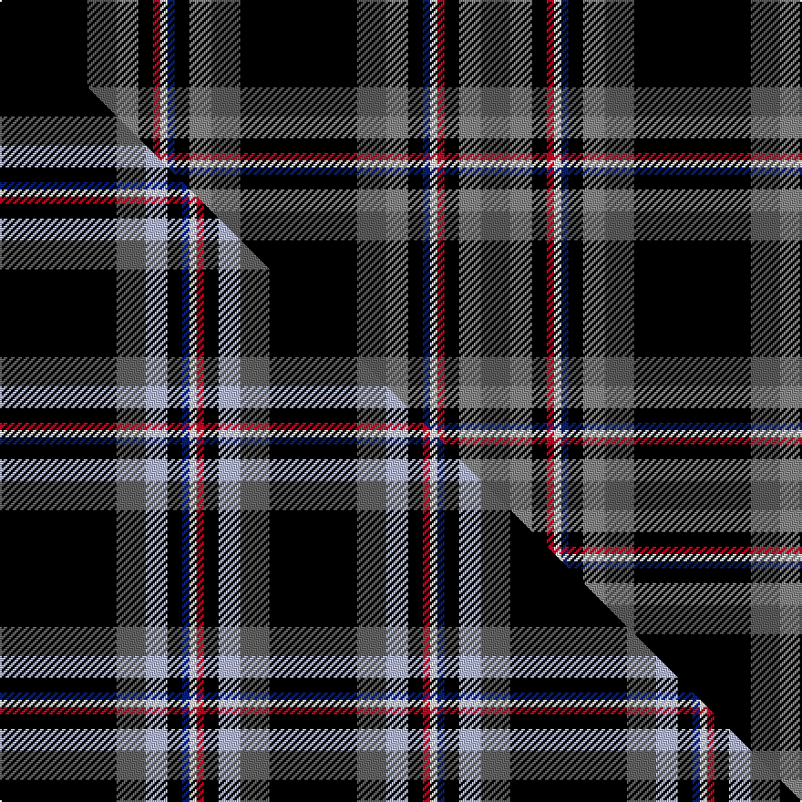

This is one **variant** — a specific cloth: this exact thread count and colourway, with its own
provenance below. It is one weaving of the [sett](/setts/k16n4o3k2db1w1r1k2o3n4k12/) (the scale-free proportion — the
same cloth at any scale or shade), whose colour order is pattern [BRKRWBKRBKBRKBWRKRBK](/stripes/brkrwbkrbkbrkbwrkrbk/).

Part of the [Iron Horse](/tartans/iron-horse/) tartan — the named design grouping this sett with its other cloths.

Sourced from tartans-authority.  It is a [20 stripe tartan](/stripes/stripes20/).

Original link [https://www.tartanregister.gov.uk/tartanDetails.aspx?ref=3820](https://www.tartanregister.gov.uk/tartanDetails.aspx?ref=3820)

## Provenance

Earliest known date: 2002 Designed for members of the Iron Horse 'Clan' (used in the loose sense) a group of American motorcycle enthusiasts wishing to express their identity and heritage through their own tartan. Only for members of the Iron Horse group and their families.

2 attestations — the source records this cloth was collapsed from (oldest owns this page)

<ul>
<li>2002 — Iron Horse (Corporate) (tartans-authority, <a href="https://www.tartanregister.gov.uk/tartanDetails.aspx?ref=3820">record</a>)  <em>Asymmetric. Designed by Larry Stump and Maryann for members of the Iron Horse 'Clan' (used in the loose sense) which is a group of American motorcycle enthusiasts wishing to express their identity and heritage through their own tartan. Only for members of the Iron Horse group and their families. Donald Ackerman was the 'Clan Chief' in June 2002.</em></li>
<li>2002 — Iron Horse Clan Tartan (house-of-tartan, <a href="http://www.house-of-tartan.scotland.net/house/TartanViewjs.asp?colr=Def&tnam=3820">record</a>) </li>
</ul>

Dataset <small>— provenance for this record, inherited from the source manifest</small>

<dl class="dataset-prov">
<dt>source</dt><dd><a href="/sources/tartans-authority/">Scottish Tartans Authority</a></dd>
<dt>data captured from</dt><dd><a href="https://github.com/thetartan/tartan-database/blob/master/data/tartans-authority/data.csv">https://github.com/thetartan/tartan-database/blob/master/data/tartans-authority/data.csv</a></dd>
<dt>data date</dt><dd>2002 <small>(this record)</small></dd>
<dt>licence</dt><dd><a href="https://creativecommons.org/licenses/by-nc-nd/4.0/">CC BY-NC-ND 4.0</a></dd>
</dl>

Capture chain <small>— the hands this data passed through, oldest first; each capture carries its own licence</small>

<ol class="capture-chain">
<li><a href="https://www.tartansauthority.com/">Scottish Tartans Authority</a> <small>the heritage body's archive — its tartan-ferret record browser is retired (links repaired to the SRT, above)</small></li>
<li><a href="https://github.com/thetartan/tartan-database">thetartan/tartan-database</a> <small>2016-2017</small> · <a href="https://creativecommons.org/licenses/by-nc-nd/4.0/">CC BY-NC-ND 4.0</a> <small>Levko Kravets's frozen compilation — the capture we vendored, and where its CC licence text came from</small></li>
<li>this dictionary <small>captured 2026-06-10 · commit 5bf86c7566</small> <small>each re-capture is a git commit to data/sources</small></li>
</ol>

## Register references

External register numbers recorded for this tartan.

- Scottish Tartans Authority (ITI): 3820

## Thread count
K/48 N16 O12 K8 R4 W4 DB4 K8 O12 N16 K64 N16 O12 K8 DB4 W4 R4 K8 O12 N/16

One full sett is **496 threads**.

## Palette
<table><thead><tr><th>Colour</th><th>Shade</th><th>OKLCh</th></tr></thead><tbody><tr><td>DB</td><td><code style="background-color:#082077;">#082077</code> <small style="color:#888">#082077</small></td><td><small style="color:#888">oklch(30.0% 0.149 265.1)</small></td></tr><tr><td>K</td><td><code style="background-color:#000000;">#000000</code> <small style="color:#888">#000000</small></td><td><small style="color:#888">oklch(0.0% 0.000 0.0)</small></td></tr><tr><td>W</td><td><code style="background-color:#F7F7F7;">#F7F7F7</code> <small style="color:#888">#F7F7F7</small></td><td><small style="color:#888">oklch(97.6% 0.000 89.9)</small></td></tr><tr><td>N</td><td><code style="background-color:#5C5C5C;">#5C5C5C</code> <small style="color:#888">#5C5C5C</small></td><td><small style="color:#888">oklch(47.5% 0.000 89.9)</small></td></tr><tr><td>O</td><td><code style="background-color:#888888;">#888888</code> <small style="color:#888">#888888</small></td><td><small style="color:#888">oklch(62.7% 0.000 89.9)</small></td></tr><tr><td>R</td><td><code style="background-color:#D60020;">#D60020</code> <small style="color:#888">#D60020</small></td><td><small style="color:#888">oklch(55.2% 0.224 25.5)</small></td></tr></tbody></table>

# Sample pattern

## Compared to the master

This cloth is one sett of its design; the master sett (the exemplar the design is anchored on) is below for comparison.

Its **ΔTartan distance** from the master is **0.90** — the same measure the nearest-tartans table ranks by (0 is identical; a re-scale of the same cloth is near 0, a recolour or a different proportion further).

<figure class="master-compare" style="margin:0">

this sett
master sett ★

<figcaption style="color:#888;font-size:smaller">One weave of this sett against the <a href="/setts/k16n4lb3k2db1w1r1k2lb3n4k12/">master sett ★</a>, split on the diagonal: a shared proportion runs seamlessly across it with only the shades shifting; a different proportion breaks on it.</figcaption>
</figure>

## Nearest tartan variants

The nearest existing variants by ΔTartan distance, with this cloth at the top so the swatches line up against it.

ΔTartan

Threads

Variant

Sett

—

496

<a href="/variants/s11/k16n4o3k2db1w1r1k2o3n4k12~x4~n1900000-o2500000/">Iron Horse (Corporate)</a>

<a href="/ttd/edit/#slug=r4k2r2k2r2k2dr8k6dr2g2db9g2k21w4~x2&amp;base=k16n4o3k2db1w1r1k2o3n4k12~x4~n1900000-o2500000" title="compare in the TTD">2.61</a>

256

<a href="/variants/s14/r4k2r2k2r2k2dr8k6dr2g2db9g2k21w4~x2/">Hitchens, William Henry</a>

<a href="/ttd/edit/#slug=db8k2db3k12dp3w1dp3k16g3w2r1w2g8~x2&amp;base=k16n4o3k2db1w1r1k2o3n4k12~x4~n1900000-o2500000" title="compare in the TTD">2.74</a>

224

<a href="/variants/s13/db8k2db3k12dp3w1dp3k16g3w2r1w2g8~x2/">MacKusick Family Tartan of North America</a>

<a href="/ttd/edit/#slug=db8k2db3k12dp3w1dp3k16g3w2dr1w2g8~x2~w4000000&amp;base=k16n4o3k2db1w1r1k2o3n4k12~x4~n1900000-o2500000" title="compare in the TTD">2.77</a>

224

<a href="/variants/s13/db8k2db3k12dp3w1dp3k16g3w2dr1w2g8~x2~w4000000/">MacKusick</a>

<a href="/ttd/edit/#slug=n4o3n4o2n4dt8n30k4dt4k36n4r2k4w2~dt1602277-r2109032&amp;base=k16n4o3k2db1w1r1k2o3n4k12~x4~n1900000-o2500000" title="compare in the TTD">2.79</a>

216

<a href="/variants/s14/n4o3n4o2n4dt8n30k4dt4k36n4r2k4w2~dt1602277-r2109032/">Capercaillie Corporate Tartan</a>

<a href="/ttd/edit/#slug=r2db2k3dg25k2db3dg4dy2dg2w2dg6db2r7k2r3w2~x2&amp;base=k16n4o3k2db1w1r1k2o3n4k12~x4~n1900000-o2500000" title="compare in the TTD">2.82</a>

268

<a href="/variants/s16/r2db2k3dg25k2db3dg4dy2dg2w2dg6db2r7k2r3w2~x2/">Hueg Scottish Thistle (Personal)</a>

<a href="/ttd/edit/#slug=db8k2db3k12dp3lb1dp3k16g3lb2dr1lb2g8~x2&amp;base=k16n4o3k2db1w1r1k2o3n4k12~x4~n1900000-o2500000" title="compare in the TTD">2.84</a>

224

<a href="/variants/s13/db8k2db3k12dp3lb1dp3k16g3lb2dr1lb2g8~x2/">MacKusick (Name)</a>

<a href="/ttd/edit/#slug=k23db1g1r3db2r1db12y1k1w1k6db4g2k2g3~x2&amp;base=k16n4o3k2db1w1r1k2o3n4k12~x4~n1900000-o2500000" title="compare in the TTD">2.91</a>

200

<a href="/variants/s15/k23db1g1r3db2r1db12y1k1w1k6db4g2k2g3~x2/">Astrobiology</a>

<a href="/ttd/edit/#slug=k2w2k15dp5n5dp10lb2dp10n5dp5n30k2n4k2n30dp4n4k15w2~x2&amp;base=k16n4o3k2db1w1r1k2o3n4k12~x4~n1900000-o2500000" title="compare in the TTD">2.95</a>

608

<a href="/variants/s19/k2w2k15dp5n5dp10lb2dp10n5dp5n30k2n4k2n30dp4n4k15w2~x2/">Un-named fashion (2013)</a>

<a href="/ttd/edit/#slug=dr21k3y1k1w3k3db1k3db8k19y4k2y1k7y3~x2&amp;base=k16n4o3k2db1w1r1k2o3n4k12~x4~n1900000-o2500000" title="compare in the TTD">2.98</a>

272

<a href="/variants/s15/dr21k3y1k1w3k3db1k3db8k19y4k2y1k7y3~x2/">Ruxton</a>

<a href="/ttd/edit/#slug=g2r4g2k16g4k16g4k2g2k2g4k4db8k1w2~x2&amp;base=k16n4o3k2db1w1r1k2o3n4k12~x4~n1900000-o2500000" title="compare in the TTD">3.02</a>

284

<a href="/variants/s15/g2r4g2k16g4k16g4k2g2k2g4k4db8k1w2~x2/">MacKean Hunting Family Tartan</a>

## Neighbour map

Every grey dot is one of 13621 variants placed by the first two principal components of the ΔTartan feature space (42% of its variance). Red is this tartan; blue dots are its nearest — click one to open its page.

<svg viewBox="0 0 640 380" role="img" style="max-width:100%;height:auto;border:1px solid #e0e0e0;border-radius:4px;display:block" xmlns="http://www.w3.org/2000/svg"><image href="/nn/cloud.v1.png" width="640" height="380"/><a href="/variants/s14/r4k2r2k2r2k2dr8k6dr2g2db9g2k21w4~x2/"><circle cx="146.4" cy="104.4" r="4" fill="#3465a4"><title>Hitchens, William Henry</title></circle></a><a href="/variants/s13/db8k2db3k12dp3w1dp3k16g3w2r1w2g8~x2/"><circle cx="147.0" cy="108.4" r="4" fill="#3465a4"><title>MacKusick Family Tartan of North America</title></circle></a><a href="/variants/s13/db8k2db3k12dp3w1dp3k16g3w2dr1w2g8~x2~w4000000/"><circle cx="147.0" cy="108.7" r="4" fill="#3465a4"><title>MacKusick</title></circle></a><a href="/variants/s14/n4o3n4o2n4dt8n30k4dt4k36n4r2k4w2~dt1602277-r2109032/"><circle cx="185.3" cy="77.7" r="4" fill="#3465a4"><title>Capercaillie Corporate Tartan</title></circle></a><a href="/variants/s16/r2db2k3dg25k2db3dg4dy2dg2w2dg6db2r7k2r3w2~x2/"><circle cx="214.3" cy="88.7" r="4" fill="#3465a4"><title>Hueg Scottish Thistle (Personal)</title></circle></a><a href="/variants/s13/db8k2db3k12dp3lb1dp3k16g3lb2dr1lb2g8~x2/"><circle cx="156.1" cy="111.4" r="4" fill="#3465a4"><title>MacKusick (Name)</title></circle></a><a href="/variants/s15/k23db1g1r3db2r1db12y1k1w1k6db4g2k2g3~x2/"><circle cx="228.0" cy="61.4" r="4" fill="#3465a4"><title>Astrobiology</title></circle></a><a href="/variants/s19/k2w2k15dp5n5dp10lb2dp10n5dp5n30k2n4k2n30dp4n4k15w2~x2/"><circle cx="226.2" cy="105.8" r="4" fill="#3465a4"><title>Un-named fashion (2013)</title></circle></a><a href="/variants/s15/dr21k3y1k1w3k3db1k3db8k19y4k2y1k7y3~x2/"><circle cx="212.8" cy="90.8" r="4" fill="#3465a4"><title>Ruxton</title></circle></a><a href="/variants/s15/g2r4g2k16g4k16g4k2g2k2g4k4db8k1w2~x2/"><circle cx="223.1" cy="110.2" r="4" fill="#3465a4"><title>MacKean Hunting Family Tartan</title></circle></a><circle cx="179.0" cy="76.1" r="5" fill="#c00000"/><text x="320" y="376" text-anchor="middle" font-size="11" fill="#999">ground</text><text x="11" y="190" text-anchor="middle" font-size="11" fill="#999" transform="rotate(-90 11 190)">complexity</text></svg>

ID: /variants/s11/k16n4o3k2db1w1r1k2o3n4k12~x4~n1900000-o2500000/
