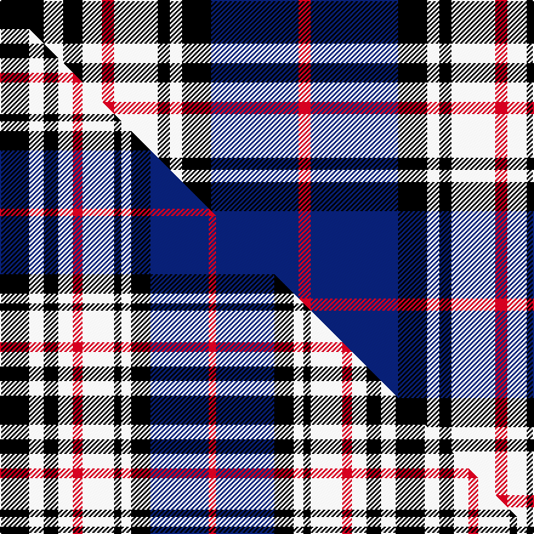

This is one **variant** — a specific cloth: this exact thread count and colourway, with its own
provenance below. It is one weaving of the [sett](/tartans/m/me/merchiston-castle-school/) (the scale-free proportion — the
same cloth at any scale or shade), whose colour order is pattern [KWKWRWKWKBR](/stripes/kwkwrwkwkbr/).

Part of the [Merchiston Castle School](/tartans/m/me/merchiston-castle-school/) tartan — the named design grouping this sett with its other cloths.

Sourced from weddslist.  It is a [11 stripe tartan](/stripes/stripes11/).

Original link [http://www.weddslist.com/cgi-bin/tartans/pg.pl?source=sts](http://www.weddslist.com/cgi-bin/tartans/pg.pl?source=sts)

2 attestations — the source records this cloth was collapsed from (oldest owns this page)

<ul>
<li>undated — Merchiston, Castle School Pipers (weddslist, <a href="http://www.weddslist.com/cgi-bin/tartans/pg.pl?source=sts">record</a>) </li>
<li>undated — Merchiston Castle School (weddslist, <a href="http://www.weddslist.com/cgi-bin/tartans/pg.pl?source=tinsel">record</a>) </li>
</ul>

Dataset <small>— provenance for this record, inherited from the source manifest</small>

<dl class="dataset-prov">
<dt>source</dt><dd><a href="/sources/weddslist/">Weddslist</a></dd>
<dt>data captured from</dt><dd><a href="https://github.com/thetartan/tartan-database/blob/master/data/weddslist/data.csv">https://github.com/thetartan/tartan-database/blob/master/data/weddslist/data.csv</a></dd>
<dt>data date</dt><dd>2016-11-17 <small>(dataset default)</small></dd>
<dt>licence</dt><dd><a href="https://creativecommons.org/licenses/by-nc-nd/4.0/">CC BY-NC-ND 4.0</a></dd>
</dl>

Capture chain <small>— the hands this data passed through, oldest first; each capture carries its own licence</small>

<ol class="capture-chain">
<li><a href="https://www.weddslist.com/tartans/">Weddslist</a> <small>the living privately compiled reference</small></li>
<li><a href="https://github.com/thetartan/tartan-database">thetartan/tartan-database</a> <small>2016-2017</small> · <a href="https://creativecommons.org/licenses/by-nc-nd/4.0/">CC BY-NC-ND 4.0</a> <small>Levko Kravets's frozen compilation — the capture we vendored, and where its CC licence text came from</small></li>
<li>this dictionary <small>captured 2026-06-10 · commit 5bf86c7566</small> <small>each re-capture is a git commit to data/sources</small></li>
</ol>

## Thread count
K/36 W16 K16 W16 R10 W36 K10 W10 K24 DB72 R/10

One full sett is **466 threads**.

## Palette
<table><thead><tr><th>Colour</th><th>Shade</th><th>OKLCh</th></tr></thead><tbody><tr><td>DB</td><td><code style="background-color:#082077;">#082077</code> <small style="color:#888">#082077</small></td><td><small style="color:#888">oklch(30.0% 0.149 265.1)</small></td></tr><tr><td>K</td><td><code style="background-color:#000000;">#000000</code> <small style="color:#888">#000000</small></td><td><small style="color:#888">oklch(0.0% 0.000 0.0)</small></td></tr><tr><td>W</td><td><code style="background-color:#F7F7F7;">#F7F7F7</code> <small style="color:#888">#F7F7F7</small></td><td><small style="color:#888">oklch(97.6% 0.000 89.9)</small></td></tr><tr><td>R</td><td><code style="background-color:#D60020;">#D60020</code> <small style="color:#888">#D60020</small></td><td><small style="color:#888">oklch(55.2% 0.224 25.5)</small></td></tr></tbody></table>

# Sample pattern

## Compared to the master

This cloth is one sett of its design; the master sett (the exemplar the design is anchored on) is below for comparison.

Its **ΔTartan distance** from the master is **0.23** — the same measure the nearest-tartans table ranks by (0 is identical; a re-scale of the same cloth is near 0, a recolour or a different proportion further).

<figure class="master-compare" style="margin:0">

this sett
master sett ★

<figcaption style="color:#888;font-size:smaller">One weave of this sett against the <a href="/setts/k12w6k6w6r4w13k3w4k8db24r3/">master sett ★</a>, split on the diagonal: a shared proportion runs seamlessly across it with only the shades shifting; a different proportion breaks on it.</figcaption>
</figure>

## Nearest tartan variants

The nearest existing variants by ΔTartan distance, with this cloth at the top so the swatches line up against it.

ΔTartan

Threads

Variant

Sett

—

466

<a href="/variants/s11/k18w8k8w8r5w18k5w5k12db36r5~x2/">Merchiston, Castle School Pipers</a>

<a href="/ttd/edit/#slug=k18w8k8w8r5w18k5w5k12db36r5&amp;base=k18w8k8w8r5w18k5w5k12db36r5~x2" title="compare in the TTD">0.00</a>

233

<a href="/variants/s11/k18w8k8w8r5w18k5w5k12db36r5/">Merchiston Castle School</a>

<a href="/ttd/edit/#slug=k9w8k8w8r5w18k5w5k12db36r5&amp;base=k18w8k8w8r5w18k5w5k12db36r5~x2" title="compare in the TTD">0.16</a>

224

<a href="/variants/s11/k9w8k8w8r5w18k5w5k12db36r5/">Merchiston Castle School</a>

<a href="/ttd/edit/#slug=k12w6k6w6r4w13k3w4k8db24r3~x2&amp;base=k18w8k8w8r5w18k5w5k12db36r5~x2" title="compare in the TTD">0.23</a>

326

<a href="/variants/s11/k12w6k6w6r4w13k3w4k8db24r3~x2/">Merchiston Castle School Pipe Band</a>

<a href="/ttd/edit/#slug=db16r4db6r10db30r4k30w34r9w6r4w16&amp;base=k18w8k8w8r5w18k5w5k12db36r5~x2" title="compare in the TTD">1.90</a>

306

<a href="/variants/s12/db16r4db6r10db30r4k30w34r9w6r4w16/">MacDonald Pattern of Plaids</a>

<a href="/ttd/edit/#slug=w25dp8w8dp8w8dp46k46lp8k46dp46w46dp8w8&amp;base=k18w8k8w8r5w18k5w5k12db36r5~x2" title="compare in the TTD">2.10</a>

589

<a href="/variants/s13/w25dp8w8dp8w8dp46k46lp8k46dp46w46dp8w8/">Poulter SG 102 (Fashion)</a>

<a href="/ttd/edit/#slug=r1k2w8k2r1k2db8k2r1k2y1~x4&amp;base=k18w8k8w8r5w18k5w5k12db36r5~x2" title="compare in the TTD">2.24</a>

232

<a href="/variants/s11/r1k2w8k2r1k2db8k2r1k2y1~x4/">Andreou Family (Personal)</a>

<a href="/ttd/edit/#slug=r1k1w2k2w2k1w4k1db9y1~x4&amp;base=k18w8k8w8r5w18k5w5k12db36r5~x2" title="compare in the TTD">2.25</a>

184

<a href="/variants/s10/r1k1w2k2w2k1w4k1db9y1~x4/">Thom(p)son</a>

<a href="/ttd/edit/#slug=n25k8n8k8n8k46w46r8w46k46n46k8n8&amp;base=k18w8k8w8r5w18k5w5k12db36r5~x2" title="compare in the TTD">2.25</a>

589

<a href="/variants/s13/n25k8n8k8n8k46w46r8w46k46n46k8n8/">Poulter SG 103 (Fashion)</a>

<a href="/ttd/edit/#slug=lb7k2w2k2w2k2lb7t4k10w2~x4~lb7609282-t5912243&amp;base=k18w8k8w8r5w18k5w5k12db36r5~x2" title="compare in the TTD">2.26</a>

284

<a href="/variants/s10/lb7k2w2k2w2k2lb7t4k10w2~x4~lb7609282-t5912243/">Investors Group</a>

<a href="/ttd/edit/#slug=lb7k1lb1k1lb1y4k6w1k6y4lb5k1lb1~x4&amp;base=k18w8k8w8r5w18k5w5k12db36r5~x2" title="compare in the TTD">2.34</a>

280

<a href="/variants/s13/lb7k1lb1k1lb1y4k6w1k6y4lb5k1lb1~x4/">Kernbrownek (Personal)</a>

## Neighbour map

Every grey dot is one of 13662 variants placed by the first two principal components of the ΔTartan feature space (42% of its variance). Red is this tartan; blue dots are its nearest — click one to open its page. The map is a flat projection of a many-dimensional space — [how to read it](/posts/neighbourhood-maps/).

<svg viewBox="0 0 640 380" role="img" style="max-width:100%;height:auto;border:1px solid #e0e0e0;border-radius:4px;display:block" xmlns="http://www.w3.org/2000/svg"><image href="/nn/cloud.v1.png" width="640" height="380"/><a href="/variants/s11/k18w8k8w8r5w18k5w5k12db36r5/"><circle cx="93.3" cy="177.9" r="4" fill="#3465a4"><title>Merchiston Castle School</title></circle></a><a href="/variants/s11/k9w8k8w8r5w18k5w5k12db36r5/"><circle cx="92.8" cy="174.9" r="4" fill="#3465a4"><title>Merchiston Castle School</title></circle></a><a href="/variants/s11/k12w6k6w6r4w13k3w4k8db24r3~x2/"><circle cx="90.6" cy="177.8" r="4" fill="#3465a4"><title>Merchiston Castle School Pipe Band</title></circle></a><a href="/variants/s12/db16r4db6r10db30r4k30w34r9w6r4w16/"><circle cx="91.1" cy="169.1" r="4" fill="#3465a4"><title>MacDonald Pattern of Plaids</title></circle></a><a href="/variants/s13/w25dp8w8dp8w8dp46k46lp8k46dp46w46dp8w8/"><circle cx="114.0" cy="183.9" r="4" fill="#3465a4"><title>Poulter SG 102 (Fashion)</title></circle></a><a href="/variants/s11/r1k2w8k2r1k2db8k2r1k2y1~x4/"><circle cx="80.3" cy="146.4" r="4" fill="#3465a4"><title>Andreou Family (Personal)</title></circle></a><a href="/variants/s10/r1k1w2k2w2k1w4k1db9y1~x4/"><circle cx="114.8" cy="143.2" r="4" fill="#3465a4"><title>Thom(p)son</title></circle></a><a href="/variants/s13/n25k8n8k8n8k46w46r8w46k46n46k8n8/"><circle cx="107.4" cy="185.1" r="4" fill="#3465a4"><title>Poulter SG 103 (Fashion)</title></circle></a><a href="/variants/s10/lb7k2w2k2w2k2lb7t4k10w2~x4~lb7609282-t5912243/"><circle cx="113.4" cy="207.7" r="4" fill="#3465a4"><title>Investors Group</title></circle></a><a href="/variants/s13/lb7k1lb1k1lb1y4k6w1k6y4lb5k1lb1~x4/"><circle cx="125.9" cy="177.4" r="4" fill="#3465a4"><title>Kernbrownek (Personal)</title></circle></a><circle cx="93.3" cy="177.9" r="5" fill="#c00000"/><text x="320" y="376" text-anchor="middle" font-size="11" fill="#999">ground</text><text x="11" y="190" text-anchor="middle" font-size="11" fill="#999" transform="rotate(-90 11 190)">complexity</text></svg>

ID: /variants/s11/k18w8k8w8r5w18k5w5k12db36r5~x2/
