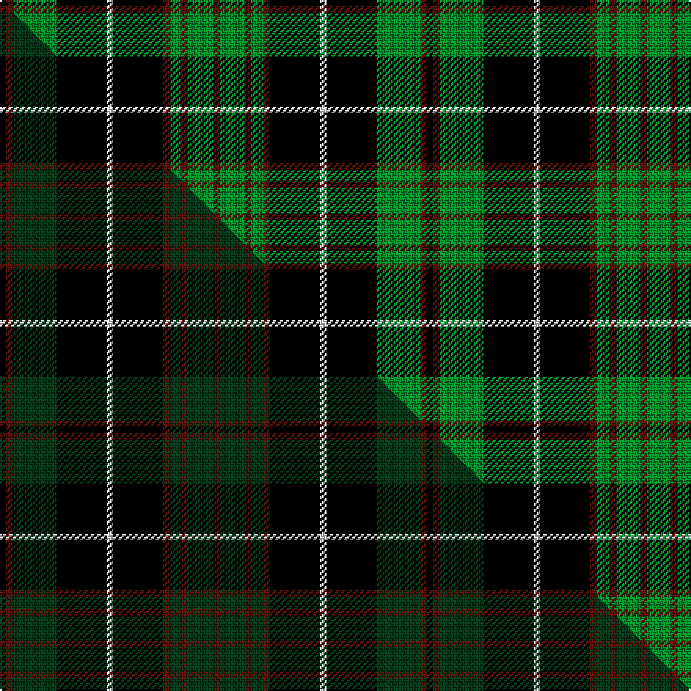

This is one **variant** — a specific cloth: this exact thread count and colourway, with its own
provenance below. It is one weaving of the [sett](/setts/k1dr1g7k8w1k8dr1g2dr1g4dr1/) (the scale-free proportion — the
same cloth at any scale or shade), whose colour order is pattern [BGBGBKWKGBK](/stripes/bgbgbkwkgbk/).

Part of the [Episcopal Clergy](/tartans/e/ep/episcopal-clergy/) tartan — the named design grouping this sett with its other cloths.

Sourced from tartans-authority.  It is a [11 stripe tartan](/stripes/stripes11/).

Original link [https://www.tartanregister.gov.uk/tartanDetails.aspx?ref=4816](https://www.tartanregister.gov.uk/tartanDetails.aspx?ref=4816)

Dataset <small>— provenance for this record, inherited from the source manifest</small>

<dl class="dataset-prov">
<dt>source</dt><dd><a href="/sources/tartans-authority/">Scottish Tartans Authority</a></dd>
<dt>data captured from</dt><dd><a href="https://github.com/thetartan/tartan-database/blob/master/data/tartans-authority/data.csv">https://github.com/thetartan/tartan-database/blob/master/data/tartans-authority/data.csv</a></dd>
<dt>data date</dt><dd>pre 1996 <small>(this record)</small></dd>
<dt>licence</dt><dd><a href="https://creativecommons.org/licenses/by-nc-nd/4.0/">CC BY-NC-ND 4.0</a></dd>
</dl>

Capture chain <small>— the hands this data passed through, oldest first; each capture carries its own licence</small>

<ol class="capture-chain">
<li><a href="https://www.tartansauthority.com/">Scottish Tartans Authority</a> <small>the heritage body's archive — its tartan-ferret record browser is retired (links repaired to the SRT, above)</small></li>
<li><a href="https://github.com/thetartan/tartan-database">thetartan/tartan-database</a> <small>2016-2017</small> · <a href="https://creativecommons.org/licenses/by-nc-nd/4.0/">CC BY-NC-ND 4.0</a> <small>Levko Kravets's frozen compilation — the capture we vendored, and where its CC licence text came from</small></li>
<li>this dictionary <small>captured 2026-06-10 · commit 5bf86c7566</small> <small>each re-capture is a git commit to data/sources</small></li>
</ol>

## Register references

External register numbers recorded for this tartan.

- Scottish Tartans Authority (ITI): 4816

## Thread count
K/4 DR4 G28 K32 W4 K32 DR4 G8 DR4 G16 DR/4

One full sett is **272 threads**.

## Palette
<table><thead><tr><th>Colour</th><th>Shade</th><th>OKLCh</th></tr></thead><tbody><tr><td>DR</td><td><code style="background-color:#55120C;">#55120C</code> <small style="color:#888">#55120C</small></td><td><small style="color:#888">oklch(30.0% 0.099 29.3)</small></td></tr><tr><td>G</td><td><code style="background-color:#008B2A;">#008B2A</code> <small style="color:#888">#008B2A</small></td><td><small style="color:#888">oklch(55.4% 0.170 145.9)</small></td></tr><tr><td>K</td><td><code style="background-color:#000000;">#000000</code> <small style="color:#888">#000000</small></td><td><small style="color:#888">oklch(0.0% 0.000 0.0)</small></td></tr><tr><td>W</td><td><code style="background-color:#F7F7F7;">#F7F7F7</code> <small style="color:#888">#F7F7F7</small></td><td><small style="color:#888">oklch(97.6% 0.000 89.9)</small></td></tr></tbody></table>

# Sample pattern

## Compared to the master

This cloth is one sett of its design; the master sett (the exemplar the design is anchored on) is below for comparison.

Its **ΔTartan distance** from the master is **0.16** — the same measure the nearest-tartans table ranks by (0 is identical; a re-scale of the same cloth is near 0, a recolour or a different proportion further).

<figure class="master-compare" style="margin:0">

this sett
master sett ★

<figcaption style="color:#888;font-size:smaller">One weave of this sett against the <a href="/setts/k1dr1dg7k8w1k8dr1dg2dr1dg4dr1/">master sett ★</a>, split on the diagonal: a shared proportion runs seamlessly across it with only the shades shifting; a different proportion breaks on it.</figcaption>
</figure>

## Nearest tartan variants

The nearest existing variants by ΔTartan distance, with this cloth at the top so the swatches line up against it.

ΔTartan

Threads

Variant

Sett

—

272

<a href="/variants/s11/k1dr1g7k8w1k8dr1g2dr1g4dr1~x4/">Episcopal Clergy (Corporate)</a>

<a href="/ttd/edit/#slug=k20lb2k6g16dp4k9~x2~dp1105325&amp;base=k1dr1g7k8w1k8dr1g2dr1g4dr1~x4" title="compare in the TTD">1.67</a>

170

<a href="/variants/s6/k20lb2k6g16dp4k9~x2~dp1105325/">Wilson's No.167</a>

<a href="/ttd/edit/#slug=k36w3k10w3dg28dr6k18~x2~dg1804158&amp;base=k1dr1g7k8w1k8dr1g2dr1g4dr1~x4" title="compare in the TTD">1.98</a>

308

<a href="/variants/s7/k36w3k10w3dg28dr6k18~x2~dg1804158/">Wild Highlanders</a>

<a href="/ttd/edit/#slug=g22k4g4k21y2k4y2k21g4k2db2g22~x2&amp;base=k1dr1g7k8w1k8dr1g2dr1g4dr1~x4" title="compare in the TTD">2.03</a>

352

<a href="/variants/s12/g22k4g4k21y2k4y2k21g4k2db2g22~x2/">Hopetoun Corporate Tartan</a>

<a href="/ttd/edit/#slug=g6k16r3k16g28k4g12w3~x2&amp;base=k1dr1g7k8w1k8dr1g2dr1g4dr1~x4" title="compare in the TTD">2.06</a>

334

<a href="/variants/s8/g6k16r3k16g28k4g12w3~x2/">MacAulay of Lewis</a>

<a href="/ttd/edit/#slug=k60g64dg5g8dg5g64k60y8k8y8&amp;base=k1dr1g7k8w1k8dr1g2dr1g4dr1~x4" title="compare in the TTD">2.18</a>

512

<a href="/variants/s10/k60g64dg5g8dg5g64k60y8k8y8/">Sin-Cos</a>

<a href="/ttd/edit/#slug=r1k6g1k1g8k1g8db1g1db6r1~x2&amp;base=k1dr1g7k8w1k8dr1g2dr1g4dr1~x4" title="compare in the TTD">2.34</a>

136

<a href="/variants/s11/r1k6g1k1g8k1g8db1g1db6r1~x2/">Davidson</a>

<a href="/ttd/edit/#slug=r1k6g1k1g8k1g8db1g1db6r1~x4&amp;base=k1dr1g7k8w1k8dr1g2dr1g4dr1~x4" title="compare in the TTD">2.34</a>

272

<a href="/variants/s11/r1k6g1k1g8k1g8db1g1db6r1~x4/">Davidson - 1842 (Clan)</a>

<a href="/ttd/edit/#slug=k1g12k12r1k1r1k12t12r1~x4&amp;base=k1dr1g7k8w1k8dr1g2dr1g4dr1~x4" title="compare in the TTD">2.36</a>

416

<a href="/variants/s9/k1g12k12r1k1r1k12t12r1~x4/">Guthrie (Name)</a>

<a href="/ttd/edit/#slug=g4r4k12w2k12g32r4k3~x2&amp;base=k1dr1g7k8w1k8dr1g2dr1g4dr1~x4" title="compare in the TTD">2.37</a>

278

<a href="/variants/s8/g4r4k12w2k12g32r4k3~x2/">MacHardy (Clans Originaux)</a>

<a href="/ttd/edit/#slug=g13k2g2k11y1k2y1k11g2b1g11~x4&amp;base=k1dr1g7k8w1k8dr1g2dr1g4dr1~x4" title="compare in the TTD">2.42</a>

360

<a href="/variants/s11/g13k2g2k11y1k2y1k11g2b1g11~x4/">Hopetoun</a>

## Neighbour map

Every grey dot is one of 13656 variants placed by the first two principal components of the ΔTartan feature space (42% of its variance). Red is this tartan; blue dots are its nearest — click one to open its page. The map is a flat projection of a many-dimensional space — [how to read it](/posts/neighbourhood-maps/).

<svg viewBox="0 0 640 380" role="img" style="max-width:100%;height:auto;border:1px solid #e0e0e0;border-radius:4px;display:block" xmlns="http://www.w3.org/2000/svg"><image href="/nn/cloud.v1.png" width="640" height="380"/><a href="/variants/s6/k20lb2k6g16dp4k9~x2~dp1105325/"><circle cx="193.1" cy="180.7" r="4" fill="#3465a4"><title>Wilson's No.167</title></circle></a><a href="/variants/s7/k36w3k10w3dg28dr6k18~x2~dg1804158/"><circle cx="206.3" cy="154.9" r="4" fill="#3465a4"><title>Wild Highlanders</title></circle></a><a href="/variants/s12/g22k4g4k21y2k4y2k21g4k2db2g22~x2/"><circle cx="224.6" cy="152.9" r="4" fill="#3465a4"><title>Hopetoun Corporate Tartan</title></circle></a><a href="/variants/s8/g6k16r3k16g28k4g12w3~x2/"><circle cx="219.0" cy="187.3" r="4" fill="#3465a4"><title>MacAulay of Lewis</title></circle></a><a href="/variants/s10/k60g64dg5g8dg5g64k60y8k8y8/"><circle cx="222.1" cy="157.1" r="4" fill="#3465a4"><title>Sin-Cos</title></circle></a><a href="/variants/s11/r1k6g1k1g8k1g8db1g1db6r1~x2/"><circle cx="202.9" cy="170.7" r="4" fill="#3465a4"><title>Davidson</title></circle></a><a href="/variants/s11/r1k6g1k1g8k1g8db1g1db6r1~x4/"><circle cx="202.9" cy="170.7" r="4" fill="#3465a4"><title>Davidson - 1842 (Clan)</title></circle></a><a href="/variants/s9/k1g12k12r1k1r1k12t12r1~x4/"><circle cx="199.2" cy="157.0" r="4" fill="#3465a4"><title>Guthrie (Name)</title></circle></a><a href="/variants/s8/g4r4k12w2k12g32r4k3~x2/"><circle cx="230.8" cy="144.4" r="4" fill="#3465a4"><title>MacHardy (Clans Originaux)</title></circle></a><a href="/variants/s11/g13k2g2k11y1k2y1k11g2b1g11~x4/"><circle cx="235.8" cy="151.9" r="4" fill="#3465a4"><title>Hopetoun</title></circle></a><circle cx="198.6" cy="169.3" r="5" fill="#c00000"/><text x="320" y="376" text-anchor="middle" font-size="11" fill="#999">ground</text><text x="11" y="190" text-anchor="middle" font-size="11" fill="#999" transform="rotate(-90 11 190)">complexity</text></svg>

ID: /variants/s11/k1dr1g7k8w1k8dr1g2dr1g4dr1~x4/
