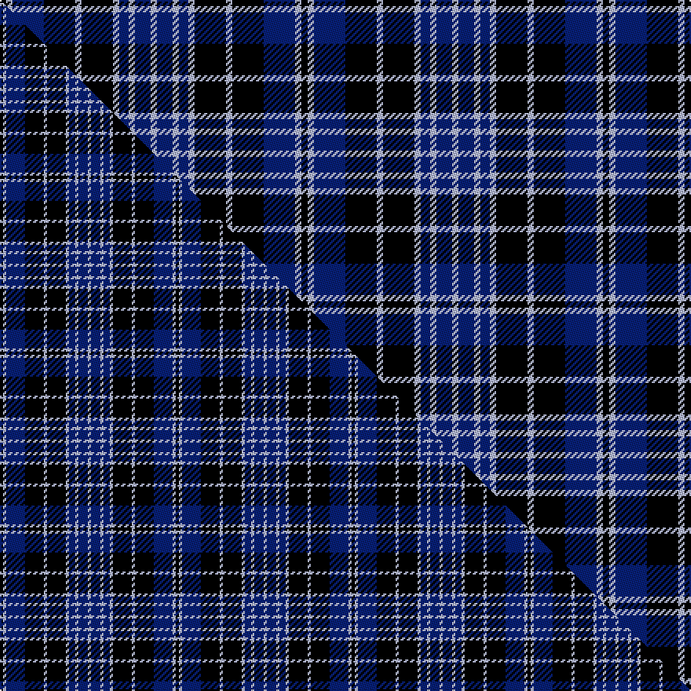

This is one **variant** — a specific cloth: this exact thread count and colourway, with its own
provenance below. It is one weaving of the [sett](/setts/k2lb2db10k10lb2k10lb2db3lb2db5lb2/) (the scale-free proportion — the
same cloth at any scale or shade), whose colour order is pattern [KWBKWKWBWBW](/stripes/kwbkwkwbwbw/).

Part of the [Clergy](/tartans/c/cl/clergy-7/) tartan — the named design grouping this sett with its other cloths.

Sourced from house-of-tartan.  It is a [11 stripe tartan](/stripes/stripes11/).

Original link [http://www.house-of-tartan.scotland.net/house/TartanViewjs.asp?colr=Def&tnam=2195](http://www.house-of-tartan.scotland.net/house/TartanViewjs.asp?colr=Def&tnam=2195)

## Provenance

Earliest known date: 1819 tba

Dataset <small>— provenance for this record, inherited from the source manifest</small>

<dl class="dataset-prov">
<dt>source</dt><dd><a href="/sources/house-of-tartan/">House of Tartan</a></dd>
<dt>data captured from</dt><dd><a href="https://github.com/thetartan/tartan-database/blob/master/data/house-of-tartan/data.csv">https://github.com/thetartan/tartan-database/blob/master/data/house-of-tartan/data.csv</a></dd>
<dt>data date</dt><dd>1819 <small>(this record)</small></dd>
<dt>licence</dt><dd><a href="https://creativecommons.org/licenses/by-nc-nd/4.0/">CC BY-NC-ND 4.0</a></dd>
</dl>

Capture chain <small>— the hands this data passed through, oldest first; each capture carries its own licence</small>

<ol class="capture-chain">
<li><a href="http://www.house-of-tartan.scotland.net/">House of Tartan</a> <small>the weaver/retailer's database — the site is now offline; the URL is kept as the ultimate source's identity</small></li>
<li><a href="https://github.com/thetartan/tartan-database">thetartan/tartan-database</a> <small>2016-2017</small> · <a href="https://creativecommons.org/licenses/by-nc-nd/4.0/">CC BY-NC-ND 4.0</a> <small>Levko Kravets's frozen compilation — the capture we vendored, and where its CC licence text came from</small></li>
<li>this dictionary <small>captured 2026-06-10 · commit 5bf86c7566</small> <small>each re-capture is a git commit to data/sources</small></li>
</ol>

## Thread count
K/4 LB4 DB20 K20 LB4 K20 LB4 DB6 LB4 DB10 LB/4

One full sett is **192 threads**.

## Palette
<table><thead><tr><th>Colour</th><th>Shade</th><th>OKLCh</th></tr></thead><tbody><tr><td>LB</td><td><code style="background-color:#B5BBDE;">#B5BBDE</code> <small style="color:#888">#B5BBDE</small></td><td><small style="color:#888">oklch(79.9% 0.050 277.6)</small></td></tr><tr><td>DB</td><td><code style="background-color:#082077;">#082077</code> <small style="color:#888">#082077</small></td><td><small style="color:#888">oklch(30.0% 0.149 265.1)</small></td></tr><tr><td>K</td><td><code style="background-color:#000000;">#000000</code> <small style="color:#888">#000000</small></td><td><small style="color:#888">oklch(0.0% 0.000 0.0)</small></td></tr></tbody></table>

# Sample pattern

## Compared to the master

This cloth is one sett of its design; the master sett (the exemplar the design is anchored on) is below for comparison.

Its **ΔTartan distance** from the master is **0.20** — the same measure the nearest-tartans table ranks by (0 is identical; a re-scale of the same cloth is near 0, a recolour or a different proportion further).

<figure class="master-compare" style="margin:0">

this sett
master sett ★

<figcaption style="color:#888;font-size:smaller">One weave of this sett against the <a href="/setts/k1lb1db6k6lb1k6lb1db2lb1db3lb1/">master sett ★</a>, split on the diagonal: a shared proportion runs seamlessly across it with only the shades shifting; a different proportion breaks on it.</figcaption>
</figure>

## Nearest tartan variants

The nearest existing variants by ΔTartan distance, with this cloth at the top so the swatches line up against it.

ΔTartan

Threads

Variant

Sett

—

192

<a href="/variants/s11/k2lb2db10k10lb2k10lb2db3lb2db5lb2~x2/">Clergy Blue Tartan</a>

<a href="/ttd/edit/#slug=k1lb1db6k6lb1k6lb1db2lb1db3lb1~x2&amp;base=k2lb2db10k10lb2k10lb2db3lb2db5lb2~x2" title="compare in the TTD">0.20</a>

112

<a href="/variants/s11/k1lb1db6k6lb1k6lb1db2lb1db3lb1~x2/">Clergy (Smith)</a>

<a href="/ttd/edit/#slug=k1lb1db6k6lb1k6lb1db2lb1db3lb1~x4&amp;base=k2lb2db10k10lb2k10lb2db3lb2db5lb2~x2" title="compare in the TTD">0.20</a>

224

<a href="/variants/s11/k1lb1db6k6lb1k6lb1db2lb1db3lb1~x4/">Clergy (Smith)</a>

<a href="/ttd/edit/#slug=k4lb4db14k15lb4k15lb4db7lb4db10lb4~x2&amp;base=k2lb2db10k10lb2k10lb2db3lb2db5lb2~x2" title="compare in the TTD">0.28</a>

324

<a href="/variants/s11/k4lb4db14k15lb4k15lb4db7lb4db10lb4~x2/">Clark (Clerke/Clergy/Priest)</a>

<a href="/ttd/edit/#slug=k4w4db19k19w4k19w4db7w4db11w4~x2&amp;base=k2lb2db10k10lb2k10lb2db3lb2db5lb2~x2" title="compare in the TTD">1.11</a>

380

<a href="/variants/s11/k4w4db19k19w4k19w4db7w4db11w4~x2/">Clark Family Tartan</a>

<a href="/ttd/edit/#slug=db4w4db19k19w4k19w4db7w4db11w4~x2&amp;base=k2lb2db10k10lb2k10lb2db3lb2db5lb2~x2" title="compare in the TTD">1.21</a>

380

<a href="/variants/s11/db4w4db19k19w4k19w4db7w4db11w4~x2/">Clark</a>

<a href="/ttd/edit/#slug=k1lb1db6k6lp1k6lb1db2lb1db3lb1~x2&amp;base=k2lb2db10k10lb2k10lb2db3lb2db5lb2~x2" title="compare in the TTD">1.21</a>

112

<a href="/variants/s11/k1lb1db6k6lp1k6lb1db2lb1db3lb1~x2/">Clergy &quot;Two Spirit&quot; (Personal)</a>

<a href="/ttd/edit/#slug=k3lo2b14k14lb2k14lb2b6lb2b16lb3~x2&amp;base=k2lb2db10k10lb2k10lb2db3lb2db5lb2~x2" title="compare in the TTD">1.58</a>

300

<a href="/variants/s11/k3lo2b14k14lb2k14lb2b6lb2b16lb3~x2/">Immanuel Presbyterian Church (Corp)</a>

<a href="/ttd/edit/#slug=db2y1db7w1k7w2~x6&amp;base=k2lb2db10k10lb2k10lb2db3lb2db5lb2~x2" title="compare in the TTD">2.21</a>

216

<a href="/variants/s6/db2y1db7w1k7w2~x6/">Hawick Rugby Club</a>

<a href="/ttd/edit/#slug=k2g2db10k10g2k10g2db3g2db5g2~x2&amp;base=k2lb2db10k10lb2k10lb2db3lb2db5lb2~x2" title="compare in the TTD">2.50</a>

192

<a href="/variants/s11/k2g2db10k10g2k10g2db3g2db5g2~x2/">Clergy (Clark) (Clan)</a>

<a href="/ttd/edit/#slug=db1g1db6k6g1k6g1db2g1db3g1~x2&amp;base=k2lb2db10k10lb2k10lb2db3lb2db5lb2~x2" title="compare in the TTD">2.56</a>

112

<a href="/variants/s11/db1g1db6k6g1k6g1db2g1db3g1~x2/">Clergy</a>

## Neighbour map

Every grey dot is one of 13621 variants placed by the first two principal components of the ΔTartan feature space (42% of its variance). Red is this tartan; blue dots are its nearest — click one to open its page.

<svg viewBox="0 0 640 380" role="img" style="max-width:100%;height:auto;border:1px solid #e0e0e0;border-radius:4px;display:block" xmlns="http://www.w3.org/2000/svg"><image href="/nn/cloud.v1.png" width="640" height="380"/><a href="/variants/s11/k1lb1db6k6lb1k6lb1db2lb1db3lb1~x2/"><circle cx="195.2" cy="203.6" r="4" fill="#3465a4"><title>Clergy (Smith)</title></circle></a><a href="/variants/s11/k1lb1db6k6lb1k6lb1db2lb1db3lb1~x4/"><circle cx="195.2" cy="203.6" r="4" fill="#3465a4"><title>Clergy (Smith)</title></circle></a><a href="/variants/s11/k4lb4db14k15lb4k15lb4db7lb4db10lb4~x2/"><circle cx="134.9" cy="242.5" r="4" fill="#3465a4"><title>Clark (Clerke/Clergy/Priest)</title></circle></a><a href="/variants/s11/k4w4db19k19w4k19w4db7w4db11w4~x2/"><circle cx="154.5" cy="218.0" r="4" fill="#3465a4"><title>Clark Family Tartan</title></circle></a><a href="/variants/s11/db4w4db19k19w4k19w4db7w4db11w4~x2/"><circle cx="152.1" cy="218.8" r="4" fill="#3465a4"><title>Clark</title></circle></a><a href="/variants/s11/k1lb1db6k6lp1k6lb1db2lb1db3lb1~x2/"><circle cx="175.8" cy="189.9" r="4" fill="#3465a4"><title>Clergy &quot;Two Spirit&quot; (Personal)</title></circle></a><a href="/variants/s11/k3lo2b14k14lb2k14lb2b6lb2b16lb3~x2/"><circle cx="187.3" cy="178.4" r="4" fill="#3465a4"><title>Immanuel Presbyterian Church (Corp)</title></circle></a><a href="/variants/s6/db2y1db7w1k7w2~x6/"><circle cx="178.8" cy="193.6" r="4" fill="#3465a4"><title>Hawick Rugby Club</title></circle></a><a href="/variants/s11/k2g2db10k10g2k10g2db3g2db5g2~x2/"><circle cx="190.0" cy="219.8" r="4" fill="#3465a4"><title>Clergy (Clark) (Clan)</title></circle></a><a href="/variants/s11/db1g1db6k6g1k6g1db2g1db3g1~x2/"><circle cx="199.9" cy="210.1" r="4" fill="#3465a4"><title>Clergy</title></circle></a><circle cx="176.1" cy="214.6" r="5" fill="#c00000"/><text x="320" y="376" text-anchor="middle" font-size="11" fill="#999">ground</text><text x="11" y="190" text-anchor="middle" font-size="11" fill="#999" transform="rotate(-90 11 190)">complexity</text></svg>

ID: /variants/s11/k2lb2db10k10lb2k10lb2db3lb2db5lb2~x2/
