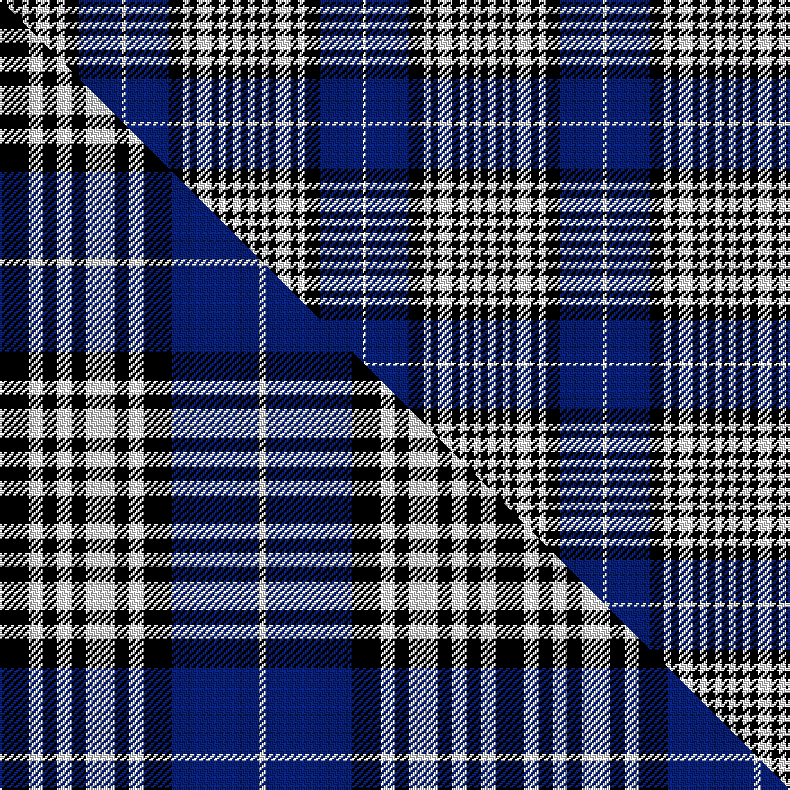

This page is one **sett** — a single exact thread-count. It belongs to the [tartan](/setts/k2w2k2w2k2w4k2w2k4db12w1/)
(the same proportion at any scale), whose colour order is pattern [KWKWKWKWKBW](/stripes/kwkwkwkwkbw/).

Part of the [Napier](/tartans/napier/) tartan — the named design grouping this sett with its other cloths.

Sourced from weddslist.  It is a [11 stripe tartan](/stripes/stripes11/).

Original link http://www.weddslist.com/cgi-bin/tartans/pg.pl?source=rb

## Thread count
K/4 W4 K4 W4 K4 W8 K4 W4 K8 DB24 W/2

One full sett is **134 threads**.

## Palette
<table><thead><tr><th>Colour</th><th>Shade</th><th>OKLCh</th></tr></thead><tbody><tr><td>DB</td><td><code style="background-color:#082077;">#082077</code> <small style="color:#888">#082077</small></td><td><small style="color:#888">oklch(30.0% 0.149 265.1)</small></td></tr><tr><td>K</td><td><code style="background-color:#000000;">#000000</code> <small style="color:#888">#000000</small></td><td><small style="color:#888">oklch(0.0% 0.000 0.0)</small></td></tr><tr><td>W</td><td><code style="background-color:#F7F7F7;">#F7F7F7</code> <small style="color:#888">#F7F7F7</small></td><td><small style="color:#888">oklch(97.6% 0.000 89.9)</small></td></tr></tbody></table>

# Sample pattern

## Compared to the master

This cloth is one sett of its design; the master sett (the exemplar the design is anchored on) is below for comparison.

Its **ΔTartan distance** from the master is **0.37** — the same measure the nearest-tartans table ranks by (0 is identical; a re-scale of the same cloth is near 0, a recolour or a different proportion further).

<figure class="master-compare" style="margin:0">

this sett
master sett ★

<figcaption style="color:#888;font-size:smaller">One weave of this sett against the <a href="/setts/k4w2k2w2k2w4k2w2k4db12w1/">master sett ★</a>, split on the diagonal: a shared proportion runs seamlessly across it with only the shades shifting; a different proportion breaks on it.</figcaption>
</figure>

## Nearest variants

The nearest existing variants by ΔTartan distance, with this cloth at the top so the swatches line up against it.

ΔTartan

Threads

Variant

Sett

—

134

<a href="/variants/s11/k2w2k2w2k2w4k2w2k4db12w1~x2/">Napier</a>

<a href="/ttd/edit/#slug=k4w2k2w2k2w4k2w2k4db12w1~x4&amp;base=k2w2k2w2k2w4k2w2k4db12w1~x2" title="compare in the TTD">0.13</a>

276

<a href="/variants/s11/k4w2k2w2k2w4k2w2k4db12w1~x4/">Napier</a>

<a href="/ttd/edit/#slug=k4w2k2w2k2w4k2w2k4db12w1~x2&amp;base=k2w2k2w2k2w4k2w2k4db12w1~x2" title="compare in the TTD">0.13</a>

138

<a href="/variants/s11/k4w2k2w2k2w4k2w2k4db12w1~x2/">Napier</a>

<a href="/ttd/edit/#slug=k9w8k8w8r5w18k5w5k12db36r5&amp;base=k2w2k2w2k2w4k2w2k4db12w1~x2" title="compare in the TTD">2.41</a>

224

<a href="/variants/s11/k9w8k8w8r5w18k5w5k12db36r5/">Merchiston Castle School</a>

<a href="/ttd/edit/#slug=k12w6k6w6r4w13k3w4k8db24r3~x2&amp;base=k2w2k2w2k2w4k2w2k4db12w1~x2" title="compare in the TTD">2.43</a>

326

<a href="/variants/s11/k12w6k6w6r4w13k3w4k8db24r3~x2/">Merchiston Castle School Pipe Band</a>

<a href="/ttd/edit/#slug=k18w8k8w8r5w18k5w5k12db36r5~x2&amp;base=k2w2k2w2k2w4k2w2k4db12w1~x2" title="compare in the TTD">2.49</a>

466

<a href="/variants/s11/k18w8k8w8r5w18k5w5k12db36r5~x2/">Merchiston, Castle School Pipers</a>

<a href="/ttd/edit/#slug=k18w8k8w8r5w18k5w5k12db36r5&amp;base=k2w2k2w2k2w4k2w2k4db12w1~x2" title="compare in the TTD">2.49</a>

233

<a href="/variants/s11/k18w8k8w8r5w18k5w5k12db36r5/">Merchiston Castle School</a>

<a href="/ttd/edit/#slug=k4lr4t29k29lr4k29lr4t6lr4t14lr4~x2~lr2800000-t2503227&amp;base=k2w2k2w2k2w4k2w2k4db12w1~x2" title="compare in the TTD">2.62</a>

508

<a href="/variants/s11/k4lr4t29k29lr4k29lr4t6lr4t14lr4~x2~lr2800000-t2503227/">Clergy (Corporate)</a>

<a href="/ttd/edit/#slug=k14w2k3w2b10w32b10k10w2k3~x2&amp;base=k2w2k2w2k2w4k2w2k4db12w1~x2" title="compare in the TTD">2.71</a>

318

<a href="/variants/s10/k14w2k3w2b10w32b10k10w2k3~x2/">Fraser, Arisaid</a>

<a href="/ttd/edit/#slug=w4r1db18k6w5k4w4k4w3k2r1db2~x2&amp;base=k2w2k2w2k2w4k2w2k4db12w1~x2" title="compare in the TTD">2.97</a>

204

<a href="/variants/s12/w4r1db18k6w5k4w4k4w3k2r1db2~x2/">Knights Templar St Andrews Corporate Tartan</a>

## Neighbour map

Every grey dot is one of 13620 variants placed by the first two principal components of the ΔTartan feature space (42% of its variance). Red is this tartan; blue dots are its nearest — click one to open its page.

<svg viewBox="0 0 640 380" role="img" style="max-width:100%;height:auto;border:1px solid #e0e0e0;border-radius:4px;display:block" xmlns="http://www.w3.org/2000/svg"><image href="/nn/cloud.v1.png" width="640" height="380"/><a href="/variants/s11/k4w2k2w2k2w4k2w2k4db12w1~x4/"><circle cx="167.1" cy="170.8" r="4" fill="#3465a4"><title>Napier</title></circle></a><a href="/variants/s11/k4w2k2w2k2w4k2w2k4db12w1~x2/"><circle cx="167.1" cy="170.8" r="4" fill="#3465a4"><title>Napier</title></circle></a><a href="/variants/s11/k9w8k8w8r5w18k5w5k12db36r5/"><circle cx="92.9" cy="175.3" r="4" fill="#3465a4"><title>Merchiston Castle School</title></circle></a><a href="/variants/s11/k12w6k6w6r4w13k3w4k8db24r3~x2/"><circle cx="90.7" cy="178.2" r="4" fill="#3465a4"><title>Merchiston Castle School Pipe Band</title></circle></a><a href="/variants/s11/k18w8k8w8r5w18k5w5k12db36r5~x2/"><circle cx="93.5" cy="178.3" r="4" fill="#3465a4"><title>Merchiston, Castle School Pipers</title></circle></a><a href="/variants/s11/k18w8k8w8r5w18k5w5k12db36r5/"><circle cx="93.5" cy="178.3" r="4" fill="#3465a4"><title>Merchiston Castle School</title></circle></a><a href="/variants/s11/k4lr4t29k29lr4k29lr4t6lr4t14lr4~x2~lr2800000-t2503227/"><circle cx="209.5" cy="186.3" r="4" fill="#3465a4"><title>Clergy (Corporate)</title></circle></a><a href="/variants/s10/k14w2k3w2b10w32b10k10w2k3~x2/"><circle cx="196.3" cy="146.0" r="4" fill="#3465a4"><title>Fraser, Arisaid</title></circle></a><a href="/variants/s12/w4r1db18k6w5k4w4k4w3k2r1db2~x2/"><circle cx="151.1" cy="126.5" r="4" fill="#3465a4"><title>Knights Templar St Andrews Corporate Tartan</title></circle></a><circle cx="159.1" cy="167.5" r="5" fill="#c00000"/><text x="320" y="376" text-anchor="middle" font-size="11" fill="#999">ground</text><text x="11" y="190" text-anchor="middle" font-size="11" fill="#999" transform="rotate(-90 11 190)">complexity</text></svg>

ID: /variants/s11/k2w2k2w2k2w4k2w2k4db12w1~x2/
