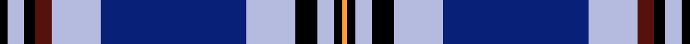
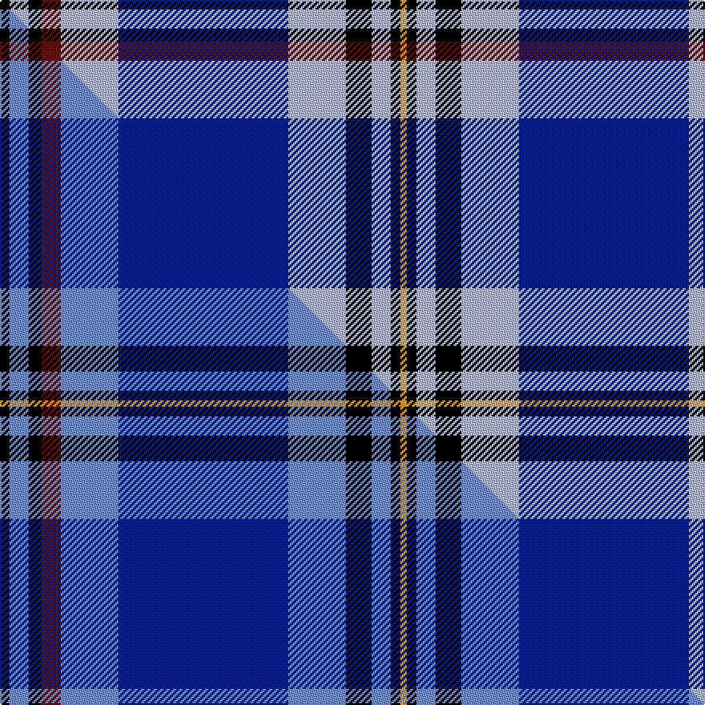

This page is one **sett** — a single exact thread-count. It belongs to the [tartan](/setts/k3lb6k4dr6lb18db53lb18k8lb6k3lo2/)
(the same proportion at any scale), whose colour order is pattern [KWKBWBWKWKY](/stripes/kwkbwbwkwky/).

Part of the [Australia 2000](/tartans/australia-2000/) tartan — the named design grouping this sett with its other cloths.

Sourced from tartans-authority.  It is a [11 stripe tartan](/stripes/stripes11/).

Original link http://www.tartansauthority.com/tartan-ferret/display/4148/

## Register references

External register numbers recorded for this tartan.

- Scottish Tartans Authority (ITI): 4148

## Thread count
K/6 LB12 K8 DR12 LB36 DB106 LB36 K16 LB12 K6 LO/4

One full sett is **498 threads**.

## Palette
<table><thead><tr><th>Colour</th><th>Shade</th><th>OKLCh</th></tr></thead><tbody><tr><td>LB</td><td><code style="background-color:#B5BBDE;">#B5BBDE</code> <small style="color:#888">#B5BBDE</small></td><td><small style="color:#888">oklch(79.9% 0.050 277.6)</small></td></tr><tr><td>DB</td><td><code style="background-color:#082077;">#082077</code> <small style="color:#888">#082077</small></td><td><small style="color:#888">oklch(30.0% 0.149 265.1)</small></td></tr><tr><td>DR</td><td><code style="background-color:#55120C;">#55120C</code> <small style="color:#888">#55120C</small></td><td><small style="color:#888">oklch(30.0% 0.099 29.3)</small></td></tr><tr><td>LO</td><td><code style="background-color:#FF9C34;">#FF9C34</code> <small style="color:#888">#FF9C34</small></td><td><small style="color:#888">oklch(77.9% 0.161 61.8)</small></td></tr><tr><td>K</td><td><code style="background-color:#000000;">#000000</code> <small style="color:#888">#000000</small></td><td><small style="color:#888">oklch(0.0% 0.000 0.0)</small></td></tr></tbody></table>

# Sample pattern

## Compared to the master

This cloth is one sett of its design; the master sett (the exemplar the design is anchored on) is below for comparison.

Its **ΔTartan distance** from the master is **0.82** — the same measure the nearest-tartans table ranks by (0 is identical; a re-scale of the same cloth is near 0, a recolour or a different proportion further).

<figure class="master-compare" style="margin:0">

this sett
master sett ★

<figcaption style="color:#888;font-size:smaller">One weave of this sett against the <a href="/setts/k3b6k4dr6b18db53b18k8b6k3lo2/">master sett ★</a>, split on the diagonal: a shared proportion runs seamlessly across it with only the shades shifting; a different proportion breaks on it.</figcaption>
</figure>

## Nearest variants

The nearest existing variants by ΔTartan distance, with this cloth at the top so the swatches line up against it.

ΔTartan

Threads

Variant

Sett

—

498

<a href="/variants/s11/k3lb6k4dr6lb18db53lb18k8lb6k3lo2~x2/">Australia 2000 (Fashion)</a>

<a href="/ttd/edit/#slug=k3b6k4dr6b18db53b18k8b6k3lo2~x2~b2603265&amp;base=k3lb6k4dr6lb18db53lb18k8lb6k3lo2~x2" title="compare in the TTD">0.00</a>

498

<a href="/variants/s11/k3b6k4dr6b18db53b18k8b6k3lo2~x2~b2603265/">Australia 2000</a>

## Neighbour map

Every grey dot is one of 13620 variants placed by the first two principal components of the ΔTartan feature space (42% of its variance). Red is this tartan; blue dots are its nearest — click one to open its page.

<svg viewBox="0 0 640 380" role="img" style="max-width:100%;height:auto;border:1px solid #e0e0e0;border-radius:4px;display:block" xmlns="http://www.w3.org/2000/svg"><image href="/nn/cloud.v1.png" width="640" height="380"/><a href="/variants/s11/k3b6k4dr6b18db53b18k8b6k3lo2~x2~b2603265/"><circle cx="229.3" cy="100.0" r="4" fill="#3465a4"><title>Australia 2000</title></circle></a><circle cx="207.4" cy="93.8" r="5" fill="#c00000"/><text x="320" y="376" text-anchor="middle" font-size="11" fill="#999">ground</text><text x="11" y="190" text-anchor="middle" font-size="11" fill="#999" transform="rotate(-90 11 190)">complexity</text></svg>

ID: /variants/s11/k3lb6k4dr6lb18db53lb18k8lb6k3lo2~x2/
