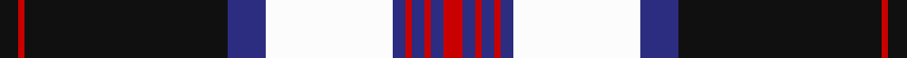

This is one **variant** — a specific cloth: this exact thread count and colourway, with its own
provenance below. It is one weaving of the [sett](/tartans/a/an/angus-dress-1992/) (the scale-free proportion — the
same cloth at any scale or shade), whose colour order is pattern [KRKBWBRBRBR](/stripes/krkbwbrbrbr/).

Part of the [Angus Dress 1992](/tartans/a/an/angus-dress-1992/) tartan — the named design grouping this sett with its other cloths.

Sourced from register-of-tartans.  It is a [11 stripe tartan](/stripes/stripes11/).

Original link [https://www.tartanregister.gov.uk/tartanDetails.aspx?ref=90](https://www.tartanregister.gov.uk/tartanDetails.aspx?ref=90)

3 attestations — the source records this cloth was collapsed from (oldest owns this page)

<ul>
<li>01/05/1992 — Angus Dress 1992 (Dance) (register-of-tartans, <a href="https://www.tartanregister.gov.uk/tartanDetails.aspx?ref=90">record</a>)  <em>Made for Highland dance competition in 1992. A modification of the Angus Tartan found in W.A.K.Johnston's 'Tartans of the Clans & Septs of Scotland' 1906 (#1179, original Scottish Tartans Authority reference). Source said to be Kati Reeder Meek (USA). Scottish Tartans Society classify as 'District' but Scottish Tartans Authority regards as 'Fashion' until documentary evidence of official acceptance is provided. Thread count and colours confirmed to Scottish Tartans Authority by Kati Meek 23 June 2004.</em></li>
<li>May 1992 — Angus Dress 1992 (Dance) (tartans-authority, <a href="https://web.archive.org/web/*/http://www.tartansauthority.com/tartan-ferret/display/2473/*">record</a>)  <em>Made for Highland dance competition in 1992. A modification of the Angus Tartan found in W.A.K.Johnston's 'Tartans of the Clans & Septs of Scotland' 1906. (# 1179) . Source said to be Kati Reeder Meek (USA) STS classify as 'District' but STA regards as 'Dance' until documentary evidence of official acceptance is provided. Thread count and colours confirmed to BW by Kati Meek 23 June 2004,</em></li>
<li>undated — Angus dress (weddslist, <a href="http://www.weddslist.com/cgi-bin/tartans/pg.pl?source=sts">record</a>) </li>
</ul>

Dataset <small>— provenance for this record, inherited from the source manifest</small>

<dl class="dataset-prov">
<dt>source</dt><dd><a href="/sources/register-of-tartans/">Scottish Register of Tartans</a></dd>
<dt>data captured from</dt><dd><a href="https://github.com/thetartan/tartan-database/blob/master/data/register-of-tartans/data.csv">https://github.com/thetartan/tartan-database/blob/master/data/register-of-tartans/data.csv</a></dd>
<dt>data date</dt><dd>01/05/1992 <small>(this record)</small></dd>
<dt>licence</dt><dd><a href="https://www.tartanregister.gov.uk/copyright">Crown copyright</a></dd>
</dl>

Capture chain <small>— the hands this data passed through, oldest first; each capture carries its own licence</small>

<ol class="capture-chain">
<li><a href="https://www.tartanregister.gov.uk/">Scottish Register of Tartans</a> · <a href="https://www.tartanregister.gov.uk/copyright">Crown copyright</a> <small>the living register — still published by National Records of Scotland</small></li>
<li><a href="https://github.com/thetartan/tartan-database">thetartan/tartan-database</a> <small>2016-2017</small> · <a href="https://creativecommons.org/licenses/by-nc-nd/4.0/">CC BY-NC-ND 4.0</a> <small>Levko Kravets's frozen compilation — the capture we vendored, and where its CC licence text came from</small></li>
<li>this dictionary <small>captured 2026-06-10 · commit 5bf86c7566</small> <small>each re-capture is a git commit to data/sources</small></li>
</ol>

## Register references

External register numbers recorded for this tartan.

- Scottish Register of Tartans: [90](https://www.tartanregister.gov.uk/tartanDetails.aspx?ref=90)
- Scottish Tartans Authority (ITI): 2473
- Scottish Tartans World Register: 2473

## Thread count
K/6 R2 K64 DB12 W40 DB4 R2 DB4 R2 DB4 R/6

One full sett is **280 threads**.

## Palette
<table><thead><tr><th>Colour</th><th>Shade</th><th>OKLCh</th></tr></thead><tbody><tr><td>DB</td><td><code style="background-color:#082077;">#082077</code> <small style="color:#888">#082077</small></td><td><small style="color:#888">oklch(30.0% 0.149 265.1)</small></td></tr><tr><td>K</td><td><code style="background-color:#000000;">#000000</code> <small style="color:#888">#000000</small></td><td><small style="color:#888">oklch(0.0% 0.000 0.0)</small></td></tr><tr><td>R</td><td><code style="background-color:#D60020;">#D60020</code> <small style="color:#888">#D60020</small></td><td><small style="color:#888">oklch(55.2% 0.224 25.5)</small></td></tr><tr><td>W</td><td><code style="background-color:#F7F7F7;">#F7F7F7</code> <small style="color:#888">#F7F7F7</small></td><td><small style="color:#888">oklch(97.6% 0.000 89.9)</small></td></tr></tbody></table>

# Sample pattern

## Nearest tartan variants

The nearest existing variants by ΔTartan distance, with this cloth at the top so the swatches line up against it.

ΔTartan

Threads

Variant

Sett

—

280

<a href="/variants/s11/k3r1k32db6w20db2r1db2r1db2r3~x2/">Angus Dress 1992 (Dance)</a>

<a href="/ttd/edit/#slug=lb7k2n2k18lb2k4lb6k2lb1~x4&amp;base=k3r1k32db6w20db2r1db2r1db2r3~x2" title="compare in the TTD">2.51</a>

320

<a href="/variants/s9/lb7k2n2k18lb2k4lb6k2lb1~x4/">Wcwm 972-2</a>

<a href="/ttd/edit/#slug=lo4k1lo3db1lo1db2k6lo4db2k6lo7k6db29lo2~x4&amp;base=k3r1k32db6w20db2r1db2r1db2r3~x2" title="compare in the TTD">2.67</a>

568

<a href="/variants/s14/lo4k1lo3db1lo1db2k6lo4db2k6lo7k6db29lo2~x4/">Agincourt (Fashion)</a>

<a href="/ttd/edit/#slug=k30n33k1ly1k1n8k1ly2k1n3k1ly3w2k1ly7~x2&amp;base=k3r1k32db6w20db2r1db2r1db2r3~x2" title="compare in the TTD">2.74</a>

306

<a href="/variants/s15/k30n33k1ly1k1n8k1ly2k1n3k1ly3w2k1ly7~x2/">Black Onyx</a>

<a href="/ttd/edit/#slug=k9o2k2n2o18n2k2r1k20n33r2~x2~o62-n47&amp;base=k3r1k32db6w20db2r1db2r1db2r3~x2" title="compare in the TTD">2.74</a>

350

<a href="/variants/s11/k9o2k2n2o18n2k2r1k20n33r2~x2~o62-n47/">Pride of Scotland Silver</a>

<a href="/ttd/edit/#slug=db8k1o1k1db22o1k14o1w2o1w6k3o1w3o1~x2&amp;base=k3r1k32db6w20db2r1db2r1db2r3~x2" title="compare in the TTD">2.78</a>

246

<a href="/variants/s15/db8k1o1k1db22o1k14o1w2o1w6k3o1w3o1~x2/">Anderson Blue</a>

<a href="/ttd/edit/#slug=k6db49g10k2g10k2lr26k2g2~x2&amp;base=k3r1k32db6w20db2r1db2r1db2r3~x2" title="compare in the TTD">2.83</a>

420

<a href="/variants/s9/k6db49g10k2g10k2lr26k2g2~x2/">Madras 3 (Fashion)</a>

<a href="/ttd/edit/#slug=k5r1w2r1k26r3ly1n10w1r3w1n10w1r3~x2&amp;base=k3r1k32db6w20db2r1db2r1db2r3~x2" title="compare in the TTD">2.99</a>

256

<a href="/variants/s14/k5r1w2r1k26r3ly1n10w1r3w1n10w1r3~x2/">El Dorado Hills P &amp; D (Corporate)</a>

<a href="/ttd/edit/#slug=k5r1w2r1k26r3y1n10w1r3w1n10w1r3~x2&amp;base=k3r1k32db6w20db2r1db2r1db2r3~x2" title="compare in the TTD">3.00</a>

256

<a href="/variants/s14/k5r1w2r1k26r3y1n10w1r3w1n10w1r3~x2/">El Dorado Hills Firefighters Pipes and Drums</a>

<a href="/ttd/edit/#slug=k6lb2n2lb3n2lb2n30k20w6k4~x2&amp;base=k3r1k32db6w20db2r1db2r1db2r3~x2" title="compare in the TTD">3.04</a>

288

<a href="/variants/s10/k6lb2n2lb3n2lb2n30k20w6k4~x2/">Nunavut (District)</a>

<a href="/ttd/edit/#slug=k6lb2n2lb3n2lb2n30k20w6k4~x2~n47&amp;base=k3r1k32db6w20db2r1db2r1db2r3~x2" title="compare in the TTD">3.05</a>

288

<a href="/variants/s10/k6lb2n2lb3n2lb2n30k20w6k4~x2~n47/">Nunavut</a>

## Neighbour map

Every grey dot is one of 13662 variants placed by the first two principal components of the ΔTartan feature space (42% of its variance). Red is this tartan; blue dots are its nearest — click one to open its page. The map is a flat projection of a many-dimensional space — [how to read it](/posts/neighbourhood-maps/).

<svg viewBox="0 0 640 380" role="img" style="max-width:100%;height:auto;border:1px solid #e0e0e0;border-radius:4px;display:block" xmlns="http://www.w3.org/2000/svg"><image href="/nn/cloud.v1.png" width="640" height="380"/><a href="/variants/s9/lb7k2n2k18lb2k4lb6k2lb1~x4/"><circle cx="231.2" cy="90.4" r="4" fill="#3465a4"><title>Wcwm 972-2</title></circle></a><a href="/variants/s14/lo4k1lo3db1lo1db2k6lo4db2k6lo7k6db29lo2~x4/"><circle cx="255.9" cy="98.1" r="4" fill="#3465a4"><title>Agincourt (Fashion)</title></circle></a><a href="/variants/s15/k30n33k1ly1k1n8k1ly2k1n3k1ly3w2k1ly7~x2/"><circle cx="259.3" cy="63.6" r="4" fill="#3465a4"><title>Black Onyx</title></circle></a><a href="/variants/s11/k9o2k2n2o18n2k2r1k20n33r2~x2~o62-n47/"><circle cx="225.3" cy="97.1" r="4" fill="#3465a4"><title>Pride of Scotland Silver</title></circle></a><a href="/variants/s15/db8k1o1k1db22o1k14o1w2o1w6k3o1w3o1~x2/"><circle cx="205.1" cy="85.2" r="4" fill="#3465a4"><title>Anderson Blue</title></circle></a><a href="/variants/s9/k6db49g10k2g10k2lr26k2g2~x2/"><circle cx="224.2" cy="114.3" r="4" fill="#3465a4"><title>Madras 3 (Fashion)</title></circle></a><a href="/variants/s14/k5r1w2r1k26r3ly1n10w1r3w1n10w1r3~x2/"><circle cx="203.4" cy="65.3" r="4" fill="#3465a4"><title>El Dorado Hills P &amp; D (Corporate)</title></circle></a><a href="/variants/s14/k5r1w2r1k26r3y1n10w1r3w1n10w1r3~x2/"><circle cx="203.2" cy="64.8" r="4" fill="#3465a4"><title>El Dorado Hills Firefighters Pipes and Drums</title></circle></a><a href="/variants/s10/k6lb2n2lb3n2lb2n30k20w6k4~x2/"><circle cx="204.9" cy="124.0" r="4" fill="#3465a4"><title>Nunavut (District)</title></circle></a><a href="/variants/s10/k6lb2n2lb3n2lb2n30k20w6k4~x2~n47/"><circle cx="205.7" cy="124.2" r="4" fill="#3465a4"><title>Nunavut</title></circle></a><circle cx="231.3" cy="72.7" r="5" fill="#c00000"/><text x="320" y="376" text-anchor="middle" font-size="11" fill="#999">ground</text><text x="11" y="190" text-anchor="middle" font-size="11" fill="#999" transform="rotate(-90 11 190)">complexity</text></svg>

ID: /variants/s11/k3r1k32db6w20db2r1db2r1db2r3~x2/
