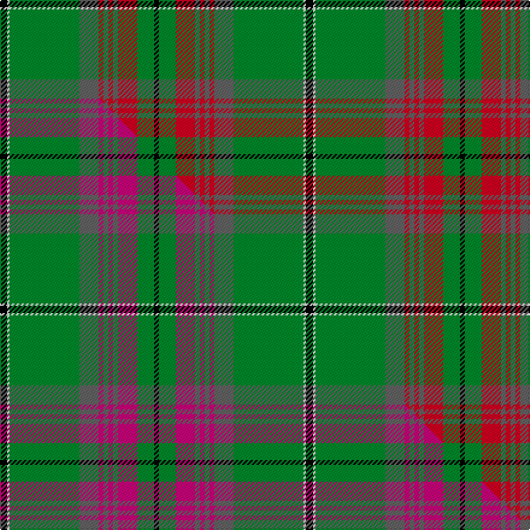

This is one **variant** — a specific cloth: this exact thread count and colourway, with its own
provenance below. It is one weaving of the [sett](/tartans/g/gr/gray-hunting/) (the scale-free proportion — the
same cloth at any scale or shade), whose colour order is pattern [KGRBRBRBGWK](/stripes/kgrbrbrbgwk/).

Part of the [Gray Hunting](/tartans/g/gr/gray-hunting/) tartan — the named design grouping this sett with its other cloths.

Sourced from house-of-tartan.  It is a [11 stripe tartan](/stripes/stripes11/).

Original link [http://www.house-of-tartan.scotland.net/house/TartanViewjs.asp?colr=Def&tnam=1079](http://www.house-of-tartan.scotland.net/house/TartanViewjs.asp?colr=Def&tnam=1079)

## Provenance

Earliest known date: 1990 There is also a Gray tartan designed by Mrs G. Gray some years earlier.

2 attestations — the source records this cloth was collapsed from (oldest owns this page)

<ul>
<li>1990 — Gray Hunting Family Tartan (house-of-tartan, <a href="http://www.house-of-tartan.scotland.net/house/TartanViewjs.asp?colr=Def&tnam=1079">record</a>) </li>
<li>undated — Gray, hunting (weddslist, <a href="http://www.weddslist.com/cgi-bin/tartans/pg.pl?source=sts">record</a>) </li>
</ul>

Dataset <small>— provenance for this record, inherited from the source manifest</small>

<dl class="dataset-prov">
<dt>source</dt><dd><a href="/sources/house-of-tartan/">House of Tartan</a></dd>
<dt>data captured from</dt><dd><a href="https://github.com/thetartan/tartan-database/blob/master/data/house-of-tartan/data.csv">https://github.com/thetartan/tartan-database/blob/master/data/house-of-tartan/data.csv</a></dd>
<dt>data date</dt><dd>1990 <small>(this record)</small></dd>
<dt>licence</dt><dd><a href="https://creativecommons.org/licenses/by-nc-nd/4.0/">CC BY-NC-ND 4.0</a></dd>
</dl>

Capture chain <small>— the hands this data passed through, oldest first; each capture carries its own licence</small>

<ol class="capture-chain">
<li><a href="http://www.house-of-tartan.scotland.net/">House of Tartan</a> <small>the weaver/retailer's database — the site is now offline; the URL is kept as the ultimate source's identity</small></li>
<li><a href="https://github.com/thetartan/tartan-database">thetartan/tartan-database</a> <small>2016-2017</small> · <a href="https://creativecommons.org/licenses/by-nc-nd/4.0/">CC BY-NC-ND 4.0</a> <small>Levko Kravets's frozen compilation — the capture we vendored, and where its CC licence text came from</small></li>
<li>this dictionary <small>captured 2026-06-10 · commit 5bf86c7566</small> <small>each re-capture is a git commit to data/sources</small></li>
</ol>

## Thread count
K/6 W2 G58 N16 R4 N4 R4 N4 R16 G14 K/4

One full sett is **254 threads**.

## Palette
<table><thead><tr><th>Colour</th><th>Shade</th><th>OKLCh</th></tr></thead><tbody><tr><td>G</td><td><code style="background-color:#008B2A;">#008B2A</code> <small style="color:#888">#008B2A</small></td><td><small style="color:#888">oklch(55.4% 0.170 145.9)</small></td></tr><tr><td>K</td><td><code style="background-color:#000000;">#000000</code> <small style="color:#888">#000000</small></td><td><small style="color:#888">oklch(0.0% 0.000 0.0)</small></td></tr><tr><td>W</td><td><code style="background-color:#F7F7F7;">#F7F7F7</code> <small style="color:#888">#F7F7F7</small></td><td><small style="color:#888">oklch(97.6% 0.000 89.9)</small></td></tr><tr><td>N</td><td><code style="background-color:#636363;">#636363</code> <small style="color:#888">#636363</small></td><td><small style="color:#888">oklch(50.0% 0.000 89.9)</small></td></tr><tr><td>R</td><td><code style="background-color:#D60020;">#D60020</code> <small style="color:#888">#D60020</small></td><td><small style="color:#888">oklch(55.2% 0.224 25.5)</small></td></tr></tbody></table>

# Sample pattern

[Sample sheet (PDF)](swatch.pdf) — the woven sample, thread count and palette on one printable A4, rendered on demand (the same sheet the TTD print page downloads).

## Compared to the master

This cloth is one sett of its design; the master sett (the exemplar the design is anchored on) is below for comparison.

Its **ΔTartan distance** from the master is **0.05** — the same measure the nearest-tartans table ranks by (0 is identical; a re-scale of the same cloth is near 0, a recolour or a different proportion further).

<figure class="master-compare" style="margin:0">

this sett
master sett ★

<figcaption style="color:#888;font-size:smaller">One weave of this sett against the <a href="/setts/k3w1g29n8m2n2m2n2m8g7k2/">master sett ★</a>, split on the diagonal: a shared proportion runs seamlessly across it with only the shades shifting; a different proportion breaks on it.</figcaption>
</figure>

## Nearest tartan variants

The nearest existing variants by ΔTartan distance, with this cloth at the top so the swatches line up against it.

ΔTartan

Threads

Variant

Sett

—

254

<a href="/variants/s11/k3w1g29n8r2n2r2n2r8g7k2~x2/">Gray Hunting Family Tartan</a>

<a href="/ttd/edit/#slug=k3w1g29n8m2n2m2n2m8g7k2~x2&amp;base=k3w1g29n8r2n2r2n2r8g7k2~x2" title="compare in the TTD">0.05</a>

254

<a href="/variants/s11/k3w1g29n8m2n2m2n2m8g7k2~x2/">Gray Htg (Name)</a>

<a href="/ttd/edit/#slug=g32w1k3w1gi14g7k3dp3w1~x2~g4808117-gi6019141&amp;base=k3w1g29n8r2n2r2n2r8g7k2~x2" title="compare in the TTD">1.96</a>

194

<a href="/variants/s9/g32w1k3w1gi14g7k3dp3w1~x2~g4808117-gi6019141/">Leach Htg #2 (Name)</a>

<a href="/ttd/edit/#slug=g44r4g2r2g2r4g12k12r2db10r4db4ly3~x2&amp;base=k3w1g29n8r2n2r2n2r8g7k2~x2" title="compare in the TTD">2.42</a>

326

<a href="/variants/s13/g44r4g2r2g2r4g12k12r2db10r4db4ly3~x2/">Cochrane of Dundonald</a>

<a href="/ttd/edit/#slug=lb4dy1g1dr30g22k3g22dr30g1dy1lb4g2~x2&amp;base=k3w1g29n8r2n2r2n2r8g7k2~x2" title="compare in the TTD">2.50</a>

472

<a href="/variants/s12/lb4dy1g1dr30g22k3g22dr30g1dy1lb4g2~x2/">Connemarra Irish District Tartan</a>

<a href="/ttd/edit/#slug=g71k4r4db9r4db4r36db4w4~x2&amp;base=k3w1g29n8r2n2r2n2r8g7k2~x2" title="compare in the TTD">2.68</a>

410

<a href="/variants/s9/g71k4r4db9r4db4r36db4w4~x2/">Rattay</a>

<a href="/ttd/edit/#slug=g71k4r4db9r4db4r36db4w4&amp;base=k3w1g29n8r2n2r2n2r8g7k2~x2" title="compare in the TTD">2.68</a>

205

<a href="/variants/s9/g71k4r4db9r4db4r36db4w4/">Rattray Family Tartan</a>

<a href="/ttd/edit/#slug=g18r1w2k1w2r1o6k2~x4&amp;base=k3w1g29n8r2n2r2n2r8g7k2~x2" title="compare in the TTD">2.83</a>

184

<a href="/variants/s8/g18r1w2k1w2r1o6k2~x4/">Humphries (Name)</a>

<a href="/ttd/edit/#slug=y7n2k2n41k12g22n6k2r4k2~x2&amp;base=k3w1g29n8r2n2r2n2r8g7k2~x2" title="compare in the TTD">2.84</a>

382

<a href="/variants/s10/y7n2k2n41k12g22n6k2r4k2~x2/">Dinwiddie</a>

<a href="/ttd/edit/#slug=ly10k2g3k2g40k2g3dr25g6ly10k1~x2&amp;base=k3w1g29n8r2n2r2n2r8g7k2~x2" title="compare in the TTD">2.86</a>

394

<a href="/variants/s11/ly10k2g3k2g40k2g3dr25g6ly10k1~x2/">MacMillan Anc (Clans Originaux)</a>

<a href="/ttd/edit/#slug=dy4n2k2n42k13g25n6k2r4k2~x2&amp;base=k3w1g29n8r2n2r2n2r8g7k2~x2" title="compare in the TTD">2.91</a>

396

<a href="/variants/s10/dy4n2k2n42k13g25n6k2r4k2~x2/">Dinwiddie Clan Tartan</a>

## Neighbour map

Every grey dot is one of 13662 variants placed by the first two principal components of the ΔTartan feature space (42% of its variance). Red is this tartan; blue dots are its nearest — click one to open its page. The map is a flat projection of a many-dimensional space — [how to read it](/posts/neighbourhood-maps/).

<svg viewBox="0 0 640 380" role="img" style="max-width:100%;height:auto;border:1px solid #e0e0e0;border-radius:4px;display:block" xmlns="http://www.w3.org/2000/svg"><image href="/nn/cloud.v1.png" width="640" height="380"/><a href="/variants/s11/k3w1g29n8m2n2m2n2m8g7k2~x2/"><circle cx="284.9" cy="92.5" r="4" fill="#3465a4"><title>Gray Htg (Name)</title></circle></a><a href="/variants/s9/g32w1k3w1gi14g7k3dp3w1~x2~g4808117-gi6019141/"><circle cx="338.2" cy="99.9" r="4" fill="#3465a4"><title>Leach Htg #2 (Name)</title></circle></a><a href="/variants/s13/g44r4g2r2g2r4g12k12r2db10r4db4ly3~x2/"><circle cx="269.4" cy="87.7" r="4" fill="#3465a4"><title>Cochrane of Dundonald</title></circle></a><a href="/variants/s12/lb4dy1g1dr30g22k3g22dr30g1dy1lb4g2~x2/"><circle cx="290.0" cy="100.2" r="4" fill="#3465a4"><title>Connemarra Irish District Tartan</title></circle></a><a href="/variants/s9/g71k4r4db9r4db4r36db4w4~x2/"><circle cx="266.5" cy="108.9" r="4" fill="#3465a4"><title>Rattay</title></circle></a><a href="/variants/s9/g71k4r4db9r4db4r36db4w4/"><circle cx="266.5" cy="108.9" r="4" fill="#3465a4"><title>Rattray Family Tartan</title></circle></a><a href="/variants/s8/g18r1w2k1w2r1o6k2~x4/"><circle cx="255.7" cy="116.6" r="4" fill="#3465a4"><title>Humphries (Name)</title></circle></a><a href="/variants/s10/y7n2k2n41k12g22n6k2r4k2~x2/"><circle cx="244.8" cy="115.3" r="4" fill="#3465a4"><title>Dinwiddie</title></circle></a><a href="/variants/s11/ly10k2g3k2g40k2g3dr25g6ly10k1~x2/"><circle cx="277.3" cy="97.2" r="4" fill="#3465a4"><title>MacMillan Anc (Clans Originaux)</title></circle></a><a href="/variants/s10/dy4n2k2n42k13g25n6k2r4k2~x2/"><circle cx="248.0" cy="110.6" r="4" fill="#3465a4"><title>Dinwiddie Clan Tartan</title></circle></a><circle cx="290.0" cy="94.6" r="5" fill="#c00000"/><text x="320" y="376" text-anchor="middle" font-size="11" fill="#999">ground</text><text x="11" y="190" text-anchor="middle" font-size="11" fill="#999" transform="rotate(-90 11 190)">complexity</text></svg>

ID: /variants/s11/k3w1g29n8r2n2r2n2r8g7k2~x2/
