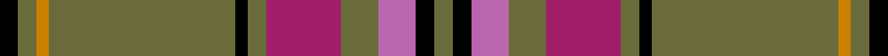

This is one **variant** — a specific cloth: this exact thread count and colourway, with its own
provenance below. It is one weaving of the [sett](/tartans/m/mc/mcalifyfe/) (the scale-free proportion — the
same cloth at any scale or shade), whose colour order is pattern [GKRGRGKGYGK](/stripes/gkrgrgkgygk/).

Part of the [McAlifyfe](/tartans/m/mc/mcalifyfe/) tartan — the named design grouping this sett with its other cloths.

Sourced from register-of-tartans.  It is a [11 stripe tartan](/stripes/stripes11/).

Original link [https://www.tartanregister.gov.uk/tartanDetails.aspx?ref=10203](https://www.tartanregister.gov.uk/tartanDetails.aspx?ref=10203)

Dataset <small>— provenance for this record, inherited from the source manifest</small>

<dl class="dataset-prov">
<dt>source</dt><dd><a href="/sources/register-of-tartans/">Scottish Register of Tartans</a></dd>
<dt>data captured from</dt><dd><a href="https://github.com/thetartan/tartan-database/blob/master/data/register-of-tartans/data.csv">https://github.com/thetartan/tartan-database/blob/master/data/register-of-tartans/data.csv</a></dd>
<dt>data date</dt><dd>04/02/2010 <small>(this record)</small></dd>
<dt>licence</dt><dd><a href="https://www.tartanregister.gov.uk/copyright">Crown copyright</a></dd>
</dl>

Capture chain <small>— the hands this data passed through, oldest first; each capture carries its own licence</small>

<ol class="capture-chain">
<li><a href="https://www.tartanregister.gov.uk/">Scottish Register of Tartans</a> · <a href="https://www.tartanregister.gov.uk/copyright">Crown copyright</a> <small>the living register — still published by National Records of Scotland</small></li>
<li><a href="https://github.com/thetartan/tartan-database">thetartan/tartan-database</a> <small>2016-2017</small> · <a href="https://creativecommons.org/licenses/by-nc-nd/4.0/">CC BY-NC-ND 4.0</a> <small>Levko Kravets's frozen compilation — the capture we vendored, and where its CC licence text came from</small></li>
<li>this dictionary <small>captured 2026-06-10 · commit 5bf86c7566</small> <small>each re-capture is a git commit to data/sources</small></li>
</ol>

## Register references

External register numbers recorded for this tartan.

- Scottish Register of Tartans: [10203](https://www.tartanregister.gov.uk/tartanDetails.aspx?ref=10203)

## Thread count
K/6 Y6 LO4 Y60 K4 Y6 M24 Y12 Mi12 K6 Y/6

One full sett is **280 threads**.

## Palette
<table><thead><tr><th>Colour</th><th>Shade</th><th>OKLCh</th></tr></thead><tbody><tr><td>LO</td><td><code style="background-color:#CB8000;">#CB8000</code> <small style="color:#888">#CB8000</small></td><td><small style="color:#888">oklch(66.3% 0.144 69.1)</small></td></tr><tr><td>Y</td><td><code style="background-color:#696B3A;">#696B3A</code> <small style="color:#888">#696B3A</small></td><td><small style="color:#888">oklch(51.4% 0.070 110.7)</small></td></tr><tr><td>K</td><td><code style="background-color:#000000;">#000000</code> <small style="color:#888">#000000</small></td><td><small style="color:#888">oklch(0.0% 0.000 0.0)</small></td></tr><tr><td>M</td><td><code style="background-color:#B966AE;">#B966AE</code> <small style="color:#888">#B966AE</small></td><td><small style="color:#888">oklch(62.9% 0.140 332.2)</small></td></tr><tr><td>M</td><td><code style="background-color:#A01D69;">#A01D69</code> <small style="color:#888">#A01D69</small></td><td><small style="color:#888">oklch(47.8% 0.178 351.0)</small></td></tr></tbody></table>

# Sample pattern

## Nearest tartan variants

The nearest existing variants by ΔTartan distance, with this cloth at the top so the swatches line up against it.

ΔTartan

Threads

Variant

Sett

—

280

<a href="/variants/s11/k3y3lo2y30k2y3m12y6mi6k3y3~x2~y2103114-lo2706066-m1907352-mi2506332/">McAlifyfe (Personal)</a>

<a href="/ttd/edit/#slug=n19do2k3o1k1w1k1do6n3k1n6~x4&amp;base=k3y3lo2y30k2y3m12y6mi6k3y3~x2~y2103114-lo2706066-m1907352-mi2506332" title="compare in the TTD">1.98</a>

252

<a href="/variants/s11/n19do2k3o1k1w1k1do6n3k1n6~x4/">Glen Clova #1</a>

<a href="/ttd/edit/#slug=k1dr14g1dr1g6lr2g6dr1g1dr14k1lb1~x4~lr3200000-lb3103284&amp;base=k3y3lo2y30k2y3m12y6mi6k3y3~x2~y2103114-lo2706066-m1907352-mi2506332" title="compare in the TTD">2.19</a>

384

<a href="/variants/s12/k1dr14g1dr1g6lbi2g6dr1g1dr14k1lb1~x4~lbi3200000-lb3103284/">MacMaster Clan/Family Tartan</a>

<a href="/ttd/edit/#slug=n16w1n1k1n8ly4r2w2r2~x4&amp;base=k3y3lo2y30k2y3m12y6mi6k3y3~x2~y2103114-lo2706066-m1907352-mi2506332" title="compare in the TTD">2.68</a>

224

<a href="/variants/s9/n16w1n1k1n8ly4r2w2r2~x4/">Middleton, City of</a>

<a href="/ttd/edit/#slug=k2lr1dr2g6dr2db4dr2k2dr15g2dr2k1~x4&amp;base=k3y3lo2y30k2y3m12y6mi6k3y3~x2~y2103114-lo2706066-m1907352-mi2506332" title="compare in the TTD">2.73</a>

316

<a href="/variants/s12/k2lr1dr2g6dr2db4dr2k2dr15g2dr2k1~x4/">MacClure Clan/Family Tartan</a>

<a href="/ttd/edit/#slug=db8o27y2r3y2o27db22k2db4k2db4k4~x2&amp;base=k3y3lo2y30k2y3m12y6mi6k3y3~x2~y2103114-lo2706066-m1907352-mi2506332" title="compare in the TTD">2.83</a>

404

<a href="/variants/s12/db8o27y2r3y2o27db22k2db4k2db4k4~x2/">Falkirk</a>

<a href="/ttd/edit/#slug=lr2g6dr1g1dr14k1lb1~x4~lr3200000-lb3103284&amp;base=k3y3lo2y30k2y3m12y6mi6k3y3~x2~y2103114-lo2706066-m1907352-mi2506332" title="compare in the TTD">2.92</a>

196

<a href="/variants/s7/lbi2g6dr1g1dr14k1lb1~x4~lbi3200000-lb3103284/">MacMaster (USA) #1</a>

<a href="/ttd/edit/#slug=o28k2o28k2o2k2do29k2r2k2~x2&amp;base=k3y3lo2y30k2y3m12y6mi6k3y3~x2~y2103114-lo2706066-m1907352-mi2506332" title="compare in the TTD">2.98</a>

336

<a href="/variants/s10/o28k2o28k2o2k2do29k2r2k2~x2/">Ulster</a>

<a href="/ttd/edit/#slug=o24lb2o4n2k6lb2o14k3lb4n8~x2&amp;base=k3y3lo2y30k2y3m12y6mi6k3y3~x2~y2103114-lo2706066-m1907352-mi2506332" title="compare in the TTD">3.00</a>

212

<a href="/variants/s10/o24lb2o4n2k6lb2o14k3lb4n8~x2/">Dobrain (Personal)</a>

<a href="/ttd/edit/#slug=g3n5k4n33g12k4w2n18ly3~x2&amp;base=k3y3lo2y30k2y3m12y6mi6k3y3~x2~y2103114-lo2706066-m1907352-mi2506332" title="compare in the TTD">3.03</a>

324

<a href="/variants/s9/g3n5k4n33g12k4w2n18ly3~x2/">Smoke Showing (UFES)</a>

<a href="/ttd/edit/#slug=y28k2y28k2y2k2dy29k2r2k2~x2&amp;base=k3y3lo2y30k2y3m12y6mi6k3y3~x2~y2103114-lo2706066-m1907352-mi2506332" title="compare in the TTD">3.07</a>

336

<a href="/variants/s10/y28k2y28k2y2k2dy29k2r2k2~x2/">Ulster (Peat) (District</a>

## Neighbour map

Every grey dot is one of 13656 variants placed by the first two principal components of the ΔTartan feature space (42% of its variance). Red is this tartan; blue dots are its nearest — click one to open its page. The map is a flat projection of a many-dimensional space — [how to read it](/posts/neighbourhood-maps/).

<svg viewBox="0 0 640 380" role="img" style="max-width:100%;height:auto;border:1px solid #e0e0e0;border-radius:4px;display:block" xmlns="http://www.w3.org/2000/svg"><image href="/nn/cloud.v1.png" width="640" height="380"/><a href="/variants/s11/n19do2k3o1k1w1k1do6n3k1n6~x4/"><circle cx="346.6" cy="107.0" r="4" fill="#3465a4"><title>Glen Clova #1</title></circle></a><a href="/variants/s12/k1dr14g1dr1g6lbi2g6dr1g1dr14k1lb1~x4~lbi3200000-lb3103284/"><circle cx="325.8" cy="122.4" r="4" fill="#3465a4"><title>MacMaster Clan/Family Tartan</title></circle></a><a href="/variants/s9/n16w1n1k1n8ly4r2w2r2~x4/"><circle cx="369.5" cy="132.4" r="4" fill="#3465a4"><title>Middleton, City of</title></circle></a><a href="/variants/s12/k2lr1dr2g6dr2db4dr2k2dr15g2dr2k1~x4/"><circle cx="273.2" cy="119.4" r="4" fill="#3465a4"><title>MacClure Clan/Family Tartan</title></circle></a><a href="/variants/s12/db8o27y2r3y2o27db22k2db4k2db4k4~x2/"><circle cx="260.3" cy="128.8" r="4" fill="#3465a4"><title>Falkirk</title></circle></a><a href="/variants/s7/lbi2g6dr1g1dr14k1lb1~x4~lbi3200000-lb3103284/"><circle cx="304.0" cy="138.2" r="4" fill="#3465a4"><title>MacMaster (USA) #1</title></circle></a><a href="/variants/s10/o28k2o28k2o2k2do29k2r2k2~x2/"><circle cx="345.4" cy="136.1" r="4" fill="#3465a4"><title>Ulster</title></circle></a><a href="/variants/s10/o24lb2o4n2k6lb2o14k3lb4n8~x2/"><circle cx="304.3" cy="154.6" r="4" fill="#3465a4"><title>Dobrain (Personal)</title></circle></a><a href="/variants/s9/g3n5k4n33g12k4w2n18ly3~x2/"><circle cx="358.4" cy="140.8" r="4" fill="#3465a4"><title>Smoke Showing (UFES)</title></circle></a><a href="/variants/s10/y28k2y28k2y2k2dy29k2r2k2~x2/"><circle cx="340.7" cy="140.1" r="4" fill="#3465a4"><title>Ulster (Peat) (District</title></circle></a><circle cx="326.0" cy="121.8" r="5" fill="#c00000"/><text x="320" y="376" text-anchor="middle" font-size="11" fill="#999">ground</text><text x="11" y="190" text-anchor="middle" font-size="11" fill="#999" transform="rotate(-90 11 190)">complexity</text></svg>

ID: /variants/s11/k3y3lo2y30k2y3m12y6mi6k3y3~x2~y2103114-lo2706066-m1907352-mi2506332/
