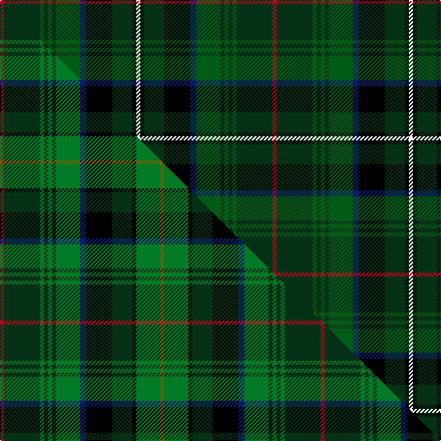

This is one **variant** — a specific cloth: this exact thread count and colourway, with its own
provenance below. It is one weaving of the [sett](/setts/k4dg10k13db3dgi12dg2dgi2dg2dgi2dg18r2/) (the scale-free proportion — the
same cloth at any scale or shade), whose colour order is pattern [KKGKBGGGGGGR](/stripes/kkgkbggggggr/).

Part of the [McHeadley Society](/tartans/mcheadley-society/) tartan — the named design grouping this sett with its other cloths.

Sourced from house-of-tartan.  It is a [12 stripe tartan](/stripes/stripes12/).

Original link [http://www.house-of-tartan.scotland.net/house/TartanViewjs.asp?colr=Def&tnam=10450](http://www.house-of-tartan.scotland.net/house/TartanViewjs.asp?colr=Def&tnam=10450)

## Provenance

Earliest known date: 4th July 2011 The McHeadley Society is a private fraternal gentlemen's club. The name is a combination of a few of the founder's surnames, all of whom were at University together. The members are spread from Florida to California and gather several times a year to play golf, travelling to Ireland or Scotland every other year. The Society supports several charitable causes, always anonymously. Its Motto is 'Faith, Family, Friendship'. Membership of the Society now extends to a second generation as several sons now join the gatherings. This sett is taken from the Boyd tartan in respect of Taylor Boyd (a member of the McHeadley Society), but altered to favour green with accents in blue, red and yellow.

Dataset <small>— provenance for this record, inherited from the source manifest</small>

<dl class="dataset-prov">
<dt>source</dt><dd><a href="/sources/house-of-tartan/">House of Tartan</a></dd>
<dt>data captured from</dt><dd><a href="https://github.com/thetartan/tartan-database/blob/master/data/house-of-tartan/data.csv">https://github.com/thetartan/tartan-database/blob/master/data/house-of-tartan/data.csv</a></dd>
<dt>data date</dt><dd>2017-01-10 <small>(dataset default)</small></dd>
<dt>licence</dt><dd><a href="https://creativecommons.org/licenses/by-nc-nd/4.0/">CC BY-NC-ND 4.0</a></dd>
</dl>

Capture chain <small>— the hands this data passed through, oldest first; each capture carries its own licence</small>

<ol class="capture-chain">
<li><a href="http://www.house-of-tartan.scotland.net/">House of Tartan</a> <small>the weaver/retailer's database — the site is now offline; the URL is kept as the ultimate source's identity</small></li>
<li><a href="https://github.com/thetartan/tartan-database">thetartan/tartan-database</a> <small>2016-2017</small> · <a href="https://creativecommons.org/licenses/by-nc-nd/4.0/">CC BY-NC-ND 4.0</a> <small>Levko Kravets's frozen compilation — the capture we vendored, and where its CC licence text came from</small></li>
<li>this dictionary <small>captured 2026-06-10 · commit 5bf86c7566</small> <small>each re-capture is a git commit to data/sources</small></li>
</ol>

## Thread count
R/4 DG36 DGi4 DG4 DGi4 DG4 DGi24 DB6 K26 DG20 K4 K/4

One full sett is **272 threads**.

## Palette
<table><thead><tr><th>Colour</th><th>Shade</th><th>OKLCh</th></tr></thead><tbody><tr><td>DB</td><td><code style="background-color:#082077;">#082077</code> <small style="color:#888">#082077</small></td><td><small style="color:#888">oklch(30.0% 0.149 265.1)</small></td></tr><tr><td>DG</td><td><code style="background-color:#053819;">#053819</code> <small style="color:#888">#053819</small></td><td><small style="color:#888">oklch(30.0% 0.075 151.3)</small></td></tr><tr><td>DG</td><td><code style="background-color:#006818;">#006818</code> <small style="color:#888">#006818</small></td><td><small style="color:#888">oklch(45.0% 0.142 145.0)</small></td></tr><tr><td>G</td><td><code style="background-color:#5C6428;">#5C6428</code> <small style="color:#888">#5C6428</small></td><td><small style="color:#888">oklch(48.3% 0.084 116.0)</small></td></tr><tr><td>K</td><td><code style="background-color:#000000;">#000000</code> <small style="color:#888">#000000</small></td><td><small style="color:#888">oklch(0.0% 0.000 0.0)</small></td></tr><tr><td>W</td><td><code style="background-color:#F7F7F7;">#F7F7F7</code> <small style="color:#888">#F7F7F7</small></td><td><small style="color:#888">oklch(97.6% 0.000 89.9)</small></td></tr><tr><td>R</td><td><code style="background-color:#D60020;">#D60020</code> <small style="color:#888">#D60020</small></td><td><small style="color:#888">oklch(55.2% 0.224 25.5)</small></td></tr></tbody></table>

# Sample pattern

## Compared to the master

This cloth is one sett of its design; the master sett (the exemplar the design is anchored on) is below for comparison.

Its **ΔTartan distance** from the master is **1.58** — the same measure the nearest-tartans table ranks by (0 is identical; a re-scale of the same cloth is near 0, a recolour or a different proportion further).

<figure class="master-compare" style="margin:0">

this sett
master sett ★

<figcaption style="color:#888;font-size:smaller">One weave of this sett against the <a href="/setts/r2dg18g2dg2g2dg2g12db3k13dg10k2g12y2/">master sett ★</a>, split on the diagonal: a shared proportion runs seamlessly across it with only the shades shifting; a different proportion breaks on it.</figcaption>
</figure>

## Nearest tartan variants

The nearest existing variants by ΔTartan distance, with this cloth at the top so the swatches line up against it.

ΔTartan

Threads

Variant

Sett

—

272

<a href="/variants/s11/k4dg10k13db3dgi12dg2dgi2dg2dgi2dg18r2~x2~dgi1806142/">McHeadley Society Corporate Tartan</a>

<a href="/ttd/edit/#slug=r2dg18g2dg2g2dg2g12db3k13dg10k2ly2~x2&amp;base=k4dg10k13db3dgi12dg2dgi2dg2dgi2dg18r2~x2~dgi1806142" title="compare in the TTD">0.34</a>

272

<a href="/variants/s12/r2dg18g2dg2g2dg2g12db3k13dg10k2ly2~x2/">McHeadley Society (Corporate)</a>

<a href="/ttd/edit/#slug=r2dg18g2dg2g2dg2g12db3k13dg10k2g12y2~x2&amp;base=k4dg10k13db3dgi12dg2dgi2dg2dgi2dg18r2~x2~dgi1806142" title="compare in the TTD">1.58</a>

320

<a href="/variants/s13/r2dg18g2dg2g2dg2g12db3k13dg10k2g12y2~x2/">McHeadley Society</a>

<a href="/ttd/edit/#slug=k8r2k6ly2k2lb2k2dy16dg24r2dg4k3~x2&amp;base=k4dg10k13db3dgi12dg2dgi2dg2dgi2dg18r2~x2~dgi1806142" title="compare in the TTD">2.87</a>

270

<a href="/variants/s12/k8r2k6ly2k2lb2k2dy16dg24r2dg4k3~x2/">Tara (District)</a>

<a href="/ttd/edit/#slug=db6k3r2k3dg31k6g2k6dy13k2g2~x2&amp;base=k4dg10k13db3dgi12dg2dgi2dg2dgi2dg18r2~x2~dgi1806142" title="compare in the TTD">2.93</a>

288

<a href="/variants/s11/db6k3r2k3dg31k6g2k6dy13k2g2~x2/">Rourke-Frew Hunting</a>

<a href="/ttd/edit/#slug=dg19g5k2t3dg5g3t5k2dt3g5w2~x2~t2304245-dt1204274&amp;base=k4dg10k13db3dgi12dg2dgi2dg2dgi2dg18r2~x2~dgi1806142" title="compare in the TTD">3.09</a>

174

<a href="/variants/s11/dg19g5k2t3dg5g3t5k2db3g5w2~x2~t2304245-db1204274/">MacLean, Kenneth, baron of Denboig (Personal)</a>

<a href="/ttd/edit/#slug=r4k1dg8g2dg8k4g8k1db2k1g8k4dg8k2dg8k1y2~x2~dg1504144-g2007139&amp;base=k4dg10k13db3dgi12dg2dgi2dg2dgi2dg18r2~x2~dgi1806142" title="compare in the TTD">3.16</a>

276

<a href="/variants/s17/r4k1dg8g2dg8k4g8k1db2k1g8k4dg8k2dg8k1y2~x2~dg1504144-g2007139/">Redmond (2014)</a>

<a href="/ttd/edit/#slug=dg29dgi16k8r4dg16dgi16y4r4k16t4dgi28dg16~dgi1806142-t2003208&amp;base=k4dg10k13db3dgi12dg2dgi2dg2dgi2dg18r2~x2~dgi1806142" title="compare in the TTD">3.17</a>

277

<a href="/variants/s12/dg29dgi16k8r4dg16dgi16y4r4k16g4dgi28dg16~dgi1806142-g2003208/">McCamley (Personal)</a>

<a href="/ttd/edit/#slug=y1k1dg8db1dg1k8dg1db8dg1k1dg8k1w1~x6&amp;base=k4dg10k13db3dgi12dg2dgi2dg2dgi2dg18r2~x2~dgi1806142" title="compare in the TTD">3.19</a>

480

<a href="/variants/s13/y1k1dg8db1dg1k8dg1db8dg1k1dg8k1w1~x6/">Robieson, Graham Alexander (Personal)</a>

<a href="/ttd/edit/#slug=dg8dr3dg8k10dp5g32dg5g32dp5k10dg8dr3dg8dp3~x2~dg1603171-g2203152&amp;base=k4dg10k13db3dgi12dg2dgi2dg2dgi2dg18r2~x2~dgi1806142" title="compare in the TTD">3.24</a>

538

<a href="/variants/s14/dg8dr3dg8k10dp5g32dg5g32dp5k10dg8dr3dg8dp3~x2~dg1603171-g2203152/">Scottish Power Corporate Tartan</a>

<a href="/ttd/edit/#slug=k2g6dy2g2dy2g19db2dr2db2g2dg4k2dg11dr2dg2dr2dg6dy2~x2&amp;base=k4dg10k13db3dgi12dg2dgi2dg2dgi2dg18r2~x2~dgi1806142" title="compare in the TTD">3.24</a>

280

<a href="/variants/s18/k2g6dy2g2dy2g19db2dr2db2g2dg4k2dg11dr2dg2dr2dg6dy2~x2/">Harmon Hunting</a>

## Neighbour map

Every grey dot is one of 13621 variants placed by the first two principal components of the ΔTartan feature space (42% of its variance). Red is this tartan; blue dots are its nearest — click one to open its page.

<svg viewBox="0 0 640 380" role="img" style="max-width:100%;height:auto;border:1px solid #e0e0e0;border-radius:4px;display:block" xmlns="http://www.w3.org/2000/svg"><image href="/nn/cloud.v1.png" width="640" height="380"/><a href="/variants/s12/r2dg18g2dg2g2dg2g12db3k13dg10k2ly2~x2/"><circle cx="164.8" cy="144.8" r="4" fill="#3465a4"><title>McHeadley Society (Corporate)</title></circle></a><a href="/variants/s13/r2dg18g2dg2g2dg2g12db3k13dg10k2g12y2~x2/"><circle cx="140.8" cy="151.6" r="4" fill="#3465a4"><title>McHeadley Society</title></circle></a><a href="/variants/s12/k8r2k6ly2k2lb2k2dy16dg24r2dg4k3~x2/"><circle cx="161.5" cy="121.3" r="4" fill="#3465a4"><title>Tara (District)</title></circle></a><a href="/variants/s11/db6k3r2k3dg31k6g2k6dy13k2g2~x2/"><circle cx="215.8" cy="123.7" r="4" fill="#3465a4"><title>Rourke-Frew Hunting</title></circle></a><a href="/variants/s11/dg19g5k2t3dg5g3t5k2db3g5w2~x2~t2304245-db1204274/"><circle cx="164.8" cy="152.9" r="4" fill="#3465a4"><title>MacLean, Kenneth, baron of Denboig (Personal)</title></circle></a><a href="/variants/s17/r4k1dg8g2dg8k4g8k1db2k1g8k4dg8k2dg8k1y2~x2~dg1504144-g2007139/"><circle cx="143.0" cy="163.5" r="4" fill="#3465a4"><title>Redmond (2014)</title></circle></a><a href="/variants/s12/dg29dgi16k8r4dg16dgi16y4r4k16g4dgi28dg16~dgi1806142-g2003208/"><circle cx="150.1" cy="196.4" r="4" fill="#3465a4"><title>McCamley (Personal)</title></circle></a><a href="/variants/s13/y1k1dg8db1dg1k8dg1db8dg1k1dg8k1w1~x6/"><circle cx="213.2" cy="157.8" r="4" fill="#3465a4"><title>Robieson, Graham Alexander (Personal)</title></circle></a><a href="/variants/s14/dg8dr3dg8k10dp5g32dg5g32dp5k10dg8dr3dg8dp3~x2~dg1603171-g2203152/"><circle cx="208.8" cy="157.0" r="4" fill="#3465a4"><title>Scottish Power Corporate Tartan</title></circle></a><a href="/variants/s18/k2g6dy2g2dy2g19db2dr2db2g2dg4k2dg11dr2dg2dr2dg6dy2~x2/"><circle cx="181.1" cy="136.4" r="4" fill="#3465a4"><title>Harmon Hunting</title></circle></a><circle cx="195.0" cy="152.1" r="5" fill="#c00000"/><text x="320" y="376" text-anchor="middle" font-size="11" fill="#999">ground</text><text x="11" y="190" text-anchor="middle" font-size="11" fill="#999" transform="rotate(-90 11 190)">complexity</text></svg>

ID: /variants/s11/k4dg10k13db3dgi12dg2dgi2dg2dgi2dg18r2~x2~dgi1806142/
