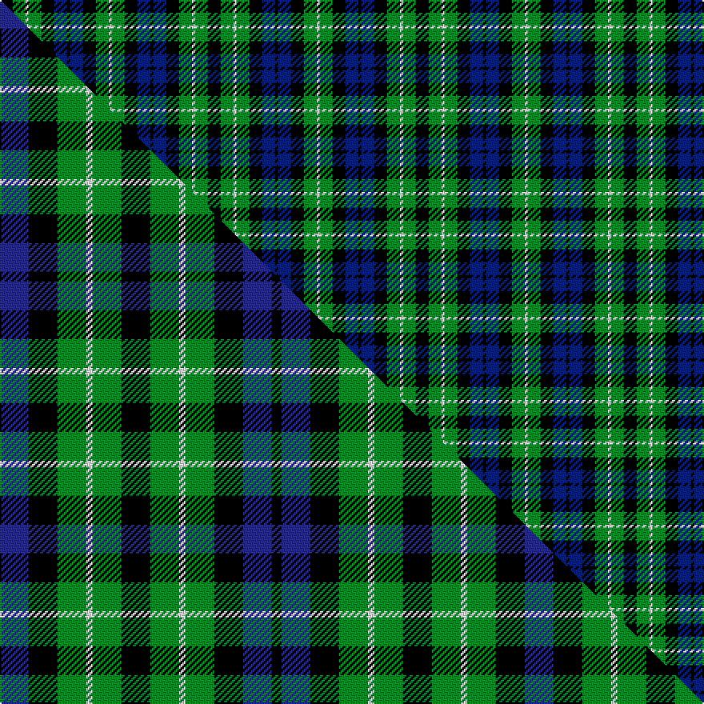

This is one **variant** — a specific cloth: this exact thread count and colourway, with its own
provenance below. It is one weaving of the [sett](/setts/k4g4w1g4k4db4k1db4k4g4w1/) (the scale-free proportion — the
same cloth at any scale or shade), whose colour order is pattern [KGWGKBKBKGW](/stripes/kgwgkbkbkgw/).

Part of the [Graham of Montrose](/tartans/g/gr/graham-of-montrose-3/) tartan — the named design grouping this sett with its other cloths.

Sourced from register-of-tartans.  It is a [11 stripe tartan](/stripes/stripes11/).

Original link [https://www.tartanregister.gov.uk/tartanDetails.aspx?ref=1486](https://www.tartanregister.gov.uk/tartanDetails.aspx?ref=1486)

2 attestations — the source records this cloth was collapsed from (oldest owns this page)

<ul>
<li>undated — Graham of Montrose #3 (register-of-tartans, <a href="https://www.tartanregister.gov.uk/tartanDetails.aspx?ref=1486">record</a>)  <em>This appears to be an extension of the sett published by the Smith brothers, in which a single white stripe comes between each pair. It could be a simple transcription error (omitting the last few numbers of the full repeat), since the Graham tartan is well documented throughout the 19th century. W.and A.K.Johnston. The Tartans of the Clans and Septs of Scotland - 1906.</em></li>
<li>undated — Graham of Montrose (weddslist, <a href="http://www.weddslist.com/cgi-bin/tartans/pg.pl?source=sts">record</a>) </li>
</ul>

Dataset <small>— provenance for this record, inherited from the source manifest</small>

<dl class="dataset-prov">
<dt>source</dt><dd><a href="/sources/register-of-tartans/">Scottish Register of Tartans</a></dd>
<dt>data captured from</dt><dd><a href="https://github.com/thetartan/tartan-database/blob/master/data/register-of-tartans/data.csv">https://github.com/thetartan/tartan-database/blob/master/data/register-of-tartans/data.csv</a></dd>
<dt>data date</dt><dd>2017-01-06 <small>(dataset default)</small></dd>
<dt>licence</dt><dd><a href="https://www.tartanregister.gov.uk/copyright">Crown copyright</a></dd>
</dl>

Capture chain <small>— the hands this data passed through, oldest first; each capture carries its own licence</small>

<ol class="capture-chain">
<li><a href="https://www.tartanregister.gov.uk/">Scottish Register of Tartans</a> · <a href="https://www.tartanregister.gov.uk/copyright">Crown copyright</a> <small>the living register — still published by National Records of Scotland</small></li>
<li><a href="https://github.com/thetartan/tartan-database">thetartan/tartan-database</a> <small>2016-2017</small> · <a href="https://creativecommons.org/licenses/by-nc-nd/4.0/">CC BY-NC-ND 4.0</a> <small>Levko Kravets's frozen compilation — the capture we vendored, and where its CC licence text came from</small></li>
<li>this dictionary <small>captured 2026-06-10 · commit 5bf86c7566</small> <small>each re-capture is a git commit to data/sources</small></li>
</ol>

## Register references

External register numbers recorded for this tartan.

- Scottish Register of Tartans: [1486](https://www.tartanregister.gov.uk/tartanDetails.aspx?ref=1486)
- Scottish Tartans World Register: 1116

## Thread count
K/8 G8 W2 G8 K8 DB8 K2 DB8 K8 G8 W/2

One full sett is **130 threads**.

## Palette
<table><thead><tr><th>Colour</th><th>Shade</th><th>OKLCh</th></tr></thead><tbody><tr><td>DB</td><td><code style="background-color:#082077;">#082077</code> <small style="color:#888">#082077</small></td><td><small style="color:#888">oklch(30.0% 0.149 265.1)</small></td></tr><tr><td>G</td><td><code style="background-color:#008B2A;">#008B2A</code> <small style="color:#888">#008B2A</small></td><td><small style="color:#888">oklch(55.4% 0.170 145.9)</small></td></tr><tr><td>K</td><td><code style="background-color:#000000;">#000000</code> <small style="color:#888">#000000</small></td><td><small style="color:#888">oklch(0.0% 0.000 0.0)</small></td></tr><tr><td>W</td><td><code style="background-color:#F7F7F7;">#F7F7F7</code> <small style="color:#888">#F7F7F7</small></td><td><small style="color:#888">oklch(97.6% 0.000 89.9)</small></td></tr></tbody></table>

# Sample pattern

## Compared to the master

This cloth is one sett of its design; the master sett (the exemplar the design is anchored on) is below for comparison.

Its **ΔTartan distance** from the master is **1.29** — the same measure the nearest-tartans table ranks by (0 is identical; a re-scale of the same cloth is near 0, a recolour or a different proportion further).

<figure class="master-compare" style="margin:0">

this sett
master sett ★

<figcaption style="color:#888;font-size:smaller">One weave of this sett against the <a href="/setts/db9k9g9w2g9k9g9w2g9k9db9k3/">master sett ★</a>, split on the diagonal: a shared proportion runs seamlessly across it with only the shades shifting; a different proportion breaks on it.</figcaption>
</figure>

## Nearest tartan variants

The nearest existing variants by ΔTartan distance, with this cloth at the top so the swatches line up against it.

ΔTartan

Threads

Variant

Sett

—

130

<a href="/variants/s11/k4g4w1g4k4db4k1db4k4g4w1~x2/">Graham of Montrose #3</a>

<a href="/ttd/edit/#slug=db9k9g9w2g9k9g9w2g9k9db9k3~x2~db1406275-w4000000&amp;base=k4g4w1g4k4db4k1db4k4g4w1~x2" title="compare in the TTD">1.29</a>

328

<a href="/variants/s12/db9k9g9w2g9k9g9w2g9k9db9k3~x2~db1406275-w4000000/">Graham of Montrose #2</a>

<a href="/ttd/edit/#slug=k5g4w1g4k1g4r1g4k5db5k1db5~x4&amp;base=k4g4w1g4k4db4k1db4k4g4w1~x2" title="compare in the TTD">1.73</a>

280

<a href="/variants/s12/k5g4w1g4k1g4r1g4k5db5k1db5~x4/">Lloyd of Dolobran Family Tartan</a>

<a href="/ttd/edit/#slug=k21g21r4g21k21g21y4g21k21db21k3db21~x2&amp;base=k4g4w1g4k4db4k1db4k4g4w1~x2" title="compare in the TTD">2.23</a>

716

<a href="/variants/s12/k21g21r4g21k21g21y4g21k21db21k3db21~x2/">Rollo</a>

<a href="/ttd/edit/#slug=dp12k13g12lb2g12k13g12lb2g12k13dp12k2~x2&amp;base=k4g4w1g4k4db4k1db4k4g4w1~x2" title="compare in the TTD">2.25</a>

440

<a href="/variants/s12/dp12k13g12lb2g12k13g12lb2g12k13dp12k2~x2/">Wilson's No.064 #2</a>

<a href="/ttd/edit/#slug=k15g15y3g15k15g15r3g15k15db15k2db15~x2&amp;base=k4g4w1g4k4db4k1db4k4g4w1~x2" title="compare in the TTD">2.26</a>

512

<a href="/variants/s12/k15g15y3g15k15g15r3g15k15db15k2db15~x2/">Rollo Family Tartan</a>

<a href="/ttd/edit/#slug=db10k2db4k4g7y2g7k4db10k2&amp;base=k4g4w1g4k4db4k1db4k4g4w1~x2" title="compare in the TTD">2.27</a>

92

<a href="/variants/s10/db10k2db4k4g7y2g7k4db10k2/">Gordon Miniature</a>

<a href="/ttd/edit/#slug=k4g4k1g4k4db4y1~x2&amp;base=k4g4w1g4k4db4k1db4k4g4w1~x2" title="compare in the TTD">2.40</a>

78

<a href="/variants/s7/k4g4k1g4k4db4y1~x2/">Unidentified No 39</a>

<a href="/ttd/edit/#slug=w2db10k10g11db2w2~x2~db1406275&amp;base=k4g4w1g4k4db4k1db4k4g4w1~x2" title="compare in the TTD">2.41</a>

140

<a href="/variants/s6/w2db10k10g11db2w2~x2~db1406275/">Norwich No.026</a>

<a href="/ttd/edit/#slug=db8k2db12k13g13w2k4w2g13k13db4~x2&amp;base=k4g4w1g4k4db4k1db4k4g4w1~x2" title="compare in the TTD">2.47</a>

320

<a href="/variants/s11/db8k2db12k13g13w2k4w2g13k13db4~x2/">Melville Family Tartan</a>

<a href="/ttd/edit/#slug=k4g4w1g4k4db4k1~x2&amp;base=k4g4w1g4k4db4k1db4k4g4w1~x2" title="compare in the TTD">2.48</a>

78

<a href="/variants/s7/k4g4w1g4k4db4k1~x2/">Graham of Montrose</a>

## Neighbour map

Every grey dot is one of 13621 variants placed by the first two principal components of the ΔTartan feature space (42% of its variance). Red is this tartan; blue dots are its nearest — click one to open its page.

<svg viewBox="0 0 640 380" role="img" style="max-width:100%;height:auto;border:1px solid #e0e0e0;border-radius:4px;display:block" xmlns="http://www.w3.org/2000/svg"><image href="/nn/cloud.v1.png" width="640" height="380"/><a href="/variants/s12/db9k9g9w2g9k9g9w2g9k9db9k3~x2~db1406275-w4000000/"><circle cx="91.2" cy="248.5" r="4" fill="#3465a4"><title>Graham of Montrose #2</title></circle></a><a href="/variants/s12/k5g4w1g4k1g4r1g4k5db5k1db5~x4/"><circle cx="85.9" cy="215.5" r="4" fill="#3465a4"><title>Lloyd of Dolobran Family Tartan</title></circle></a><a href="/variants/s12/k21g21r4g21k21g21y4g21k21db21k3db21~x2/"><circle cx="104.9" cy="211.8" r="4" fill="#3465a4"><title>Rollo</title></circle></a><a href="/variants/s12/dp12k13g12lb2g12k13g12lb2g12k13dp12k2~x2/"><circle cx="119.2" cy="225.1" r="4" fill="#3465a4"><title>Wilson's No.064 #2</title></circle></a><a href="/variants/s12/k15g15y3g15k15g15r3g15k15db15k2db15~x2/"><circle cx="106.3" cy="209.5" r="4" fill="#3465a4"><title>Rollo Family Tartan</title></circle></a><a href="/variants/s10/db10k2db4k4g7y2g7k4db10k2/"><circle cx="160.7" cy="232.9" r="4" fill="#3465a4"><title>Gordon Miniature</title></circle></a><a href="/variants/s7/k4g4k1g4k4db4y1~x2/"><circle cx="112.4" cy="268.4" r="4" fill="#3465a4"><title>Unidentified No 39</title></circle></a><a href="/variants/s6/w2db10k10g11db2w2~x2~db1406275/"><circle cx="96.8" cy="224.1" r="4" fill="#3465a4"><title>Norwich No.026</title></circle></a><a href="/variants/s11/db8k2db12k13g13w2k4w2g13k13db4~x2/"><circle cx="112.8" cy="210.1" r="4" fill="#3465a4"><title>Melville Family Tartan</title></circle></a><a href="/variants/s7/k4g4w1g4k4db4k1~x2/"><circle cx="98.0" cy="262.2" r="4" fill="#3465a4"><title>Graham of Montrose</title></circle></a><circle cx="74.7" cy="252.4" r="5" fill="#c00000"/><text x="320" y="376" text-anchor="middle" font-size="11" fill="#999">ground</text><text x="11" y="190" text-anchor="middle" font-size="11" fill="#999" transform="rotate(-90 11 190)">complexity</text></svg>

ID: /variants/s11/k4g4w1g4k4db4k1db4k4g4w1~x2/
