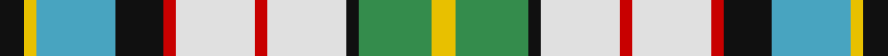

This page is one **sett** — a single exact thread-count. It belongs to the [tartan](/setts/k4ly2lg13k8r2w13r2w13k2g12ly4/)
(the same proportion at any scale), whose colour order is pattern [KYYKRWRWKGY](/stripes/kyykrwrwkgy/).

Sourced from tartans-authority.  It is a [11 stripe tartan](/stripes/stripes11/).

Original link http://www.tartansauthority.com/tartan-ferret/display/8236/

## Register references

External register numbers recorded for this tartan.

- Scottish Register of Tartans: [8236](https://www.tartanregister.gov.uk/tartanDetails?ref=8236)
- Scottish Tartans Authority (ITI): 8236

## Thread count
K/8 Y4 B26 K16 R4 LN26 R4 LN26 K4 G24 Y/8

One full sett is **284 threads**.

## Palette

Palette: <strong>Tartan Register</strong> <small style="color:#888">(5 of 6 colours)</small>
<table><thead><tr><th>Colour</th><th>Threads</th><th>Shade</th><th>Base</th><th>OKLCh</th></tr></thead><tbody><tr><td>K/</td><td style="text-align:right;font-variant-numeric:tabular-nums">8</td><td><code style="background-color:#101010;">#101010</code> <small style="color:#888">#101010</small></td><td>K <code style="background-color:#000000;">#000000</code></td><td><small style="color:#888">oklch(17.3% 0.000 89.9)</small></td></tr><tr><td>Y</td><td style="text-align:right;font-variant-numeric:tabular-nums">4</td><td><code style="background-color:#E8C000;">#E8C000</code> <small style="color:#888">#E8C000</small></td><td>Y <code style="background-color:#F2BF00;">#F2BF00</code></td><td><small style="color:#888">oklch(81.9% 0.168 93.7)</small></td></tr><tr><td>B</td><td style="text-align:right;font-variant-numeric:tabular-nums">26</td><td><code style="background-color:#48A4C0;">#48A4C0</code> <small style="color:#888">#48A4C0</small></td><td>Y <code style="background-color:#F2BF00;">#F2BF00</code></td><td><small style="color:#888">oklch(67.5% 0.096 221.0)</small></td></tr><tr><td>K</td><td style="text-align:right;font-variant-numeric:tabular-nums">16</td><td><code style="background-color:#101010;">#101010</code> <small style="color:#888">#101010</small></td><td>K <code style="background-color:#000000;">#000000</code></td><td><small style="color:#888">oklch(17.3% 0.000 89.9)</small></td></tr><tr><td>R</td><td style="text-align:right;font-variant-numeric:tabular-nums">4</td><td><code style="background-color:#C80000;">#C80000</code> <small style="color:#888">#C80000</small></td><td>R <code style="background-color:#CC0000;">#CC0000</code></td><td><small style="color:#888">oklch(52.3% 0.215 29.2)</small></td></tr><tr><td>LN</td><td style="text-align:right;font-variant-numeric:tabular-nums">26</td><td><code style="background-color:#E0E0E0;">#E0E0E0</code> <small style="color:#888">#E0E0E0</small></td><td>W <code style="background-color:#F7F7F7;">#F7F7F7</code></td><td><small style="color:#888">oklch(90.7% 0.000 89.9)</small></td></tr><tr><td>R</td><td style="text-align:right;font-variant-numeric:tabular-nums">4</td><td><code style="background-color:#C80000;">#C80000</code> <small style="color:#888">#C80000</small></td><td>R <code style="background-color:#CC0000;">#CC0000</code></td><td><small style="color:#888">oklch(52.3% 0.215 29.2)</small></td></tr><tr><td>LN</td><td style="text-align:right;font-variant-numeric:tabular-nums">26</td><td><code style="background-color:#E0E0E0;">#E0E0E0</code> <small style="color:#888">#E0E0E0</small></td><td>W <code style="background-color:#F7F7F7;">#F7F7F7</code></td><td><small style="color:#888">oklch(90.7% 0.000 89.9)</small></td></tr><tr><td>K</td><td style="text-align:right;font-variant-numeric:tabular-nums">4</td><td><code style="background-color:#101010;">#101010</code> <small style="color:#888">#101010</small></td><td>K <code style="background-color:#000000;">#000000</code></td><td><small style="color:#888">oklch(17.3% 0.000 89.9)</small></td></tr><tr><td>G</td><td style="text-align:right;font-variant-numeric:tabular-nums">24</td><td><code style="background-color:#348C4C;">#348C4C</code> <small style="color:#888">#348C4C</small></td><td>G <code style="background-color:#006100;">#006100</code></td><td><small style="color:#888">oklch(57.1% 0.128 149.4)</small></td></tr><tr><td>Y/</td><td style="text-align:right;font-variant-numeric:tabular-nums">8</td><td><code style="background-color:#E8C000;">#E8C000</code> <small style="color:#888">#E8C000</small></td><td>Y <code style="background-color:#F2BF00;">#F2BF00</code></td><td><small style="color:#888">oklch(81.9% 0.168 93.7)</small></td></tr></tbody></table>

## Nearest tartans

The nearest existing variants by ΔTartan distance, with this tartan at the top so the swatches line up against it.

ΔTartan

Tartan

Sett

—

<a href="/ttd/edit/#slug=k4ly2lg13k8r2w13r2w13k2g12ly4~x2">MacLellan Dress (Personal)</a> <a class="nn-out" href="/variants/s11/k4ly2lg13k8r2w13r2w13k2g12ly4~x2/" title="open its dictionary page">↗</a>

0.91

<a href="/ttd/edit/#slug=k2w1db7k4r1w8r2w8k1dg7w1dg7ly2~x4&amp;base=k4ly2lg13k8r2w13r2w13k2g12ly4~x2">MacLellan/McLellan Dress (Personal)</a> <a class="nn-out" href="/variants/s13/k2w1db7k4r1w8r2w8k1dg7w1dg7ly2~x4/" title="open its dictionary page">↗</a>

1.02

<a href="/ttd/edit/#slug=w30lb4dt6m4dt6g6dt12g13lt4~x2&amp;base=k4ly2lg13k8r2w13r2w13k2g12ly4~x2">Sound of Iona</a> <a class="nn-out" href="/variants/s9/w30lb4dt6m4dt6g6dt12g13lt4~x2/" title="open its dictionary page">↗</a>

1.02

<a href="/ttd/edit/#slug=k2w1db7k4r1w8r2w8k1g7w1ly2~x2&amp;base=k4ly2lg13k8r2w13r2w13k2g12ly4~x2">MacLellan, dress McLellan</a> <a class="nn-out" href="/variants/s12/k2w1db7k4r1w8r2w8k1g7w1ly2~x2/" title="open its dictionary page">↗</a>

1.09

<a href="/ttd/edit/#slug=r6w20g12o3g8t20k2t3~x2&amp;base=k4ly2lg13k8r2w13r2w13k2g12ly4~x2">Coulter Dress (Personal)</a> <a class="nn-out" href="/variants/s8/r6w20g12o3g8t20k2t3~x2/" title="open its dictionary page">↗</a>

1.13

<a href="/ttd/edit/#slug=g5db3t3g5w4ly2t1ly2db1r1~x6&amp;base=k4ly2lg13k8r2w13r2w13k2g12ly4~x2">Northern College (Ontario)</a> <a class="nn-out" href="/variants/s10/g5db3t3g5w4ly2t1ly2db1r1~x6/" title="open its dictionary page">↗</a>

1.15

<a href="/ttd/edit/#slug=w6ly2w2ly3w11g11b2k12b3k6w2~x2&amp;base=k4ly2lg13k8r2w13r2w13k2g12ly4~x2">Fitzpatrick</a> <a class="nn-out" href="/variants/s11/w6ly2w2ly3w11g11b2k12b3k6w2~x2/" title="open its dictionary page">↗</a>

1.20

<a href="/ttd/edit/#slug=lo1y6g2w1k8w1g2w9k1w4ly1~x4&amp;base=k4ly2lg13k8r2w13r2w13k2g12ly4~x2">Tiree</a> <a class="nn-out" href="/variants/s11/lo1y6g2w1k8w1g2w9k1w4ly1~x4/" title="open its dictionary page">↗</a>

1.21

<a href="/ttd/edit/#slug=dg2o13dg12w3lb10w3lb12g13r2~x2&amp;base=k4ly2lg13k8r2w13r2w13k2g12ly4~x2">Mounth The.. Corporate Tartan</a> <a class="nn-out" href="/variants/s9/dg2o13dg12w3lb10w3lb12g13r2~x2/" title="open its dictionary page">↗</a>

1.21

<a href="/ttd/edit/#slug=t8ly2g4ly2dp4ly2t8w15lo2~x4&amp;base=k4ly2lg13k8r2w13r2w13k2g12ly4~x2">Edmonton, City of</a> <a class="nn-out" href="/variants/s9/t8ly2g4ly2dp4ly2t8w15lo2~x4/" title="open its dictionary page">↗</a>

1.22

<a href="/variants/s12/k4g4k2g14k6w3k6wi2w4wi2w15r3~x2/">Hayama Shirt Honten, The</a>

## Neighbour map

Every grey dot is one of 14360 variants placed by the first two principal components of the ΔTartan feature space (44% of its variance). Red is this tartan; blue dots are its nearest — click one to open its page.

<svg viewBox="0 0 640 380" role="img" style="max-width:100%;height:auto;border:1px solid #e0e0e0;border-radius:4px;display:block" xmlns="http://www.w3.org/2000/svg"><image href="/nn/cloud.v1.png" width="640" height="380"/><a href="/variants/s13/k2w1db7k4r1w8r2w8k1dg7w1dg7ly2~x4/"><circle cx="61.4" cy="137.7" r="4" fill="#3465a4"><title>MacLellan/McLellan Dress (Personal)</title></circle></a><a href="/variants/s9/w30lb4dt6m4dt6g6dt12g13lt4~x2/"><circle cx="81.7" cy="146.9" r="4" fill="#3465a4"><title>Sound of Iona</title></circle></a><a href="/variants/s12/k2w1db7k4r1w8r2w8k1g7w1ly2~x2/"><circle cx="78.9" cy="132.0" r="4" fill="#3465a4"><title>MacLellan, dress McLellan</title></circle></a><a href="/variants/s8/r6w20g12o3g8t20k2t3~x2/"><circle cx="81.8" cy="153.8" r="4" fill="#3465a4"><title>Coulter Dress (Personal)</title></circle></a><a href="/variants/s10/g5db3t3g5w4ly2t1ly2db1r1~x6/"><circle cx="51.6" cy="195.2" r="4" fill="#3465a4"><title>Northern College (Ontario)</title></circle></a><a href="/variants/s11/w6ly2w2ly3w11g11b2k12b3k6w2~x2/"><circle cx="69.5" cy="172.2" r="4" fill="#3465a4"><title>Fitzpatrick</title></circle></a><a href="/variants/s11/lo1y6g2w1k8w1g2w9k1w4ly1~x4/"><circle cx="105.7" cy="122.6" r="4" fill="#3465a4"><title>Tiree</title></circle></a><a href="/variants/s9/dg2o13dg12w3lb10w3lb12g13r2~x2/"><circle cx="54.2" cy="187.1" r="4" fill="#3465a4"><title>Mounth The.. Corporate Tartan</title></circle></a><a href="/variants/s9/t8ly2g4ly2dp4ly2t8w15lo2~x4/"><circle cx="87.9" cy="154.3" r="4" fill="#3465a4"><title>Edmonton, City of</title></circle></a><a href="/variants/s12/k4g4k2g14k6w3k6wi2w4wi2w15r3~x2/"><circle cx="80.1" cy="148.5" r="4" fill="#3465a4"><title>Hayama Shirt Honten, The</title></circle></a><circle cx="44.0" cy="152.5" r="5" fill="#c00000"/></svg>

ID: /variants/s11/k4ly2lg13k8r2w13r2w13k2g12ly4~x2/
