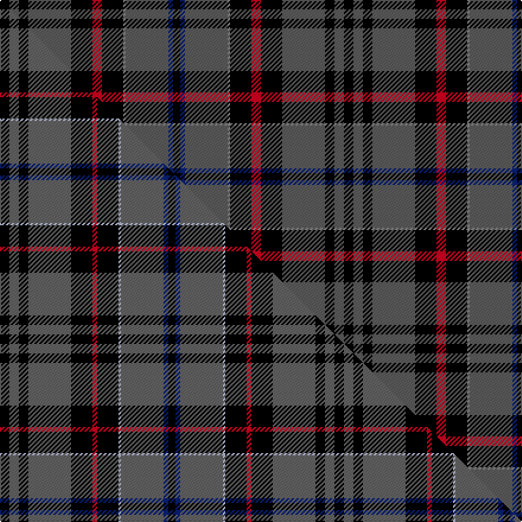

This is one **variant** — a specific cloth: this exact thread count and colourway, with its own
provenance below. It is one weaving of the [sett](/tartans/m/mo/moggach/) (the scale-free proportion — the
same cloth at any scale or shade), whose colour order is pattern [KBBRKRKBKBK](/stripes/kbbrkrkbkbk/).

Part of the [Moggach](/tartans/m/mo/moggach/) tartan — the named design grouping this sett with its other cloths.

Sourced from tartans-authority.  It is a [11 stripe tartan](/stripes/stripes11/).

Original link <code>http://www.tartansauthority.com/tartan-ferret/display/10875/</code> — retired · [Internet Archive copy](https://web.archive.org/web/*/http://www.tartansauthority.com/tartan-ferret/display/10875/*)

Dataset <small>— provenance for this record, inherited from the source manifest</small>

<dl class="dataset-prov">
<dt>source</dt><dd><a href="/sources/tartans-authority/">Scottish Tartans Authority</a></dd>
<dt>data captured from</dt><dd><a href="https://github.com/thetartan/tartan-database/blob/master/data/tartans-authority/data.csv">https://github.com/thetartan/tartan-database/blob/master/data/tartans-authority/data.csv</a></dd>
<dt>data date</dt><dd>2013 <small>(this record)</small></dd>
<dt>licence</dt><dd><a href="https://creativecommons.org/licenses/by-nc-nd/4.0/">CC BY-NC-ND 4.0</a></dd>
</dl>

Capture chain <small>— the hands this data passed through, oldest first; each capture carries its own licence</small>

<ol class="capture-chain">
<li><a href="https://www.tartansauthority.com/">Scottish Tartans Authority</a> <small>the heritage body’s archive — its tartan-ferret record browser is retired; dead record links are shown unlinked, with an Internet Archive copy (ITI numbers are not SRT references)</small></li>
<li><a href="https://github.com/thetartan/tartan-database">thetartan/tartan-database</a> <small>2016-2017</small> · <a href="https://creativecommons.org/licenses/by-nc-nd/4.0/">CC BY-NC-ND 4.0</a> <small>Levko Kravets's frozen compilation — the capture we vendored, and where its CC licence text came from</small></li>
<li>this dictionary <small>captured 2026-06-10 · commit 5bf86c7566</small> <small>each re-capture is a git commit to data/sources</small></li>
</ol>

## Register references

External register numbers recorded for this tartan.

- Scottish Register of Tartans: [10875](https://www.tartanregister.gov.uk/tartanDetails?ref=10875)
- Scottish Tartans Authority (ITI): 10875

## Thread count
K/8 N8 K8 N36 K18 R8 K18 O2 N36 DB4 K/6

One full sett is **290 threads**.

## Palette
<table><thead><tr><th>Colour</th><th>Shade</th><th>OKLCh</th></tr></thead><tbody><tr><td>DB</td><td><code style="background-color:#082077;">#082077</code> <small style="color:#888">#082077</small></td><td><small style="color:#888">oklch(30.0% 0.149 265.1)</small></td></tr><tr><td>K</td><td><code style="background-color:#000000;">#000000</code> <small style="color:#888">#000000</small></td><td><small style="color:#888">oklch(0.0% 0.000 0.0)</small></td></tr><tr><td>N</td><td><code style="background-color:#5C5C5C;">#5C5C5C</code> <small style="color:#888">#5C5C5C</small></td><td><small style="color:#888">oklch(47.5% 0.000 89.9)</small></td></tr><tr><td>O</td><td><code style="background-color:#888888;">#888888</code> <small style="color:#888">#888888</small></td><td><small style="color:#888">oklch(62.7% 0.000 89.9)</small></td></tr><tr><td>R</td><td><code style="background-color:#D60020;">#D60020</code> <small style="color:#888">#D60020</small></td><td><small style="color:#888">oklch(55.2% 0.224 25.5)</small></td></tr></tbody></table>

# Sample pattern

## Compared to the master

This cloth is one sett of its design; the master sett (the exemplar the design is anchored on) is below for comparison.

Its **ΔTartan distance** from the master is **0.36** — the same measure the nearest-tartans table ranks by (0 is identical; a re-scale of the same cloth is near 0, a recolour or a different proportion further).

<figure class="master-compare" style="margin:0">

this sett
master sett ★

<figcaption style="color:#888;font-size:smaller">One weave of this sett against the <a href="/setts/k4n4k4n18k9r2k9lb1n18db2k3/">master sett ★</a>, split on the diagonal: a shared proportion runs seamlessly across it with only the shades shifting; a different proportion breaks on it.</figcaption>
</figure>

## Nearest tartan variants

The nearest existing variants by ΔTartan distance, with this cloth at the top so the swatches line up against it.

ΔTartan

Threads

Variant

Sett

—

290

<a href="/variants/s11/k4n4k4n18k9r4k9o1n18db2k3~x2~n1900000-o2500000/">Moggach (Strathspey)</a>

<a href="/ttd/edit/#slug=k4n4k4n18k9r2k9lb1n18db2k3~x2&amp;base=k4n4k4n18k9r4k9o1n18db2k3~x2~n1900000-o2500000" title="compare in the TTD">0.36</a>

282

<a href="/variants/s11/k4n4k4n18k9r2k9lb1n18db2k3~x2/">Moggach (Strathspey)</a>

<a href="/ttd/edit/#slug=w4k2n12dr3k3dr3k23n10k2n6k2~x2&amp;base=k4n4k4n18k9r4k9o1n18db2k3~x2~n1900000-o2500000" title="compare in the TTD">1.67</a>

268

<a href="/variants/s11/w4k2n12dr3k3dr3k23n10k2n6k2~x2/">Auld Lang Syne, Grey (Fashion)</a>

<a href="/ttd/edit/#slug=w4k2o12dr3k3dr3k23o10k2o6k2~x2~o2500000&amp;base=k4n4k4n18k9r4k9o1n18db2k3~x2~n1900000-o2500000" title="compare in the TTD">1.67</a>

268

<a href="/variants/s11/w4k2o12dr3k3dr3k23o10k2o6k2~x2~o2500000/">Auld Lang Syne, Grey Weavers Tartan</a>

<a href="/ttd/edit/#slug=dy3k19n2k2n2k2n18k3db3k3n23r3~x2&amp;base=k4n4k4n18k9r4k9o1n18db2k3~x2~n1900000-o2500000" title="compare in the TTD">2.67</a>

320

<a href="/variants/s12/dy3k19n2k2n2k2n18k3db3k3n23r3~x2/">MacInnes Homecoming</a>

<a href="/ttd/edit/#slug=y2w1r2k20r9k20y7n20k5y1k1r1~x2&amp;base=k4n4k4n18k9r4k9o1n18db2k3~x2~n1900000-o2500000" title="compare in the TTD">2.71</a>

350

<a href="/variants/s12/y2w1r2k20r9k20y7n20k5y1k1r1~x2/">Cates Dress</a>

<a href="/ttd/edit/#slug=lb13lr2n38k13n8k8n17k2n17k4o11~n1900000-o2500000&amp;base=k4n4k4n18k9r4k9o1n18db2k3~x2~n1900000-o2500000" title="compare in the TTD">2.72</a>

242

<a href="/variants/s11/lb13lr2n38k13n8k8n17k2n17k4o11~n1900000-o2500000/">Bute Heather, Grey (Fashion)</a>

<a href="/ttd/edit/#slug=r3n23k3db3k3n18k2n2k2n2k19ly3~x2&amp;base=k4n4k4n18k9r4k9o1n18db2k3~x2~n1900000-o2500000" title="compare in the TTD">2.74</a>

320

<a href="/variants/s12/r3n23k3db3k3n18k2n2k2n2k19ly3~x2/">MacInnes Homecoming (Clan)</a>

<a href="/ttd/edit/#slug=dr10k3dg2w2k22b4k22dr4dg4dr14w3~x2&amp;base=k4n4k4n18k9r4k9o1n18db2k3~x2~n1900000-o2500000" title="compare in the TTD">2.79</a>

334

<a href="/variants/s11/dr10k3dg2w2k22b4k22dr4dg4dr14w3~x2/">MacDonald, Sir John A</a>

<a href="/ttd/edit/#slug=k5y3dg10k23r3k10r3w2r9w2k3w1~x2&amp;base=k4n4k4n18k9r4k9o1n18db2k3~x2~n1900000-o2500000" title="compare in the TTD">2.87</a>

284

<a href="/variants/s12/k5y3dg10k23r3k10r3w2r9w2k3w1~x2/">Watson-Kirby (Personal)</a>

<a href="/ttd/edit/#slug=k4db16k3db3k32ly7k3r10k2w4~x2&amp;base=k4n4k4n18k9r4k9o1n18db2k3~x2~n1900000-o2500000" title="compare in the TTD">2.87</a>

320

<a href="/variants/s10/k4db16k3db3k32ly7k3r10k2w4~x2/">Model T Ford (Corporate)</a>

## Neighbour map

Every grey dot is one of 13657 variants placed by the first two principal components of the ΔTartan feature space (42% of its variance). Red is this tartan; blue dots are its nearest — click one to open its page. The map is a flat projection of a many-dimensional space — [how to read it](/posts/neighbourhood-maps/).

<svg viewBox="0 0 640 380" role="img" style="max-width:100%;height:auto;border:1px solid #e0e0e0;border-radius:4px;display:block" xmlns="http://www.w3.org/2000/svg"><image href="/nn/cloud.v1.png" width="640" height="380"/><a href="/variants/s11/k4n4k4n18k9r2k9lb1n18db2k3~x2/"><circle cx="253.1" cy="124.0" r="4" fill="#3465a4"><title>Moggach (Strathspey)</title></circle></a><a href="/variants/s11/w4k2n12dr3k3dr3k23n10k2n6k2~x2/"><circle cx="211.5" cy="149.9" r="4" fill="#3465a4"><title>Auld Lang Syne, Grey (Fashion)</title></circle></a><a href="/variants/s11/w4k2o12dr3k3dr3k23o10k2o6k2~x2~o2500000/"><circle cx="194.6" cy="142.7" r="4" fill="#3465a4"><title>Auld Lang Syne, Grey Weavers Tartan</title></circle></a><a href="/variants/s12/dy3k19n2k2n2k2n18k3db3k3n23r3~x2/"><circle cx="254.1" cy="125.6" r="4" fill="#3465a4"><title>MacInnes Homecoming</title></circle></a><a href="/variants/s12/y2w1r2k20r9k20y7n20k5y1k1r1~x2/"><circle cx="216.6" cy="100.2" r="4" fill="#3465a4"><title>Cates Dress</title></circle></a><a href="/variants/s11/lb13lr2n38k13n8k8n17k2n17k4o11~n1900000-o2500000/"><circle cx="270.3" cy="134.3" r="4" fill="#3465a4"><title>Bute Heather, Grey (Fashion)</title></circle></a><a href="/variants/s12/r3n23k3db3k3n18k2n2k2n2k19ly3~x2/"><circle cx="248.8" cy="125.1" r="4" fill="#3465a4"><title>MacInnes Homecoming (Clan)</title></circle></a><a href="/variants/s11/dr10k3dg2w2k22b4k22dr4dg4dr14w3~x2/"><circle cx="221.5" cy="142.9" r="4" fill="#3465a4"><title>MacDonald, Sir John A</title></circle></a><a href="/variants/s12/k5y3dg10k23r3k10r3w2r9w2k3w1~x2/"><circle cx="227.8" cy="95.9" r="4" fill="#3465a4"><title>Watson-Kirby (Personal)</title></circle></a><a href="/variants/s10/k4db16k3db3k32ly7k3r10k2w4~x2/"><circle cx="207.1" cy="111.5" r="4" fill="#3465a4"><title>Model T Ford (Corporate)</title></circle></a><circle cx="244.9" cy="129.0" r="5" fill="#c00000"/><text x="320" y="376" text-anchor="middle" font-size="11" fill="#999">ground</text><text x="11" y="190" text-anchor="middle" font-size="11" fill="#999" transform="rotate(-90 11 190)">complexity</text></svg>

ID: /variants/s11/k4n4k4n18k9r4k9o1n18db2k3~x2~n1900000-o2500000/
