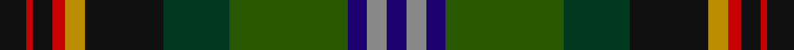

This page is one **sett** — a single exact thread-count. It belongs to the [tartan](/setts/k4r1k3r2lo3k12dg10dgi18db3o3db3/)
(the same proportion at any scale), whose colour order is pattern [BRBGGKYRKRK](/stripes/brbggkyrkrk/).

Sourced from tartans-authority.  It is a [11 stripe tartan](/stripes/stripes11/).

Original link http://www.tartansauthority.com/tartan-ferret/display/10365/

## Register references

External register numbers recorded for this tartan.

- Scottish Register of Tartans: [10365](https://www.tartanregister.gov.uk/tartanDetails?ref=10365)
- Scottish Tartans Authority (ITI): 10365

## Thread count
K/8 R2 K6 R4 DY6 K24 DG20 G36 DB6 N6 DB/6

One full sett is **234 threads**.

## Palette

Palette: <strong>Tartan Register</strong>
<table><thead><tr><th>Colour</th><th>Threads</th><th>Shade</th><th>Base</th><th>OKLCh</th></tr></thead><tbody><tr><td>K/</td><td style="text-align:right;font-variant-numeric:tabular-nums">8</td><td><code style="background-color:#101010;">#101010</code> <small style="color:#888">#101010</small></td><td>K <code style="background-color:#000000;">#000000</code></td><td><small style="color:#888">oklch(17.3% 0.000 89.9)</small></td></tr><tr><td>R</td><td style="text-align:right;font-variant-numeric:tabular-nums">2</td><td><code style="background-color:#C80000;">#C80000</code> <small style="color:#888">#C80000</small></td><td>R <code style="background-color:#CC0000;">#CC0000</code></td><td><small style="color:#888">oklch(52.3% 0.215 29.2)</small></td></tr><tr><td>K</td><td style="text-align:right;font-variant-numeric:tabular-nums">6</td><td><code style="background-color:#101010;">#101010</code> <small style="color:#888">#101010</small></td><td>K <code style="background-color:#000000;">#000000</code></td><td><small style="color:#888">oklch(17.3% 0.000 89.9)</small></td></tr><tr><td>R</td><td style="text-align:right;font-variant-numeric:tabular-nums">4</td><td><code style="background-color:#C80000;">#C80000</code> <small style="color:#888">#C80000</small></td><td>R <code style="background-color:#CC0000;">#CC0000</code></td><td><small style="color:#888">oklch(52.3% 0.215 29.2)</small></td></tr><tr><td>DY</td><td style="text-align:right;font-variant-numeric:tabular-nums">6</td><td><code style="background-color:#BC8C00;">#BC8C00</code> <small style="color:#888">#BC8C00</small></td><td>Y <code style="background-color:#F2BF00;">#F2BF00</code></td><td><small style="color:#888">oklch(66.8% 0.137 84.1)</small></td></tr><tr><td>K</td><td style="text-align:right;font-variant-numeric:tabular-nums">24</td><td><code style="background-color:#101010;">#101010</code> <small style="color:#888">#101010</small></td><td>K <code style="background-color:#000000;">#000000</code></td><td><small style="color:#888">oklch(17.3% 0.000 89.9)</small></td></tr><tr><td>DG</td><td style="text-align:right;font-variant-numeric:tabular-nums">20</td><td><code style="background-color:#003820;">#003820</code> <small style="color:#888">#003820</small></td><td>G <code style="background-color:#006100;">#006100</code></td><td><small style="color:#888">oklch(30.0% 0.070 158.3)</small></td></tr><tr><td>G</td><td style="text-align:right;font-variant-numeric:tabular-nums">36</td><td><code style="background-color:#285800;">#285800</code> <small style="color:#888">#285800</small></td><td>G <code style="background-color:#006100;">#006100</code></td><td><small style="color:#888">oklch(41.0% 0.122 135.8)</small></td></tr><tr><td>DB</td><td style="text-align:right;font-variant-numeric:tabular-nums">6</td><td><code style="background-color:#1C0070;">#1C0070</code> <small style="color:#888">#1C0070</small></td><td>B <code style="background-color:#2A418A;">#2A418A</code></td><td><small style="color:#888">oklch(26.3% 0.162 277.1)</small></td></tr><tr><td>N</td><td style="text-align:right;font-variant-numeric:tabular-nums">6</td><td><code style="background-color:#888888;">#888888</code> <small style="color:#888">#888888</small></td><td>R <code style="background-color:#CC0000;">#CC0000</code></td><td><small style="color:#888">oklch(62.7% 0.000 89.9)</small></td></tr><tr><td>DB/</td><td style="text-align:right;font-variant-numeric:tabular-nums">6</td><td><code style="background-color:#1C0070;">#1C0070</code> <small style="color:#888">#1C0070</small></td><td>B <code style="background-color:#2A418A;">#2A418A</code></td><td><small style="color:#888">oklch(26.3% 0.162 277.1)</small></td></tr></tbody></table>

## Nearest tartans

The nearest existing variants by ΔTartan distance, with this tartan at the top so the swatches line up against it.

ΔTartan

Tartan

Sett

—

<a href="/ttd/edit/#slug=k4r1k3r2lo3k12dg10dgi18db3o3db3~x2">Blake (Personal)</a> <a class="nn-out" href="/variants/s11/k4r1k3r2lo3k12dg10dgi18db3o3db3~x2/" title="open its dictionary page">↗</a>

1.14

<a href="/ttd/edit/#slug=lb4k1y19lo1k19n13r2n4r2~x4&amp;base=k4r1k3r2lo3k12dg10dgi18db3o3db3~x2">Whitson (Name)</a> <a class="nn-out" href="/variants/s9/lb4k1y19lo1k19n13r2n4r2~x4/" title="open its dictionary page">↗</a>

1.21

<a href="/ttd/edit/#slug=dy16k4dy8g2dg19w2g22db15k4w3dg3ly4g30db25w5dg40db16~x2&amp;base=k4r1k3r2lo3k12dg10dgi18db3o3db3~x2">Les Cercles de Fermieres du Quebec</a> <a class="nn-out" href="/variants/s17/dy16k4dy8g2dg19w2g22db15k4w3dg3ly4g30db25w5dg40db16~x2/" title="open its dictionary page">↗</a>

1.24

<a href="/ttd/edit/#slug=r3gi18k10db12k1g2k1db12ly2k10g2gi2g15gi3~x2&amp;base=k4r1k3r2lo3k12dg10dgi18db3o3db3~x2">Leinster</a> <a class="nn-out" href="/variants/s14/r3gi18k10db12k1g2k1db12ly2k10g2gi2g15gi3~x2/" title="open its dictionary page">↗</a>

1.27

<a href="/ttd/edit/#slug=w2t1db14k14dg14r2dg14k14db14ly2~x2&amp;base=k4r1k3r2lo3k12dg10dgi18db3o3db3~x2">Erskine Veterans (Corporate)</a> <a class="nn-out" href="/variants/s10/w2t1db14k14dg14r2dg14k14db14ly2~x2/" title="open its dictionary page">↗</a>

1.27

<a href="/ttd/edit/#slug=k49dy15lb2dy6g6dy16lo3loi23dy9lo2b9~x2&amp;base=k4r1k3r2lo3k12dg10dgi18db3o3db3~x2">State Seal of Wyoming (Fashion)</a> <a class="nn-out" href="/variants/s11/k49dy15lb2dy6g6dy16lo3loi23dy9lo2b9~x2/" title="open its dictionary page">↗</a>

1.27

<a href="/ttd/edit/#slug=r4g4k2g15do5g5do15g6w1db19r2~x2&amp;base=k4r1k3r2lo3k12dg10dgi18db3o3db3~x2">Adams</a> <a class="nn-out" href="/variants/s11/r4g4k2g15do5g5do15g6w1db19r2~x2/" title="open its dictionary page">↗</a>

1.28

<a href="/ttd/edit/#slug=t1dr4t12dr1k7dg12k7do21w1~x2&amp;base=k4r1k3r2lo3k12dg10dgi18db3o3db3~x2">Redgate (Connecticut) Hunting</a> <a class="nn-out" href="/variants/s9/t1dr4t12dr1k7dg12k7do21w1~x2/" title="open its dictionary page">↗</a>

1.28

<a href="/ttd/edit/#slug=r4g4k2g17do5g5do17g6lb1db22r2~x2&amp;base=k4r1k3r2lo3k12dg10dgi18db3o3db3~x2">Adams (Name)</a> <a class="nn-out" href="/variants/s11/r4g4k2g17do5g5do17g6lb1db22r2~x2/" title="open its dictionary page">↗</a>

1.29

<a href="/ttd/edit/#slug=dpi5k1y5dp15dg15g28k2r4~x2&amp;base=k4r1k3r2lo3k12dg10dgi18db3o3db3~x2">Batten of Argyll Clan Tartan</a> <a class="nn-out" href="/variants/s8/dpi5k1y5dp15dg15g28k2r4~x2/" title="open its dictionary page">↗</a>

1.31

<a href="/ttd/edit/#slug=r2y2n9k10g12k1y1k1ly1~x4&amp;base=k4r1k3r2lo3k12dg10dgi18db3o3db3~x2">Trades House</a> <a class="nn-out" href="/variants/s9/r2y2n9k10g12k1y1k1ly1~x4/" title="open its dictionary page">↗</a>

## Neighbour map

Every grey dot is one of 14360 variants placed by the first two principal components of the ΔTartan feature space (44% of its variance). Red is this tartan; blue dots are its nearest — click one to open its page.

<svg viewBox="0 0 640 380" role="img" style="max-width:100%;height:auto;border:1px solid #e0e0e0;border-radius:4px;display:block" xmlns="http://www.w3.org/2000/svg"><image href="/nn/cloud.v1.png" width="640" height="380"/><a href="/variants/s9/lb4k1y19lo1k19n13r2n4r2~x4/"><circle cx="175.6" cy="145.8" r="4" fill="#3465a4"><title>Whitson (Name)</title></circle></a><a href="/variants/s17/dy16k4dy8g2dg19w2g22db15k4w3dg3ly4g30db25w5dg40db16~x2/"><circle cx="117.3" cy="114.2" r="4" fill="#3465a4"><title>Les Cercles de Fermieres du Quebec</title></circle></a><a href="/variants/s14/r3gi18k10db12k1g2k1db12ly2k10g2gi2g15gi3~x2/"><circle cx="119.1" cy="136.4" r="4" fill="#3465a4"><title>Leinster</title></circle></a><a href="/variants/s10/w2t1db14k14dg14r2dg14k14db14ly2~x2/"><circle cx="127.0" cy="167.8" r="4" fill="#3465a4"><title>Erskine Veterans (Corporate)</title></circle></a><a href="/variants/s11/k49dy15lb2dy6g6dy16lo3loi23dy9lo2b9~x2/"><circle cx="170.2" cy="97.5" r="4" fill="#3465a4"><title>State Seal of Wyoming (Fashion)</title></circle></a><a href="/variants/s11/r4g4k2g15do5g5do15g6w1db19r2~x2/"><circle cx="193.2" cy="149.3" r="4" fill="#3465a4"><title>Adams</title></circle></a><a href="/variants/s9/t1dr4t12dr1k7dg12k7do21w1~x2/"><circle cx="166.3" cy="148.8" r="4" fill="#3465a4"><title>Redgate (Connecticut) Hunting</title></circle></a><a href="/variants/s11/r4g4k2g17do5g5do17g6lb1db22r2~x2/"><circle cx="208.0" cy="142.2" r="4" fill="#3465a4"><title>Adams (Name)</title></circle></a><a href="/variants/s8/dpi5k1y5dp15dg15g28k2r4~x2/"><circle cx="201.0" cy="133.7" r="4" fill="#3465a4"><title>Batten of Argyll Clan Tartan</title></circle></a><a href="/variants/s9/r2y2n9k10g12k1y1k1ly1~x4/"><circle cx="154.5" cy="162.1" r="4" fill="#3465a4"><title>Trades House</title></circle></a><circle cx="134.9" cy="132.1" r="5" fill="#c00000"/></svg>

ID: /variants/s11/k4r1k3r2lo3k12dg10dgi18db3o3db3~x2/
