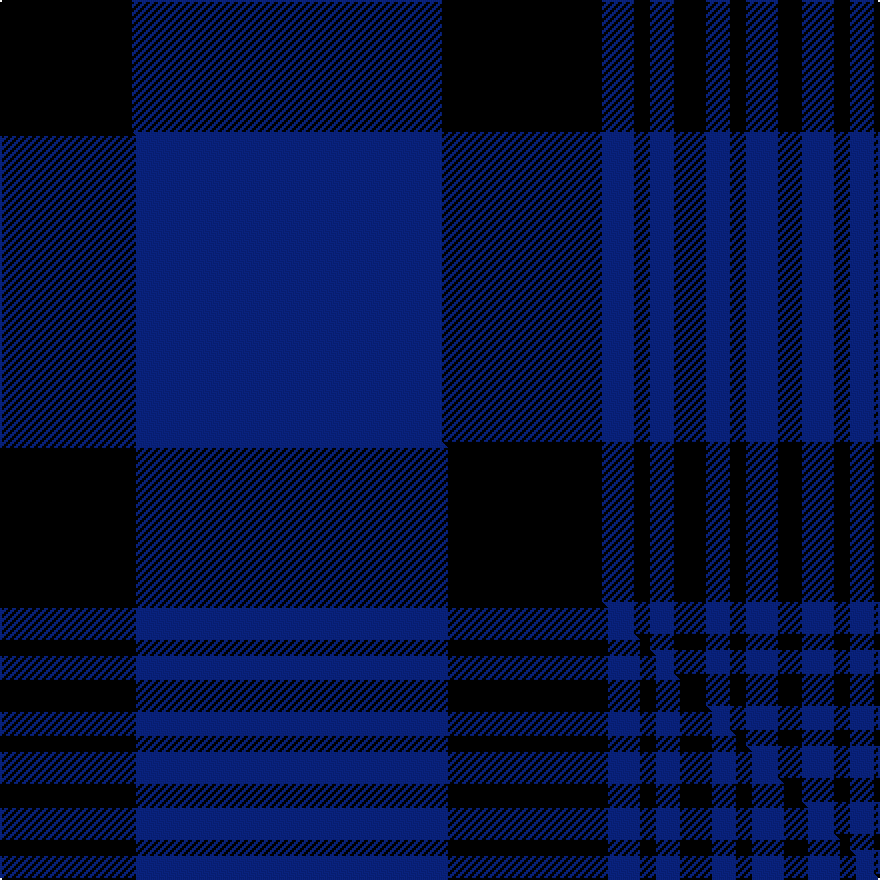

This is one **variant** — a specific cloth: this exact thread count and colourway, with its own
provenance below. It is one weaving of the [sett](/setts/k66db155k80db16k8db12k16db12k8db16k12/) (the scale-free proportion — the
same cloth at any scale or shade), whose colour order is pattern [KBKBKBKBKBK](/stripes/kbkbkbkbkbk/).

Part of the [Azabu Tailor](/tartans/a/az/azabu-tailor/) tartan — the named design grouping this sett with its other cloths.

Sourced from tartans-authority.  It is a [11 stripe tartan](/stripes/stripes11/).

Original link [https://www.tartanregister.gov.uk/tartanDetails.aspx?ref=10994](https://www.tartanregister.gov.uk/tartanDetails.aspx?ref=10994)

Dataset <small>— provenance for this record, inherited from the source manifest</small>

<dl class="dataset-prov">
<dt>source</dt><dd><a href="/sources/tartans-authority/">Scottish Tartans Authority</a></dd>
<dt>data captured from</dt><dd><a href="https://github.com/thetartan/tartan-database/blob/master/data/tartans-authority/data.csv">https://github.com/thetartan/tartan-database/blob/master/data/tartans-authority/data.csv</a></dd>
<dt>data date</dt><dd>2014 <small>(this record)</small></dd>
<dt>licence</dt><dd><a href="https://creativecommons.org/licenses/by-nc-nd/4.0/">CC BY-NC-ND 4.0</a></dd>
</dl>

Capture chain <small>— the hands this data passed through, oldest first; each capture carries its own licence</small>

<ol class="capture-chain">
<li><a href="https://www.tartansauthority.com/">Scottish Tartans Authority</a> <small>the heritage body's archive — its tartan-ferret record browser is retired (links repaired to the SRT, above)</small></li>
<li><a href="https://github.com/thetartan/tartan-database">thetartan/tartan-database</a> <small>2016-2017</small> · <a href="https://creativecommons.org/licenses/by-nc-nd/4.0/">CC BY-NC-ND 4.0</a> <small>Levko Kravets's frozen compilation — the capture we vendored, and where its CC licence text came from</small></li>
<li>this dictionary <small>captured 2026-06-10 · commit 5bf86c7566</small> <small>each re-capture is a git commit to data/sources</small></li>
</ol>

## Register references

External register numbers recorded for this tartan.

- Scottish Register of Tartans: [10994](https://www.tartanregister.gov.uk/tartanDetails?ref=10994)
- Scottish Tartans Authority (ITI): 10994

## Thread count
K/66 DB155 K80 DB16 K8 DB12 K16 DB12 K8 DB16 K/12

One full sett is **724 threads**.

## Palette
<table><thead><tr><th>Colour</th><th>Shade</th><th>OKLCh</th></tr></thead><tbody><tr><td>DB</td><td><code style="background-color:#082077;">#082077</code> <small style="color:#888">#082077</small></td><td><small style="color:#888">oklch(30.0% 0.149 265.1)</small></td></tr><tr><td>K</td><td><code style="background-color:#000000;">#000000</code> <small style="color:#888">#000000</small></td><td><small style="color:#888">oklch(0.0% 0.000 0.0)</small></td></tr></tbody></table>

# Sample pattern

## Compared to the master

This cloth is one sett of its design; the master sett (the exemplar the design is anchored on) is below for comparison.

Its **ΔTartan distance** from the master is **0.01** — the same measure the nearest-tartans table ranks by (0 is identical; a re-scale of the same cloth is near 0, a recolour or a different proportion further).

<figure class="master-compare" style="margin:0">

this sett
master sett ★

<figcaption style="color:#888;font-size:smaller">One weave of this sett against the <a href="/setts/k17db39k20db4k2db3k4db3k2db4k3/">master sett ★</a>, split on the diagonal: a shared proportion runs seamlessly across it with only the shades shifting; a different proportion breaks on it.</figcaption>
</figure>

## Nearest tartan variants

The nearest existing variants by ΔTartan distance, with this cloth at the top so the swatches line up against it.

ΔTartan

Threads

Variant

Sett

—

724

<a href="/variants/s11/k66db155k80db16k8db12k16db12k8db16k12/">Azabu Tailor (Corporate)</a>

<a href="/ttd/edit/#slug=k17db39k20db4k2db3k4db3k2db4k3~x4&amp;base=k66db155k80db16k8db12k16db12k8db16k12" title="compare in the TTD">0.01</a>

728

<a href="/variants/s11/k17db39k20db4k2db3k4db3k2db4k3~x4/">Azabu Tailor</a>

<a href="/ttd/edit/#slug=db28k1w1db2k1r2k1db2w1k1db15k16db3k16~x2&amp;base=k66db155k80db16k8db12k16db12k8db16k12" title="compare in the TTD">1.61</a>

272

<a href="/variants/s14/db28k1w1db2k1r2k1db2w1k1db15k16db3k16~x2/">Bristow Helicopters</a>

<a href="/ttd/edit/#slug=db16k2ly2k2ly2k15db14k2db14k15db16k4w1~x2&amp;base=k66db155k80db16k8db12k16db12k8db16k12" title="compare in the TTD">2.55</a>

386

<a href="/variants/s13/db16k2ly2k2ly2k15db14k2db14k15db16k4w1~x2/">Bredillet (Personal)</a>

<a href="/ttd/edit/#slug=db36k4db4k34b3k3w4k3b3k34db4k4db36k4~x2&amp;base=k66db155k80db16k8db12k16db12k8db16k12" title="compare in the TTD">3.01</a>

624

<a href="/variants/s14/db36k4db4k34b3k3w4k3b3k34db4k4db36k4~x2/">Slanj Dress</a>

<a href="/ttd/edit/#slug=k3r2k12db8k2db4k2db4k12db22y3~x2&amp;base=k66db155k80db16k8db12k16db12k8db16k12" title="compare in the TTD">3.10</a>

284

<a href="/variants/s11/k3r2k12db8k2db4k2db4k12db22y3~x2/">Caledonian Dragon (Corporate)</a>

<a href="/ttd/edit/#slug=k7r2k33db33k2db7~x2&amp;base=k66db155k80db16k8db12k16db12k8db16k12" title="compare in the TTD">3.67</a>

308

<a href="/variants/s6/k7r2k33db33k2db7~x2/">Casterton (Corporate)</a>

<a href="/ttd/edit/#slug=k3dr1k14db14dr1db1dr1db1dr2~x4&amp;base=k66db155k80db16k8db12k16db12k8db16k12" title="compare in the TTD">3.75</a>

284

<a href="/variants/s9/k3dr1k14db14dr1db1dr1db1dr2~x4/">Angus (District/Clan)</a>

<a href="/ttd/edit/#slug=k20db2k6db2k4db27w2db8~x2&amp;base=k66db155k80db16k8db12k16db12k8db16k12" title="compare in the TTD">3.75</a>

228

<a href="/variants/s8/k20db2k6db2k4db27w2db8~x2/">Pride of Kinross</a>

<a href="/ttd/edit/#slug=db12k12g1k12db12g1db12k12g1k12db12k1~x4&amp;base=k66db155k80db16k8db12k16db12k8db16k12" title="compare in the TTD">3.77</a>

748

<a href="/variants/s12/db12k12g1k12db12g1db12k12g1k12db12k1~x4/">Marchmont (Personal)</a>

<a href="/ttd/edit/#slug=db3k12db3k17db40k2db2w1~x2&amp;base=k66db155k80db16k8db12k16db12k8db16k12" title="compare in the TTD">3.83</a>

312

<a href="/variants/s8/db3k12db3k17db40k2db2w1~x2/">Blue Spirit Fashion Tartan</a>

## Neighbour map

Every grey dot is one of 13621 variants placed by the first two principal components of the ΔTartan feature space (42% of its variance). Red is this tartan; blue dots are its nearest — click one to open its page. The map is a flat projection of a many-dimensional space — [how to read it](/posts/neighbourhood-maps/).

<svg viewBox="0 0 640 380" role="img" style="max-width:100%;height:auto;border:1px solid #e0e0e0;border-radius:4px;display:block" xmlns="http://www.w3.org/2000/svg"><image href="/nn/cloud.v1.png" width="640" height="380"/><a href="/variants/s11/k17db39k20db4k2db3k4db3k2db4k3~x4/"><circle cx="395.1" cy="157.0" r="4" fill="#3465a4"><title>Azabu Tailor</title></circle></a><a href="/variants/s14/db28k1w1db2k1r2k1db2w1k1db15k16db3k16~x2/"><circle cx="337.1" cy="92.4" r="4" fill="#3465a4"><title>Bristow Helicopters</title></circle></a><a href="/variants/s13/db16k2ly2k2ly2k15db14k2db14k15db16k4w1~x2/"><circle cx="302.0" cy="153.9" r="4" fill="#3465a4"><title>Bredillet (Personal)</title></circle></a><a href="/variants/s14/db36k4db4k34b3k3w4k3b3k34db4k4db36k4~x2/"><circle cx="279.9" cy="138.8" r="4" fill="#3465a4"><title>Slanj Dress</title></circle></a><a href="/variants/s11/k3r2k12db8k2db4k2db4k12db22y3~x2/"><circle cx="281.2" cy="166.5" r="4" fill="#3465a4"><title>Caledonian Dragon (Corporate)</title></circle></a><a href="/variants/s6/k7r2k33db33k2db7~x2/"><circle cx="349.5" cy="186.7" r="4" fill="#3465a4"><title>Casterton (Corporate)</title></circle></a><a href="/variants/s9/k3dr1k14db14dr1db1dr1db1dr2~x4/"><circle cx="325.3" cy="168.6" r="4" fill="#3465a4"><title>Angus (District/Clan)</title></circle></a><a href="/variants/s8/k20db2k6db2k4db27w2db8~x2/"><circle cx="338.1" cy="178.2" r="4" fill="#3465a4"><title>Pride of Kinross</title></circle></a><a href="/variants/s12/db12k12g1k12db12g1db12k12g1k12db12k1~x4/"><circle cx="294.8" cy="206.3" r="4" fill="#3465a4"><title>Marchmont (Personal)</title></circle></a><a href="/variants/s8/db3k12db3k17db40k2db2w1~x2/"><circle cx="427.8" cy="126.3" r="4" fill="#3465a4"><title>Blue Spirit Fashion Tartan</title></circle></a><circle cx="395.4" cy="157.3" r="5" fill="#c00000"/><text x="320" y="376" text-anchor="middle" font-size="11" fill="#999">ground</text><text x="11" y="190" text-anchor="middle" font-size="11" fill="#999" transform="rotate(-90 11 190)">complexity</text></svg>

ID: /variants/s11/k66db155k80db16k8db12k16db12k8db16k12/
