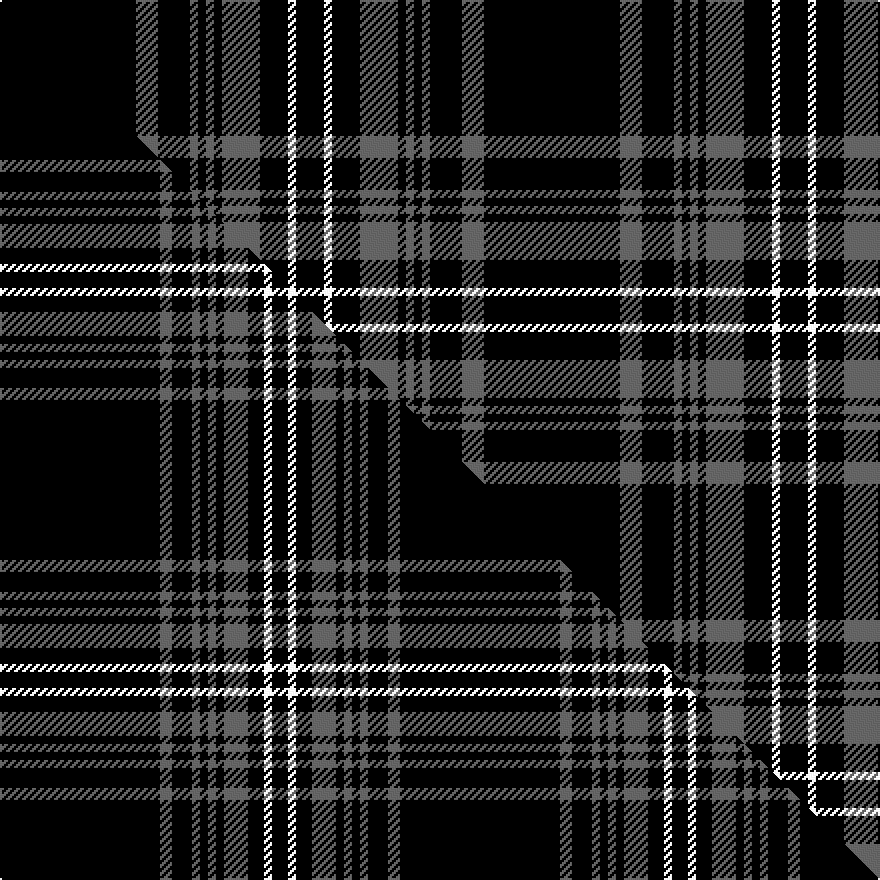

This page is one **sett** — a single exact thread-count. It belongs to the [tartan](/setts/k68n11k16n4k4n4k4n19k14w4k14/)
(the same proportion at any scale), whose colour order is pattern [KBKBKBKBKWK](/stripes/kbkbkbkbkwk/).

Part of the [Stewart Mourning](/tartans/stewart-mourning/) tartan — the named design grouping this sett with its other cloths.

Sourced from weddslist.  It is a [11 stripe tartan](/stripes/stripes11/).

Original link http://www.weddslist.com/cgi-bin/tartans/pg.pl?source=sts

## Thread count
K/68 N11 K16 N4 K4 N4 K4 N19 K14 W4 K/14

One full sett is **242 threads**.

## Palette
<table><thead><tr><th>Colour</th><th>Shade</th><th>OKLCh</th></tr></thead><tbody><tr><td>K</td><td><code style="background-color:#000000;">#000000</code> <small style="color:#888">#000000</small></td><td><small style="color:#888">oklch(0.0% 0.000 0.0)</small></td></tr><tr><td>W</td><td><code style="background-color:#F7F7F7;">#F7F7F7</code> <small style="color:#888">#F7F7F7</small></td><td><small style="color:#888">oklch(97.6% 0.000 89.9)</small></td></tr><tr><td>N</td><td><code style="background-color:#636363;">#636363</code> <small style="color:#888">#636363</small></td><td><small style="color:#888">oklch(50.0% 0.000 89.9)</small></td></tr></tbody></table>

# Sample pattern

## Compared to the master

This cloth is one sett of its design; the master sett (the exemplar the design is anchored on) is below for comparison.

Its **ΔTartan distance** from the master is **0.46** — the same measure the nearest-tartans table ranks by (0 is identical; a re-scale of the same cloth is near 0, a recolour or a different proportion further).

<figure class="master-compare" style="margin:0">

this sett
master sett ★

<figcaption style="color:#888;font-size:smaller">One weave of this sett against the <a href="/setts/k40n3k5n2k2n2k2n6k4w2k4/">master sett ★</a>, split on the diagonal: a shared proportion runs seamlessly across it with only the shades shifting; a different proportion breaks on it.</figcaption>
</figure>

## Nearest tartan variants

The nearest existing variants by ΔTartan distance, with this cloth at the top so the swatches line up against it.

ΔTartan

Threads

Variant

Sett

—

242

<a href="/variants/s11/k68n11k16n4k4n4k4n19k14w4k14/">Stewart Mourning</a>

<a href="/ttd/edit/#slug=k40n3k5n2k2n2k2n6k4w2k4~x2&amp;base=k68n11k16n4k4n4k4n19k14w4k14" title="compare in the TTD">0.46</a>

200

<a href="/variants/s11/k40n3k5n2k2n2k2n6k4w2k4~x2/">Stewart/Stuart Mourning</a>

<a href="/ttd/edit/#slug=k36w4k6w1k1w1k1w8k4w1k6~x2&amp;base=k68n11k16n4k4n4k4n19k14w4k14" title="compare in the TTD">1.51</a>

192

<a href="/variants/s11/k36w4k6w1k1w1k1w8k4w1k6~x2/">Royal Stewart B &amp; W (Universal?)</a>

<a href="/ttd/edit/#slug=r2k25dy2k20n5k2n4k3n3k4n2k6y2~x2&amp;base=k68n11k16n4k4n4k4n19k14w4k14" title="compare in the TTD">1.56</a>

312

<a href="/variants/s13/r2k25dy2k20n5k2n4k3n3k4n2k6y2~x2/">Gold-Smith (Personal)</a>

<a href="/ttd/edit/#slug=k27w2k2w2k2w2k2w2k4r5~x4&amp;base=k68n11k16n4k4n4k4n19k14w4k14" title="compare in the TTD">1.90</a>

272

<a href="/variants/s10/k27w2k2w2k2w2k2w2k4r5~x4/">Reiver Check</a>

<a href="/ttd/edit/#slug=k22n17k2n4k2n2k37n4k2r3~x2&amp;base=k68n11k16n4k4n4k4n19k14w4k14" title="compare in the TTD">1.99</a>

330

<a href="/variants/s10/k22n17k2n4k2n2k37n4k2r3~x2/">Witches' Blood, The</a>

<a href="/ttd/edit/#slug=k49o8k4n6oi4n6k4o8k49oi2~n1900000-oi2500000&amp;base=k68n11k16n4k4n4k4n19k14w4k14" title="compare in the TTD">2.35</a>

229

<a href="/variants/s10/k49o8k4n6oi4n6k4o8k49oi2~n1900000-oi2500000/">Harley Davidson</a>

<a href="/ttd/edit/#slug=k3n6k8lb2k8n3k5n36k2n3~x2~n1900000&amp;base=k68n11k16n4k4n4k4n19k14w4k14" title="compare in the TTD">2.35</a>

292

<a href="/variants/s10/k3n6k8lb2k8n3k5n36k2n3~x2~n1900000/">City Building (Glasgow) LLP</a>

<a href="/ttd/edit/#slug=k3n6k8lb2k8n3k5n36k2n3~x2&amp;base=k68n11k16n4k4n4k4n19k14w4k14" title="compare in the TTD">2.36</a>

292

<a href="/variants/s10/k3n6k8lb2k8n3k5n36k2n3~x2/">City Building (Glasgow) LLP (Corp)</a>

<a href="/ttd/edit/#slug=n1k21n5k3n5k9r1~x4&amp;base=k68n11k16n4k4n4k4n19k14w4k14" title="compare in the TTD">2.48</a>

352

<a href="/variants/s7/n1k21n5k3n5k9r1~x4/">Sunderland of Scotland (Fashion)</a>

<a href="/ttd/edit/#slug=k10n5k2n5k10w1k26w1n4w1k5w1~x2&amp;base=k68n11k16n4k4n4k4n19k14w4k14" title="compare in the TTD">2.48</a>

262

<a href="/variants/s12/k10n5k2n5k10w1k26w1n4w1k5w1~x2/">Clergy #3</a>

## Neighbour map

Every grey dot is one of 13620 variants placed by the first two principal components of the ΔTartan feature space (42% of its variance). Red is this tartan; blue dots are its nearest — click one to open its page.

<svg viewBox="0 0 640 380" role="img" style="max-width:100%;height:auto;border:1px solid #e0e0e0;border-radius:4px;display:block" xmlns="http://www.w3.org/2000/svg"><image href="/nn/cloud.v1.png" width="640" height="380"/><a href="/variants/s11/k40n3k5n2k2n2k2n6k4w2k4~x2/"><circle cx="397.0" cy="78.0" r="4" fill="#3465a4"><title>Stewart/Stuart Mourning</title></circle></a><a href="/variants/s11/k36w4k6w1k1w1k1w8k4w1k6~x2/"><circle cx="474.1" cy="84.4" r="4" fill="#3465a4"><title>Royal Stewart B &amp; W (Universal?)</title></circle></a><a href="/variants/s13/r2k25dy2k20n5k2n4k3n3k4n2k6y2~x2/"><circle cx="385.0" cy="109.6" r="4" fill="#3465a4"><title>Gold-Smith (Personal)</title></circle></a><a href="/variants/s10/k27w2k2w2k2w2k2w2k4r5~x4/"><circle cx="392.5" cy="113.5" r="4" fill="#3465a4"><title>Reiver Check</title></circle></a><a href="/variants/s10/k22n17k2n4k2n2k37n4k2r3~x2/"><circle cx="392.5" cy="128.3" r="4" fill="#3465a4"><title>Witches' Blood, The</title></circle></a><a href="/variants/s10/k49o8k4n6oi4n6k4o8k49oi2~n1900000-oi2500000/"><circle cx="425.7" cy="99.2" r="4" fill="#3465a4"><title>Harley Davidson</title></circle></a><a href="/variants/s10/k3n6k8lb2k8n3k5n36k2n3~x2~n1900000/"><circle cx="374.9" cy="133.0" r="4" fill="#3465a4"><title>City Building (Glasgow) LLP</title></circle></a><a href="/variants/s10/k3n6k8lb2k8n3k5n36k2n3~x2/"><circle cx="370.3" cy="131.8" r="4" fill="#3465a4"><title>City Building (Glasgow) LLP (Corp)</title></circle></a><a href="/variants/s7/n1k21n5k3n5k9r1~x4/"><circle cx="432.8" cy="151.3" r="4" fill="#3465a4"><title>Sunderland of Scotland (Fashion)</title></circle></a><a href="/variants/s12/k10n5k2n5k10w1k26w1n4w1k5w1~x2/"><circle cx="422.8" cy="110.9" r="4" fill="#3465a4"><title>Clergy #3</title></circle></a><circle cx="416.1" cy="123.9" r="5" fill="#c00000"/><text x="320" y="376" text-anchor="middle" font-size="11" fill="#999">ground</text><text x="11" y="190" text-anchor="middle" font-size="11" fill="#999" transform="rotate(-90 11 190)">complexity</text></svg>

ID: /variants/s11/k68n11k16n4k4n4k4n19k14w4k14/
