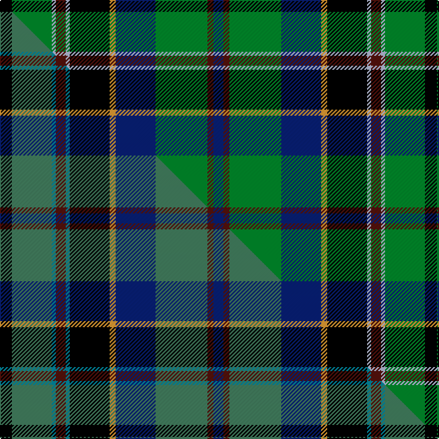

This is one **variant** — a specific cloth: this exact thread count and colourway, with its own
provenance below. It is one weaving of the [sett](/tartans/s/st/stephenson/) (the scale-free proportion — the
same cloth at any scale or shade), whose colour order is pattern [BBGBYKWBWGK](/stripes/bbgbykwbwgk/).

Part of the [Stephenson](/tartans/s/st/stephenson/) tartan — the named design grouping this sett with its other cloths.

Sourced from tartans-authority.  It is a [11 stripe tartan](/stripes/stripes11/).

Original link <code>http://www.tartansauthority.com/tartan-ferret/display/517/</code> — retired · [Internet Archive copy](https://web.archive.org/web/*/http://www.tartansauthority.com/tartan-ferret/display/517/*)

Dataset <small>— provenance for this record, inherited from the source manifest</small>

<dl class="dataset-prov">
<dt>source</dt><dd><a href="/sources/tartans-authority/">Scottish Tartans Authority</a></dd>
<dt>data captured from</dt><dd><a href="https://github.com/thetartan/tartan-database/blob/master/data/tartans-authority/data.csv">https://github.com/thetartan/tartan-database/blob/master/data/tartans-authority/data.csv</a></dd>
<dt>data date</dt><dd>1975 <small>(this record)</small></dd>
<dt>licence</dt><dd><a href="https://creativecommons.org/licenses/by-nc-nd/4.0/">CC BY-NC-ND 4.0</a></dd>
</dl>

Capture chain <small>— the hands this data passed through, oldest first; each capture carries its own licence</small>

<ol class="capture-chain">
<li><a href="https://www.tartansauthority.com/">Scottish Tartans Authority</a> <small>the heritage body’s archive — its tartan-ferret record browser is retired; dead record links are shown unlinked, with an Internet Archive copy (ITI numbers are not SRT references)</small></li>
<li><a href="https://github.com/thetartan/tartan-database">thetartan/tartan-database</a> <small>2016-2017</small> · <a href="https://creativecommons.org/licenses/by-nc-nd/4.0/">CC BY-NC-ND 4.0</a> <small>Levko Kravets's frozen compilation — the capture we vendored, and where its CC licence text came from</small></li>
<li>this dictionary <small>captured 2026-06-10 · commit 5bf86c7566</small> <small>each re-capture is a git commit to data/sources</small></li>
</ol>

## Register references

External register numbers recorded for this tartan.

- Scottish Tartans Authority (ITI): 517

## Thread count
K/12 G40 LB4 DR10 LB4 K40 LO6 DB40 G52 DR6 DB/10

One full sett is **426 threads**.

## Palette
<table><thead><tr><th>Colour</th><th>Shade</th><th>OKLCh</th></tr></thead><tbody><tr><td>LB</td><td><code style="background-color:#B5BBDE;">#B5BBDE</code> <small style="color:#888">#B5BBDE</small></td><td><small style="color:#888">oklch(79.9% 0.050 277.6)</small></td></tr><tr><td>DB</td><td><code style="background-color:#082077;">#082077</code> <small style="color:#888">#082077</small></td><td><small style="color:#888">oklch(30.0% 0.149 265.1)</small></td></tr><tr><td>DR</td><td><code style="background-color:#55120C;">#55120C</code> <small style="color:#888">#55120C</small></td><td><small style="color:#888">oklch(30.0% 0.099 29.3)</small></td></tr><tr><td>LO</td><td><code style="background-color:#FF9C34;">#FF9C34</code> <small style="color:#888">#FF9C34</small></td><td><small style="color:#888">oklch(77.9% 0.161 61.8)</small></td></tr><tr><td>G</td><td><code style="background-color:#008B2A;">#008B2A</code> <small style="color:#888">#008B2A</small></td><td><small style="color:#888">oklch(55.4% 0.170 145.9)</small></td></tr><tr><td>K</td><td><code style="background-color:#000000;">#000000</code> <small style="color:#888">#000000</small></td><td><small style="color:#888">oklch(0.0% 0.000 0.0)</small></td></tr></tbody></table>

# Sample pattern

## Compared to the master

This cloth is one sett of its design; the master sett (the exemplar the design is anchored on) is below for comparison.

Its **ΔTartan distance** from the master is **0.10** — the same measure the nearest-tartans table ranks by (0 is identical; a re-scale of the same cloth is near 0, a recolour or a different proportion further).

<figure class="master-compare" style="margin:0">

this sett
master sett ★

<figcaption style="color:#888;font-size:smaller">One weave of this sett against the <a href="/setts/k6g20t2dr5t2k20lo3db20g26dr3db5/">master sett ★</a>, split on the diagonal: a shared proportion runs seamlessly across it with only the shades shifting; a different proportion breaks on it.</figcaption>
</figure>

## Nearest tartan variants

The nearest existing variants by ΔTartan distance, with this cloth at the top so the swatches line up against it.

ΔTartan

Threads

Variant

Sett

—

426

<a href="/variants/s11/k6g20lb2dr5lb2k20lo3db20g26dr3db5~x2/">Stephenson (Name)</a>

<a href="/ttd/edit/#slug=k6g20lb2r5lb2k20y3db20g26r3db5~x2&amp;base=k6g20lb2dr5lb2k20lo3db20g26dr3db5~x2" title="compare in the TTD">0.33</a>

426

<a href="/variants/s11/k6g20lb2r5lb2k20y3db20g26r3db5~x2/">Stephenson Clan Tartan</a>

<a href="/ttd/edit/#slug=k6g20lb2r6lb2k20y3db20g26r3db6~x2&amp;base=k6g20lb2dr5lb2k20lo3db20g26dr3db5~x2" title="compare in the TTD">0.36</a>

432

<a href="/variants/s11/k6g20lb2r6lb2k20y3db20g26r3db6~x2/">Stevenson</a>

<a href="/ttd/edit/#slug=g30w3g4y5g4w3g6k14lb3k14db18w4~x2&amp;base=k6g20lb2dr5lb2k20lo3db20g26dr3db5~x2" title="compare in the TTD">1.52</a>

364

<a href="/variants/s12/g30w3g4y5g4w3g6k14lb3k14db18w4~x2/">MacKellar</a>

<a href="/ttd/edit/#slug=g12r2g2r5g16db3n2k2n3db6k20y3~x2&amp;base=k6g20lb2dr5lb2k20lo3db20g26dr3db5~x2" title="compare in the TTD">1.59</a>

274

<a href="/variants/s12/g12r2g2r5g16db3n2k2n3db6k20y3~x2/">Kelsey, William (Personal)</a>

<a href="/ttd/edit/#slug=db17dp4db2k11g33y4g33k11db2dp4db17lb6~x2&amp;base=k6g20lb2dr5lb2k20lo3db20g26dr3db5~x2" title="compare in the TTD">1.63</a>

530

<a href="/variants/s12/db17dp4db2k11g33y4g33k11db2dp4db17lb6~x2/">East Lothian (Fashion) Fashion Tartan</a>

<a href="/ttd/edit/#slug=g12r2g2r5g16db3n2k2n3db6k20ly3~x2&amp;base=k6g20lb2dr5lb2k20lo3db20g26dr3db5~x2" title="compare in the TTD">1.65</a>

274

<a href="/variants/s12/g12r2g2r5g16db3n2k2n3db6k20ly3~x2/">Kelsey, William (Personal)</a>

<a href="/ttd/edit/#slug=g30w3g4ly5g4w3g6k14lb3k14db18w4~x2&amp;base=k6g20lb2dr5lb2k20lo3db20g26dr3db5~x2" title="compare in the TTD">1.71</a>

364

<a href="/variants/s12/g30w3g4ly5g4w3g6k14lb3k14db18w4~x2/">MacKellar</a>

<a href="/ttd/edit/#slug=db7w2g3db18y2k15y2g17r5g3r2g7~x2&amp;base=k6g20lb2dr5lb2k20lo3db20g26dr3db5~x2" title="compare in the TTD">1.73</a>

304

<a href="/variants/s12/db7w2g3db18y2k15y2g17r5g3r2g7~x2/">Paisley District Tartan</a>

<a href="/ttd/edit/#slug=k7t20lb2r6lb2k20y3g20t27r3t6~x2&amp;base=k6g20lb2dr5lb2k20lo3db20g26dr3db5~x2" title="compare in the TTD">1.73</a>

438

<a href="/variants/s11/k7t20lb2r6lb2k20y3g20t27r3t6~x2/">Stinson (Name)</a>

<a href="/ttd/edit/#slug=k6g14lb2r3lb2k16y2b16g16r3~x2&amp;base=k6g20lb2dr5lb2k20lo3db20g26dr3db5~x2" title="compare in the TTD">1.74</a>

302

<a href="/variants/s10/k6g14lb2r3lb2k16y2b16g16r3~x2/">Unnamed 4</a>

## Neighbour map

Every grey dot is one of 13657 variants placed by the first two principal components of the ΔTartan feature space (42% of its variance). Red is this tartan; blue dots are its nearest — click one to open its page. The map is a flat projection of a many-dimensional space — [how to read it](/posts/neighbourhood-maps/).

<svg viewBox="0 0 640 380" role="img" style="max-width:100%;height:auto;border:1px solid #e0e0e0;border-radius:4px;display:block" xmlns="http://www.w3.org/2000/svg"><image href="/nn/cloud.v1.png" width="640" height="380"/><a href="/variants/s11/k6g20lb2r5lb2k20y3db20g26r3db5~x2/"><circle cx="125.6" cy="134.6" r="4" fill="#3465a4"><title>Stephenson Clan Tartan</title></circle></a><a href="/variants/s11/k6g20lb2r6lb2k20y3db20g26r3db6~x2/"><circle cx="120.7" cy="136.7" r="4" fill="#3465a4"><title>Stevenson</title></circle></a><a href="/variants/s12/g30w3g4y5g4w3g6k14lb3k14db18w4~x2/"><circle cx="102.0" cy="136.6" r="4" fill="#3465a4"><title>MacKellar</title></circle></a><a href="/variants/s12/g12r2g2r5g16db3n2k2n3db6k20y3~x2/"><circle cx="111.9" cy="133.9" r="4" fill="#3465a4"><title>Kelsey, William (Personal)</title></circle></a><a href="/variants/s12/db17dp4db2k11g33y4g33k11db2dp4db17lb6~x2/"><circle cx="164.6" cy="124.0" r="4" fill="#3465a4"><title>East Lothian (Fashion) Fashion Tartan</title></circle></a><a href="/variants/s12/g12r2g2r5g16db3n2k2n3db6k20ly3~x2/"><circle cx="111.7" cy="135.2" r="4" fill="#3465a4"><title>Kelsey, William (Personal)</title></circle></a><a href="/variants/s12/g30w3g4ly5g4w3g6k14lb3k14db18w4~x2/"><circle cx="99.8" cy="136.0" r="4" fill="#3465a4"><title>MacKellar</title></circle></a><a href="/variants/s12/db7w2g3db18y2k15y2g17r5g3r2g7~x2/"><circle cx="94.8" cy="146.4" r="4" fill="#3465a4"><title>Paisley District Tartan</title></circle></a><a href="/variants/s11/k7t20lb2r6lb2k20y3g20t27r3t6~x2/"><circle cx="147.9" cy="136.0" r="4" fill="#3465a4"><title>Stinson (Name)</title></circle></a><a href="/variants/s10/k6g14lb2r3lb2k16y2b16g16r3~x2/"><circle cx="83.1" cy="159.6" r="4" fill="#3465a4"><title>Unnamed 4</title></circle></a><circle cx="127.5" cy="136.3" r="5" fill="#c00000"/><text x="320" y="376" text-anchor="middle" font-size="11" fill="#999">ground</text><text x="11" y="190" text-anchor="middle" font-size="11" fill="#999" transform="rotate(-90 11 190)">complexity</text></svg>

ID: /variants/s11/k6g20lb2dr5lb2k20lo3db20g26dr3db5~x2/
