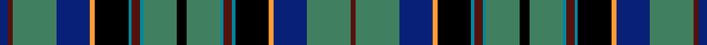

This page is one **sett** — a single exact thread-count. It belongs to the [tartan](/setts/k6g20t2dr5t2k20lo3db20g26dr3db5/)
(the same proportion at any scale), whose colour order is pattern [BBGBYKBBBGKGBBBKYBGB](/stripes/bbgbykbbbgkgbbbkybgb/).

Part of the [Stephenson](/tartans/stephenson/) tartan — the named design grouping this sett with its other cloths.

Sourced from register-of-tartans.  It is a [20 stripe tartan](/stripes/stripes20/).

Original link [https://www.tartanregister.gov.uk/tartanDetails.aspx?ref=3917](https://www.tartanregister.gov.uk/tartanDetails.aspx?ref=3917)

Dataset <small>— provenance for this record, inherited from the source manifest</small>

<dl class="dataset-prov">
<dt>source</dt><dd><a href="/sources/register-of-tartans/">Scottish Register of Tartans</a></dd>
<dt>data captured from</dt><dd><a href="https://github.com/thetartan/tartan-database/blob/master/data/register-of-tartans/data.csv">https://github.com/thetartan/tartan-database/blob/master/data/register-of-tartans/data.csv</a></dd>
<dt>data date</dt><dd>1970 <small>(this record)</small></dd>
<dt>licence</dt><dd><a href="https://www.tartanregister.gov.uk/copyright">Crown copyright</a></dd>
</dl>

Capture chain <small>— the hands this data passed through, oldest first; each capture carries its own licence</small>

<ol class="capture-chain">
<li><a href="https://www.tartanregister.gov.uk/">Scottish Register of Tartans</a> · <a href="https://www.tartanregister.gov.uk/copyright">Crown copyright</a> <small>the living register — still published by National Records of Scotland</small></li>
<li><a href="https://github.com/thetartan/tartan-database">thetartan/tartan-database</a> <small>2016-2017</small> · <a href="https://creativecommons.org/licenses/by-nc-nd/4.0/">CC BY-NC-ND 4.0</a> <small>Levko Kravets's frozen compilation — the capture we vendored, and where its CC licence text came from</small></li>
<li>this dictionary <small>captured 2026-06-10 · commit 5bf86c7566</small> <small>each re-capture is a git commit to data/sources</small></li>
</ol>

## Register references

External register numbers recorded for this tartan.

- Scottish Register of Tartans: [3917](https://www.tartanregister.gov.uk/tartanDetails.aspx?ref=3917)
- Scottish Tartans Authority (ITI): 517
- Scottish Tartans World Register: 517

## Thread count
DB/10 DR6 G52 DB40 LO6 K40 T4 DR10 T4 G40 K12 G40 T4 DR10 T4 K40 LO6 DB40 G52 DR/6

One full sett is **836 threads**.

## Palette
<table><thead><tr><th>Colour</th><th>Shade</th><th>OKLCh</th></tr></thead><tbody><tr><td>T</td><td><code style="background-color:#00879F;">#00879F</code> <small style="color:#888">#00879F</small></td><td><small style="color:#888">oklch(57.4% 0.102 216.1)</small></td></tr><tr><td>DB</td><td><code style="background-color:#082077;">#082077</code> <small style="color:#888">#082077</small></td><td><small style="color:#888">oklch(30.0% 0.149 265.1)</small></td></tr><tr><td>DR</td><td><code style="background-color:#55120C;">#55120C</code> <small style="color:#888">#55120C</small></td><td><small style="color:#888">oklch(30.0% 0.099 29.3)</small></td></tr><tr><td>LO</td><td><code style="background-color:#FF9C34;">#FF9C34</code> <small style="color:#888">#FF9C34</small></td><td><small style="color:#888">oklch(77.9% 0.161 61.8)</small></td></tr><tr><td>DG</td><td><code style="background-color:#006818;">#006818</code> <small style="color:#888">#006818</small></td><td><small style="color:#888">oklch(45.0% 0.142 145.0)</small></td></tr><tr><td>G</td><td><code style="background-color:#408060;">#408060</code> <small style="color:#888">#408060</small></td><td><small style="color:#888">oklch(54.8% 0.084 160.1)</small></td></tr><tr><td>K</td><td><code style="background-color:#000000;">#000000</code> <small style="color:#888">#000000</small></td><td><small style="color:#888">oklch(0.0% 0.000 0.0)</small></td></tr><tr><td>R</td><td><code style="background-color:#D60020;">#D60020</code> <small style="color:#888">#D60020</small></td><td><small style="color:#888">oklch(55.2% 0.224 25.5)</small></td></tr></tbody></table>

# Sample pattern

## Nearest tartan variants

The nearest existing variants by ΔTartan distance, with this cloth at the top so the swatches line up against it.

ΔTartan

Threads

Variant

Sett

—

836

<a href="/variants/s11/k6g20t2dr5t2k20lo3db20g26dr3db5~x2~g2203152/">Stephenson</a>

<a href="/ttd/edit/#slug=k6g20lb2dr5lb2k20lo3db20g26dr3db5~x2&amp;base=k6g20t2dr5t2k20lo3db20g26dr3db5~x2~g2203152" title="compare in the TTD">0.09</a>

426

<a href="/variants/s11/k6g20lb2dr5lb2k20lo3db20g26dr3db5~x2/">Stephenson (Name)</a>

<a href="/ttd/edit/#slug=k6g20lb2r5lb2k20y3db20g26r3db5~x2&amp;base=k6g20t2dr5t2k20lo3db20g26dr3db5~x2~g2203152" title="compare in the TTD">0.39</a>

426

<a href="/variants/s11/k6g20lb2r5lb2k20y3db20g26r3db5~x2/">Stephenson</a>

<a href="/ttd/edit/#slug=k6g20lb2r6lb2k20y3db20g26r3db6~x2&amp;base=k6g20t2dr5t2k20lo3db20g26dr3db5~x2~g2203152" title="compare in the TTD">0.41</a>

432

<a href="/variants/s11/k6g20lb2r6lb2k20y3db20g26r3db6~x2/">Stevenson</a>

<a href="/ttd/edit/#slug=k7t20lb2r6lb2k20y3g20t27r3g6~x2&amp;base=k6g20t2dr5t2k20lo3db20g26dr3db5~x2~g2203152" title="compare in the TTD">1.80</a>

438

<a href="/variants/s11/k7t20lb2r6lb2k20y3g20t27r3g6~x2/">Stinson</a>

<a href="/ttd/edit/#slug=db22k2ly3k2db22k4g10k2g10r3k4r3do10g2do10k3~x2&amp;base=k6g20t2dr5t2k20lo3db20g26dr3db5~x2~g2203152" title="compare in the TTD">1.94</a>

398

<a href="/variants/s16/db22k2ly3k2db22k4g10k2g10r3k4r3do10g2do10k3~x2/">Yeomans (2016)</a>

<a href="/ttd/edit/#slug=db2w1db15k5g11k1r3k1g11k5db17w1db17k5g11k1r3k1g11k5db15w1db2y2~x2&amp;base=k6g20t2dr5t2k20lo3db20g26dr3db5~x2~g2203152" title="compare in the TTD">2.06</a>

580

<a href="/variants/s24/db2w1db15k5g11k1r3k1g11k5db17w1db17k5g11k1r3k1g11k5db15w1db2y2~x2/">Sacramento City Fire Department</a>

<a href="/ttd/edit/#slug=dt50k10dt6k10dt6dg5lp5dg5o8dg23w5~x2~dt1204274-dg1405139&amp;base=k6g20t2dr5t2k20lo3db20g26dr3db5~x2~g2203152" title="compare in the TTD">2.17</a>

422

<a href="/variants/s11/db50k10db6k10db6dg5lp5dg5o8dg23w5~x2~db1204274-dg1405139/">Scottish Hockey Union</a>

<a href="/ttd/edit/#slug=db3r2lb2db16k2g2k2g2k2db16g2k10g4r4g12w3~x2&amp;base=k6g20t2dr5t2k20lo3db20g26dr3db5~x2~g2203152" title="compare in the TTD">2.30</a>

324

<a href="/variants/s16/db3r2lb2db16k2g2k2g2k2db16g2k10g4r4g12w3~x2/">Annandale (Personal)</a>

<a href="/ttd/edit/#slug=k12g12k1r1k1g12k1y3k1g12k12db12dt3db12~x4~db1406275-dt1204274&amp;base=k6g20t2dr5t2k20lo3db20g26dr3db5~x2~g2203152" title="compare in the TTD">2.37</a>

664

<a href="/variants/s14/k12g12k1r1k1g12k1y3k1g12k12dbi12db3dbi12~x4~dbi1406275-db1204274/">Gow Hunting Family Tartan</a>

<a href="/ttd/edit/#slug=g8db16k5y2dp1y2k5db7r2db7g16db7r2db7k5y2dp1y2k5db16g8w1~x2&amp;base=k6g20t2dr5t2k20lo3db20g26dr3db5~x2~g2203152" title="compare in the TTD">2.43</a>

490

<a href="/variants/s22/g8db16k5y2dp1y2k5db7r2db7g16db7r2db7k5y2dp1y2k5db16g8w1~x2/">Waipu</a>

## Neighbour map

Every grey dot is one of 13621 variants placed by the first two principal components of the ΔTartan feature space (42% of its variance). Red is this tartan; blue dots are its nearest — click one to open its page.

<svg viewBox="0 0 640 380" role="img" style="max-width:100%;height:auto;border:1px solid #e0e0e0;border-radius:4px;display:block" xmlns="http://www.w3.org/2000/svg"><image href="/nn/cloud.v1.png" width="640" height="380"/><a href="/variants/s11/k6g20lb2dr5lb2k20lo3db20g26dr3db5~x2/"><circle cx="127.7" cy="136.7" r="4" fill="#3465a4"><title>Stephenson (Name)</title></circle></a><a href="/variants/s11/k6g20lb2r5lb2k20y3db20g26r3db5~x2/"><circle cx="125.8" cy="135.0" r="4" fill="#3465a4"><title>Stephenson</title></circle></a><a href="/variants/s11/k6g20lb2r6lb2k20y3db20g26r3db6~x2/"><circle cx="120.9" cy="137.2" r="4" fill="#3465a4"><title>Stevenson</title></circle></a><a href="/variants/s11/k7t20lb2r6lb2k20y3g20t27r3g6~x2/"><circle cx="121.9" cy="115.1" r="4" fill="#3465a4"><title>Stinson</title></circle></a><a href="/variants/s16/db22k2ly3k2db22k4g10k2g10r3k4r3do10g2do10k3~x2/"><circle cx="122.2" cy="124.3" r="4" fill="#3465a4"><title>Yeomans (2016)</title></circle></a><a href="/variants/s24/db2w1db15k5g11k1r3k1g11k5db17w1db17k5g11k1r3k1g11k5db15w1db2y2~x2/"><circle cx="157.6" cy="88.9" r="4" fill="#3465a4"><title>Sacramento City Fire Department</title></circle></a><a href="/variants/s11/db50k10db6k10db6dg5lp5dg5o8dg23w5~x2~db1204274-dg1405139/"><circle cx="113.7" cy="118.0" r="4" fill="#3465a4"><title>Scottish Hockey Union</title></circle></a><a href="/variants/s16/db3r2lb2db16k2g2k2g2k2db16g2k10g4r4g12w3~x2/"><circle cx="111.4" cy="128.5" r="4" fill="#3465a4"><title>Annandale (Personal)</title></circle></a><a href="/variants/s14/k12g12k1r1k1g12k1y3k1g12k12dbi12db3dbi12~x4~dbi1406275-db1204274/"><circle cx="108.2" cy="135.2" r="4" fill="#3465a4"><title>Gow Hunting Family Tartan</title></circle></a><a href="/variants/s22/g8db16k5y2dp1y2k5db7r2db7g16db7r2db7k5y2dp1y2k5db16g8w1~x2/"><circle cx="145.2" cy="94.1" r="4" fill="#3465a4"><title>Waipu</title></circle></a><circle cx="135.1" cy="115.8" r="5" fill="#c00000"/><text x="320" y="376" text-anchor="middle" font-size="11" fill="#999">ground</text><text x="11" y="190" text-anchor="middle" font-size="11" fill="#999" transform="rotate(-90 11 190)">complexity</text></svg>

ID: /variants/s11/k6g20t2dr5t2k20lo3db20g26dr3db5~x2~g2203152/
