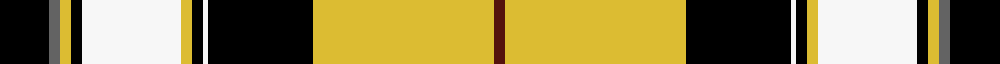

This page is one **sett** — a single exact thread-count. It belongs to the [tartan](/setts/k9n2ly2k2w18ly2k2w1k19ly33dr2/)
(the same proportion at any scale), whose colour order is pattern [BYKWKYWKYBK](/stripes/bykwkywkybk/).

Sourced from register-of-tartans.  It is a [11 stripe tartan](/stripes/stripes11/).

Original link https://www.tartanregister.gov.uk/tartanDetails.aspx?ref=3379

2 attestations — the source records this cloth was collapsed from (oldest owns this page)

<ul>
<li>01/01/2003 — Pride of Scotland Gold (register-of-tartans, <a href="https://www.tartanregister.gov.uk/tartanDetails.aspx?ref=3379">record</a>)  <em>Design owned by McCalls of Aberdeen. Woven exclusively by Lochcarron of Scotland. Woven sample.</em></li>
<li>2003 — Pride of Scotland, Gold (Fashion) (tartans-authority, <a href="http://www.tartansauthority.com/tartan-ferret/display/6478/">record</a>)  <em>One of a series of tartans from McCalls of Aberdeen based on the Pride of Scotland (#2469). McCalls of Aberdeen. Woven exclusively by Lochcarron of Scotland. Woven sample.</em></li>
</ul>

## Register references

External register numbers recorded for this tartan.

- Scottish Register of Tartans: [3379](https://www.tartanregister.gov.uk/tartanDetails.aspx?ref=3379)
- Scottish Tartans Authority (ITI): 6478

## Thread count
K/18 N4 LY4 K4 W36 LY4 K4 W2 K38 LY66 DR/4

One full sett is **346 threads**.

## Palette
<table><thead><tr><th>Colour</th><th>Shade</th><th>OKLCh</th></tr></thead><tbody><tr><td>DR</td><td><code style="background-color:#55120C;">#55120C</code> <small style="color:#888">#55120C</small></td><td><small style="color:#888">oklch(30.0% 0.099 29.3)</small></td></tr><tr><td>K</td><td><code style="background-color:#000000;">#000000</code> <small style="color:#888">#000000</small></td><td><small style="color:#888">oklch(0.0% 0.000 0.0)</small></td></tr><tr><td>W</td><td><code style="background-color:#F7F7F7;">#F7F7F7</code> <small style="color:#888">#F7F7F7</small></td><td><small style="color:#888">oklch(97.6% 0.000 89.9)</small></td></tr><tr><td>LY</td><td><code style="background-color:#DCBC32;">#DCBC32</code> <small style="color:#888">#DCBC32</small></td><td><small style="color:#888">oklch(80.0% 0.150 95.2)</small></td></tr><tr><td>N</td><td><code style="background-color:#636363;">#636363</code> <small style="color:#888">#636363</small></td><td><small style="color:#888">oklch(50.0% 0.000 89.9)</small></td></tr></tbody></table>

# Sample pattern

ID: /variants/s11/k9n2ly2k2w18ly2k2w1k19ly33dr2~x2/
