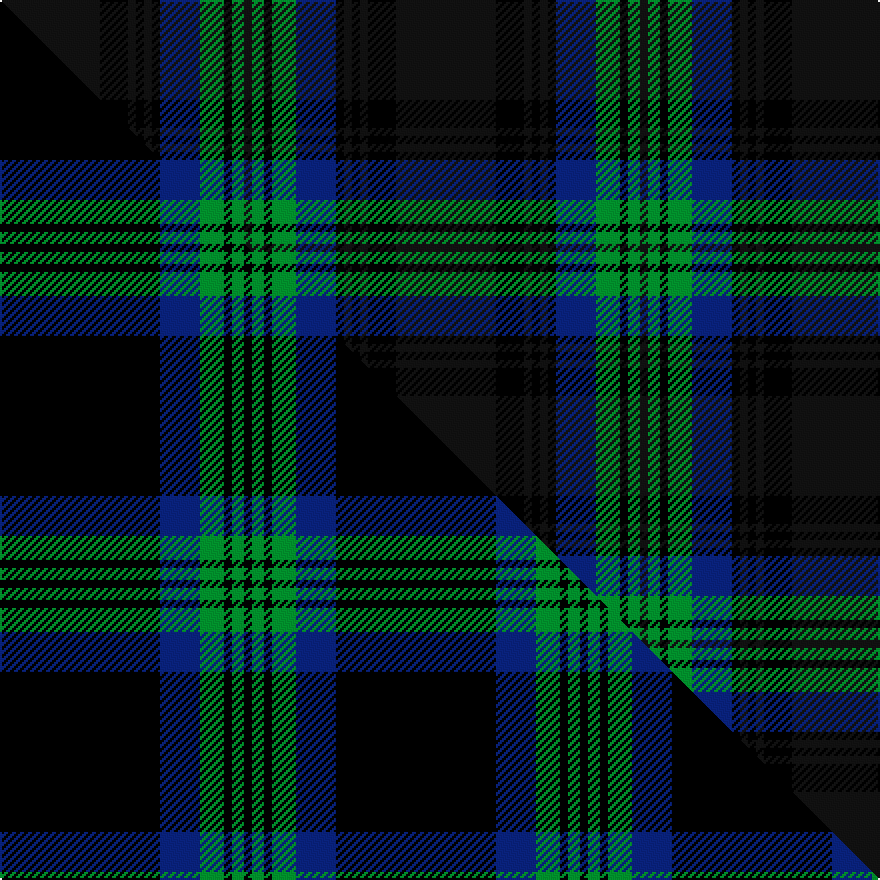

This is one **variant** — a specific cloth: this exact thread count and colourway, with its own
provenance below. It is one weaving of the [sett](/tartans/d/da/daks-6/) (the scale-free proportion — the
same cloth at any scale or shade), whose colour order is pattern [KGKGBKKKKKK](/stripes/kgkgbkkkkkk/).

Part of the [Daks](/tartans/d/da/daks-6/) tartan — the named design grouping this sett with its other cloths.

Sourced from tartans-authority.  It is a [11 stripe tartan](/stripes/stripes11/).

Original link <code>http://www.tartansauthority.com/tartan-ferret/display/2630/</code> — retired · [Internet Archive copy](https://web.archive.org/web/*/http://www.tartansauthority.com/tartan-ferret/display/2630/*)

Dataset <small>— provenance for this record, inherited from the source manifest</small>

<dl class="dataset-prov">
<dt>source</dt><dd><a href="/sources/tartans-authority/">Scottish Tartans Authority</a></dd>
<dt>data captured from</dt><dd><a href="https://github.com/thetartan/tartan-database/blob/master/data/tartans-authority/data.csv">https://github.com/thetartan/tartan-database/blob/master/data/tartans-authority/data.csv</a></dd>
<dt>data date</dt><dd>June 1997 <small>(this record)</small></dd>
<dt>licence</dt><dd><a href="https://creativecommons.org/licenses/by-nc-nd/4.0/">CC BY-NC-ND 4.0</a></dd>
</dl>

Capture chain <small>— the hands this data passed through, oldest first; each capture carries its own licence</small>

<ol class="capture-chain">
<li><a href="https://www.tartansauthority.com/">Scottish Tartans Authority</a> <small>the heritage body’s archive — its tartan-ferret record browser is retired; dead record links are shown unlinked, with an Internet Archive copy (ITI numbers are not SRT references)</small></li>
<li><a href="https://github.com/thetartan/tartan-database">thetartan/tartan-database</a> <small>2016-2017</small> · <a href="https://creativecommons.org/licenses/by-nc-nd/4.0/">CC BY-NC-ND 4.0</a> <small>Levko Kravets's frozen compilation — the capture we vendored, and where its CC licence text came from</small></li>
<li>this dictionary <small>captured 2026-06-10 · commit 5bf86c7566</small> <small>each re-capture is a git commit to data/sources</small></li>
</ol>

## Register references

External register numbers recorded for this tartan.

- Scottish Tartans Authority (ITI): 2630

## Thread count
Ki/50 K14 Ki4 K4 Ki4 K4 DB20 G12 K4 G6 Ki/4

One full sett is **198 threads**.

## Palette
<table><thead><tr><th>Colour</th><th>Shade</th><th>OKLCh</th></tr></thead><tbody><tr><td>G</td><td><code style="background-color:#008B2A;">#008B2A</code> <small style="color:#888">#008B2A</small></td><td><small style="color:#888">oklch(55.4% 0.170 145.9)</small></td></tr><tr><td>K</td><td><code style="background-color:#101010;">#101010</code> <small style="color:#888">#101010</small></td><td><small style="color:#888">oklch(17.3% 0.000 89.9)</small></td></tr><tr><td>K</td><td><code style="background-color:#101010;">#101010</code> <small style="color:#888">#101010</small></td><td><small style="color:#888">oklch(17.3% 0.000 89.9)</small></td></tr><tr><td>DB</td><td><code style="background-color:#082077;">#082077</code> <small style="color:#888">#082077</small></td><td><small style="color:#888">oklch(30.0% 0.149 265.1)</small></td></tr><tr><td>K</td><td><code style="background-color:#000000;">#000000</code> <small style="color:#888">#000000</small></td><td><small style="color:#888">oklch(0.0% 0.000 0.0)</small></td></tr></tbody></table>

# Sample pattern

## Compared to the master

This cloth is one sett of its design; the master sett (the exemplar the design is anchored on) is below for comparison.

Its **ΔTartan distance** from the master is **7.07** — the same measure the nearest-tartans table ranks by (0 is identical; a re-scale of the same cloth is near 0, a recolour or a different proportion further).

<figure class="master-compare" style="margin:0">

this sett
master sett ★

<figcaption style="color:#888;font-size:smaller">One weave of this sett against the <a href="/setts/k40db10g6k2g3k2/">master sett ★</a>, split on the diagonal: a shared proportion runs seamlessly across it with only the shades shifting; a different proportion breaks on it.</figcaption>
</figure>

## Nearest tartan variants

The nearest existing variants by ΔTartan distance, with this cloth at the top so the swatches line up against it.

ΔTartan

Threads

Variant

Sett

—

198

<a href="/variants/s11/ki25k7ki2k2ki2k2db10g6k2g3ki2~x2~ki17/">Daks (Chino Check) (Fashion)</a>

<a href="/ttd/edit/#slug=k40db10g6k2g3k2~x2&amp;base=ki25k7ki2k2ki2k2db10g6k2g3ki2~x2~ki17" title="compare in the TTD">2.09</a>

168

<a href="/variants/s6/k40db10g6k2g3k2~x2/">Daks (Chino Check)</a>

<a href="/ttd/edit/#slug=k4db24k4r3k4dg24k4lo3k4dg24r3k2~x4&amp;base=ki25k7ki2k2ki2k2db10g6k2g3ki2~x2~ki17" title="compare in the TTD">2.31</a>

800

<a href="/variants/s12/k4db24k4r3k4dg24k4lo3k4dg24r3k2~x4/">Skene of that Ilk</a>

<a href="/ttd/edit/#slug=dg3db10k3db2k2db2dg3k5dg2k5dg22r2dg3r2~x2&amp;base=ki25k7ki2k2ki2k2db10g6k2g3ki2~x2~ki17" title="compare in the TTD">2.43</a>

254

<a href="/variants/s14/dg3db10k3db2k2db2dg3k5dg2k5dg22r2dg3r2~x2/">Lochcarron Hunting Corporate Tartan</a>

<a href="/ttd/edit/#slug=dg3db10t3db2t2db2dg3k5dg2k5dg22r2dg3r2~x2&amp;base=ki25k7ki2k2ki2k2db10g6k2g3ki2~x2~ki17" title="compare in the TTD">2.64</a>

254

<a href="/variants/s14/dg3db10t3db2t2db2dg3k5dg2k5dg22r2dg3r2~x2/">Lochcarron Hunting</a>

<a href="/ttd/edit/#slug=dt8lb2dt27k10n4k2n3k2n16dt2~x2~dt32-n46&amp;base=ki25k7ki2k2ki2k2db10g6k2g3ki2~x2~ki17" title="compare in the TTD">2.72</a>

284

<a href="/variants/s10/dt8lb2dt27k10n4k2n3k2n16dt2~x2~dt32-n46/">Highland Granite</a>

<a href="/ttd/edit/#slug=dg28dr12dg4k20ly2k3ly2k3dg7~x2&amp;base=ki25k7ki2k2ki2k2db10g6k2g3ki2~x2~ki17" title="compare in the TTD">2.75</a>

254

<a href="/variants/s9/dg28dr12dg4k20ly2k3ly2k3dg7~x2/">Cork, County (District)</a>

<a href="/ttd/edit/#slug=dg5k1y2k1dg19k15y2db20dg3~x2&amp;base=ki25k7ki2k2ki2k2db10g6k2g3ki2~x2~ki17" title="compare in the TTD">2.85</a>

256

<a href="/variants/s9/dg5k1y2k1dg19k15y2db20dg3~x2/">Maine Acadia</a>

<a href="/ttd/edit/#slug=db1k1db8k2ly1dg12ly1db8k1db1~x4&amp;base=ki25k7ki2k2ki2k2db10g6k2g3ki2~x2~ki17" title="compare in the TTD">2.87</a>

280

<a href="/variants/s10/db1k1db8k2ly1dg12ly1db8k1db1~x4/">Rowan (Name)</a>

<a href="/ttd/edit/#slug=y1k1dg8db1dg1k8dg1db8dg1k1dg8k1w1~x6&amp;base=ki25k7ki2k2ki2k2db10g6k2g3ki2~x2~ki17" title="compare in the TTD">2.90</a>

480

<a href="/variants/s13/y1k1dg8db1dg1k8dg1db8dg1k1dg8k1w1~x6/">Robieson, Graham Alexander (Personal)</a>

<a href="/ttd/edit/#slug=r2k2db21k8dg16db3dg16k8db3k3db21k2r2~x2&amp;base=ki25k7ki2k2ki2k2db10g6k2g3ki2~x2~ki17" title="compare in the TTD">2.95</a>

420

<a href="/variants/s13/r2k2db21k8dg16db3dg16k8db3k3db21k2r2~x2/">Metropolitan Atlanta Police, Emerald Society</a>

## Neighbour map

Every grey dot is one of 13662 variants placed by the first two principal components of the ΔTartan feature space (42% of its variance). Red is this tartan; blue dots are its nearest — click one to open its page. The map is a flat projection of a many-dimensional space — [how to read it](/posts/neighbourhood-maps/).

<svg viewBox="0 0 640 380" role="img" style="max-width:100%;height:auto;border:1px solid #e0e0e0;border-radius:4px;display:block" xmlns="http://www.w3.org/2000/svg"><image href="/nn/cloud.v1.png" width="640" height="380"/><a href="/variants/s6/k40db10g6k2g3k2~x2/"><circle cx="245.0" cy="142.4" r="4" fill="#3465a4"><title>Daks (Chino Check)</title></circle></a><a href="/variants/s12/k4db24k4r3k4dg24k4lo3k4dg24r3k2~x4/"><circle cx="218.7" cy="139.6" r="4" fill="#3465a4"><title>Skene of that Ilk</title></circle></a><a href="/variants/s14/dg3db10k3db2k2db2dg3k5dg2k5dg22r2dg3r2~x2/"><circle cx="254.8" cy="142.7" r="4" fill="#3465a4"><title>Lochcarron Hunting Corporate Tartan</title></circle></a><a href="/variants/s14/dg3db10t3db2t2db2dg3k5dg2k5dg22r2dg3r2~x2/"><circle cx="247.1" cy="141.2" r="4" fill="#3465a4"><title>Lochcarron Hunting</title></circle></a><a href="/variants/s10/dt8lb2dt27k10n4k2n3k2n16dt2~x2~dt32-n46/"><circle cx="300.6" cy="170.4" r="4" fill="#3465a4"><title>Highland Granite</title></circle></a><a href="/variants/s9/dg28dr12dg4k20ly2k3ly2k3dg7~x2/"><circle cx="266.8" cy="166.6" r="4" fill="#3465a4"><title>Cork, County (District)</title></circle></a><a href="/variants/s9/dg5k1y2k1dg19k15y2db20dg3~x2/"><circle cx="259.1" cy="162.5" r="4" fill="#3465a4"><title>Maine Acadia</title></circle></a><a href="/variants/s10/db1k1db8k2ly1dg12ly1db8k1db1~x4/"><circle cx="292.8" cy="168.7" r="4" fill="#3465a4"><title>Rowan (Name)</title></circle></a><a href="/variants/s13/y1k1dg8db1dg1k8dg1db8dg1k1dg8k1w1~x6/"><circle cx="212.8" cy="157.8" r="4" fill="#3465a4"><title>Robieson, Graham Alexander (Personal)</title></circle></a><a href="/variants/s13/r2k2db21k8dg16db3dg16k8db3k3db21k2r2~x2/"><circle cx="250.5" cy="178.4" r="4" fill="#3465a4"><title>Metropolitan Atlanta Police, Emerald Society</title></circle></a><circle cx="266.6" cy="150.0" r="5" fill="#c00000"/><text x="320" y="376" text-anchor="middle" font-size="11" fill="#999">ground</text><text x="11" y="190" text-anchor="middle" font-size="11" fill="#999" transform="rotate(-90 11 190)">complexity</text></svg>

ID: /variants/s11/ki25k7ki2k2ki2k2db10g6k2g3ki2~x2~ki17/
