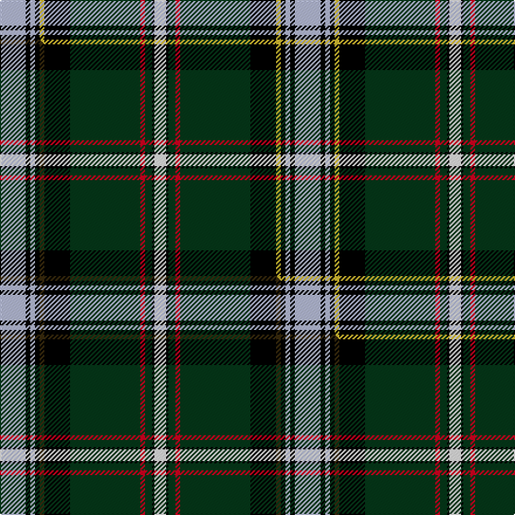

This page is one **sett** — a single exact thread-count. It belongs to the [tartan](/setts/lb11k2lb2k2ly2k11dg30r2dg3k1w5/)
(the same proportion at any scale), whose colour order is pattern [WKGRGKYKWKW](/stripes/wkgrgkykwkw/).

Part of the [Labrador](/tartans/labrador/) tartan — the named design grouping this sett with its other cloths.

Sourced from tartans-authority.  It is a [11 stripe tartan](/stripes/stripes11/).

Original link https://www.tartanregister.gov.uk/tartanDetails.aspx?ref=10004

## Provenance

Earliest known date: Feb. 2009 Officially adopted by the combined Councils of Labrador in February 2010. This tartan has been designed to celebrate the Labrador Scottish Heritage.

2 attestations — the source records this cloth was collapsed from (oldest owns this page)

<ul>
<li>Feb. 2009 — Labrador (District) (tartans-authority, <a href="https://www.tartanregister.gov.uk/tartanDetails.aspx?ref=10004">record</a>)  <em>Officially adopted by the combined Councils of Labrador in February 2010. This tartan has been designed to celebrate the Labrador Scottish Heritage. The starting point was the tartan of the Grants of Strathspey since Donald Smith, Lord Strathcona, one of the founders of the Dominion of Canada, was a grandson of the family. The sett and the colours have been changed to make the tartan uniquely Labradorean. Donald Smith set the standard for fur trapping and trading that was the principle element of the pioneer economy. This tartan may only be woven by the designer, Michael S. Martin, or his assigns. This tartan is registered with the Trade Marks office of the Government of Canada and the titles "Tartan of Labrador" and "Labrador Tartan" have been designated to describe the design.</em></li>
<li>undated — Labrador District Tartan (house-of-tartan, <a href="http://www.house-of-tartan.scotland.net/house/TartanViewjs.asp?colr=Def&tnam=10004">record</a>) </li>
</ul>

Dataset <small>— provenance for this record, inherited from the source manifest</small>

<dl class="dataset-prov">
<dt>source</dt><dd><a href="/sources/tartans-authority/">Scottish Tartans Authority</a></dd>
<dt>data captured from</dt><dd><a href="https://github.com/thetartan/tartan-database/blob/master/data/tartans-authority/data.csv">https://github.com/thetartan/tartan-database/blob/master/data/tartans-authority/data.csv</a></dd>
<dt>data date</dt><dd>Feb. 2009 <small>(this record)</small></dd>
<dt>licence</dt><dd><a href="https://creativecommons.org/licenses/by-nc-nd/4.0/">CC BY-NC-ND 4.0</a></dd>
</dl>

Capture chain <small>— the hands this data passed through, oldest first; each capture carries its own licence</small>

<ol class="capture-chain">
<li><a href="https://www.tartansauthority.com/">Scottish Tartans Authority</a> <small>the heritage body's archive — its tartan-ferret record browser is retired (links repaired to the SRT, above)</small></li>
<li><a href="https://github.com/thetartan/tartan-database">thetartan/tartan-database</a> <small>2016-2017</small> · <a href="https://creativecommons.org/licenses/by-nc-nd/4.0/">CC BY-NC-ND 4.0</a> <small>Levko Kravets's frozen compilation — the capture we vendored, and where its CC licence text came from</small></li>
<li>this dictionary <small>captured 2026-06-10 · commit 5bf86c7566</small> <small>each re-capture is a git commit to data/sources</small></li>
</ol>

## Register references

External register numbers recorded for this tartan.

- Scottish Register of Tartans: [10004](https://www.tartanregister.gov.uk/tartanDetails?ref=10004)
- Scottish Tartans Authority (ITI): 10004

## Thread count
LB/22 K4 LB4 K4 LY4 K22 DG60 R4 DG6 K2 W/10

One full sett is **252 threads**.

## Palette
<table><thead><tr><th>Colour</th><th>Shade</th><th>OKLCh</th></tr></thead><tbody><tr><td>DG</td><td><code style="background-color:#053819;">#053819</code> <small style="color:#888">#053819</small></td><td><small style="color:#888">oklch(30.0% 0.075 151.3)</small></td></tr><tr><td>R</td><td><code style="background-color:#D60020;">#D60020</code> <small style="color:#888">#D60020</small></td><td><small style="color:#888">oklch(55.2% 0.224 25.5)</small></td></tr><tr><td>LY</td><td><code style="background-color:#DCBC32;">#DCBC32</code> <small style="color:#888">#DCBC32</small></td><td><small style="color:#888">oklch(80.0% 0.150 95.2)</small></td></tr><tr><td>K</td><td><code style="background-color:#000000;">#000000</code> <small style="color:#888">#000000</small></td><td><small style="color:#888">oklch(0.0% 0.000 0.0)</small></td></tr><tr><td>LB</td><td><code style="background-color:#B5BBDE;">#B5BBDE</code> <small style="color:#888">#B5BBDE</small></td><td><small style="color:#888">oklch(79.9% 0.050 277.6)</small></td></tr><tr><td>W</td><td><code style="background-color:#F7F7F7;">#F7F7F7</code> <small style="color:#888">#F7F7F7</small></td><td><small style="color:#888">oklch(97.6% 0.000 89.9)</small></td></tr></tbody></table>

# Sample pattern

## Compared to the master

This cloth is one sett of its design; the master sett (the exemplar the design is anchored on) is below for comparison.

Its **ΔTartan distance** from the master is **0.03** — the same measure the nearest-tartans table ranks by (0 is identical; a re-scale of the same cloth is near 0, a recolour or a different proportion further).

<figure class="master-compare" style="margin:0">

this sett
master sett ★

<figcaption style="color:#888;font-size:smaller">One weave of this sett against the <a href="/setts/lb11k2lb2k2dy2k11dg30r2dg3k1w5/">master sett ★</a>, split on the diagonal: a shared proportion runs seamlessly across it with only the shades shifting; a different proportion breaks on it.</figcaption>
</figure>

## Nearest tartan variants

The nearest existing variants by ΔTartan distance, with this cloth at the top so the swatches line up against it.

ΔTartan

Threads

Variant

Sett

—

252

<a href="/variants/s11/lb11k2lb2k2ly2k11dg30r2dg3k1w5~x2/">Labrador (District)</a>

<a href="/ttd/edit/#slug=lb11k2lb2k2dy2k11dg30r2dg3k1w5~x2&amp;base=lb11k2lb2k2ly2k11dg30r2dg3k1w5~x2" title="compare in the TTD">0.03</a>

252

<a href="/variants/s11/lb11k2lb2k2dy2k11dg30r2dg3k1w5~x2/">Labrador</a>

<a href="/ttd/edit/#slug=k45r4k4n4ly16n76db8ly6db2w4&amp;base=lb11k2lb2k2ly2k11dg30r2dg3k1w5~x2" title="compare in the TTD">1.69</a>

289

<a href="/variants/s10/k45r4k4n4ly16n76db8ly6db2w4/">Highland Gathering (Fashion?)</a>

<a href="/ttd/edit/#slug=ly4db7ly4k26g3k1g3w9r2w4r2~x2&amp;base=lb11k2lb2k2ly2k11dg30r2dg3k1w5~x2" title="compare in the TTD">1.99</a>

248

<a href="/variants/s11/ly4db7ly4k26g3k1g3w9r2w4r2~x2/">Beaudoux - Amis Picards (District)</a>

<a href="/ttd/edit/#slug=w2db4r16k12g36dy1db6k2w2~x2&amp;base=lb11k2lb2k2ly2k11dg30r2dg3k1w5~x2" title="compare in the TTD">2.03</a>

316

<a href="/variants/s9/w2db4r16k12g36dy1db6k2w2~x2/">National Millennium</a>

<a href="/ttd/edit/#slug=dy29g17k1w3k1y2k10lb8dy4lb8k10y2k1w3dy29~x2&amp;base=lb11k2lb2k2ly2k11dg30r2dg3k1w5~x2" title="compare in the TTD">2.11</a>

396

<a href="/variants/s15/dy29g17k1w3k1y2k10lb8dy4lb8k10y2k1w3dy29~x2/">Massie/Massey</a>

<a href="/ttd/edit/#slug=w4k1db16k1g32dr6k6lo6g4lo2g1~x2&amp;base=lb11k2lb2k2ly2k11dg30r2dg3k1w5~x2" title="compare in the TTD">2.17</a>

306

<a href="/variants/s11/w4k1db16k1g32dr6k6lo6g4lo2g1~x2/">Zambia</a>

<a href="/ttd/edit/#slug=g28k1g1k6w1k6dp1k1dp4r3dp14~x4&amp;base=lb11k2lb2k2ly2k11dg30r2dg3k1w5~x2" title="compare in the TTD">2.19</a>

360

<a href="/variants/s11/g28k1g1k6w1k6dp1k1dp4r3dp14~x4/">New Hampshire</a>

<a href="/ttd/edit/#slug=k2g30k3dbi4k2db18lb1k3r2~x2~dbi1406275-db1004274&amp;base=lb11k2lb2k2ly2k11dg30r2dg3k1w5~x2" title="compare in the TTD">2.29</a>

252

<a href="/variants/s9/k2g30k3dbi4k2db18lb1k3r2~x2~dbi1406275-db1004274/">Lusk (Personal)</a>

<a href="/ttd/edit/#slug=r4g3k11n3db3n30k1w4k1g3k3g3k3n12r2~x2&amp;base=lb11k2lb2k2ly2k11dg30r2dg3k1w5~x2" title="compare in the TTD">2.38</a>

332

<a href="/variants/s15/r4g3k11n3db3n30k1w4k1g3k3g3k3n12r2~x2/">Trew 40th (Personal)</a>

<a href="/ttd/edit/#slug=y7dg1k1y2k9g22dg7k27db4k3w4~x2~dg1806142-g2408144&amp;base=lb11k2lb2k2ly2k11dg30r2dg3k1w5~x2" title="compare in the TTD">2.42</a>

326

<a href="/variants/s11/y7dg1k1y2k9g22dg7k27db4k3w4~x2~dg1806142-g2408144/">Gilhooley (Personal)</a>

## Neighbour map

Every grey dot is one of 13620 variants placed by the first two principal components of the ΔTartan feature space (42% of its variance). Red is this tartan; blue dots are its nearest — click one to open its page.

<svg viewBox="0 0 640 380" role="img" style="max-width:100%;height:auto;border:1px solid #e0e0e0;border-radius:4px;display:block" xmlns="http://www.w3.org/2000/svg"><image href="/nn/cloud.v1.png" width="640" height="380"/><a href="/variants/s11/lb11k2lb2k2dy2k11dg30r2dg3k1w5~x2/"><circle cx="188.9" cy="68.4" r="4" fill="#3465a4"><title>Labrador</title></circle></a><a href="/variants/s10/k45r4k4n4ly16n76db8ly6db2w4/"><circle cx="216.5" cy="54.7" r="4" fill="#3465a4"><title>Highland Gathering (Fashion?)</title></circle></a><a href="/variants/s11/ly4db7ly4k26g3k1g3w9r2w4r2~x2/"><circle cx="131.7" cy="76.5" r="4" fill="#3465a4"><title>Beaudoux - Amis Picards (District)</title></circle></a><a href="/variants/s9/w2db4r16k12g36dy1db6k2w2~x2/"><circle cx="186.4" cy="76.2" r="4" fill="#3465a4"><title>National Millennium</title></circle></a><a href="/variants/s15/dy29g17k1w3k1y2k10lb8dy4lb8k10y2k1w3dy29~x2/"><circle cx="186.4" cy="72.0" r="4" fill="#3465a4"><title>Massie/Massey</title></circle></a><a href="/variants/s11/w4k1db16k1g32dr6k6lo6g4lo2g1~x2/"><circle cx="194.0" cy="76.4" r="4" fill="#3465a4"><title>Zambia</title></circle></a><a href="/variants/s11/g28k1g1k6w1k6dp1k1dp4r3dp14~x4/"><circle cx="216.4" cy="86.3" r="4" fill="#3465a4"><title>New Hampshire</title></circle></a><a href="/variants/s9/k2g30k3dbi4k2db18lb1k3r2~x2~dbi1406275-db1004274/"><circle cx="215.7" cy="82.4" r="4" fill="#3465a4"><title>Lusk (Personal)</title></circle></a><a href="/variants/s15/r4g3k11n3db3n30k1w4k1g3k3g3k3n12r2~x2/"><circle cx="228.6" cy="59.7" r="4" fill="#3465a4"><title>Trew 40th (Personal)</title></circle></a><a href="/variants/s11/y7dg1k1y2k9g22dg7k27db4k3w4~x2~dg1806142-g2408144/"><circle cx="165.5" cy="87.0" r="4" fill="#3465a4"><title>Gilhooley (Personal)</title></circle></a><circle cx="187.2" cy="68.2" r="5" fill="#c00000"/><text x="320" y="376" text-anchor="middle" font-size="11" fill="#999">ground</text><text x="11" y="190" text-anchor="middle" font-size="11" fill="#999" transform="rotate(-90 11 190)">complexity</text></svg>

ID: /variants/s11/lb11k2lb2k2ly2k11dg30r2dg3k1w5~x2/
