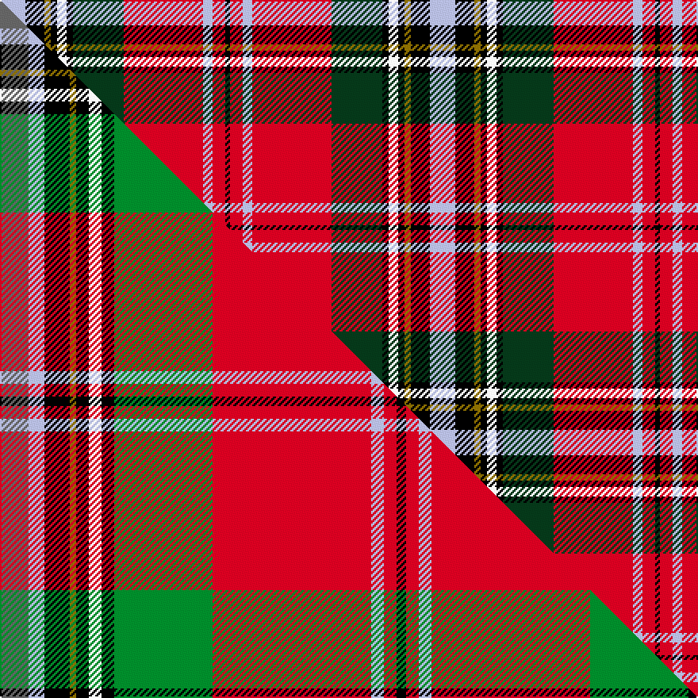

This is one **variant** — a specific cloth: this exact thread count and colourway, with its own
provenance below. It is one weaving of the [sett](/setts/lb16k12y4k4w6k4dg32r50lb6r8k3/) (the scale-free proportion — the
same cloth at any scale or shade), whose colour order is pattern [KRWRGKWKGKW](/stripes/krwrgkwkgkw/).

Part of the [MacLean of Duart](/tartans/maclean-of-duart-2/) tartan — the named design grouping this sett with its other cloths.

Sourced from tartans-authority.  It is a [11 stripe tartan](/stripes/stripes11/).

Original link [https://www.tartanregister.gov.uk/tartanDetails.aspx?ref=377](https://www.tartanregister.gov.uk/tartanDetails.aspx?ref=377)

Dataset <small>— provenance for this record, inherited from the source manifest</small>

<dl class="dataset-prov">
<dt>source</dt><dd><a href="/sources/tartans-authority/">Scottish Tartans Authority</a></dd>
<dt>data captured from</dt><dd><a href="https://github.com/thetartan/tartan-database/blob/master/data/tartans-authority/data.csv">https://github.com/thetartan/tartan-database/blob/master/data/tartans-authority/data.csv</a></dd>
<dt>data date</dt><dd>1819 <small>(this record)</small></dd>
<dt>licence</dt><dd><a href="https://creativecommons.org/licenses/by-nc-nd/4.0/">CC BY-NC-ND 4.0</a></dd>
</dl>

Capture chain <small>— the hands this data passed through, oldest first; each capture carries its own licence</small>

<ol class="capture-chain">
<li><a href="https://www.tartansauthority.com/">Scottish Tartans Authority</a> <small>the heritage body's archive — its tartan-ferret record browser is retired (links repaired to the SRT, above)</small></li>
<li><a href="https://github.com/thetartan/tartan-database">thetartan/tartan-database</a> <small>2016-2017</small> · <a href="https://creativecommons.org/licenses/by-nc-nd/4.0/">CC BY-NC-ND 4.0</a> <small>Levko Kravets's frozen compilation — the capture we vendored, and where its CC licence text came from</small></li>
<li>this dictionary <small>captured 2026-06-10 · commit 5bf86c7566</small> <small>each re-capture is a git commit to data/sources</small></li>
</ol>

## Register references

External register numbers recorded for this tartan.

- Scottish Tartans Authority (ITI): 377

## Thread count
LB/16 K12 Y4 K4 W6 K4 DG32 R50 LB6 R8 K/3

One full sett is **271 threads**.

## Palette
<table><thead><tr><th>Colour</th><th>Shade</th><th>OKLCh</th></tr></thead><tbody><tr><td>LB</td><td><code style="background-color:#B5BBDE;">#B5BBDE</code> <small style="color:#888">#B5BBDE</small></td><td><small style="color:#888">oklch(79.9% 0.050 277.6)</small></td></tr><tr><td>DG</td><td><code style="background-color:#053819;">#053819</code> <small style="color:#888">#053819</small></td><td><small style="color:#888">oklch(30.0% 0.075 151.3)</small></td></tr><tr><td>K</td><td><code style="background-color:#000000;">#000000</code> <small style="color:#888">#000000</small></td><td><small style="color:#888">oklch(0.0% 0.000 0.0)</small></td></tr><tr><td>W</td><td><code style="background-color:#F7F7F7;">#F7F7F7</code> <small style="color:#888">#F7F7F7</small></td><td><small style="color:#888">oklch(97.6% 0.000 89.9)</small></td></tr><tr><td>R</td><td><code style="background-color:#D60020;">#D60020</code> <small style="color:#888">#D60020</small></td><td><small style="color:#888">oklch(55.2% 0.224 25.5)</small></td></tr><tr><td>Y</td><td><code style="background-color:#8B6E00;">#8B6E00</code> <small style="color:#888">#8B6E00</small></td><td><small style="color:#888">oklch(55.1% 0.113 90.4)</small></td></tr></tbody></table>

# Sample pattern

## Compared to the master

This cloth is one sett of its design; the master sett (the exemplar the design is anchored on) is below for comparison.

Its **ΔTartan distance** from the master is **0.98** — the same measure the nearest-tartans table ranks by (0 is identical; a re-scale of the same cloth is near 0, a recolour or a different proportion further).

<figure class="master-compare" style="margin:0">

this sett
master sett ★

<figcaption style="color:#888;font-size:smaller">One weave of this sett against the <a href="/setts/n9lb5k8y2k4w4k4g31r50lb4r4k3/">master sett ★</a>, split on the diagonal: a shared proportion runs seamlessly across it with only the shades shifting; a different proportion breaks on it.</figcaption>
</figure>

## Nearest tartan variants

The nearest existing variants by ΔTartan distance, with this cloth at the top so the swatches line up against it.

ΔTartan

Threads

Variant

Sett

—

271

<a href="/variants/s11/lb16k12y4k4w6k4dg32r50lb6r8k3/">Maclean of Duart (Wilsons) (Clan)</a>

<a href="/ttd/edit/#slug=lb16k12y4k4w6k4g32r50lb6r8k3&amp;base=lb16k12y4k4w6k4dg32r50lb6r8k3" title="compare in the TTD">0.11</a>

271

<a href="/variants/s11/lb16k12y4k4w6k4g32r50lb6r8k3/">MacLean of Duart #3</a>

<a href="/ttd/edit/#slug=lb13k6y2k3w4k3g22r31lb3r4k2~x2&amp;base=lb16k12y4k4w6k4dg32r50lb6r8k3" title="compare in the TTD">0.31</a>

342

<a href="/variants/s11/lb13k6y2k3w4k3g22r31lb3r4k2~x2/">MacLean of Duart #4</a>

<a href="/ttd/edit/#slug=lb14k8y2k3w4k3g21r48lb4r5k3~x2&amp;base=lb16k12y4k4w6k4dg32r50lb6r8k3" title="compare in the TTD">0.46</a>

426

<a href="/variants/s11/lb14k8y2k3w4k3g21r48lb4r5k3~x2/">MacLean of Duart #5</a>

<a href="/ttd/edit/#slug=lb8k4y1k2w3k2g12r24lb2r3k2~x2&amp;base=lb16k12y4k4w6k4dg32r50lb6r8k3" title="compare in the TTD">0.47</a>

232

<a href="/variants/s11/lb8k4y1k2w3k2g12r24lb2r3k2~x2/">MacLean of Duart #2</a>

<a href="/ttd/edit/#slug=do9lb5k8y2k4w4k4g28r44lb4r5k3~x2&amp;base=lb16k12y4k4w6k4dg32r50lb6r8k3" title="compare in the TTD">0.66</a>

456

<a href="/variants/s12/do9lb5k8y2k4w4k4g28r44lb4r5k3~x2/">MacLean (rare)</a>

<a href="/ttd/edit/#slug=n9lb5k8y2k4w4k4g31r50lb4r4k3~x2&amp;base=lb16k12y4k4w6k4dg32r50lb6r8k3" title="compare in the TTD">0.98</a>

488

<a href="/variants/s12/n9lb5k8y2k4w4k4g31r50lb4r4k3~x2/">MacLean of Duart</a>

<a href="/ttd/edit/#slug=k3r30g10k3y2k3w2k6r2db12w2~x2&amp;base=lb16k12y4k4w6k4dg32r50lb6r8k3" title="compare in the TTD">1.12</a>

290

<a href="/variants/s11/k3r30g10k3y2k3w2k6r2db12w2~x2/">Kilmorie</a>

<a href="/ttd/edit/#slug=r4k4r32g4w3g4k13g3db18r2y3~x2&amp;base=lb16k12y4k4w6k4dg32r50lb6r8k3" title="compare in the TTD">1.19</a>

346

<a href="/variants/s11/r4k4r32g4w3g4k13g3db18r2y3~x2/">Norwell</a>

<a href="/ttd/edit/#slug=db4lb1k3y1k1w1k1g8r12lb1r2k1~x4&amp;base=lb16k12y4k4w6k4dg32r50lb6r8k3" title="compare in the TTD">1.64</a>

268

<a href="/variants/s12/db4lb1k3y1k1w1k1g8r12lb1r2k1~x4/">MacLean of Duart #6</a>

<a href="/ttd/edit/#slug=db4lb1k3y1k1w1k1g8r12lb1r2k1~x2&amp;base=lb16k12y4k4w6k4dg32r50lb6r8k3" title="compare in the TTD">1.64</a>

134

<a href="/variants/s12/db4lb1k3y1k1w1k1g8r12lb1r2k1~x2/">MacLean of Duart Clan Tartan</a>

## Neighbour map

Every grey dot is one of 13621 variants placed by the first two principal components of the ΔTartan feature space (42% of its variance). Red is this tartan; blue dots are its nearest — click one to open its page.

<svg viewBox="0 0 640 380" role="img" style="max-width:100%;height:auto;border:1px solid #e0e0e0;border-radius:4px;display:block" xmlns="http://www.w3.org/2000/svg"><image href="/nn/cloud.v1.png" width="640" height="380"/><a href="/variants/s11/lb16k12y4k4w6k4g32r50lb6r8k3/"><circle cx="136.3" cy="99.2" r="4" fill="#3465a4"><title>MacLean of Duart #3</title></circle></a><a href="/variants/s11/lb13k6y2k3w4k3g22r31lb3r4k2~x2/"><circle cx="125.0" cy="102.3" r="4" fill="#3465a4"><title>MacLean of Duart #4</title></circle></a><a href="/variants/s11/lb14k8y2k3w4k3g21r48lb4r5k3~x2/"><circle cx="189.6" cy="72.1" r="4" fill="#3465a4"><title>MacLean of Duart #5</title></circle></a><a href="/variants/s11/lb8k4y1k2w3k2g12r24lb2r3k2~x2/"><circle cx="164.3" cy="79.2" r="4" fill="#3465a4"><title>MacLean of Duart #2</title></circle></a><a href="/variants/s12/do9lb5k8y2k4w4k4g28r44lb4r5k3~x2/"><circle cx="139.5" cy="63.0" r="4" fill="#3465a4"><title>MacLean (rare)</title></circle></a><a href="/variants/s12/n9lb5k8y2k4w4k4g31r50lb4r4k3~x2/"><circle cx="158.7" cy="54.2" r="4" fill="#3465a4"><title>MacLean of Duart</title></circle></a><a href="/variants/s11/k3r30g10k3y2k3w2k6r2db12w2~x2/"><circle cx="147.8" cy="91.6" r="4" fill="#3465a4"><title>Kilmorie</title></circle></a><a href="/variants/s11/r4k4r32g4w3g4k13g3db18r2y3~x2/"><circle cx="148.5" cy="96.2" r="4" fill="#3465a4"><title>Norwell</title></circle></a><a href="/variants/s12/db4lb1k3y1k1w1k1g8r12lb1r2k1~x4/"><circle cx="103.5" cy="91.8" r="4" fill="#3465a4"><title>MacLean of Duart #6</title></circle></a><a href="/variants/s12/db4lb1k3y1k1w1k1g8r12lb1r2k1~x2/"><circle cx="103.5" cy="91.8" r="4" fill="#3465a4"><title>MacLean of Duart Clan Tartan</title></circle></a><circle cx="137.2" cy="96.9" r="5" fill="#c00000"/><text x="320" y="376" text-anchor="middle" font-size="11" fill="#999">ground</text><text x="11" y="190" text-anchor="middle" font-size="11" fill="#999" transform="rotate(-90 11 190)">complexity</text></svg>

ID: /variants/s11/lb16k12y4k4w6k4dg32r50lb6r8k3/
