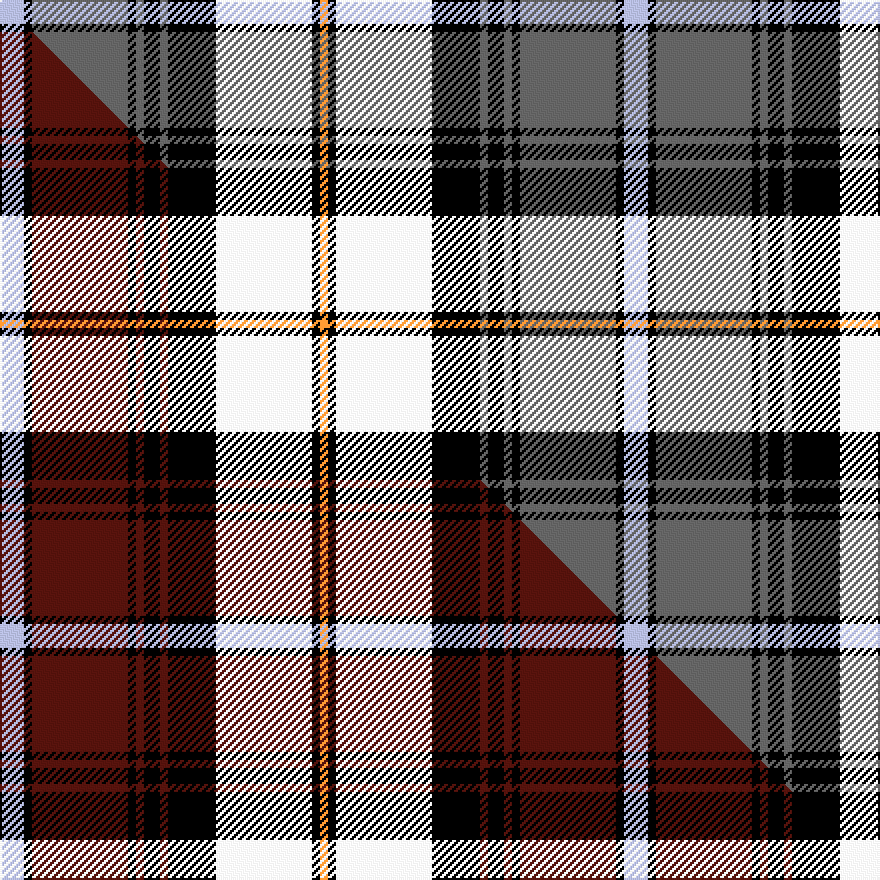

This page is one **sett** — a single exact thread-count. It belongs to the [tartan](/setts/lb3k1n12k1n1k2n1k6w12k1lo1/)
(the same proportion at any scale), whose colour order is pattern [WKBKBKBKWKY](/stripes/wkbkbkbkwky/).

Part of the [McCandlish Arisaid](/tartans/mccandlish-arisaid/) tartan — the named design grouping this sett with its other cloths.

Sourced from tartans-authority.  It is a [11 stripe tartan](/stripes/stripes11/).

Original link http://www.tartansauthority.com/tartan-ferret/display/8232/

## Register references

External register numbers recorded for this tartan.

- Scottish Tartans Authority (ITI): 8232

## Thread count
LB/12 K4 N48 K4 N4 K8 N4 K24 W48 K4 LO/4

One full sett is **312 threads**.

## Palette
<table><thead><tr><th>Colour</th><th>Shade</th><th>OKLCh</th></tr></thead><tbody><tr><td>LO</td><td><code style="background-color:#FF9C34;">#FF9C34</code> <small style="color:#888">#FF9C34</small></td><td><small style="color:#888">oklch(77.9% 0.161 61.8)</small></td></tr><tr><td>K</td><td><code style="background-color:#000000;">#000000</code> <small style="color:#888">#000000</small></td><td><small style="color:#888">oklch(0.0% 0.000 0.0)</small></td></tr><tr><td>W</td><td><code style="background-color:#F7F7F7;">#F7F7F7</code> <small style="color:#888">#F7F7F7</small></td><td><small style="color:#888">oklch(97.6% 0.000 89.9)</small></td></tr><tr><td>LB</td><td><code style="background-color:#B5BBDE;">#B5BBDE</code> <small style="color:#888">#B5BBDE</small></td><td><small style="color:#888">oklch(79.9% 0.050 277.6)</small></td></tr><tr><td>N</td><td><code style="background-color:#636363;">#636363</code> <small style="color:#888">#636363</small></td><td><small style="color:#888">oklch(50.0% 0.000 89.9)</small></td></tr></tbody></table>

# Sample pattern

## Compared to the master

This cloth is one sett of its design; the master sett (the exemplar the design is anchored on) is below for comparison.

Its **ΔTartan distance** from the master is **1.82** — the same measure the nearest-tartans table ranks by (0 is identical; a re-scale of the same cloth is near 0, a recolour or a different proportion further).

<figure class="master-compare" style="margin:0">

this sett
master sett ★

<figcaption style="color:#888;font-size:smaller">One weave of this sett against the <a href="/setts/lb3k1dr12k1dr1k2dr1k6w12k1lo1/">master sett ★</a>, split on the diagonal: a shared proportion runs seamlessly across it with only the shades shifting; a different proportion breaks on it.</figcaption>
</figure>

## Nearest tartan variants

The nearest existing variants by ΔTartan distance, with this cloth at the top so the swatches line up against it.

ΔTartan

Threads

Variant

Sett

—

312

<a href="/variants/s11/lb3k1n12k1n1k2n1k6w12k1lo1~x4/">McCandlish Arisaid, Grey (Name)</a>

<a href="/ttd/edit/#slug=lb3k1n12k1n1k2n1k6lr12k1lo1~x4~lb3103284-lr2800000&amp;base=lb3k1n12k1n1k2n1k6w12k1lo1~x4" title="compare in the TTD">0.14</a>

312

<a href="/variants/s11/lb3k1n12k1n1k2n1k6lr12k1lo1~x4~lb3103284-lr2800000/">McCandlish Dress, Grey (Name)</a>

<a href="/ttd/edit/#slug=lb3k1dr12k1dr1k2dr1k6w12k1lo1~x4&amp;base=lb3k1n12k1n1k2n1k6w12k1lo1~x4" title="compare in the TTD">1.82</a>

312

<a href="/variants/s11/lb3k1dr12k1dr1k2dr1k6w12k1lo1~x4/">McCandlish Arisaid, Red (Name)</a>

<a href="/ttd/edit/#slug=dy27w2dy3ly4dy3w2dy5k13n2w26n3~x2&amp;base=lb3k1n12k1n1k2n1k6w12k1lo1~x4" title="compare in the TTD">1.98</a>

300

<a href="/variants/s11/dy27w2dy3ly4dy3w2dy5k13n2w26n3~x2/">MacKellar Dress, Maroon (Dance)</a>

<a href="/ttd/edit/#slug=w6dg2w27k10db4k4db4k4db15r2db2r4~x2&amp;base=lb3k1n12k1n1k2n1k6w12k1lo1~x4" title="compare in the TTD">2.04</a>

316

<a href="/variants/s12/w6dg2w27k10db4k4db4k4db15r2db2r4~x2/">Sutherland Dress, Old (Dance)</a>

<a href="/ttd/edit/#slug=dg8r1dg2r2dg12w1k12r1lb12r2lb2r1lb8~x4&amp;base=lb3k1n12k1n1k2n1k6w12k1lo1~x4" title="compare in the TTD">2.04</a>

448

<a href="/variants/s13/dg8r1dg2r2dg12w1k12r1lb12r2lb2r1lb8~x4/">Boston Pipe Band, Greater</a>

<a href="/ttd/edit/#slug=w5g2w23k7db4k3db3k3db11r2db2r3~x2&amp;base=lb3k1n12k1n1k2n1k6w12k1lo1~x4" title="compare in the TTD">2.05</a>

256

<a href="/variants/s12/w5g2w23k7db4k3db3k3db11r2db2r3~x2/">Sutherland, Dress</a>

<a href="/ttd/edit/#slug=k2y2db15y2k2y2w2y2w14y1k2y2~x2&amp;base=lb3k1n12k1n1k2n1k6w12k1lo1~x4" title="compare in the TTD">2.26</a>

184

<a href="/variants/s12/k2y2db15y2k2y2w2y2w14y1k2y2~x2/">Independence</a>

<a href="/ttd/edit/#slug=k8w7k2w3k2w3k2w3k2w7g18dp27w3~x2&amp;base=lb3k1n12k1n1k2n1k6w12k1lo1~x4" title="compare in the TTD">2.31</a>

326

<a href="/variants/s13/k8w7k2w3k2w3k2w3k2w7g18dp27w3~x2/">IAPD</a>

<a href="/ttd/edit/#slug=db2k2db4k4g4y1g4w2db3w14db2w2k2y1~x4&amp;base=lb3k1n12k1n1k2n1k6w12k1lo1~x4" title="compare in the TTD">2.32</a>

364

<a href="/variants/s14/db2k2db4k4g4y1g4w2db3w14db2w2k2y1~x4/">Gordon Dress #3</a>

<a href="/ttd/edit/#slug=dr4w4dr2w29k10dg3k10dg4g4dg3g3dg3~x2~dg1806142-g2408144&amp;base=lb3k1n12k1n1k2n1k6w12k1lo1~x4" title="compare in the TTD">2.33</a>

302

<a href="/variants/s12/dr4w4dr2w29k10dg3k10dg4g4dg3g3dg3~x2~dg1806142-g2408144/">Ross Arisaid</a>

## Neighbour map

Every grey dot is one of 13620 variants placed by the first two principal components of the ΔTartan feature space (42% of its variance). Red is this tartan; blue dots are its nearest — click one to open its page.

<svg viewBox="0 0 640 380" role="img" style="max-width:100%;height:auto;border:1px solid #e0e0e0;border-radius:4px;display:block" xmlns="http://www.w3.org/2000/svg"><image href="/nn/cloud.v1.png" width="640" height="380"/><a href="/variants/s11/lb3k1n12k1n1k2n1k6lr12k1lo1~x4~lb3103284-lr2800000/"><circle cx="136.8" cy="130.8" r="4" fill="#3465a4"><title>McCandlish Dress, Grey (Name)</title></circle></a><a href="/variants/s11/lb3k1dr12k1dr1k2dr1k6w12k1lo1~x4/"><circle cx="119.4" cy="121.6" r="4" fill="#3465a4"><title>McCandlish Arisaid, Red (Name)</title></circle></a><a href="/variants/s11/dy27w2dy3ly4dy3w2dy5k13n2w26n3~x2/"><circle cx="158.9" cy="119.0" r="4" fill="#3465a4"><title>MacKellar Dress, Maroon (Dance)</title></circle></a><a href="/variants/s12/w6dg2w27k10db4k4db4k4db15r2db2r4~x2/"><circle cx="132.2" cy="122.9" r="4" fill="#3465a4"><title>Sutherland Dress, Old (Dance)</title></circle></a><a href="/variants/s13/dg8r1dg2r2dg12w1k12r1lb12r2lb2r1lb8~x4/"><circle cx="110.8" cy="132.9" r="4" fill="#3465a4"><title>Boston Pipe Band, Greater</title></circle></a><a href="/variants/s12/w5g2w23k7db4k3db3k3db11r2db2r3~x2/"><circle cx="135.4" cy="127.6" r="4" fill="#3465a4"><title>Sutherland, Dress</title></circle></a><a href="/variants/s12/k2y2db15y2k2y2w2y2w14y1k2y2~x2/"><circle cx="137.9" cy="123.3" r="4" fill="#3465a4"><title>Independence</title></circle></a><a href="/variants/s13/k8w7k2w3k2w3k2w3k2w7g18dp27w3~x2/"><circle cx="125.4" cy="135.6" r="4" fill="#3465a4"><title>IAPD</title></circle></a><a href="/variants/s14/db2k2db4k4g4y1g4w2db3w14db2w2k2y1~x4/"><circle cx="107.3" cy="123.9" r="4" fill="#3465a4"><title>Gordon Dress #3</title></circle></a><a href="/variants/s12/dr4w4dr2w29k10dg3k10dg4g4dg3g3dg3~x2~dg1806142-g2408144/"><circle cx="134.1" cy="114.1" r="4" fill="#3465a4"><title>Ross Arisaid</title></circle></a><circle cx="118.8" cy="125.8" r="5" fill="#c00000"/><text x="320" y="376" text-anchor="middle" font-size="11" fill="#999">ground</text><text x="11" y="190" text-anchor="middle" font-size="11" fill="#999" transform="rotate(-90 11 190)">complexity</text></svg>

ID: /variants/s11/lb3k1n12k1n1k2n1k6w12k1lo1~x4/
