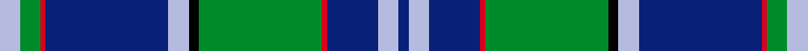

This is one **variant** — a specific cloth: this exact thread count and colourway, with its own
provenance below. It is one weaving of the [sett](/setts/lb4g4r1db24lb4k2g24r1db10lb4db2/) (the scale-free proportion — the
same cloth at any scale or shade), whose colour order is pattern [BWBRGKWBRGW](/stripes/bwbrgkwbrgw/).

Sourced from register-of-tartans.  It is a [11 stripe tartan](/stripes/stripes11/).

Original link [https://www.tartanregister.gov.uk/tartanDetails.aspx?ref=756](https://www.tartanregister.gov.uk/tartanDetails.aspx?ref=756)

2 attestations — the source records this cloth was collapsed from (oldest owns this page)

<ul>
<li>01/01/1996 — Coopers & Lybrand (register-of-tartans, <a href="https://www.tartanregister.gov.uk/tartanDetails.aspx?ref=756">record</a>)  <em>Designed by Deirdre Nicholls of Celtic Silks. May 1996. Swatch in Scottish Tartans Authority's Johnston Collection. Dark green, red and blue called for but lighter shades used here to display sett. Produced for their 1996 European Partners meeting in Edinburgh.</em></li>
<li>1996 — Coopers & Lybrand (Corporate) (tartans-authority, <a href="https://www.tartanregister.gov.uk/tartanDetails.aspx?ref=2303">record</a>)  <em>Designed by Deirdre Nicholls of Celtic Silks. May 1996. Swatch in STA's Johnston Collection. Dark green, red and blue called for but lighter shades used here to display sett.</em></li>
</ul>

Dataset <small>— provenance for this record, inherited from the source manifest</small>

<dl class="dataset-prov">
<dt>source</dt><dd><a href="/sources/register-of-tartans/">Scottish Register of Tartans</a></dd>
<dt>data captured from</dt><dd><a href="https://github.com/thetartan/tartan-database/blob/master/data/register-of-tartans/data.csv">https://github.com/thetartan/tartan-database/blob/master/data/register-of-tartans/data.csv</a></dd>
<dt>data date</dt><dd>1996 <small>(this record)</small></dd>
<dt>licence</dt><dd><a href="https://www.tartanregister.gov.uk/copyright">Crown copyright</a></dd>
</dl>

Capture chain <small>— the hands this data passed through, oldest first; each capture carries its own licence</small>

<ol class="capture-chain">
<li><a href="https://www.tartanregister.gov.uk/">Scottish Register of Tartans</a> · <a href="https://www.tartanregister.gov.uk/copyright">Crown copyright</a> <small>the living register — still published by National Records of Scotland</small></li>
<li><a href="https://github.com/thetartan/tartan-database">thetartan/tartan-database</a> <small>2016-2017</small> · <a href="https://creativecommons.org/licenses/by-nc-nd/4.0/">CC BY-NC-ND 4.0</a> <small>Levko Kravets's frozen compilation — the capture we vendored, and where its CC licence text came from</small></li>
<li>this dictionary <small>captured 2026-06-10 · commit 5bf86c7566</small> <small>each re-capture is a git commit to data/sources</small></li>
</ol>

## Register references

External register numbers recorded for this tartan.

- Scottish Register of Tartans: [756](https://www.tartanregister.gov.uk/tartanDetails.aspx?ref=756)
- Scottish Tartans Authority (ITI): 2303
- Scottish Tartans World Register: 2303

## Thread count
LB/8 G8 R2 DB48 LB8 K4 G48 R2 DB20 LB8 DB/4

One full sett is **308 threads**.

## Palette
<table><thead><tr><th>Colour</th><th>Shade</th><th>OKLCh</th></tr></thead><tbody><tr><td>LB</td><td><code style="background-color:#B5BBDE;">#B5BBDE</code> <small style="color:#888">#B5BBDE</small></td><td><small style="color:#888">oklch(79.9% 0.050 277.6)</small></td></tr><tr><td>DB</td><td><code style="background-color:#082077;">#082077</code> <small style="color:#888">#082077</small></td><td><small style="color:#888">oklch(30.0% 0.149 265.1)</small></td></tr><tr><td>G</td><td><code style="background-color:#008B2A;">#008B2A</code> <small style="color:#888">#008B2A</small></td><td><small style="color:#888">oklch(55.4% 0.170 145.9)</small></td></tr><tr><td>K</td><td><code style="background-color:#000000;">#000000</code> <small style="color:#888">#000000</small></td><td><small style="color:#888">oklch(0.0% 0.000 0.0)</small></td></tr><tr><td>R</td><td><code style="background-color:#D60020;">#D60020</code> <small style="color:#888">#D60020</small></td><td><small style="color:#888">oklch(55.2% 0.224 25.5)</small></td></tr></tbody></table>

# Sample pattern

## Nearest tartan variants

The nearest existing variants by ΔTartan distance, with this cloth at the top so the swatches line up against it.

ΔTartan

Threads

Variant

Sett

—

308

<a href="/variants/s11/lb4g4r1db24lb4k2g24r1db10lb4db2~x2/">Coopers &amp; Lybrand</a>

<a href="/ttd/edit/#slug=lb4g4r1db18lb4k2g16r1db6lb4k2~x2&amp;base=lb4g4r1db24lb4k2g24r1db10lb4db2~x2" title="compare in the TTD">1.32</a>

236

<a href="/variants/s11/lb4g4r1db18lb4k2g16r1db6lb4k2~x2/">Coopers &amp; Lybrand</a>

<a href="/ttd/edit/#slug=g40k8g4k8g4dr14b64lb9b3&amp;base=lb4g4r1db24lb4k2g24r1db10lb4db2~x2" title="compare in the TTD">1.46</a>

265

<a href="/variants/s9/g40k8g4k8g4dr14b64lb9b3/">West Lothian/Linlithgowshire</a>

<a href="/ttd/edit/#slug=g40k8g4k8g4dr14db64lb9db3&amp;base=lb4g4r1db24lb4k2g24r1db10lb4db2~x2" title="compare in the TTD">1.91</a>

265

<a href="/variants/s9/g40k8g4k8g4dr14db64lb9db3/">West Lothian</a>

<a href="/ttd/edit/#slug=dp4db5dp3db50k15g3k5g32w2g3&amp;base=lb4g4r1db24lb4k2g24r1db10lb4db2~x2" title="compare in the TTD">2.10</a>

237

<a href="/variants/s10/dp4db5dp3db50k15g3k5g32w2g3/">Spirit of Morningside (Fashion)</a>

<a href="/ttd/edit/#slug=db24k8g8r2g4k1w2k1g4~x2&amp;base=lb4g4r1db24lb4k2g24r1db10lb4db2~x2" title="compare in the TTD">2.16</a>

160

<a href="/variants/s9/db24k8g8r2g4k1w2k1g4~x2/">Ferguson (Tarlogie)</a>

<a href="/ttd/edit/#slug=r3g2k1g2db26k12db4g15k1db1y3~x2&amp;base=lb4g4r1db24lb4k2g24r1db10lb4db2~x2" title="compare in the TTD">2.33</a>

268

<a href="/variants/s11/r3g2k1g2db26k12db4g15k1db1y3~x2/">King (Personal)</a>

<a href="/ttd/edit/#slug=db66k2db10k15g15r4g15r4g30y2w4&amp;base=lb4g4r1db24lb4k2g24r1db10lb4db2~x2" title="compare in the TTD">2.41</a>

264

<a href="/variants/s11/db66k2db10k15g15r4g15r4g30y2w4/">Mulcahy</a>

<a href="/ttd/edit/#slug=t18db2k2db2k1t2k8g1ly1g6k8t14k2g2~x2&amp;base=lb4g4r1db24lb4k2g24r1db10lb4db2~x2" title="compare in the TTD">2.42</a>

236

<a href="/variants/s14/t18db2k2db2k1t2k8g1ly1g6k8t14k2g2~x2/">Angove, the Black Swan (Name)</a>

<a href="/ttd/edit/#slug=w2dbi19k4dbi4k4g9db2k1~x4~dbi1705244-db1106275&amp;base=lb4g4r1db24lb4k2g24r1db10lb4db2~x2" title="compare in the TTD">2.44</a>

348

<a href="/variants/s8/w2dbi19k4dbi4k4g9db2k1~x4~dbi1705244-db1106275/">Dollar Academy (1999) (Corporate)</a>

<a href="/ttd/edit/#slug=db24y2k8g16k1g3k1g3r4~x2&amp;base=lb4g4r1db24lb4k2g24r1db10lb4db2~x2" title="compare in the TTD">2.48</a>

192

<a href="/variants/s9/db24y2k8g16k1g3k1g3r4~x2/">Ogilvy Hunting</a>

## Neighbour map

Every grey dot is one of 13621 variants placed by the first two principal components of the ΔTartan feature space (42% of its variance). Red is this tartan; blue dots are its nearest — click one to open its page.

<svg viewBox="0 0 640 380" role="img" style="max-width:100%;height:auto;border:1px solid #e0e0e0;border-radius:4px;display:block" xmlns="http://www.w3.org/2000/svg"><image href="/nn/cloud.v1.png" width="640" height="380"/><a href="/variants/s11/lb4g4r1db18lb4k2g16r1db6lb4k2~x2/"><circle cx="164.8" cy="129.6" r="4" fill="#3465a4"><title>Coopers &amp; Lybrand</title></circle></a><a href="/variants/s9/g40k8g4k8g4dr14b64lb9b3/"><circle cx="215.3" cy="123.0" r="4" fill="#3465a4"><title>West Lothian/Linlithgowshire</title></circle></a><a href="/variants/s9/g40k8g4k8g4dr14db64lb9db3/"><circle cx="212.9" cy="120.8" r="4" fill="#3465a4"><title>West Lothian</title></circle></a><a href="/variants/s10/dp4db5dp3db50k15g3k5g32w2g3/"><circle cx="230.0" cy="103.4" r="4" fill="#3465a4"><title>Spirit of Morningside (Fashion)</title></circle></a><a href="/variants/s9/db24k8g8r2g4k1w2k1g4~x2/"><circle cx="209.8" cy="112.4" r="4" fill="#3465a4"><title>Ferguson (Tarlogie)</title></circle></a><a href="/variants/s11/r3g2k1g2db26k12db4g15k1db1y3~x2/"><circle cx="217.6" cy="100.5" r="4" fill="#3465a4"><title>King (Personal)</title></circle></a><a href="/variants/s11/db66k2db10k15g15r4g15r4g30y2w4/"><circle cx="221.3" cy="80.4" r="4" fill="#3465a4"><title>Mulcahy</title></circle></a><a href="/variants/s14/t18db2k2db2k1t2k8g1ly1g6k8t14k2g2~x2/"><circle cx="206.6" cy="112.7" r="4" fill="#3465a4"><title>Angove, the Black Swan (Name)</title></circle></a><a href="/variants/s8/w2dbi19k4dbi4k4g9db2k1~x4~dbi1705244-db1106275/"><circle cx="232.2" cy="138.9" r="4" fill="#3465a4"><title>Dollar Academy (1999) (Corporate)</title></circle></a><a href="/variants/s9/db24y2k8g16k1g3k1g3r4~x2/"><circle cx="192.9" cy="119.7" r="4" fill="#3465a4"><title>Ogilvy Hunting</title></circle></a><circle cx="226.8" cy="111.2" r="5" fill="#c00000"/><text x="320" y="376" text-anchor="middle" font-size="11" fill="#999">ground</text><text x="11" y="190" text-anchor="middle" font-size="11" fill="#999" transform="rotate(-90 11 190)">complexity</text></svg>

ID: /variants/s11/lb4g4r1db24lb4k2g24r1db10lb4db2~x2/
