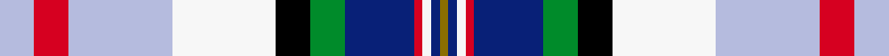

This page is one **sett** — a single exact thread-count. It belongs to the [tartan](/setts/lb4r4lb12w12k4g4db8r1w1db1y1/)
(the same proportion at any scale), whose colour order is pattern [GBWRBGKWWRW](/stripes/gbwrbgkwwrw/).

Sourced from register-of-tartans.  It is a [11 stripe tartan](/stripes/stripes11/).

Original link https://www.tartanregister.gov.uk/tartanDetails.aspx?ref=10170

2 attestations — the source records this cloth was collapsed from (oldest owns this page)

<ul>
<li>28/01/2010 — Arisaig NS Canada (register-of-tartans, <a href="https://www.tartanregister.gov.uk/tartanDetails.aspx?ref=10170">record</a>)  <em>Arisaig NS Canada was designed and adopted by the communities of Knoydart, McArras Brook, Arisaig, Doctors Brook Malignant Cove and Maryvale West located in Antigonish County, Nova Scotia, Canada. It is a tribute to the area's rich history and a tribute to the district's early settlers and Scottish culture. This tartan is owned by the Arisaig Community Development Association who control its use and production.</em></li>
<li>pre 2010 — Arisaig (District) (tartans-authority, <a href="http://www.tartansauthority.com/tartan-ferret/display/10170/">record</a>)  <em>Arisaig NS Canada was designed and adopted by the communities of Knoydart, McArras Brook, Arisaig, Doctors Brook Malignant Cove and Maryvale West located in Antigonish County, Nova Scotia, Canada. It is a tribute to the area's rich history and a tribute to the district's early settlers and Scottish culture. This tartan is owned by the Arisaig Community Development Association who control its use and production. Permission to weave this tartan must be obtained from the Arisaig Community Development Association. Email: arisaigdevelopment@yahoo.ca.</em></li>
</ul>

## Register references

External register numbers recorded for this tartan.

- Scottish Register of Tartans: [10170](https://www.tartanregister.gov.uk/tartanDetails?ref=10170)
- Scottish Tartans Authority (ITI): 10170

## Thread count
LB/8 R8 LB24 W24 K8 G8 DB16 R2 W2 DB2 Y/2

One full sett is **198 threads**.

## Palette
<table><thead><tr><th>Colour</th><th>Shade</th><th>OKLCh</th></tr></thead><tbody><tr><td>B</td><td><code style="background-color:#B5BBDE;">#B5BBDE</code> <small style="color:#888">#B5BBDE</small></td><td><small style="color:#888">oklch(79.9% 0.050 277.6)</small></td></tr><tr><td>DB</td><td><code style="background-color:#082077;">#082077</code> <small style="color:#888">#082077</small></td><td><small style="color:#888">oklch(30.0% 0.149 265.1)</small></td></tr><tr><td>G</td><td><code style="background-color:#008B2A;">#008B2A</code> <small style="color:#888">#008B2A</small></td><td><small style="color:#888">oklch(55.4% 0.170 145.9)</small></td></tr><tr><td>K</td><td><code style="background-color:#000000;">#000000</code> <small style="color:#888">#000000</small></td><td><small style="color:#888">oklch(0.0% 0.000 0.0)</small></td></tr><tr><td>R</td><td><code style="background-color:#D60020;">#D60020</code> <small style="color:#888">#D60020</small></td><td><small style="color:#888">oklch(55.2% 0.224 25.5)</small></td></tr><tr><td>W</td><td><code style="background-color:#F7F7F7;">#F7F7F7</code> <small style="color:#888">#F7F7F7</small></td><td><small style="color:#888">oklch(97.6% 0.000 89.9)</small></td></tr><tr><td>Y</td><td><code style="background-color:#8B6E00;">#8B6E00</code> <small style="color:#888">#8B6E00</small></td><td><small style="color:#888">oklch(55.1% 0.113 90.4)</small></td></tr></tbody></table>

# Sample pattern

ID: /variants/s11/lb4r4lb12w12k4g4db8r1w1db1y1~x2/
