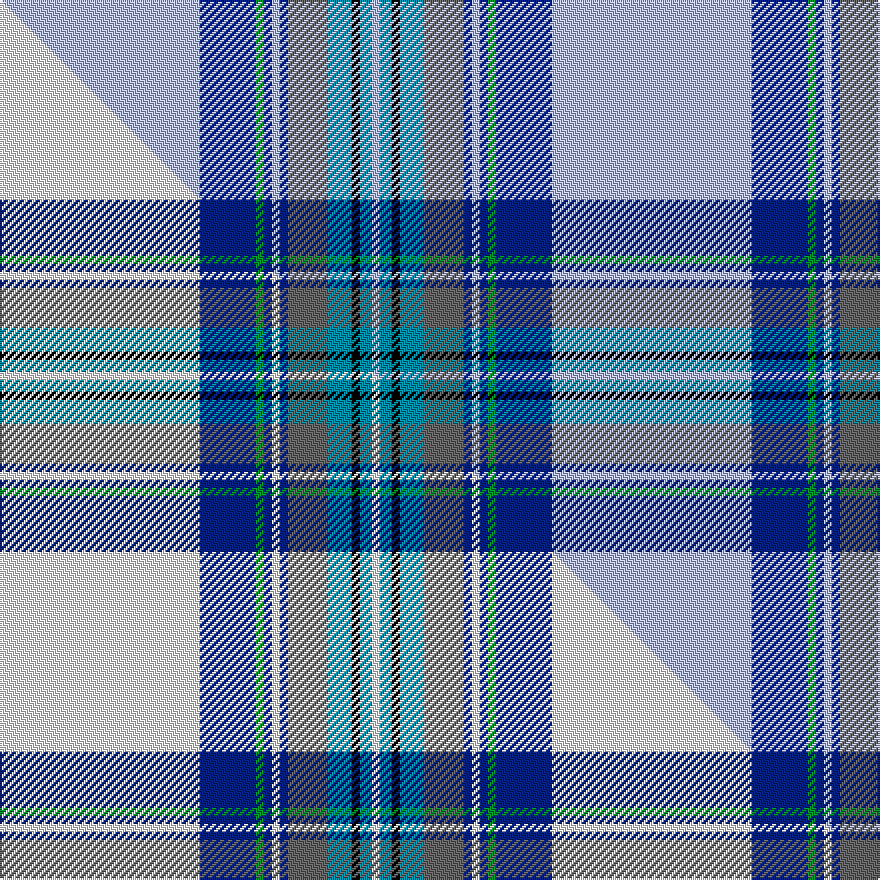

This is one **variant** — a specific cloth: this exact thread count and colourway, with its own
provenance below. It is one weaving of the [sett](/tartans/b/bl/blue-dunnett/) (the scale-free proportion — the
same cloth at any scale or shade), whose colour order is pattern [WBGBWBBBKBW](/stripes/wbgbwbbbkbw/).

Part of the [Blue Dunnett](/tartans/b/bl/blue-dunnett/) tartan — the named design grouping this sett with its other cloths.

Sourced from tartans-authority.  It is a [11 stripe tartan](/stripes/stripes11/).

Original link <code>http://www.tartansauthority.com/tartan-ferret/display/3706/</code> — retired · [Internet Archive copy](https://web.archive.org/web/*/http://www.tartansauthority.com/tartan-ferret/display/3706/*)

Dataset <small>— provenance for this record, inherited from the source manifest</small>

<dl class="dataset-prov">
<dt>source</dt><dd><a href="/sources/tartans-authority/">Scottish Tartans Authority</a></dd>
<dt>data captured from</dt><dd><a href="https://github.com/thetartan/tartan-database/blob/master/data/tartans-authority/data.csv">https://github.com/thetartan/tartan-database/blob/master/data/tartans-authority/data.csv</a></dd>
<dt>data date</dt><dd>pre 1989 <small>(this record)</small></dd>
<dt>licence</dt><dd><a href="https://creativecommons.org/licenses/by-nc-nd/4.0/">CC BY-NC-ND 4.0</a></dd>
</dl>

Capture chain <small>— the hands this data passed through, oldest first; each capture carries its own licence</small>

<ol class="capture-chain">
<li><a href="https://www.tartansauthority.com/">Scottish Tartans Authority</a> <small>the heritage body’s archive — its tartan-ferret record browser is retired; dead record links are shown unlinked, with an Internet Archive copy (ITI numbers are not SRT references)</small></li>
<li><a href="https://github.com/thetartan/tartan-database">thetartan/tartan-database</a> <small>2016-2017</small> · <a href="https://creativecommons.org/licenses/by-nc-nd/4.0/">CC BY-NC-ND 4.0</a> <small>Levko Kravets's frozen compilation — the capture we vendored, and where its CC licence text came from</small></li>
<li>this dictionary <small>captured 2026-06-10 · commit 5bf86c7566</small> <small>each re-capture is a git commit to data/sources</small></li>
</ol>

## Register references

External register numbers recorded for this tartan.

- Scottish Tartans Authority (ITI): 3706

## Thread count
LB/100 DB28 G4 DB4 LB4 DB4 N20 T12 K4 T6 LB/4

One full sett is **276 threads**.

## Palette
<table><thead><tr><th>Colour</th><th>Shade</th><th>OKLCh</th></tr></thead><tbody><tr><td>T</td><td><code style="background-color:#00879F;">#00879F</code> <small style="color:#888">#00879F</small></td><td><small style="color:#888">oklch(57.4% 0.102 216.1)</small></td></tr><tr><td>G</td><td><code style="background-color:#008B2A;">#008B2A</code> <small style="color:#888">#008B2A</small></td><td><small style="color:#888">oklch(55.4% 0.170 145.9)</small></td></tr><tr><td>DB</td><td><code style="background-color:#082077;">#082077</code> <small style="color:#888">#082077</small></td><td><small style="color:#888">oklch(30.0% 0.149 265.1)</small></td></tr><tr><td>K</td><td><code style="background-color:#000000;">#000000</code> <small style="color:#888">#000000</small></td><td><small style="color:#888">oklch(0.0% 0.000 0.0)</small></td></tr><tr><td>N</td><td><code style="background-color:#636363;">#636363</code> <small style="color:#888">#636363</small></td><td><small style="color:#888">oklch(50.0% 0.000 89.9)</small></td></tr><tr><td>LB</td><td><code style="background-color:#B5BBDE;">#B5BBDE</code> <small style="color:#888">#B5BBDE</small></td><td><small style="color:#888">oklch(79.9% 0.050 277.6)</small></td></tr></tbody></table>

# Sample pattern

## Compared to the master

This cloth is one sett of its design; the master sett (the exemplar the design is anchored on) is below for comparison.

Its **ΔTartan distance** from the master is **2.93** — the same measure the nearest-tartans table ranks by (0 is identical; a re-scale of the same cloth is near 0, a recolour or a different proportion further).

<figure class="master-compare" style="margin:0">

this sett
master sett ★

<figcaption style="color:#888;font-size:smaller">One weave of this sett against the <a href="/setts/w50db14g2db2w2db2n10t6k2t3w2/">master sett ★</a>, split on the diagonal: a shared proportion runs seamlessly across it with only the shades shifting; a different proportion breaks on it.</figcaption>
</figure>

## Nearest tartan variants

The nearest existing variants by ΔTartan distance, with this cloth at the top so the swatches line up against it.

ΔTartan

Threads

Variant

Sett

—

276

<a href="/variants/s11/lb50db14g2db2lb2db2n10t6k2t3lb2~x2/">Blue Dunnett (Fashion)</a>

<a href="/ttd/edit/#slug=y2db3y2db22lb8r1lb3r1lb22k1w2~x2&amp;base=lb50db14g2db2lb2db2n10t6k2t3lb2~x2" title="compare in the TTD">2.55</a>

260

<a href="/variants/s11/y2db3y2db22lb8r1lb3r1lb22k1w2~x2/">Liddell (Newfane, New York)</a>

<a href="/ttd/edit/#slug=b28k1r7k1b6k1n4k1b6y2r3y2b4w6~x2&amp;base=lb50db14g2db2lb2db2n10t6k2t3lb2~x2" title="compare in the TTD">2.80</a>

220

<a href="/variants/s14/b28k1r7k1b6k1n4k1b6y2r3y2b4w6~x2/">Rabbinical (Corporate)</a>

<a href="/ttd/edit/#slug=lr64db18lb2db3lr2db3t14b8k2b4lr2~x2~lb3005267-b2409265&amp;base=lb50db14g2db2lb2db2n10t6k2t3lb2~x2" title="compare in the TTD">2.88</a>

356

<a href="/variants/s11/lr64db18lb2db3lr2db3t14b8k2b4lr2~x2~lb3005267-b2409265/">Bennet Dress (Fashion)</a>

<a href="/ttd/edit/#slug=w50db14g2db2w2db2n10t6k2t3w2~x2&amp;base=lb50db14g2db2lb2db2n10t6k2t3lb2~x2" title="compare in the TTD">2.93</a>

276

<a href="/variants/s11/w50db14g2db2w2db2n10t6k2t3w2~x2/">Blue Dunnett</a>

<a href="/ttd/edit/#slug=t50r3t4k8n4k2y3k2r12w2r4t4~x2&amp;base=lb50db14g2db2lb2db2n10t6k2t3lb2~x2" title="compare in the TTD">3.02</a>

284

<a href="/variants/s12/t50r3t4k8n4k2y3k2r12w2r4t4~x2/">City of Barrie</a>

<a href="/ttd/edit/#slug=lb16db6k1y1k1db1lb4dy4k1r1~x4&amp;base=lb50db14g2db2lb2db2n10t6k2t3lb2~x2" title="compare in the TTD">3.11</a>

220

<a href="/variants/s10/lb16db6k1y1k1db1lb4dy4k1r1~x4/">Kirk in the Hills</a>

<a href="/ttd/edit/#slug=lo2w3k1b9k1bi6g1bi3g1bi19k2w7lo1~x2~b1611266-bi2501240&amp;base=lb50db14g2db2lb2db2n10t6k2t3lb2~x2" title="compare in the TTD">3.11</a>

218

<a href="/variants/s13/lo2w3k1b9k1bi6g1bi3g1bi19k2w7lo1~x2~b1511266-bi2501240/">Cahaba Memorial</a>

<a href="/ttd/edit/#slug=lb57db4k8y4k4lb4k4g8r6k4r4lb2&amp;base=lb50db14g2db2lb2db2n10t6k2t3lb2~x2" title="compare in the TTD">3.33</a>

159

<a href="/variants/s12/lb57db4k8y4k4lb4k4g8r6k4r4lb2/">Stuart/Stewart Royal variant</a>

<a href="/ttd/edit/#slug=b32w1k3w1g14b7k3dr3w1~x2&amp;base=lb50db14g2db2lb2db2n10t6k2t3lb2~x2" title="compare in the TTD">3.37</a>

194

<a href="/variants/s9/b32w1k3w1g14b7k3dr3w1~x2/">Leach, Leech, Leitch, hunting</a>

<a href="/ttd/edit/#slug=r2lb2r1lb24o1n3k3lb3o12lb4r1~x2~o2500000-n1900000&amp;base=lb50db14g2db2lb2db2n10t6k2t3lb2~x2" title="compare in the TTD">3.41</a>

218

<a href="/variants/s11/r2lb2r1lb24o1n3k3lb3o12lb4r1~x2~o2500000-n1900000/">Dabney Grey (Personal)</a>

## Neighbour map

Every grey dot is one of 13657 variants placed by the first two principal components of the ΔTartan feature space (42% of its variance). Red is this tartan; blue dots are its nearest — click one to open its page. The map is a flat projection of a many-dimensional space — [how to read it](/posts/neighbourhood-maps/).

<svg viewBox="0 0 640 380" role="img" style="max-width:100%;height:auto;border:1px solid #e0e0e0;border-radius:4px;display:block" xmlns="http://www.w3.org/2000/svg"><image href="/nn/cloud.v1.png" width="640" height="380"/><a href="/variants/s11/y2db3y2db22lb8r1lb3r1lb22k1w2~x2/"><circle cx="242.0" cy="90.7" r="4" fill="#3465a4"><title>Liddell (Newfane, New York)</title></circle></a><a href="/variants/s14/b28k1r7k1b6k1n4k1b6y2r3y2b4w6~x2/"><circle cx="298.1" cy="64.6" r="4" fill="#3465a4"><title>Rabbinical (Corporate)</title></circle></a><a href="/variants/s11/lr64db18lb2db3lr2db3t14b8k2b4lr2~x2~lb3005267-b2409265/"><circle cx="287.6" cy="55.7" r="4" fill="#3465a4"><title>Bennet Dress (Fashion)</title></circle></a><a href="/variants/s11/w50db14g2db2w2db2n10t6k2t3w2~x2/"><circle cx="257.3" cy="63.6" r="4" fill="#3465a4"><title>Blue Dunnett</title></circle></a><a href="/variants/s12/t50r3t4k8n4k2y3k2r12w2r4t4~x2/"><circle cx="292.8" cy="61.7" r="4" fill="#3465a4"><title>City of Barrie</title></circle></a><a href="/variants/s10/lb16db6k1y1k1db1lb4dy4k1r1~x4/"><circle cx="225.2" cy="94.7" r="4" fill="#3465a4"><title>Kirk in the Hills</title></circle></a><a href="/variants/s13/lo2w3k1b9k1bi6g1bi3g1bi19k2w7lo1~x2~b1511266-bi2501240/"><circle cx="196.1" cy="93.2" r="4" fill="#3465a4"><title>Cahaba Memorial</title></circle></a><a href="/variants/s12/lb57db4k8y4k4lb4k4g8r6k4r4lb2/"><circle cx="256.6" cy="44.4" r="4" fill="#3465a4"><title>Stuart/Stewart Royal variant</title></circle></a><a href="/variants/s9/b32w1k3w1g14b7k3dr3w1~x2/"><circle cx="327.3" cy="96.3" r="4" fill="#3465a4"><title>Leach, Leech, Leitch, hunting</title></circle></a><a href="/variants/s11/r2lb2r1lb24o1n3k3lb3o12lb4r1~x2~o2500000-n1900000/"><circle cx="334.5" cy="105.3" r="4" fill="#3465a4"><title>Dabney Grey (Personal)</title></circle></a><circle cx="290.4" cy="73.2" r="5" fill="#c00000"/><text x="320" y="376" text-anchor="middle" font-size="11" fill="#999">ground</text><text x="11" y="190" text-anchor="middle" font-size="11" fill="#999" transform="rotate(-90 11 190)">complexity</text></svg>

ID: /variants/s11/lb50db14g2db2lb2db2n10t6k2t3lb2~x2/
