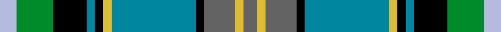

This page is one **sett** — a single exact thread-count. It belongs to the [tartan](/setts/lb6g13k12t3k3ly3t30k3n11ly3n5/)
(the same proportion at any scale), whose colour order is pattern [BYBKBYKBKGW](/stripes/bybkbykbkgw/).

Sourced from tartans-authority.  It is a [11 stripe tartan](/stripes/stripes11/).

Original link http://www.tartansauthority.com/tartan-ferret/display/8913/

## Register references

External register numbers recorded for this tartan.

- Scottish Register of Tartans: [8913](https://www.tartanregister.gov.uk/tartanDetails?ref=8913)
- Scottish Tartans Authority (ITI): 8913

## Thread count
LB/12 G26 K24 T6 K6 LY6 T60 K6 N22 LY6 N/10

One full sett is **346 threads**.

## Palette
<table><thead><tr><th>Colour</th><th>Shade</th><th>OKLCh</th></tr></thead><tbody><tr><td>T</td><td><code style="background-color:#00879F;">#00879F</code> <small style="color:#888">#00879F</small></td><td><small style="color:#888">oklch(57.4% 0.102 216.1)</small></td></tr><tr><td>LY</td><td><code style="background-color:#DCBC32;">#DCBC32</code> <small style="color:#888">#DCBC32</small></td><td><small style="color:#888">oklch(80.0% 0.150 95.2)</small></td></tr><tr><td>G</td><td><code style="background-color:#008B2A;">#008B2A</code> <small style="color:#888">#008B2A</small></td><td><small style="color:#888">oklch(55.4% 0.170 145.9)</small></td></tr><tr><td>K</td><td><code style="background-color:#000000;">#000000</code> <small style="color:#888">#000000</small></td><td><small style="color:#888">oklch(0.0% 0.000 0.0)</small></td></tr><tr><td>LB</td><td><code style="background-color:#B5BBDE;">#B5BBDE</code> <small style="color:#888">#B5BBDE</small></td><td><small style="color:#888">oklch(79.9% 0.050 277.6)</small></td></tr><tr><td>N</td><td><code style="background-color:#636363;">#636363</code> <small style="color:#888">#636363</small></td><td><small style="color:#888">oklch(50.0% 0.000 89.9)</small></td></tr></tbody></table>

# Sample pattern

ID: /variants/s11/lb6g13k12t3k3ly3t30k3n11ly3n5~x2/
