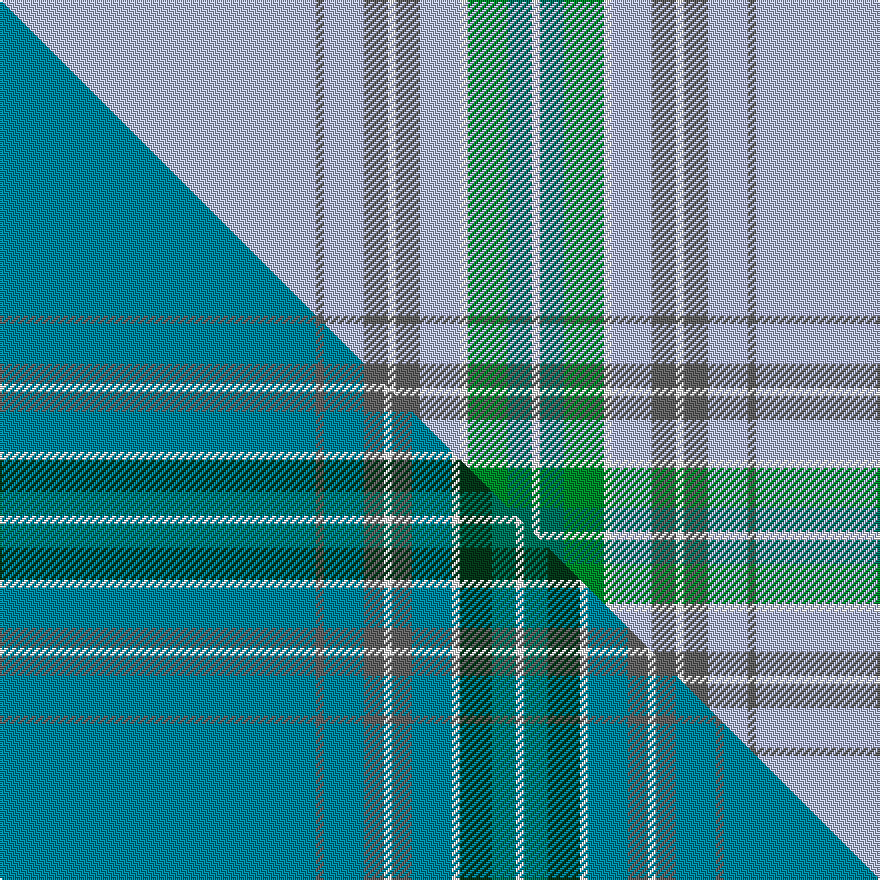

This is one **variant** — a specific cloth: this exact thread count and colourway, with its own
provenance below. It is one weaving of the [sett](/setts/lb79n2lb10n6w2n6lb10w2g10gi6w2/) (the scale-free proportion — the
same cloth at any scale or shade), whose colour order is pattern [WBWBWBWWGGW](/stripes/wbwbwbwwggw/).

Part of the [Dallas](/tartans/d/da/dallas/) tartan — the named design grouping this sett with its other cloths.

Sourced from house-of-tartan.  It is a [11 stripe tartan](/stripes/stripes11/).

Original link [http://www.house-of-tartan.scotland.net/house/TartanViewjs.asp?colr=Def&tnam=7513](http://www.house-of-tartan.scotland.net/house/TartanViewjs.asp?colr=Def&tnam=7513)

## Provenance

Earliest known date: 1980 In February 2010 Dr Phil Smith provided information that a Dr. Dallas said he had first seen the Dallas tartan in the 1940s in the home of an old woman in the Carse of Gowrie (near Dundee). This pattern has been woven by Lochcarron. It is similar but not exactly the same as another version woven by D C Dalgliesh in the 1980s when he supplied a kilt length to US kiltmaker Kathy Lare of New Mexico.

Dataset <small>— provenance for this record, inherited from the source manifest</small>

<dl class="dataset-prov">
<dt>source</dt><dd><a href="/sources/house-of-tartan/">House of Tartan</a></dd>
<dt>data captured from</dt><dd><a href="https://github.com/thetartan/tartan-database/blob/master/data/house-of-tartan/data.csv">https://github.com/thetartan/tartan-database/blob/master/data/house-of-tartan/data.csv</a></dd>
<dt>data date</dt><dd>1980 <small>(this record)</small></dd>
<dt>licence</dt><dd><a href="https://creativecommons.org/licenses/by-nc-nd/4.0/">CC BY-NC-ND 4.0</a></dd>
</dl>

Capture chain <small>— the hands this data passed through, oldest first; each capture carries its own licence</small>

<ol class="capture-chain">
<li><a href="http://www.house-of-tartan.scotland.net/">House of Tartan</a> <small>the weaver/retailer's database — the site is now offline; the URL is kept as the ultimate source's identity</small></li>
<li><a href="https://github.com/thetartan/tartan-database">thetartan/tartan-database</a> <small>2016-2017</small> · <a href="https://creativecommons.org/licenses/by-nc-nd/4.0/">CC BY-NC-ND 4.0</a> <small>Levko Kravets's frozen compilation — the capture we vendored, and where its CC licence text came from</small></li>
<li>this dictionary <small>captured 2026-06-10 · commit 5bf86c7566</small> <small>each re-capture is a git commit to data/sources</small></li>
</ol>

## Thread count
LB/158 N4 LB20 N12 W4 N12 LB20 W4 G20 Gi12 W/4

One full sett is **378 threads**.

## Palette
<table><thead><tr><th>Colour</th><th>Shade</th><th>OKLCh</th></tr></thead><tbody><tr><td>LB</td><td><code style="background-color:#B5BBDE;">#B5BBDE</code> <small style="color:#888">#B5BBDE</small></td><td><small style="color:#888">oklch(79.9% 0.050 277.6)</small></td></tr><tr><td>DG</td><td><code style="background-color:#003820;">#003820</code> <small style="color:#888">#003820</small></td><td><small style="color:#888">oklch(30.0% 0.070 158.3)</small></td></tr><tr><td>G</td><td><code style="background-color:#007460;">#007460</code> <small style="color:#888">#007460</small></td><td><small style="color:#888">oklch(49.9% 0.094 175.1)</small></td></tr><tr><td>G</td><td><code style="background-color:#008B2A;">#008B2A</code> <small style="color:#888">#008B2A</small></td><td><small style="color:#888">oklch(55.4% 0.170 145.9)</small></td></tr><tr><td>K</td><td><code style="background-color:#000000;">#000000</code> <small style="color:#888">#000000</small></td><td><small style="color:#888">oklch(0.0% 0.000 0.0)</small></td></tr><tr><td>W</td><td><code style="background-color:#F7F7F7;">#F7F7F7</code> <small style="color:#888">#F7F7F7</small></td><td><small style="color:#888">oklch(97.6% 0.000 89.9)</small></td></tr><tr><td>T</td><td><code style="background-color:#00879F;">#00879F</code> <small style="color:#888">#00879F</small></td><td><small style="color:#888">oklch(57.4% 0.102 216.1)</small></td></tr><tr><td>N</td><td><code style="background-color:#636363;">#636363</code> <small style="color:#888">#636363</small></td><td><small style="color:#888">oklch(50.0% 0.000 89.9)</small></td></tr></tbody></table>

# Sample pattern

## Compared to the master

This cloth is one sett of its design; the master sett (the exemplar the design is anchored on) is below for comparison.

Its **ΔTartan distance** from the master is **0.71** — the same measure the nearest-tartans table ranks by (0 is identical; a re-scale of the same cloth is near 0, a recolour or a different proportion further).

<figure class="master-compare" style="margin:0">

this sett
master sett ★

<figcaption style="color:#888;font-size:smaller">One weave of this sett against the <a href="/setts/t79n2t10n5w2n5t10w2dg8g6w2/">master sett ★</a>, split on the diagonal: a shared proportion runs seamlessly across it with only the shades shifting; a different proportion breaks on it.</figcaption>
</figure>

## Nearest tartan variants

The nearest existing variants by ΔTartan distance, with this cloth at the top so the swatches line up against it.

ΔTartan

Threads

Variant

Sett

—

378

<a href="/variants/s11/lb79n2lb10n6w2n6lb10w2g10gi6w2~x2~gi2004173/">Dallas Family Tartan</a>

<a href="/ttd/edit/#slug=lb79n2lb10n6w2n6lb10w2g10dg6w2~x2&amp;base=lb79n2lb10n6w2n6lb10w2g10gi6w2~x2~gi2004173" title="compare in the TTD">0.02</a>

378

<a href="/variants/s11/lb79n2lb10n6w2n6lb10w2g10dg6w2~x2/">Dallas (Clan)</a>

<a href="/ttd/edit/#slug=t79n2t10n5w2n5t10w2dg8g6w2~x2~g2004173&amp;base=lb79n2lb10n6w2n6lb10w2g10gi6w2~x2~gi2004173" title="compare in the TTD">0.71</a>

362

<a href="/variants/s11/t79n2t10n5w2n5t10w2dg8g6w2~x2~g2004173/">Dallas (Lochcarron) (Personal)</a>

<a href="/ttd/edit/#slug=dbi8w4db6dbi2db6n10db63w3~dbi1406275-db1404245&amp;base=lb79n2lb10n6w2n6lb10w2g10gi6w2~x2~gi2004173" title="compare in the TTD">2.12</a>

193

<a href="/variants/s8/dbi8w4db6dbi2db6n10db63w3~dbi1406275-db1404245/">Pride of the Clyde</a>

<a href="/ttd/edit/#slug=o16lb8n1lb2n1lb1n8o34w2~x2~o2500000-n1900000&amp;base=lb79n2lb10n6w2n6lb10w2g10gi6w2~x2~gi2004173" title="compare in the TTD">2.57</a>

256

<a href="/variants/s9/o16lb8n1lb2n1lb1n8o34w2~x2~o2500000-n1900000/">Stuart of Bute 2013 (Fashion)</a>

<a href="/ttd/edit/#slug=n56db9w2db2r2n9lb4db2lb2y3~x2&amp;base=lb79n2lb10n6w2n6lb10w2g10gi6w2~x2~gi2004173" title="compare in the TTD">3.31</a>

246

<a href="/variants/s10/n56db9w2db2r2n9lb4db2lb2y3~x2/">Blue Toon</a>

<a href="/ttd/edit/#slug=t42w5t1w1ly9t1dg2w1t1r1~x4&amp;base=lb79n2lb10n6w2n6lb10w2g10gi6w2~x2~gi2004173" title="compare in the TTD">3.48</a>

340

<a href="/variants/s10/t42w5t1w1ly9t1dg2w1t1r1~x4/">Stratford, (Oregon) City of (Dist.)</a>

<a href="/ttd/edit/#slug=lb43db2lb2r1lb1ri11lb2db2lb22w4lb7~x2~db1406275-ri2806019&amp;base=lb79n2lb10n6w2n6lb10w2g10gi6w2~x2~gi2004173" title="compare in the TTD">3.81</a>

288

<a href="/variants/s11/lb43db2lb2r1lb1ri11lb2db2lb22w4lb7~x2~db1406275-ri2806019/">Highland Dusk (Fashion)</a>

<a href="/ttd/edit/#slug=lb100y12dt14ly5dt5w5dt5y28lb16dt5lb18ly6~y2400000-dt1700000&amp;base=lb79n2lb10n6w2n6lb10w2g10gi6w2~x2~gi2004173" title="compare in the TTD">3.95</a>

332

<a href="/variants/s12/lb100y12n14ly5n5w5n5y28lb16n5lb18ly6~y2400000-n1700000/">Glenclova</a>

## Neighbour map

Every grey dot is one of 13656 variants placed by the first two principal components of the ΔTartan feature space (42% of its variance). Red is this tartan; blue dots are its nearest — click one to open its page. The map is a flat projection of a many-dimensional space — [how to read it](/posts/neighbourhood-maps/).

<svg viewBox="0 0 640 380" role="img" style="max-width:100%;height:auto;border:1px solid #e0e0e0;border-radius:4px;display:block" xmlns="http://www.w3.org/2000/svg"><image href="/nn/cloud.v1.png" width="640" height="380"/><a href="/variants/s11/lb79n2lb10n6w2n6lb10w2g10dg6w2~x2/"><circle cx="524.2" cy="101.4" r="4" fill="#3465a4"><title>Dallas (Clan)</title></circle></a><a href="/variants/s11/t79n2t10n5w2n5t10w2dg8g6w2~x2~g2004173/"><circle cx="610.1" cy="129.2" r="4" fill="#3465a4"><title>Dallas (Lochcarron) (Personal)</title></circle></a><a href="/variants/s8/dbi8w4db6dbi2db6n10db63w3~dbi1406275-db1404245/"><circle cx="564.8" cy="163.0" r="4" fill="#3465a4"><title>Pride of the Clyde</title></circle></a><a href="/variants/s9/o16lb8n1lb2n1lb1n8o34w2~x2~o2500000-n1900000/"><circle cx="585.7" cy="177.0" r="4" fill="#3465a4"><title>Stuart of Bute 2013 (Fashion)</title></circle></a><a href="/variants/s10/n56db9w2db2r2n9lb4db2lb2y3~x2/"><circle cx="493.1" cy="97.6" r="4" fill="#3465a4"><title>Blue Toon</title></circle></a><a href="/variants/s10/t42w5t1w1ly9t1dg2w1t1r1~x4/"><circle cx="475.3" cy="84.5" r="4" fill="#3465a4"><title>Stratford, (Oregon) City of (Dist.)</title></circle></a><a href="/variants/s11/lb43db2lb2r1lb1ri11lb2db2lb22w4lb7~x2~db1406275-ri2806019/"><circle cx="614.5" cy="121.6" r="4" fill="#3465a4"><title>Highland Dusk (Fashion)</title></circle></a><a href="/variants/s12/lb100y12n14ly5n5w5n5y28lb16n5lb18ly6~y2400000-n1700000/"><circle cx="441.2" cy="152.1" r="4" fill="#3465a4"><title>Glenclova</title></circle></a><circle cx="550.6" cy="110.6" r="5" fill="#c00000"/><text x="320" y="376" text-anchor="middle" font-size="11" fill="#999">ground</text><text x="11" y="190" text-anchor="middle" font-size="11" fill="#999" transform="rotate(-90 11 190)">complexity</text></svg>

ID: /variants/s11/lb79n2lb10n6w2n6lb10w2g10gi6w2~x2~gi2004173/
