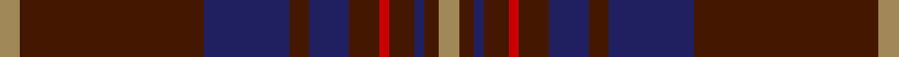

This page is one **sett** — a single exact thread-count. It belongs to the [tartan](/setts/lo4do37db17do4db8do6r2do5db2do3lo4/)
(the same proportion at any scale), whose colour order is pattern [YBBBBBRBBBY](/stripes/ybbbbbrbbby/).

Sourced from house-of-tartan.  It is a [11 stripe tartan](/stripes/stripes11/).

Original link http://www.house-of-tartan.scotland.net/house/TartanViewjs.asp?colr=Def&tnam=5733

## Provenance

Earliest known date: 2002 The tartan for this Welsh surname and its variation, Griffith, is actually woven in Wales at the Cambrian Woollen Mill, weaving on the same site since 1830. This tartan differs from many traditional patterns in that the warp and weft differ, giving the finished worsted wool cloth more of a predominant stripe, vertically noticeable in the finished Kilt, or Cilt in Wales. Available from Wales Tartan Centres in Swansea

## Thread count
LT/4 DR37 DB17 DR4 DB8 DR6 R2 DR5 DB2 DR3 LT/4

One full sett is **176 threads**.

## Palette

Palette: <strong>Tartan Register</strong>
<table><thead><tr><th>Colour</th><th>Threads</th><th>Shade</th><th>Base</th><th>OKLCh</th></tr></thead><tbody><tr><td>LT/</td><td style="text-align:right;font-variant-numeric:tabular-nums">4</td><td><code style="background-color:#A08858;">#A08858</code> <small style="color:#888">#A08858</small></td><td>Y <code style="background-color:#F2BF00;">#F2BF00</code></td><td><small style="color:#888">oklch(63.7% 0.071 84.0)</small></td></tr><tr><td>DR</td><td style="text-align:right;font-variant-numeric:tabular-nums">37</td><td><code style="background-color:#441800;">#441800</code> <small style="color:#888">#441800</small></td><td>B <code style="background-color:#2A418A;">#2A418A</code></td><td><small style="color:#888">oklch(27.3% 0.076 46.3)</small></td></tr><tr><td>DB</td><td style="text-align:right;font-variant-numeric:tabular-nums">17</td><td><code style="background-color:#202060;">#202060</code> <small style="color:#888">#202060</small></td><td>B <code style="background-color:#2A418A;">#2A418A</code></td><td><small style="color:#888">oklch(28.9% 0.111 276.9)</small></td></tr><tr><td>DR</td><td style="text-align:right;font-variant-numeric:tabular-nums">4</td><td><code style="background-color:#441800;">#441800</code> <small style="color:#888">#441800</small></td><td>B <code style="background-color:#2A418A;">#2A418A</code></td><td><small style="color:#888">oklch(27.3% 0.076 46.3)</small></td></tr><tr><td>DB</td><td style="text-align:right;font-variant-numeric:tabular-nums">8</td><td><code style="background-color:#202060;">#202060</code> <small style="color:#888">#202060</small></td><td>B <code style="background-color:#2A418A;">#2A418A</code></td><td><small style="color:#888">oklch(28.9% 0.111 276.9)</small></td></tr><tr><td>DR</td><td style="text-align:right;font-variant-numeric:tabular-nums">6</td><td><code style="background-color:#441800;">#441800</code> <small style="color:#888">#441800</small></td><td>B <code style="background-color:#2A418A;">#2A418A</code></td><td><small style="color:#888">oklch(27.3% 0.076 46.3)</small></td></tr><tr><td>R</td><td style="text-align:right;font-variant-numeric:tabular-nums">2</td><td><code style="background-color:#C80000;">#C80000</code> <small style="color:#888">#C80000</small></td><td>R <code style="background-color:#CC0000;">#CC0000</code></td><td><small style="color:#888">oklch(52.3% 0.215 29.2)</small></td></tr><tr><td>DR</td><td style="text-align:right;font-variant-numeric:tabular-nums">5</td><td><code style="background-color:#441800;">#441800</code> <small style="color:#888">#441800</small></td><td>B <code style="background-color:#2A418A;">#2A418A</code></td><td><small style="color:#888">oklch(27.3% 0.076 46.3)</small></td></tr><tr><td>DB</td><td style="text-align:right;font-variant-numeric:tabular-nums">2</td><td><code style="background-color:#202060;">#202060</code> <small style="color:#888">#202060</small></td><td>B <code style="background-color:#2A418A;">#2A418A</code></td><td><small style="color:#888">oklch(28.9% 0.111 276.9)</small></td></tr><tr><td>DR</td><td style="text-align:right;font-variant-numeric:tabular-nums">3</td><td><code style="background-color:#441800;">#441800</code> <small style="color:#888">#441800</small></td><td>B <code style="background-color:#2A418A;">#2A418A</code></td><td><small style="color:#888">oklch(27.3% 0.076 46.3)</small></td></tr><tr><td>LT/</td><td style="text-align:right;font-variant-numeric:tabular-nums">4</td><td><code style="background-color:#A08858;">#A08858</code> <small style="color:#888">#A08858</small></td><td>Y <code style="background-color:#F2BF00;">#F2BF00</code></td><td><small style="color:#888">oklch(63.7% 0.071 84.0)</small></td></tr></tbody></table>

## Nearest tartans

The nearest existing variants by ΔTartan distance, with this tartan at the top so the swatches line up against it.

ΔTartan

Tartan

Sett

—

<a href="/ttd/edit/#slug=lo4do37db17do4db8do6r2do5db2do3lo4">Griffiths Welsh Name Tartan</a> <a class="nn-out" href="/variants/s11/lo4do37db17do4db8do6r2do5db2do3lo4/" title="open its dictionary page">↗</a>

1.15

<a href="/ttd/edit/#slug=dg12o4k1ly1o2k1ly1o4dg16o20dg2o8~x2&amp;base=lo4do37db17do4db8do6r2do5db2do3lo4">Livingstone (Australia) NSW</a> <a class="nn-out" href="/variants/s12/dg12o4k1ly1o2k1ly1o4dg16o20dg2o8~x2/" title="open its dictionary page">↗</a>

1.15

<a href="/ttd/edit/#slug=do8k2o2do2k13do2k2ly1do14k26ly2~x2&amp;base=lo4do37db17do4db8do6r2do5db2do3lo4">Pride of Scotland, Dark (Fashion)</a> <a class="nn-out" href="/variants/s11/do8k2o2do2k13do2k2ly1do14k26ly2~x2/" title="open its dictionary page">↗</a>

1.37

<a href="/ttd/edit/#slug=ri7r2db2ri2dg32ri6db12ri41dg2ri5r2dg5~x2&amp;base=lo4do37db17do4db8do6r2do5db2do3lo4">MacDougall #5</a> <a class="nn-out" href="/variants/s12/ri7r2db2ri2dg32ri6db12ri41dg2ri5r2dg5~x2/" title="open its dictionary page">↗</a>

1.41

<a href="/ttd/edit/#slug=r6lo1r24dg6db2k1db2k1db12r1~x2&amp;base=lo4do37db17do4db8do6r2do5db2do3lo4">MacEdward (MacGregor Hastie)</a> <a class="nn-out" href="/variants/s10/r6lo1r24dg6db2k1db2k1db12r1~x2/" title="open its dictionary page">↗</a>

1.41

<a href="/ttd/edit/#slug=m12dg6k1dg2k1dg1k6m24w2~x2&amp;base=lo4do37db17do4db8do6r2do5db2do3lo4">Stuart/Stewart of Bute Hunting</a> <a class="nn-out" href="/variants/s9/m12dg6k1dg2k1dg1k6m24w2~x2/" title="open its dictionary page">↗</a>

1.44

<a href="/ttd/edit/#slug=ly4dt2r7dt15r4dt3r4dt7r28dg7r6dg2&amp;base=lo4do37db17do4db8do6r2do5db2do3lo4">Walker Family Tartan</a> <a class="nn-out" href="/variants/s12/ly4dt2r7dt15r4dt3r4dt7r28dg7r6dg2/" title="open its dictionary page">↗</a>

1.46

<a href="/ttd/edit/#slug=r1k1n30k6n1k6dy8k1r1~x2&amp;base=lo4do37db17do4db8do6r2do5db2do3lo4">Klappert Original (Personal)</a> <a class="nn-out" href="/variants/s9/r1k1n30k6n1k6dy8k1r1~x2/" title="open its dictionary page">↗</a>

1.47

<a href="/ttd/edit/#slug=dri26w2dri3dt15dt26dr2dt3~x2&amp;base=lo4do37db17do4db8do6r2do5db2do3lo4">Gavin</a> <a class="nn-out" href="/variants/s7/dri26w2dri3dt15dt26dr2dt3~x2/" title="open its dictionary page">↗</a>

1.47

<a href="/ttd/edit/#slug=r7w2r32db7dg3db2dg3db2dg16r3~x2&amp;base=lo4do37db17do4db8do6r2do5db2do3lo4">Chisholm Hunting</a> <a class="nn-out" href="/variants/s10/r7w2r32db7dg3db2dg3db2dg16r3~x2/" title="open its dictionary page">↗</a>

1.48

<a href="/ttd/edit/#slug=n19do2k3o1k1w1k1do6n3k1n6~x4&amp;base=lo4do37db17do4db8do6r2do5db2do3lo4">Glen Clova #1</a> <a class="nn-out" href="/variants/s11/n19do2k3o1k1w1k1do6n3k1n6~x4/" title="open its dictionary page">↗</a>

## Neighbour map

Every grey dot is one of 14360 variants placed by the first two principal components of the ΔTartan feature space (44% of its variance). Red is this tartan; blue dots are its nearest — click one to open its page.

<svg viewBox="0 0 640 380" role="img" style="max-width:100%;height:auto;border:1px solid #e0e0e0;border-radius:4px;display:block" xmlns="http://www.w3.org/2000/svg"><image href="/nn/cloud.v1.png" width="640" height="380"/><a href="/variants/s12/dg12o4k1ly1o2k1ly1o4dg16o20dg2o8~x2/"><circle cx="408.7" cy="180.2" r="4" fill="#3465a4"><title>Livingstone (Australia) NSW</title></circle></a><a href="/variants/s11/do8k2o2do2k13do2k2ly1do14k26ly2~x2/"><circle cx="429.4" cy="175.9" r="4" fill="#3465a4"><title>Pride of Scotland, Dark (Fashion)</title></circle></a><a href="/variants/s12/ri7r2db2ri2dg32ri6db12ri41dg2ri5r2dg5~x2/"><circle cx="385.4" cy="153.1" r="4" fill="#3465a4"><title>MacDougall #5</title></circle></a><a href="/variants/s10/r6lo1r24dg6db2k1db2k1db12r1~x2/"><circle cx="393.8" cy="141.8" r="4" fill="#3465a4"><title>MacEdward (MacGregor Hastie)</title></circle></a><a href="/variants/s9/m12dg6k1dg2k1dg1k6m24w2~x2/"><circle cx="447.7" cy="156.9" r="4" fill="#3465a4"><title>Stuart/Stewart of Bute Hunting</title></circle></a><a href="/variants/s12/ly4dt2r7dt15r4dt3r4dt7r28dg7r6dg2/"><circle cx="350.4" cy="178.5" r="4" fill="#3465a4"><title>Walker Family Tartan</title></circle></a><a href="/variants/s9/r1k1n30k6n1k6dy8k1r1~x2/"><circle cx="425.8" cy="150.0" r="4" fill="#3465a4"><title>Klappert Original (Personal)</title></circle></a><a href="/variants/s7/dri26w2dri3dt15dt26dr2dt3~x2/"><circle cx="411.7" cy="229.5" r="4" fill="#3465a4"><title>Gavin</title></circle></a><a href="/variants/s10/r7w2r32db7dg3db2dg3db2dg16r3~x2/"><circle cx="367.5" cy="163.2" r="4" fill="#3465a4"><title>Chisholm Hunting</title></circle></a><a href="/variants/s11/n19do2k3o1k1w1k1do6n3k1n6~x4/"><circle cx="410.0" cy="145.6" r="4" fill="#3465a4"><title>Glen Clova #1</title></circle></a><circle cx="429.1" cy="176.9" r="5" fill="#c00000"/></svg>

ID: /variants/s11/lo4do37db17do4db8do6r2do5db2do3lo4/
