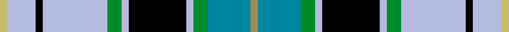

This page is one **sett** — a single exact thread-count. It belongs to the [tartan](/setts/ly1t6g2lb1k8lb1g2lb9k1lb4lyi1/)
(the same proportion at any scale), whose colour order is pattern [YBGWKWGWKWY](/stripes/ybgwkwgwkwy/).

Sourced from register-of-tartans.  It is a [11 stripe tartan](/stripes/stripes11/).

Original link https://www.tartanregister.gov.uk/tartanDetails.aspx?ref=4129

## Register references

External register numbers recorded for this tartan.

- Scottish Register of Tartans: [4129](https://www.tartanregister.gov.uk/tartanDetails.aspx?ref=4129)
- Scottish Tartans Authority (ITI): 5121

## Thread count
LYi/4 LB16 K4 LB36 G8 LB4 K32 LB4 G8 T24 LY/4

One full sett is **280 threads**.

## Palette
<table><thead><tr><th>Colour</th><th>Shade</th><th>OKLCh</th></tr></thead><tbody><tr><td>B</td><td><code style="background-color:#00879F;">#00879F</code> <small style="color:#888">#00879F</small></td><td><small style="color:#888">oklch(57.4% 0.102 216.1)</small></td></tr><tr><td>G</td><td><code style="background-color:#008B2A;">#008B2A</code> <small style="color:#888">#008B2A</small></td><td><small style="color:#888">oklch(55.4% 0.170 145.9)</small></td></tr><tr><td>K</td><td><code style="background-color:#000000;">#000000</code> <small style="color:#888">#000000</small></td><td><small style="color:#888">oklch(0.0% 0.000 0.0)</small></td></tr><tr><td>LG</td><td><code style="background-color:#C4BC68;">#C4BC68</code> <small style="color:#888">#C4BC68</small></td><td><small style="color:#888">oklch(78.4% 0.107 103.7)</small></td></tr><tr><td>LT</td><td><code style="background-color:#A08858;">#A08858</code> <small style="color:#888">#A08858</small></td><td><small style="color:#888">oklch(63.7% 0.071 84.0)</small></td></tr><tr><td>LY</td><td><code style="background-color:#B5BBDE;">#B5BBDE</code> <small style="color:#888">#B5BBDE</small></td><td><small style="color:#888">oklch(79.9% 0.050 277.6)</small></td></tr></tbody></table>

# Sample pattern

ID: /variants/s11/ly1t6g2lb1k8lb1g2lb9k1lb4lyi1~x4~ly2503076-lyi3104101/
