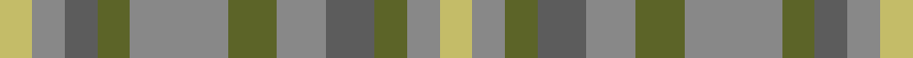

This page is one **sett** — a single exact thread-count. It belongs to the [tartan](/setts/ly2o2n2y2o6y3o3n3y2o2ly2/)
(the same proportion at any scale), whose colour order is pattern [YRBGRGRBGRY](/stripes/yrbgrgrbgry/).

Sourced from tartans-authority.  It is a [11 stripe tartan](/stripes/stripes11/).

Original link http://www.tartansauthority.com/tartan-ferret/display/10393/

## Register references

External register numbers recorded for this tartan.

- Scottish Register of Tartans: [10393](https://www.tartanregister.gov.uk/tartanDetails?ref=10393)
- Scottish Tartans Authority (ITI): 10393

## Thread count
LG/4 Na4 N4 G4 Na12 G6 Na6 N6 G4 Na4 LG/4

One full sett is **108 threads**.

## Palette

Palette: <strong>Tartan Register</strong> <small style="color:#888">(3 of 4 colours)</small>
<table><thead><tr><th>Colour</th><th>Threads</th><th>Shade</th><th>Base</th><th>OKLCh</th></tr></thead><tbody><tr><td>LG/</td><td style="text-align:right;font-variant-numeric:tabular-nums">4</td><td><code style="background-color:#C4BC68;">#C4BC68</code> <small style="color:#888">#C4BC68</small></td><td>Y <code style="background-color:#F2BF00;">#F2BF00</code></td><td><small style="color:#888">oklch(78.4% 0.107 103.7)</small></td></tr><tr><td>Na</td><td style="text-align:right;font-variant-numeric:tabular-nums">4</td><td><code style="background-color:#888888;">#888888</code> <small style="color:#888">#888888</small></td><td>R <code style="background-color:#CC0000;">#CC0000</code></td><td><small style="color:#888">oklch(62.7% 0.000 89.9)</small></td></tr><tr><td>N</td><td style="text-align:right;font-variant-numeric:tabular-nums">4</td><td><code style="background-color:#5C5C5C;">#5C5C5C</code> <small style="color:#888">#5C5C5C</small></td><td>B <code style="background-color:#2A418A;">#2A418A</code></td><td><small style="color:#888">oklch(47.5% 0.000 89.9)</small></td></tr><tr><td>G</td><td style="text-align:right;font-variant-numeric:tabular-nums">4</td><td><code style="background-color:#5C6428;">#5C6428</code> <small style="color:#888">#5C6428</small></td><td>G <code style="background-color:#006100;">#006100</code></td><td><small style="color:#888">oklch(48.3% 0.084 116.0)</small></td></tr><tr><td>Na</td><td style="text-align:right;font-variant-numeric:tabular-nums">12</td><td><code style="background-color:#888888;">#888888</code> <small style="color:#888">#888888</small></td><td>R <code style="background-color:#CC0000;">#CC0000</code></td><td><small style="color:#888">oklch(62.7% 0.000 89.9)</small></td></tr><tr><td>G</td><td style="text-align:right;font-variant-numeric:tabular-nums">6</td><td><code style="background-color:#5C6428;">#5C6428</code> <small style="color:#888">#5C6428</small></td><td>G <code style="background-color:#006100;">#006100</code></td><td><small style="color:#888">oklch(48.3% 0.084 116.0)</small></td></tr><tr><td>Na</td><td style="text-align:right;font-variant-numeric:tabular-nums">6</td><td><code style="background-color:#888888;">#888888</code> <small style="color:#888">#888888</small></td><td>R <code style="background-color:#CC0000;">#CC0000</code></td><td><small style="color:#888">oklch(62.7% 0.000 89.9)</small></td></tr><tr><td>N</td><td style="text-align:right;font-variant-numeric:tabular-nums">6</td><td><code style="background-color:#5C5C5C;">#5C5C5C</code> <small style="color:#888">#5C5C5C</small></td><td>B <code style="background-color:#2A418A;">#2A418A</code></td><td><small style="color:#888">oklch(47.5% 0.000 89.9)</small></td></tr><tr><td>G</td><td style="text-align:right;font-variant-numeric:tabular-nums">4</td><td><code style="background-color:#5C6428;">#5C6428</code> <small style="color:#888">#5C6428</small></td><td>G <code style="background-color:#006100;">#006100</code></td><td><small style="color:#888">oklch(48.3% 0.084 116.0)</small></td></tr><tr><td>Na</td><td style="text-align:right;font-variant-numeric:tabular-nums">4</td><td><code style="background-color:#888888;">#888888</code> <small style="color:#888">#888888</small></td><td>R <code style="background-color:#CC0000;">#CC0000</code></td><td><small style="color:#888">oklch(62.7% 0.000 89.9)</small></td></tr><tr><td>LG/</td><td style="text-align:right;font-variant-numeric:tabular-nums">4</td><td><code style="background-color:#C4BC68;">#C4BC68</code> <small style="color:#888">#C4BC68</small></td><td>Y <code style="background-color:#F2BF00;">#F2BF00</code></td><td><small style="color:#888">oklch(78.4% 0.107 103.7)</small></td></tr></tbody></table>

## Nearest tartans

The nearest existing variants by ΔTartan distance, with this tartan at the top so the swatches line up against it.

ΔTartan

Tartan

Sett

—

<a href="/ttd/edit/#slug=ly2o2n2y2o6y3o3n3y2o2ly2~x2">Callanish (District)</a> <a class="nn-out" href="/variants/s11/ly2o2n2y2o6y3o3n3y2o2ly2~x2/" title="open its dictionary page">↗</a>

1.94

<a href="/ttd/edit/#slug=dy9g9ly2g9dy9b9dy3~x2&amp;base=ly2o2n2y2o6y3o3n3y2o2ly2~x2">MacKay - 1800 (Reay Coat) (Artefact)</a> <a class="nn-out" href="/variants/s7/dy9g9ly2g9dy9b9dy3~x2/" title="open its dictionary page">↗</a>

2.03

<a href="/ttd/edit/#slug=g7oi3o3t3o3oi3g12y4g4y4t3~x2&amp;base=ly2o2n2y2o6y3o3n3y2o2ly2~x2">Ralston (USA)</a> <a class="nn-out" href="/variants/s11/g7oi3o3t3o3oi3g12y4g4y4t3~x2/" title="open its dictionary page">↗</a>

2.08

<a href="/ttd/edit/#slug=r1o4g3o1db3o1~x2&amp;base=ly2o2n2y2o6y3o3n3y2o2ly2~x2">Fraser Hunting</a> <a class="nn-out" href="/variants/s6/r1o4g3o1db3o1~x2/" title="open its dictionary page">↗</a>

2.23

<a href="/ttd/edit/#slug=dy1db3dy1dg3dy4r1~x2&amp;base=ly2o2n2y2o6y3o3n3y2o2ly2~x2">Fraser Hunting #2</a> <a class="nn-out" href="/variants/s6/dy1db3dy1dg3dy4r1~x2/" title="open its dictionary page">↗</a>

2.29

<a href="/ttd/edit/#slug=o7r3o9g15db19o14r4~x2&amp;base=ly2o2n2y2o6y3o3n3y2o2ly2~x2">Dorward</a> <a class="nn-out" href="/variants/s7/o7r3o9g15db19o14r4~x2/" title="open its dictionary page">↗</a>

2.36

<a href="/ttd/edit/#slug=o7n6lb1lo6n1lo6n6lb1o6~x8&amp;base=ly2o2n2y2o6y3o3n3y2o2ly2~x2">Outlander #2</a> <a class="nn-out" href="/variants/s9/o7n6lb1lo6n1lo6n6lb1o6~x8/" title="open its dictionary page">↗</a>

2.37

<a href="/ttd/edit/#slug=lp9n4lp5o4k3o12n18y4n18o6~x2&amp;base=ly2o2n2y2o6y3o3n3y2o2ly2~x2">Jaggy Thistle (Fashion)</a> <a class="nn-out" href="/variants/s10/lp9n4lp5o4k3o12n18y4n18o6~x2/" title="open its dictionary page">↗</a>

2.39

<a href="/ttd/edit/#slug=y7n6lt1lo6n1lo6n6lt1y6~x8&amp;base=ly2o2n2y2o6y3o3n3y2o2ly2~x2">Outlander #2</a> <a class="nn-out" href="/variants/s9/y7n6lt1lo6n1lo6n6lt1y6~x8/" title="open its dictionary page">↗</a>

2.42

<a href="/ttd/edit/#slug=r3o23y8g6y8t6y10t12y3~x2&amp;base=ly2o2n2y2o6y3o3n3y2o2ly2~x2">Lawrence's Seven Pillars of Khaki</a> <a class="nn-out" href="/variants/s9/r3o23y8g6y8t6y10t12y3~x2/" title="open its dictionary page">↗</a>

2.43

<a href="/ttd/edit/#slug=n12dy2ly2dy2n2dy10y12dy3y12dy10n11r2ly2~x2&amp;base=ly2o2n2y2o6y3o3n3y2o2ly2~x2">MacVicar, McVicar, McVicker</a> <a class="nn-out" href="/variants/s13/n12dy2ly2dy2n2dy10y12dy3y12dy10n11r2ly2~x2/" title="open its dictionary page">↗</a>

## Neighbour map

Every grey dot is one of 14360 variants placed by the first two principal components of the ΔTartan feature space (44% of its variance). Red is this tartan; blue dots are its nearest — click one to open its page.

<svg viewBox="0 0 640 380" role="img" style="max-width:100%;height:auto;border:1px solid #e0e0e0;border-radius:4px;display:block" xmlns="http://www.w3.org/2000/svg"><image href="/nn/cloud.v1.png" width="640" height="380"/><a href="/variants/s7/dy9g9ly2g9dy9b9dy3~x2/"><circle cx="211.2" cy="314.3" r="4" fill="#3465a4"><title>MacKay - 1800 (Reay Coat) (Artefact)</title></circle></a><a href="/variants/s11/g7oi3o3t3o3oi3g12y4g4y4t3~x2/"><circle cx="195.9" cy="260.1" r="4" fill="#3465a4"><title>Ralston (USA)</title></circle></a><a href="/variants/s6/r1o4g3o1db3o1~x2/"><circle cx="242.5" cy="303.9" r="4" fill="#3465a4"><title>Fraser Hunting</title></circle></a><a href="/variants/s6/dy1db3dy1dg3dy4r1~x2/"><circle cx="271.2" cy="324.6" r="4" fill="#3465a4"><title>Fraser Hunting #2</title></circle></a><a href="/variants/s7/o7r3o9g15db19o14r4~x2/"><circle cx="230.3" cy="279.1" r="4" fill="#3465a4"><title>Dorward</title></circle></a><a href="/variants/s9/o7n6lb1lo6n1lo6n6lb1o6~x8/"><circle cx="264.4" cy="299.2" r="4" fill="#3465a4"><title>Outlander #2</title></circle></a><a href="/variants/s10/lp9n4lp5o4k3o12n18y4n18o6~x2/"><circle cx="245.4" cy="236.9" r="4" fill="#3465a4"><title>Jaggy Thistle (Fashion)</title></circle></a><a href="/variants/s9/y7n6lt1lo6n1lo6n6lt1y6~x8/"><circle cx="264.9" cy="300.4" r="4" fill="#3465a4"><title>Outlander #2</title></circle></a><a href="/variants/s9/r3o23y8g6y8t6y10t12y3~x2/"><circle cx="256.8" cy="261.7" r="4" fill="#3465a4"><title>Lawrence's Seven Pillars of Khaki</title></circle></a><a href="/variants/s13/n12dy2ly2dy2n2dy10y12dy3y12dy10n11r2ly2~x2/"><circle cx="200.9" cy="232.5" r="4" fill="#3465a4"><title>MacVicar, McVicar, McVicker</title></circle></a><circle cx="216.6" cy="314.7" r="5" fill="#c00000"/></svg>

ID: /variants/s11/ly2o2n2y2o6y3o3n3y2o2ly2~x2/
